# HDFS, MapReduce and Spark RDD \(1\)

## **0. 预备知识**

#### Unix Command Line

| Command | Description |
| :--- | :--- |
| **awk** | "Aho, Weinberger and Kernigan", Bell Labs, 1970s. Interpreted programming language for text processing. |
| **awk -F** | \(see above\) + Set the field separator. |
| **cat** | Display the contents of a file at the command line, is also used to copy and or append text files into a document. Named after its function to con-cat-enate files. |
| **cd** | Change the current working directory. Also known as chdir \(change directory\). |
| **cd /**  | Change the current directory to root directory. |
| **cd ..**  | Change the current directory to parent directory. |
| **cd ~**  | Change the current directory to your home directory. |
| **cp**  | Make copies of files and directories. |
| **cp -r**  | Copy directories recursively. |
| **cut**  | Drop sections of each line of input by bytes, characters, or fields, separated by a delimiter \(the tab character by default\). |
| **cut -d -f**  | -d is for delimiter instead of tab character, -f select only those fields \(ex.: “cut -d “,“ -f1 multilined\_file.txt” - will mean that we select only the first field from each comma-separated line in the file\) |
| **du**  | Estimate \(and display\) the file space usage - space used under a particular directory or files on a file system. |
| **df**  | Display the amount of available disk space being used by file systems. |
| **df -h**  | Use human readable format. |
| **free**  | Display the total amount of free and used memory \(use vm\_stat instead on MacOS\). |
| **free -m**  | Display the amount of memory in megabytes. |
| **free -g**  | Display the amount of memory in gigabytes. |
| **grep**  | Process text and print any lines which match a regular expression \("global regular expression print"\) |
| **head**  | Print the beginning of a text file or piped data. By default, outputs the first 10 lines of its input to the command line. |
| **head -n**  | Output the first n lines of input data \(ex.: “head -5 multilined\_file.txt”\). |
| **kill**  | Send a signal to kill a process. The default signal for kill is TERM \(which will terminate the process\). |
| **less**  | Is similar to more, but has the extended capability of allowing both forward and backward navigation through the file. |
| **ls**  | List the contents of a directory. |
| **ls -l**  | List the contents of a directory + use a long format, displaying Unix file types, permissions, number of hard links, owner, group, size, last-modified date and filename. |
| **ls -lh**  | List the contents of a directory + print sizes in human readable format. \(e.g. 1K, 234M, 2G, etc.\) |
| **ls -lS**  | Sort by file size |
| **man**  | Display the manual pages which provide documentation about commands, system calls, library routines and the kernel. |
| **mkdir**  | Create a directory on a file system \("make directory"\) |
| **more**  | Display the contents of a text file one screen at a time. |
| **mv**  | Rename files or directories or move them to a different directory. |
| **nice**  | Run a command with a modified scheduling priority. |
| **ps**  | Provide information about the currently running processes, including their process identification numbers \(PIDs\) \("process status"\). |
| **ps a**  | Select all processes except both session leaders and processes not associated with a terminal. |
| **pwd**  | Abbreviated from "print working directory", pwd writes the full pathname of the current working directory. |
| **rm**  | Remove files or directories. |
| **rm -r**  | Remove directories and their contents recursively. |
| **sort**  | Sort the contents of a text file. |
| **sort -r**  | Sort the output in the reverse order. Reverse means - to reverse the result of comparsions |
| **sort -k**  | -k or --key=POS1\[,POS2\] Start a key at POS1 \(origin 1\), end it at POS2 \(default end of the line\) \(ex.: “sort -k2,2 multilined\_file.txt”\). |
| **sort -n**  | Compare according to string numerical value. |
| **tail**  | Print the tail end of a text file or piped data. Be default, outputs the last 10 lines of its input to the command line. |
| **tail -n**  | Output the last n lines of input data \(ex.: “tail -2 multilined\_file.txt”\). |
| **top**  | Produce an ordered list of running processes selected by user-specified criteria, and updates it periodically. |
| **touch**  | Update the access date and or modification date of a file or directory or create an empty file. |
| **tr**  | Replace or remove specific characters in its input data set \("translate"\). |
| **tr -d**  | Delete characters, do not translate. |
| **vim**  | Is a text editor \("vi improved"\). It can be used for editing any kind of text and is especially suited for editing computer programs. |
| **wc** | Print a count of lines, words and bytes for each input file \("word count"\) |
| **wc -c**  | Print only the number of characters. |
| **wc -l**  | Print only the number of lines. |

## **1. GFS初步**

### **Scaling Distributed File System** {#-scalling-distributed-file-system-}

#### **How to Store all data?**

在工业生产中，单机性能提升非常的昂贵，所以主流的提高规模的方式是水平化，这也就引出了GFS的使用。

* Big Capacity Node \(Scale Up/Vertical Scaling\)
  * 提高单机的能力，垂直提升
* Collection of Nodes \(Scale Out/Horizontal Scaling\) 
  * 使用多台小机器分摊，水平提升

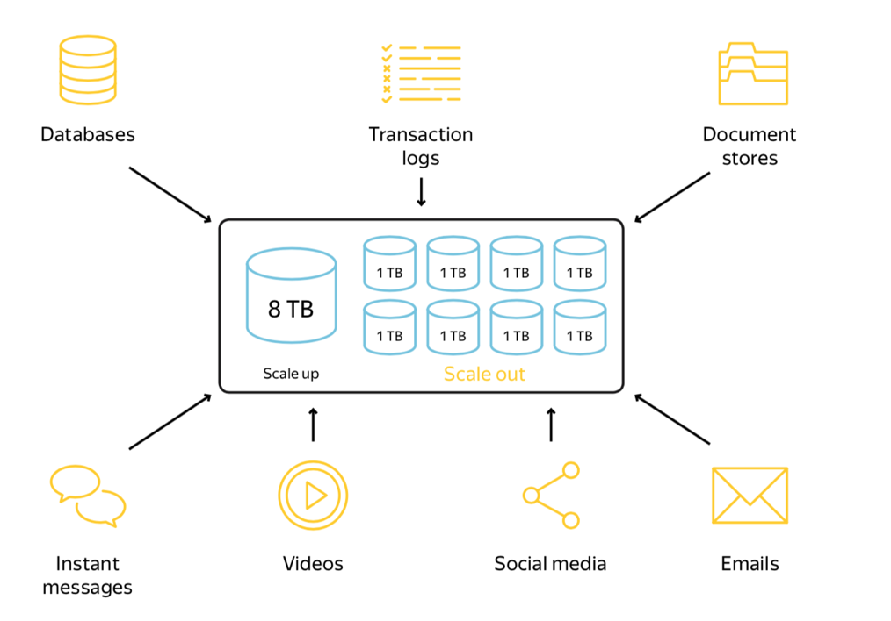

#### **GFS Key Components**

* Components failures are norm \(replication\)
  * 允许失败
* even space utilization
  * 机器空间均匀利用
* write-once-read-many
  * 写一次读多次

#### **Server Roles**

* Data Nodes: store machines are called channel servers
  * Data Node存的是数据
* Master Node: stores all metadata in memory.
  * Master Node存的是管理信息包括位置之类的
  * Metadata : includes administrative information about creation time, access properties, and so on

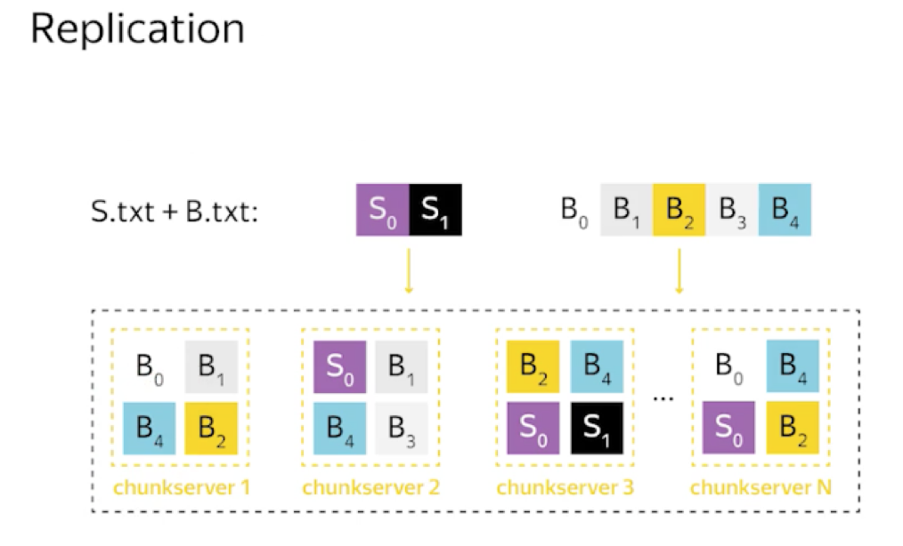

#### **GFS & HDFS**

GFS和DFS的区别

* 是否开源：GFS不开源，HDFS开源
* 编写语言 

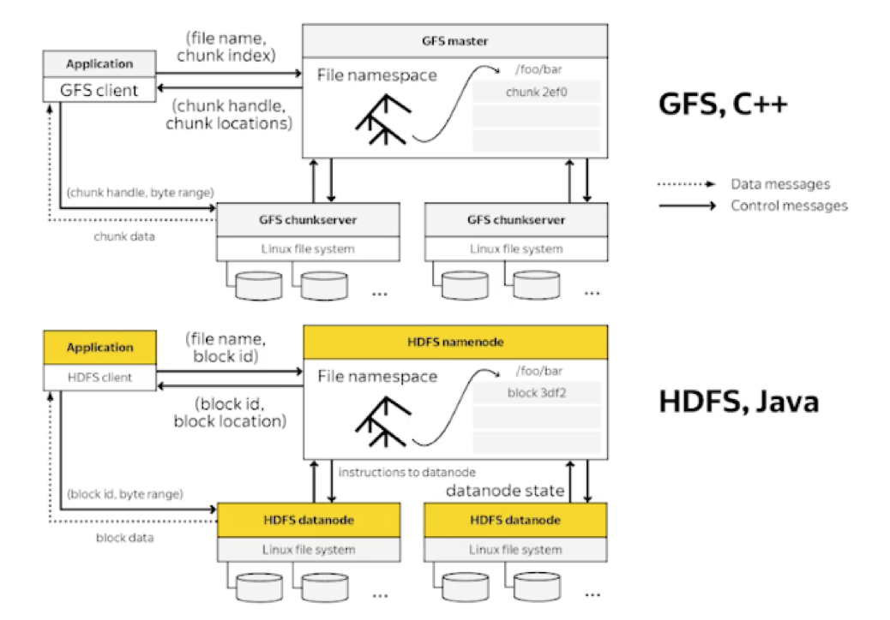

#### **How to read files?**

* HDFS client通过RPC （Remote Procedure Call）向data node发送请求，data node验证是否其有权力创建文件，并且该文件不存在命名冲突
* HDFS client请求一堆data node来存储文件碎片，这些节点形成一个pipeline，第一个向临近的传送，后一个复制前一个的结果。
* 如果出错，标记出错的节点，用新的节点替代它，由此形成新的pipeline.

#### How to write files ?

* 首先发送请求得到所有node的位置
* 如果数据丢失了，从其他节点读取

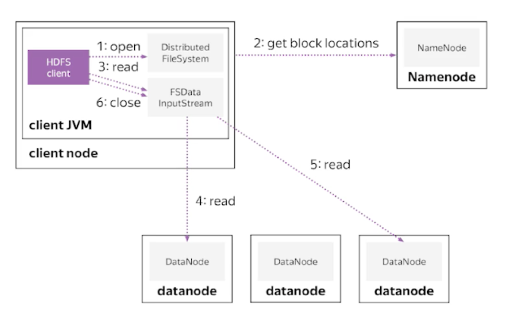

#### **Identify distance**

* Same Machine : 本地存储在同一台机器上，不需要任何额外的PRC，距离为0。
* Same Rack : 如果存储在同一个机架上，距离为2
* Different Rack : 不同的机架上，距离为4
* Another Data Center : 存储在另一个数据中心，距离为6

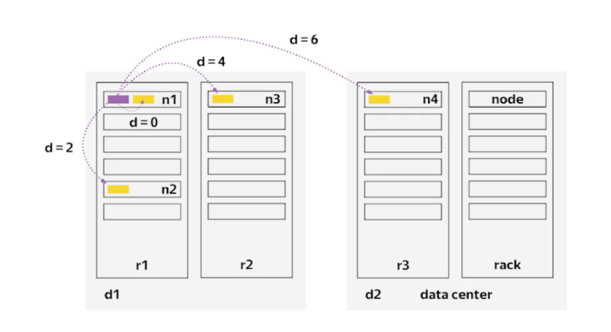



**Redundancy Model**

* First Replica : 第一个复制通常都是同一个节点，不然就是随机选择
* Second Replica : 第二个复制通常在不同的机架上 
* Third Replica : 第三个备份在第二个备份的不同机架的其他机器上

因为每次都要一次三份，所以每次的replica以及recovery都需要形成一个pipeline，也就是下图。

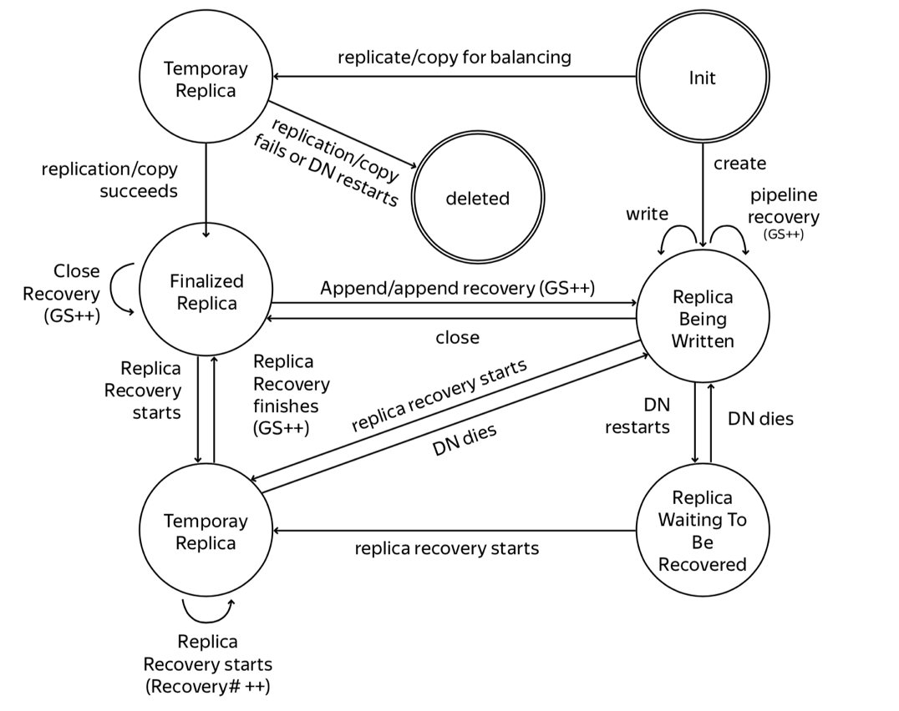

### Block and Replica States, Recovery Process {#block-and-replica-states-recovery-process}

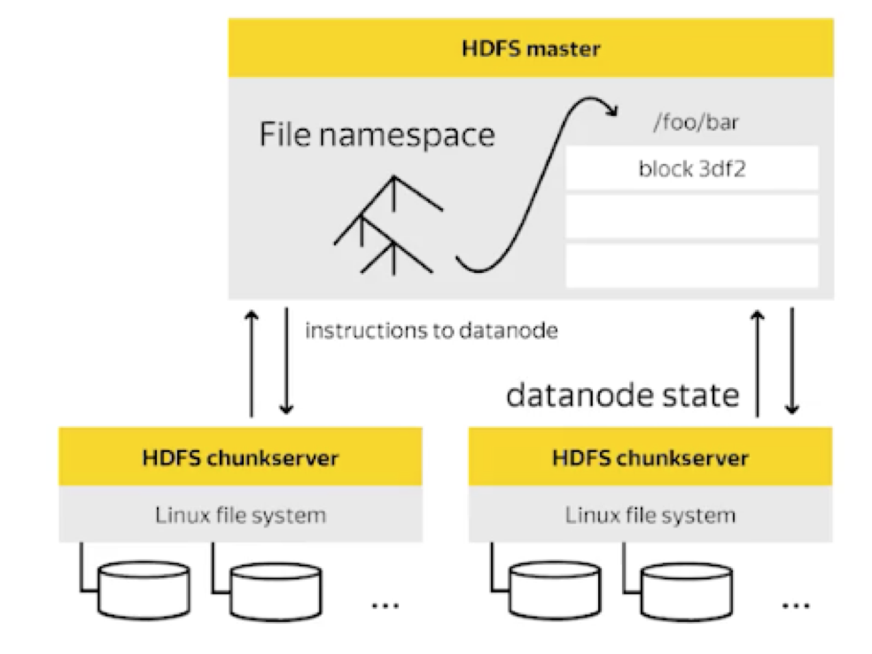

* Block： 在同一节点存储 meta-information 并提供信息关于block的位置和状态信息，不存储数据，存的是信息
  * Each block of data has a version number called Generation Stamp or GS for short. 
* Replica：主要是在节点存储物理信息
  * If replica is in a finalized state then it means that meta-information for this block on name node is aligned with all the corresponding replica's states and data.

**Replica States :**

* RBW \(Replica Being Written to\) : 通常是文件的最后一个block或者重新被打开等待合并的状态。
  * Bytes that are acknowledged by the downstream data nodes in a pipeline are visible for a reader of this replica.
* RWR \(Replica Waiting to be Recovered\) : 主要发生在failure 和 recovery 之后
* RUR \(Replica Under Recovery\): HDFS client 从name node获取权限以进行数据write和append操作，目的是防止HDFS client lease过期。

**Block States :**

* under\_construction : As soon as a user opens a file for writing, name node creates the corresponding block with the under\_construction state. It is always the last block of a file, it's length and generation stamp are mutable.
* under\_recover : Replicas transitions from RWR to recovery RUR state when the client dies.
* committed : there are already some finalized replicas but not all of them.
* complete : state where all the replicas are in the finalized state and therefore they have identical visible length and generation stamps

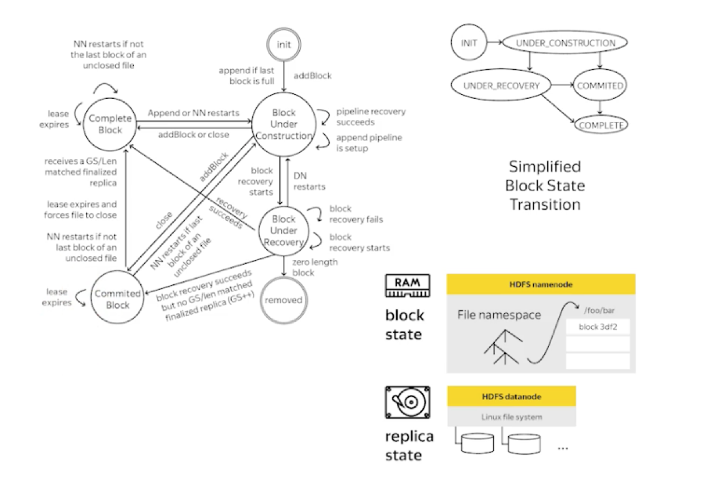

**Block Recovery :**  
During the block recovery process NameNode has to ensure that all of the corresponding replicas of a block will transition to a common state logically and physically. By physically I mean that all the correspondent replicas should have the same on disk content. To accomplish it, NameNode chooses a primary datanode called PD in a design document. As the last step, PD notifies NameNode about the result, success or failure. In case of failure, NameNode could retry block recovery process.   

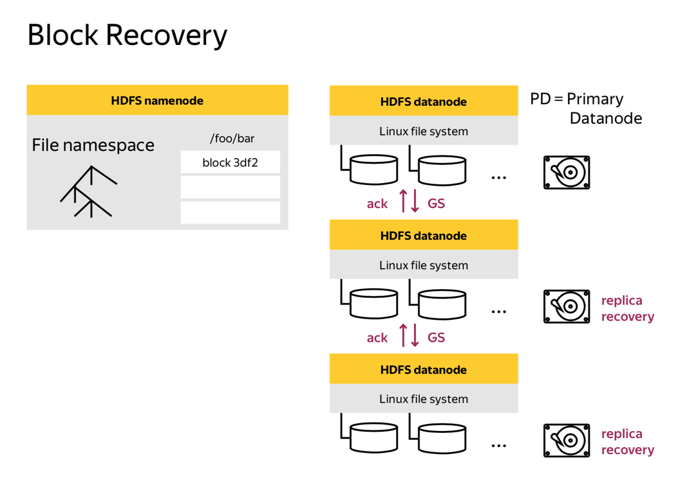

**Lease Recovery :**

Lease manager manages all the leases at the NameNode. HDFS clients request at least every time they would like to write, or append to a file. Lease manager maintains a soft and a hard limit. If a current lease holder doesn't renew his lease during the soft limit timeout, then another client will be able to take over this lease. In this case and in this case of reaching a hard limit, the process of lease recovery will begin. 

* concurrency control: Even if a client is still alive, it won't be able to write data to a file. 
* consistency guarantee. All replicas should draw back to a consistence state to have the same on-disk data and generation stamp. 

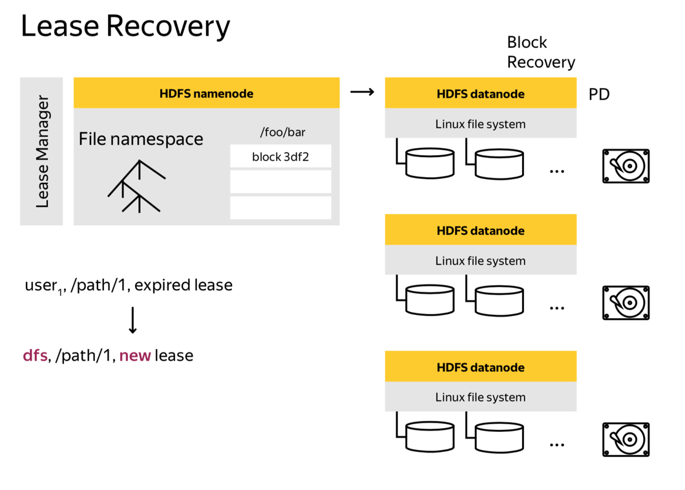

**Pipeline Recovery :**

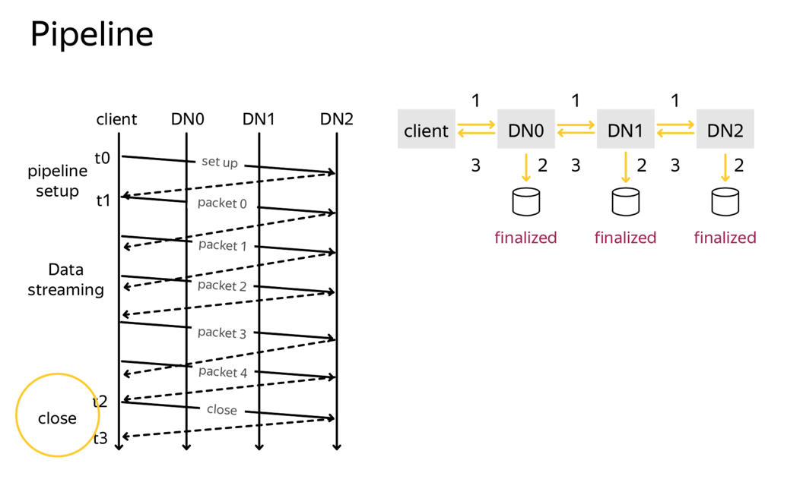

When you write to an HDFS file, HDFS client writes data block by block. Each block is constructed through a right pipeline, as the first client breaks down block into pieces called packets. These packets are propagated to the DataNodes through the pipeline.  

During the pipeline setup stage, a clients sends a setup message down to the pipeline. Each DataNode opens a replica for writing and sends ack message back upstream with the pipeline. 

Data streaming stage is defined by time range from t1 to t2, where t1 is the time when a client to receives the acknowledgement message for the top stage. And t2 is the time when the client receives the acknowledgement message for all the block packets. 

If you're writing to a new file and a failure happens during this top stage, then you can easily abandon DataNode pipeline and request a new one from scratch. If DataNode is not able to continue process packets appropriately, for instance because of these problems, then it allots the DataNode pipeline about it, by closing all the connections. When HDFS client detects a fire, it stops sending new packets to the existing pipeline, request a new generation stamp from a NameNode, and rebuilds a pipeline from good DataNodes.

### HDFS client {#hdfs-client}

Basic Commands:  
man: hdfs dfs -help  
info: hdfs dfs -usage 

Examples :  
Get info : hdfs dfs -ls -R -h /data/wiki  
Check space : hdfs dfs -du -h /data/wiki  
Create documents : hdfs dfs -mkdir -p deep/nested/path  
Remove documents : hdfs dfs -rm -r deep  
Creat Empty file : hdfs dfs -touchz file.txt  
Move Files : hdfs dfs -mv file.txt another\_file.txt && hdfs dfs -rm  
another\_file.txt  
Assign to Node : hdfs dfs -get hdfs\_test\*  
Check time to replica : time hdfs dfs -setrep -w 2 hdfs\_test\_file.txt  
Check node status : hdfs fsck /data/wiki/en\_articles -files

HDFS client likes an agency to use Command Line to save data into HDFS from local machine.  

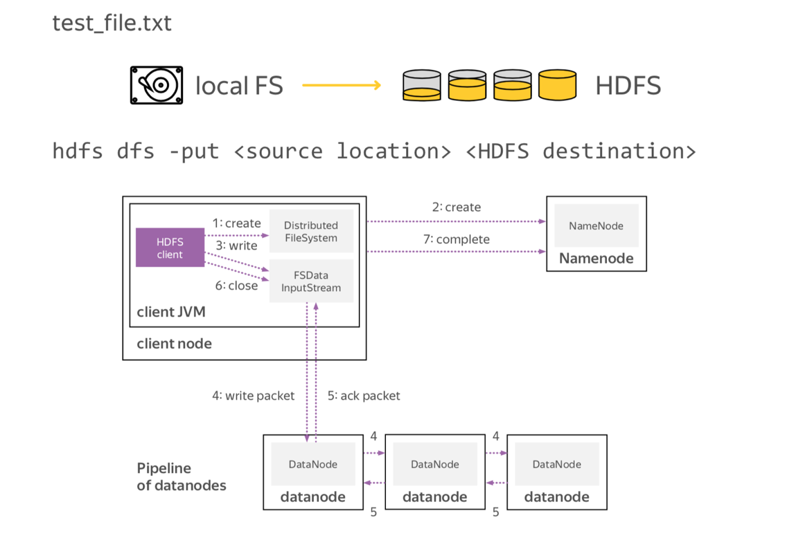

### Namenode Architecture {#namenode-architecture}

**NameNode** is a service responsible for keeping hierarchy of folders and files.

* NameNode stores all of this data in memory. RAM speed of reading and writing data is fostered by order of magnitude compared to a disk. 

**Small files problem**  
The more files you have in a distributed storage, the more load you have on a NameNode. And this load doesn't depend on the file size, as you have approximately the same amount of meta information stored in RAM. 

**Why 128 megabyte of data was once chosen as a default block size?**  
When you read block of data from a hard drive, first you need to locate this work on a disk. Quite naturally, this operation is called seek. Having a reading speed of three and a half gigabyte per second, you will be able to read 128 megabyte in 30 to 40 milliseconds. Typical drive seek time is less than one percent of the aforementioned number. It is exactly the reason for having 128 megabyte block size. It is one choice to have less than one percent overhead for reading the random block of data from a hard drive, and keeping block size small at the same time. We can more easily keep equal utilization of hard drive space over the cluster with small block size.   

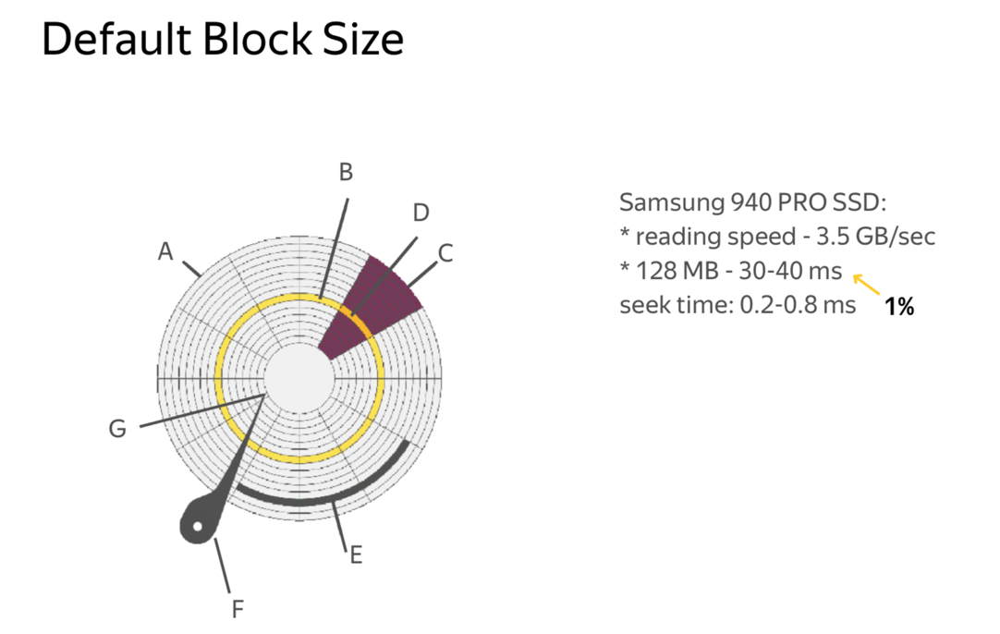

NameNode server is a single point of failure. In case this service goes down, the whole HDFS storage becomes unavailable, even for read-only operations. So, there are a number of technical tricks to make NameNode decisions durable and to speed up NameNode recovery process. NameNode uses write-ahead log, or WAL for short, strategy to persist matter information modifications. This log is called the edit log. It can be replicated to different hard drives. It is also usually replicated to an NFS storage. With NFS storage, you will be able to tolerate full NameNode crash. However, edit log is not enough to reproduce NameNode state. You should also have a snapshot of memory at some point in time from which you can replay transaction stored in the edit log. This snapshot is called fsimage. You usually have a HiLoad and a NameNode, so edit log will grow quite fast. It is a normal scenario when replay of one week of transactions from edit log will take several hours to boot a NameNode.   

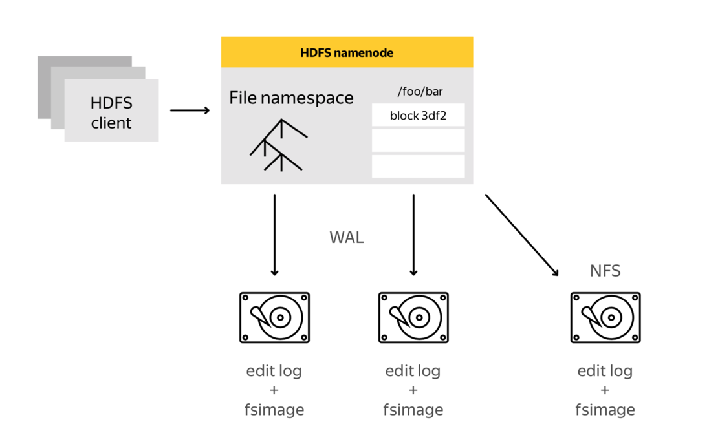

As you can guess, it is not appropriate for a high demand service. For this reason, Hadoop developers invented secondary NameNode. Secondary NameNode, or better to say, **checkpoint NameNodes** \(not backup node\), compacts the edit log by creating a new fsimage. New fsimage is made of all the fsimage by applying all stored transactions in edit log.  

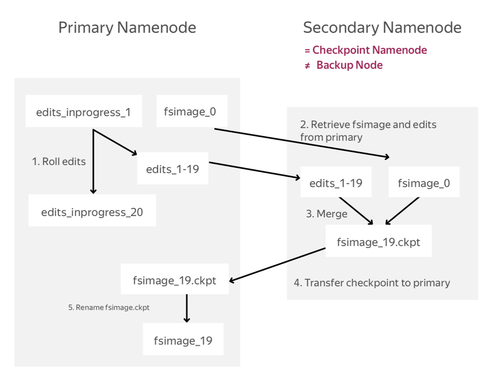

It is a robust and poorly asynchronous process. You should also take in mind that secondary NameNode consumes the same amount of RAM to build a new fsimage. The amount of drives in your cluster has a linear relation to the speed of data processing. Overall, these numbers will be a good reference for you when you decide to install your own cluster for research and development purposes. Summing up, you now can explain how NameNode stores meta information hierarchy and how it achieves durability.

### Data modeling and file formats {#data-modeling-and-file-formats}

Data model: a way you think about your data elements, what they are, what domain they come from, how different elements relate to each other, what they are composed of abstract model, explicitly defines the structure of data

* Defines the structure of data
* Makes some things easier to express than others
* Will use a relational model

Types :

* Relational data model
* Graph data model

#### **Binary Formats** {#-binary-formats-}

**Sequence File**

* First binary format implemented in Hadoop 
* Stores sequence of key-value pairs
* Java-specific serialization/deserialization

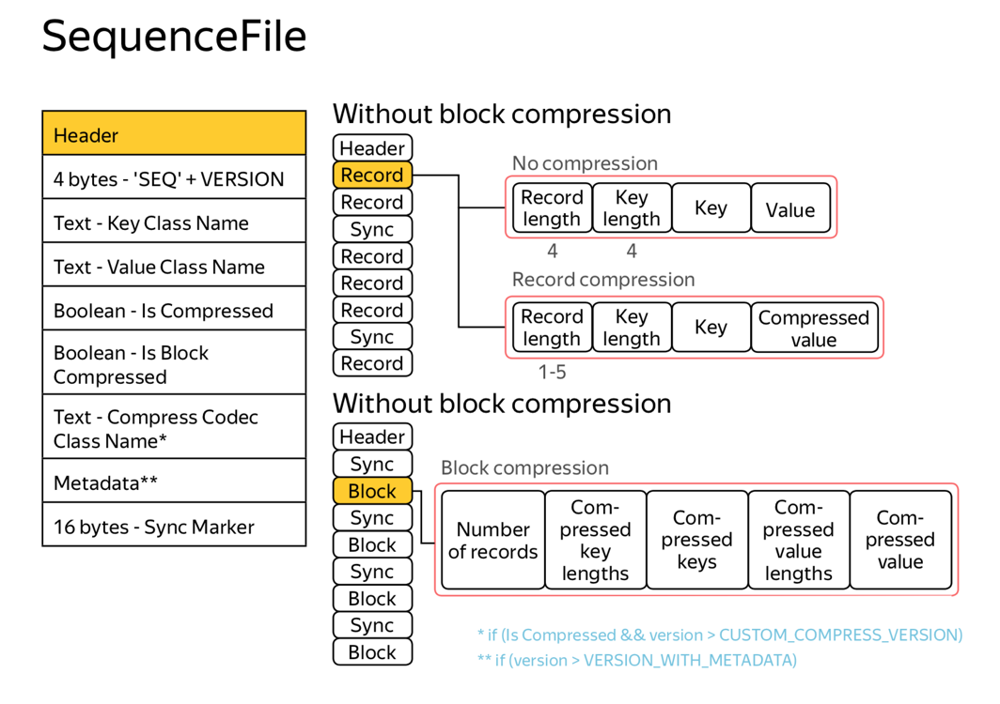

**Avro**

* Both format & support library
* Stores objects defined by the schema
* specifies field names, types, aliases
* defines serialization/deserialization code 
* allows some schema updates
* Interoperability with many languages

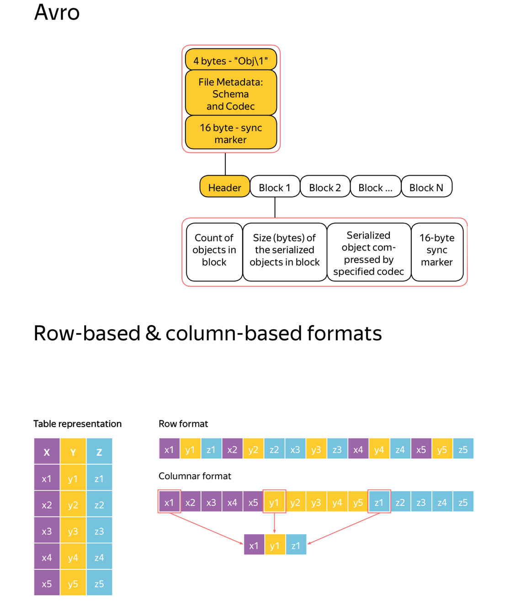

  

**RCFile**

* First columnar format\* in Hadoop\(\)
* Horizontal/vertical partitioning
  * split rows into row groups
  * transpose values within a row group

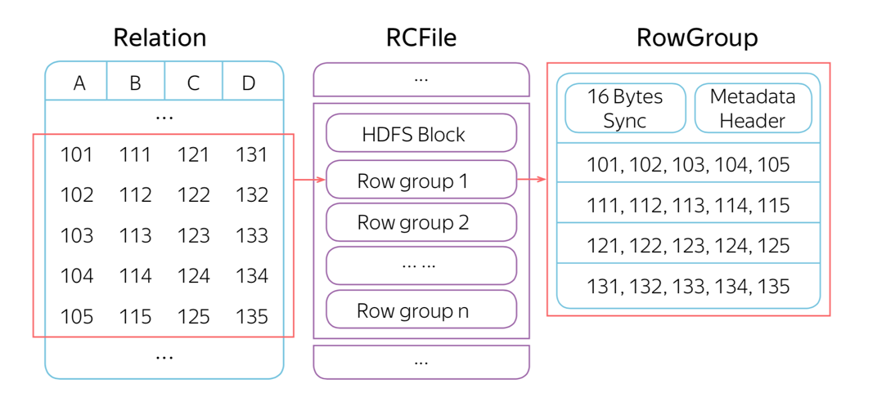

**Parquet**

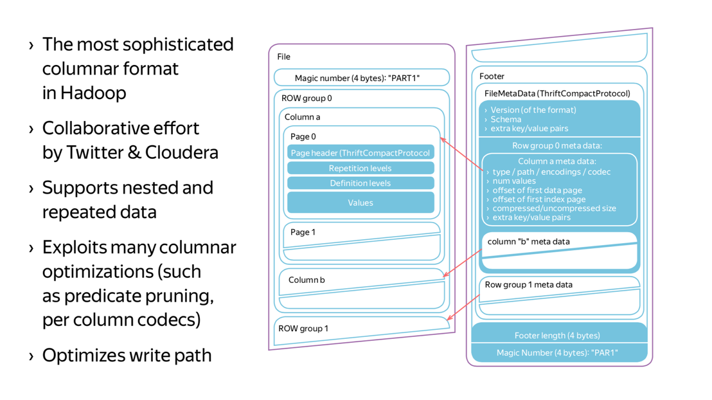

**Tips:**

* Binary formats are efficient in coding data
* SequenceFile is a reasonable choice for Java users
* Avro is a good alternative for many use cases
* RCFile/ORC/Parquet are best for “wide” tables and analytical workloads

| Types | CSV & TSV \(comma- & tab-separated values\) | JSON \(JavaScript Object Notation\) | SequenceFile | Avro | RCFile |
| :--- | :--- | :--- | :--- | :--- | :--- |
| Space efficiency | BAD | BAD \(WORSE THAN CSV\) | MODERATE TO GOOD | MODERATE TO GOOD | GOOD |
| Speed | GOOD | GOOD ENOUGH | GOOD | GOOD WITH CODEGEN | MODERATE TO GOOD, LESS I/O |
| Datatypes | ONLY STRINGS | STRINGS, NUMBERS, BOOLEANS, MAPS, LISTS | ANY W/ SER./DESER. CODE | JSON-LIKE | BYTE STRINGS |
| Splittable | SPLITTABLE W/O HEADER | SPLITTABLE IF 1 DOCUMENT PER LINE | SPLITTABLE | SPLITTABLE | SPLITTABLE |
| Extensibility | BAD | YES | NO | YES | NO |

**Compression**  

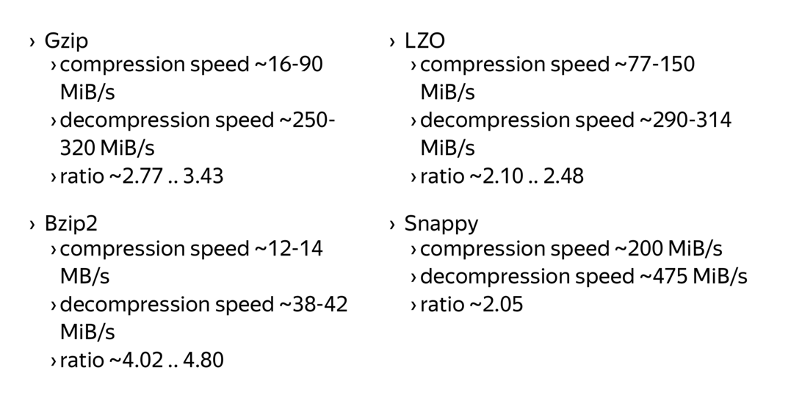

**When to use compression**  

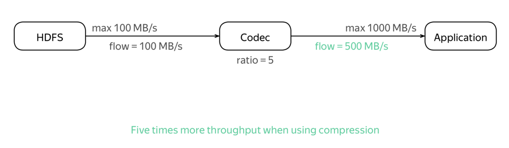

**Raise awareness about application bottlenecks**

* CPU-bound: cannot benefit from the compression
* I/O-bound: can benefit from the compression
* Codec performance vary depending on data, many options available

