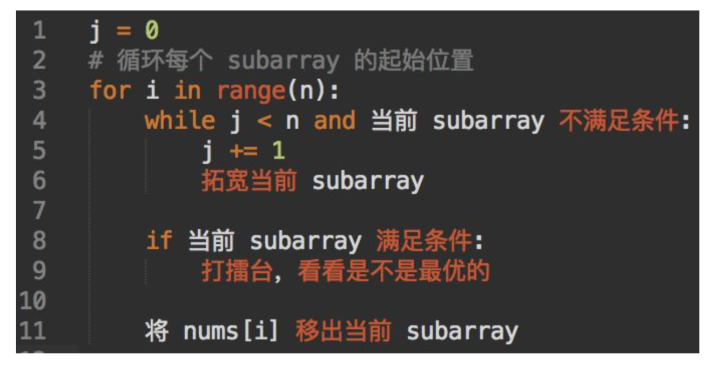

# Advanced Algorithms \(1\) - Two Pointers Follow up

## 1. 同向双指针

基本套路就是下图，稍微修改了下形成自己的风格。



```python
left, right = 0, 0
for left in range(n):
    while right < n and subarray 不满足：
        right += 1 # 拓宽序列 注意right不回头
    
    if subarray 满足条件：
        看下是否满足条件
    
    将nums[left]移除 # remove left
```

#### 406. Minimum Size Subarray Sum

双指针遍历，分为左右两个left和right，控制两个条件

* sum需要大于threshold
* mini\_len要最小

控制这两个带入模板就可以了

```python
class Solution:
    """
    @param nums: an array of integers
    @param s: An integer
    @return: an integer representing the minimum size of subarray
    """
    def minimumSize(self, nums, s):
        # get maximum length
        n = len(nums)
        # test case
        if n == 0 or s is None :
            return -1
        # same direction two pointers
        left, right = 0, 0
        sum = 0
        mini_len = n + 1
        for left in range(n) :
            # get right value
            while right < n and sum < s:
                sum += nums[right]
                right += 1
            # find
            if sum >= s :
                mini_len = min(mini_len, right - left)
            # remove left 
            sum -= nums[left]
        # not find 
        if mini_len == n + 1:
            return  -1
        
        return mini_len
```

#### 384. Longest Substring Without Repeating Characters

主要通过hashset来进行判断，先找限制条件

* 最长的 需要 longest记录
* 不重复需要hashset判断

```python
class Solution:
    def lengthOfLongestSubstring(self, s):
        """
        :type s: str
        :rtype: int
        """
        n = len(s)
        left, right = 0, 0
        max_val, hashmap = 0, {}
        
        for left in range(n) :
            while right < n and s[right] not in hashmap :
                hashmap[s[right]] = True
                right += 1
            max_val = max(max_val, right - left)
            hashmap.pop(s[left])
        return max_val
```

#### 32. Minimum Window Substring

主要是要用length和hashmap来控制字符串的数字，详细见下。

* 需要hashset形成target的char作为限制条件
* 需要保证length最小
* 需要注意hashset在get和pop的时候需要确认顺序

```python
class Solution:
    """
    @param source : A string
    @param target: A string
    @return: A string denote the minimum window, return "" if there is no such a string
    """
    def minWindow(self, source, target):
        matchStr = ''
        # corner case
        if source is None :
            return matchStr
        # init
        targetHash, newHash = self.newhash(target), {}
        targetLen, matchLen = len(targetHash), 0
        # denote l, r - left, right
        left, right = 0, 0
        n, miniLen = len(source), len(source) + 1
        
        for left in range(n) :
            # right move to find the string
            while right < n and matchLen < targetLen :
                char = source[right]
                if char in targetHash:
                    newHash[char] = newHash.get(char, 0) + 1
                    if targetHash[char] == newHash[char] :
                        matchLen += 1
                right += 1
            # if find, confirm min
            if right - left < miniLen and matchLen == targetLen :
                miniLen = right - left
                matchStr = source[left:right]
            # move left pointer and del related info
            char = source[left]
            if char in targetHash :
                if targetHash[char] == newHash[char] :
                    matchLen -= 1
                newHash[char] -= 1
        return matchStr
    
    def newhash(self, target) :
        hashset = {}
        for char in target :
            hashset[char] = hashset.get(char, 0) + 1
        return hashset
```

#### 386. Longest Substring with At Most K Distinct Characters

和上一个题差不多，基本同一个套路

* 主要需要注意控制条件，小于k或者在hash里面

```python
class Solution:
    """
    @param s: A string
    @param k: An integer
    @return: An integer
    """
    def lengthOfLongestSubstringKDistinct(self, s, k):
        if s is None or k == 0 :
            return 0
            
        left, right = 0, 0
        n, longest = len(s), 0
        hashset = {}
        
        for left in range(n) :
            while right < n and (len(hashset) < k or s[right] in hashset) :
                hashset[s[right]] = hashset.get(s[right], 0) + 1
                right += 1
        
            longest = max(longest, right - left)
            
            if s[left] in hashset :
                hashset[s[left]] -= 1
                if hashset[s[left]] == 0 :
                    hashset.pop(s[left])
            
        return longest
```

## 2. 查找类问题

查找类问题大多可以二分，这里本质还是二分加双指针，核心算法是quick select，这个非常重要。这里比较典型的是top k问题。


