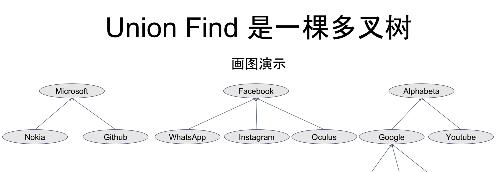
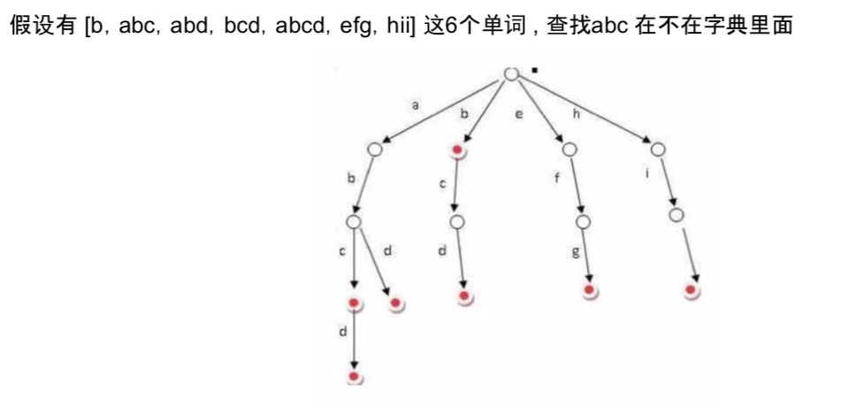
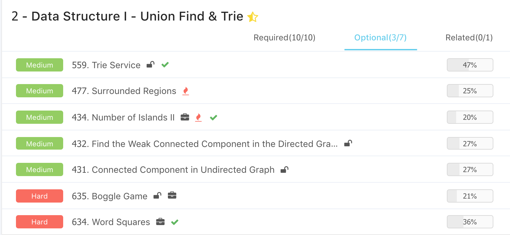

# Advanced Algorithms \(2\) - Union Find & Tire

## 1. Union Find

#### 什么是Union Find ?

一种用于支持集合快速合并和查找操作的数据结构，别名disjoint set。

* 平均是O\(1\) 合并两个集合 - Union
* 平均是O\(1\) 查询元素所属集合 - Find
  * 具体的时间复杂度是log\*n - log\(logn\)
  * 阿克曼函数的反函数

{% embed url="https://en.wikipedia.org/wiki/Proof\_of\_O\(log\*n\)\_time\_complexity\_of\_union%E2%80%93find" %}



#### Union Find的实现

* 底层数据结构
  * 父亲表示法，用一个数组/哈希表记录每个节点的父亲是谁。
    * 一种自下而上的
      * father\[“Nokia”\] = “Microsoft”
      * father\[“Instagram”\] = “Facebook”
* 查询所在集合
  * 用所在集合最顶层的老大哥节点来代表这个集合
* 合并两个集合
  * 找到两个集合中最顶层的两个老大哥节点 A 和 B
    * father\[A\] = B // or father\[B\] = A 如果无所谓谁合并谁的

#### 代码实现

* 初始化
  * 使用哈希表或者数组来存储每个节点的父亲节点
  * 如果节点不是连续整数的话，就最好用哈希表来存储 
  * 最开始所有的父亲节点都指向自己
    * 也有的方法中是将父亲节点指向空，虽然可行但是没有指向自己操作起来那么方便

```python
def __init__(self, n) :
    self.father = {}
    for i in range(i, n + 1) :
        self.father[i] = i
```

* Find 查找老大哥
  * 沿着父亲节点一路往上走可以找到老大哥
  * O\(logn\)

```python
# 错误模板
# 本身其实没问题的，主要是最坏情况成链时，时间复杂度会退化到O(n^2)
def find(self, node):
    while self.father[node] != node :
        node = self.father[node]
    return node
```

* 路径压缩
  * 在找到老大哥之后，还需要把一路上经过的点都指向老大哥

```python
# 正确模板
# 递归版本
def find(self, node):
    if node == self.father[node] :
        return node    
    self.father[node] = self.find(sel.father[node])
    return self.father[node]
# 非递归版本
def find(self, node):
    path = []
    while self.father[node] != node :
        path.append(node)
        node = self.father[node]
    # 路径上所有的指向老大哥    
    for n in path :
        self.father[n] = node
    
    return node
```

* Find
  * 找到两个元素所在集合的两个老大哥A和B
  * A指向B

```python
def union(self, a, b):
    self.father[self.find(a)] = self.find(b)
```

* 完整代码

```python
class UnionFind :
    def __init__(self, n):
        self.father = {}
        for i in range(1, n + 1) :
            self.father[i] = i
            
    def union(self, a, b) :
        self.father[self.find(a)] = self.find(b)
    
    def find(self, node):
        path = []
        while node != self.father[node] :
            path.append(node)
            node = self.father[node]
        
        for i in path :
            self.father[n] = node
        return node
```

#### Union Find可以解决什么问题

* 合并两个集合
* 查询某个元素所在集合
* 判断两个元素是否在同一个集合
* 获得某个集合的元素个数
* 统计当前集合个数

#### [589. Connecting Graph](https://www.lintcode.com/problem/connecting-graph/)

主要是练习前面的模板，判断两个点是否在同一个集合。

```python
class ConnectingGraph:

    def __init__(self, n):
        # do intialization if necessary
        self.father = {}
        for i in range(1, n + 1) :
            self.father[i] = i 
  
    def connect(self, a, b):
        # write your code here
        self.father[self.find(a)] = self.father[self.find(b)]
 
    def query(self, a, b):
        # write your code here
        return self.father[self.find(a)] == self.father[self.find(b)]
    
    def find(self, node) :
        path = []
        
        while self.father[node] != node :
            path.append(node)
            node = self.father[node]
            
        for i in path :
            self.father[i] = node
        
        return node        
```

#### [590. Connecting Graph II](https://www.lintcode.com/problem/connecting-graph-ii)

多开一个hash用来记录每个节点下面连了几个：

* connect : merge根节点，并合并cnt
* query : 返回根节点的cnt

```python
class ConnectingGraph2:

    def __init__(self, n):
        self.father = {}
        self.count = {}
        # point to itself, every node count is 1
        for i in range(1, n + 1) :
            self.father[i] = i
            self.count[i] = 1
    
    def find(self, node) :
        path = []
        while node != self.father[node] :
            path.append(node)
            node = self.father[node]
        
        for n in path :
            self.father[n] = node
    
        return node

    def connect(self, a, b):
        root_a, root_b = self.find(a), self.find(b)
        # connect and cnt 
        if root_a != root_b :
            # a -> father b
            self.father[root_a] = root_b
            self.count[root_b] += self.count[root_a]

    def query(self, a):
        # return root cnt
        return self.count[self.find(a)]
```

#### [591. Connecting Graph III](https://www.lintcode.com/problem/connecting-graph-iii)

只有connect的时候才会导致连接的self.size减少，主要控制的就是这里，其他的基本就是这样。

```python
class ConnectingGraph3:
    def __init__(self, n):
        self.size = n
        self.father = {}
        for i in range(1, n + 1) :
            self.father[i] = i
    
    def find(self, node) :
        path = []
        while node != self.father[node] :
            path.append(node)
            node = self.father[node]
        
        for n in path :
            self.father[n] = node
        return node
    
    def connect(self, a, b):
        # root
        root_a, root_b = self.find(a), self.find(b)
        if root_a != root_b :
            # a -> father b
            self.father[root_a] = root_b
            self.size -= 1

    def query(self):
        return self.size
```

#### 小结

这里基本等于不断熟悉了并查集的使用，主要的模板find找到老大哥，即根节点。而connect将老大哥merge起来，而根据需要和限制条件需要改一些条件。

* 是否在同一个集合 ： 老大哥是不是一样
* 每个联通的里面的元素个数 : 老大哥有多少小弟
  * 只让老大哥记小弟个数
  * 老大哥合并，小弟也要合并
* 联通集个数: 老大哥有几个
  * 老大哥合并一次就少一个，用来控制

#### [434. Number of Islands II](https://www.lintcode.com/problem/number-of-distinct-islands-ii/) / [305. Number of Islands II](https://leetcode.com/problems/number-of-islands-ii/description/)

在原有并查集的模板上进行了加工，主要步骤

* 每次使用hash查看是否已经在原有记录中
* 如果没有，将上下左右看一遍在不在记录中，如果在就union，然后size会减1

题解非常的巧妙

```python
"""
Definition for a point.
class Point:
    def __init__(self, a=0, b=0):
        self.x = a
        self.y = b
"""
directions = [(0, 1), (1, 0), (0, -1), (-1, 0)]

class Solution:
    def numIslands2(self, n, m, operators):
        # islands - check if visited
        # result - record
        islands, result = {}, []
        # init
        self.father = {}
        self.size = 0
        # traverse 
        for point in operators :
            x, y = point.x, point.y
            # if visited
            if (x, y) in islands :
                result.append(self.size)
                continue
            # record
            islands[(x, y)] = True
            self.size += 1
            self.father[(x, y)] = (x, y)
            # new point - check up, down, left, right
            # if has, connect
            for (dx, dy) in directions:
                x1, y1 = x + dx, y + dy
                if (x1, y1) in islands :
                    self.union((x, y), (x1, y1))
            result.append(self.size)
        return result
        
        
    def find(self, point) :
        path = []
        while point != self.father[point] :
            path.append(point)
            point = self.father[point]
        
        for n in path :
            self.father[n] = point
            
        return point
        
    def union(self, point_x, point_y) :
        root_a, root_b = self.find(point_x), self.find(point_y)
        if root_a != root_b :
            self.father[root_a] = root_b
            self.size -= 1
```

#### [178. Graph Valid Tree](https://www.lintcode.com/problem/graph-valid-tree/) / [261. Graph Valid Tree](https://leetcode.com/problems/graph-valid-tree/description/)

这个题用union find真的是非常巧妙，如果能成为一棵树，必然最后联通的size只有1，这里不考虑平衡二叉树。每次只需要union新的边即可。

* 这里为什么要用range\(n\)，而不用range\(1, n + 1\)，是因为需要根据题目要求来进行设计
* 图的特性是n个点，n-1条边，可以用这个进行快速检查

```python
class Solution:
    def validTree(self, n, edges):
        if n - 1 != len(edges) :
            return False
            
        self.size = 0 
        self.father = {}
        
        for i in range(n) :
            self.father[i] = i
            
        for (_from, _to) in edges :
            self.union(_from, _to)
            
        return self.size == 1
        
    def find(self, node) :
        path = []
        while node != self.father[node] :
            path.append(node)
            node = self.father[node]
            
        for n in path :
            self.father[n] = node
            
        return node
    
    def union(self, a, b) :
        root_a, root_b = self.find(a), self.find(b)
        if root_a != root_b :
            self.size -= 1
            self.father[root_a] = root_b
```

#### [1070. Accounts Merge](https://www.lintcode.com/problem/accounts-merge/) / [721. Accounts Merge](https://leetcode.com/problems/accounts-merge/description/)

这个题比较复杂，有很多非常细小的点需要注意，这里的关键是用到了信息检索里面的forward index和inverted index概念。

* **Step 0** : 现有的union find的模板定义的是每个node的father是自己，也就是i，所有后面的定义也应该用i，而不是账户的名字
* **Step 1** : 先获取所有email的对应的id，然后将相同email的union起来
* **Step 2** : 遍历原有的accounts，合并所有老大哥的email
* **Step 3** ：排序即可

这个题非常的复杂，需要想的很清楚，个人觉得可能用union find解不是一个特别好的方法，但是对于练习union find非常有价值。

* 命名变量的时候，尽量不同的function使用不同的，不然很难debug
* 命名的时候注意和global的区别，有时候少一个s，差别还是很大的

```python
class Solution:

    def accountsMerge(self, accounts):
        # init
        self.father = {}
        for i in range(len(accounts)) : # enumerate starts from 0
            self.father[i] = i
        # build email's father and union all have same 
        email_father = self.email_father(accounts)
        for (email, ids) in email_father.items() :
            root_id = ids[0]
            for id in ids[1:] :
                self.union(root_id, id)
        # sort
        id_emails = self.id_email_merge(accounts)
        sorted_output = []
        for id, emails in id_emails.items():
            sorted_output.append([accounts[id][0]] + sorted(emails))
        return sorted_output
        
    def id_email_merge(self, accounts) :
        # merge all emails with same id
        id_emails = {}
        for id, account in enumerate(accounts) :
            # init with set - add
            root_id = self.find(id) 
            email_set = id_emails.get(root_id, set())
            for email in account[1:]:
                email_set.add(email)
            id_emails[root_id] = email_set
        return id_emails
        
    def email_father(self, accounts) :
        email_father = {}
        for id, account in enumerate(accounts) :
            # avoid the user id
            for email in account[1:] :
                # init with list - append
                email_father[email] = email_father.get(email, [])
                email_father[email].append(id)
        return email_father
    
    
    def find(self, node) :
        path = []
        while node != self.father[node] :
            path.append(node)
            node = self.father[node]
        
        for n in path :
            self.father[n] = node
            
        return node
    
    def union(self, a, b) :
        self.father[self.find(a)] = self.find(b)
```

#### 小结

这里的几道题基本都是和连通性有关的，比如岛是不是连着的，把树连起来之类的问题，account merge比较特殊是因为需要先进行预处理

* 联通性问题都可以用BFS和Union Find解决
* 而需要拆开两个集合的时候**无法**使用Union Find

补充一些题:

#### [629. Minimum Spanning Tree](https://www.lintcode.com/problem/minimum-spanning-tree/description)

{% embed url="https://en.wikipedia.org/wiki/Kruskal%27s\_algorithm" %}

{% embed url="https://en.wikipedia.org/wiki/Prim%27s\_algorithm" %}

使用了Kruskal算法，先排序，再union

```python
class Solution:
    # @param {Connection[]} connections given a list of connections
    # include two cities and cost
    # @return {Connection[]} a list of connections from results
    def lowestCost(self, connections):
        # Write your code here
        if connections is None or len(connections) == 0:
            return []
            
        connections.sort(key=lambda x: (x.cost, x.city1, x.city2))
        self.initialize(connections)
        
        results = []
        for connection in connections:
            city1 = connection.city1
            city2 = connection.city2
            if self.union(city1, city2):
                results.append(connection)
                
        if self.count != len(self.father) - 1:
            return []
        return results
        
        
    def initialize(self, connections):
        self.father = {}
        self.count = 0
        for connection in connections:
            city1 = connection.city1
            city2 = connection.city2
            if city1 not in self.father:
                self.father[city1] = city1
            if city2 not in self.father:
                self.father[city2] = city2
            
    def union(self, city1, city2):
        root_1 = self.find(city1)
        root_2 = self.find(city2)
        if root_1 != root_2:
            self.father[root_1] = root_2
            self.count += 1
            return True
        return False
    
    def find(self, city):
        path = []
        while self.father[city] != city:
            path.append(city)
            city = self.father[city]
        for p in path:
            self.father[p] = city
        return city
```

## 2. Tire

#### 什么是字典树？

又名 Prefix Tree，来自单词 Retrieval，发音与 Tree 相同。在计算机科学中，trie，又称**前缀树**或**字典樹**，是一种有序树，用于保存关联数组，其中的键通常是字符串。

#### 主要考点

* 实现一个 Trie
* 比较 Trie 和 Hash 的优劣
  * Trie需要寻址L次，而hash只有一次
* 字符矩阵类问题使用 Trie 比 Hash 更高效
  * hash需要找26个字母，但tire只看儿子有几个

#### 字典树通过用空间换时间，从而减少了时间复杂度，而增加了空间复杂度。

* search时间复杂度O\(N\)







#### Tire的实现

#### [442. Implement Trie \(Prefix Tree\)](https://www.lintcode.com/problem/implement-trie-prefix-tree/description) / [208. Implement Trie \(Prefix Tree\)](https://leetcode.com/problems/implement-trie-prefix-tree/description/)

* insert 插入单词
* find 找到单词所在的TireNode
  * 没有返回None

```python
class TrieNode: 
    # 用儿子来存储树结构，而is_word进行O(n)时间查找
    def __init__(self):
        self.children = {}
        self.is_word = False
        
class Trie:
    def __init__(self):
        self.root = TrieNode()
        
    # 从根节点遍历，如果不在第一层儿子们里就加入，类似链表
    def insert(self, word):
        node = self.root
        for c in word:
            if c not in node.children:
                node.children[c] = TrieNode()
            # 链的下一个
            node = node.children[c]
        
        node.is_word = True
        
    # 遍历子树
    def find(self, word):
        node = self.root
        for c in word:
            # 看c在不在儿子里，不在就是None，在就返回节点
            node = node.children.get(c)
            if node is None:
                return None
        return node
       
    def search(self, word):
        node = self.find(word)
        # 节点不为空，且字典中存了该字符
        # 如果存了word -> wor是不应该存在的，这个意思
        return node is not None and node.is_word

    def startsWith(self, prefix):
        # 同上一个，只要wor不空就行
        return self.find(prefix) is not None
```

#### [473. Add and Search Word - Data structure design](https://www.lintcode.com/problem/implement-trie-prefix-tree/description) / [211. Add and Search Word - Data structure design](https://leetcode.com/problems/add-and-search-word-data-structure-design/description/)

这个题本质不是特别的难，依旧是使用了Tire的数据结构，非常的巧妙

* 借助DFS进行遍历
  * 如果不是 . 的话，就对下一层进行搜索
  * 如果是 . 的话，对改层所有的children的child进行搜索

```python
class TrieNode :
    def __init__(self) :
        self.children = {}
        self.is_word = False
        
class WordDictionary:

    def __init__(self):
        self.root = TrieNode()
        
    def addWord(self, word):
        node = self.root
        for c in word :
            if c not in node.children :
                node.children[c] = TrieNode()
            node = node.children[c]
        node.is_word = True

    def search(self, word):
        if word is None :
            return False
        return self.search_helper(self.root, word, 0)
    
    def search_helper(self, node, word, i):
        if node is None :
            return False
        if i >= len(word) :
            return node.is_word 
        
        c = word[i]
        if c != '.' :
            return self.search_helper(node.children.get(c), word, i + 1)
        
        for child in node.children :
            if self.search_helper(node.children[child], word, i + 1) :
                return True
        return False
```

#### [634. Word Squares](https://www.lintcode.com/problem/word-squares/) / [425. Word Squares](https://leetcode.com/problems/word-squares/description/)

这个题一开始觉得比较复杂，后来感觉其实一般，主要是一旦定义了Trie，整体就优化了很多，几个值得注意的小细节。

* 剪枝，根据所有的前缀组合来看是否前缀存在，不存在就prune
* 这里要善于test，要给一个例子进去去验证自己的理解比较好

```python
# define data structure
class TrieNode :
    def __init__(self) :
        self.children = {}
        self.is_word = False
        self.word_list = []
        
class Trie :
    def __init__(self) :
        self.root = TrieNode()
    
    def add(self, word) :
        node = self.root
        for c in word :
            if c not in node.children :
                node.children[c] = TrieNode()
            node = node.children[c]
            node.word_list.append(word)
        node.is_word = True
    
    def find(self, word) :
        node = self.root 
        for c in word :
            node = node.children.get(c)
            if node is None :
                return None
        return node
        
    def words_prefix(self, prefix) :
        node = self.find(prefix)
        return [] if node is None else node.word_list


class Solution:

    def wordSquares(self, words):
        # 初始化trie，加入单词
        trie = Trie()
        for word in words :
            trie.add(word)
        # 检测是否可以加入，sqaure为list
        squares = []
        for word in words :
            self.search(trie, [word], squares)
            
        return squares
        
    def search(self, trie, square, squares) :
        # eg. ['wall', 'area'] n: 单词长度 4, pos: 单词数目 2
        n, pos = len(square[0]), len(square)
        # 递归出口 - 需要deep copy 
        if n == pos :
            squares.append(list(square))
            return 
        
        # 剪枝 - 以后面为前缀的是否存在
        for col in range(pos, n) :
            prefix = ''.join(square[i][col] for i in range(pos))
            if trie.find(prefix) is None :
                return 
    
        # ['wall',
        #  'area']  prefix = 'le'，下一个应该以le开头，每行的pos - 2
        prefix = ''.join(square[i][pos] for i in range(pos))
        for word in trie.words_prefix(prefix) :
            # 尝试将word加入
            square.append(word)
            self.search(trie, square, squares)
            square.pop()
```

#### [132. Word Search II](https://www.lintcode.com/problem/word-search-ii/) / [212. Word Search II](https://leetcode.com/problems/word-search-ii/description/)

这个题的思路不是很难，但是代码实现比较复杂，有时间还是多写几遍，目前还做不到bug free

* 将所有的单词加入Trie，进行建树
* 对二维矩阵进行深度优先搜索，这里主要借助了二维坐标数组

```python
DIRECTIONS = [(0, -1), (0, 1), (-1, 0), (1, 0)]

class TrieNode :
    def __init__(self) :
        self.children = {}
        self.is_word = False
        self.word = None 
        
class Trie  :
    def __init__(self) :
        self.root = TrieNode()
    
    def add(self, word) :
        node = self.root
        for c in word :
            if c not in node.children :
                node.children[c] = TrieNode()
            node = node.children[c]
        node.is_word = True
        node.word = word
    
    def find(self, word) :
        node = self.root
        for c in word :
            node = node.children.get(c)
            if node is None :
                return None
        return node

class Solution:
    def wordSearchII(self, board, words):
        # corner test
        if board is None or len(board) == 0 :
            return []
        # build trie
        trie = Trie()
        for word in words :
            trie.add(word)
        # search 
        result = set()
        row, col = len(board), len(board[0])
        for i in range(row) :
            for j in range(col) :
                # word
                start_node = trie.root.children.get(board[i][j])
                self.search(board, i, j, start_node, set([(i, j)]), result)
       
        return list(result)
        
    def search(self, board, x, y, node, visited, result) :
        # if not find
        if node is None :
            return 
        # if find word
        if node.is_word :
            result.add(node.word)
        
        for dx, dy in DIRECTIONS :
            x1, y1 = x + dx, y + dy
            
            if not self.inside(board, x1, y1) :
                continue
            
            if (x1, y1) in visited :
                continue
            # dfs
            visited.add((x1, y1))
            next_node = node.children.get(board[x1][y1])
            self.search(board, x1, y1, next_node, visited, result)
            visited.remove((x1, y1))
    
    def inside(self, board, x, y):
        # check if out of index
        return 0 <= x < len(board) and 0 <= y < len(board[0])
```

## 3. Ladder

有点忙，只把required做完了，其他的还需要继续努力。





