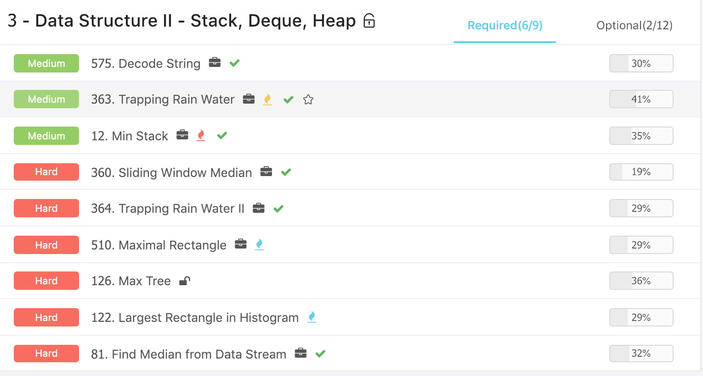
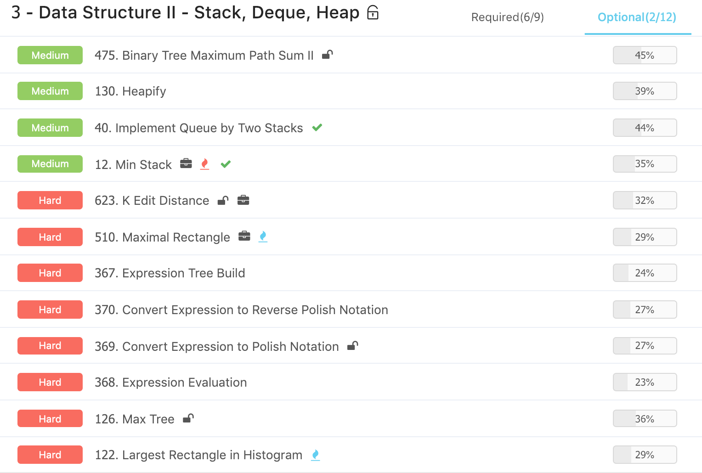

# Advanced Algorithms \(3\) - Heap & Stack

## 1. Heap

#### [363. Trapping Rain Water](https://www.lintcode.com/problem/trapping-rain-water/description) / [42. Trapping Rain Water](https://leetcode.com/problems/trapping-rain-water/description/)

非常非常巧妙的一个，先从左边开始遍历，然后再从右边开始遍历，有一点像mono stack，就是找到左右最高的点，然后看里面和和最高中最小的查即可。

* 这里尝试过将两个循环写在一起来减少代码量，但是不行
* 整体来说，时间复杂度并没有改变，所以代码量不太重要

现在的时间和空间复杂度分别是: O\(n\)，O\(n\)

```python
class Solution:
    def trapRainWater(self, heights):
        left, right = [], []
        left_max, right_max = -sys.maxsize, -sys.maxsize
        
        for height in heights :
            left_max = max(left_max, height)
            left.append(left_max)
            
        for height in reversed(heights) :
            right_max = max(right_max, height)
            right.append(right_max)
            
        n = len(heights)
        water = 0
        
        for i in range(n) :
            water += min(left[i], right[n - i - 1]) - heights[i]
            
        return water
```

#### Follow up : 能不能继续降低空间复杂度？

使用相向双指针，整个算法的思想是计算每个位置上可以盛放的水，累加起来。记录如下几个值：

* left, right =&gt; 左右指针的位置
* left\_max, right\_max =&gt; 从左到右和从右到左到 left, right 为止，找到的最大的 height

每次比较 left\_max 和 right\_max，

* 如果 left\_max 比较小，就挪动 left 到 left + 1。

与此同时，查看 left 这个位置上能够盛放多少水，这里有两种情况：

* 一种是 left\_max &gt; heights\[left\]，这种情况下，水可以盛放 left\_max - heights\[left\] 那么多。因为右边有 right\_max 挡着，左侧可以到 left\_max。
* 一种是 left\_max &lt;= heights\[left\]，这种情况下，水无法盛放，会从左侧流走，此时更新 left\_max 为 heights\[left\]
* left\_max &gt;= right\_max 的情况类似处理。

现在的时间和空间复杂度分别是: O\(n\)，O\(1\)

```python
class Solution:
    def trapRainWater(self, heights):
        if not heights:
            return 0
            
        left, right = 0, len(heights) - 1
        left_max, right_max = heights[left], heights[right]
        water = 0
        
        while left <= right:
            if left_max < right_max:
                left_max = max(left_max, heights[left])
                water += left_max - heights[left]
                left += 1
            else:
                right_max = max(right_max, heights[right])
                water += right_max - heights[right]
                right -= 1
                    
        return water
```

#### [364. Trapping Rain Water II](https://www.lintcode.com/problem/trapping-rain-water-ii/description) / [407. Trapping Rain Water II](https://leetcode.com/problems/trapping-rain-water-ii/description/)

这个题非常非常的有趣，但是容易写错的点也比较多，需要多些几遍，这样脑子比较清楚。

* 参考了第一个题，先将边界都加入heap，来找到短板
* 然后从短板出发，依次向里面推，并不断找短板，用这种思路来解决

这种类似棋盘类的问题，值得多练一下，比如word search， number of islands。

* 怎么样通过trapping rain water 1 拓展到这题的思路?
* 怎么样想到利用堆?
* 怎么想到由外向内遍历？

时间复杂度，如果这个矩阵有n行m列，那么时间复杂度就是mnlog\(mn\)，最坏情况需要维护一个m\*n个元素的矩阵。

```python
import heapq as h

class Solution:
    def trapRainWater(self, heights):
        # test corner case
        if not heights :
            return 0
        # init
        self.init(heights)
        
        water = 0
        while self.boarder:
            height, x, y = h.heappop(self.boarder)
            for (x1, y1) in self.adjacent(x, y) :
                water += max(0, height - heights[x1][y1])
                self.add(x1, y1, max(height, heights[x1][y1]))
        return water
            
    def init(self, heights) :
        # init heap and add outer to heap
        # x, y -> n, m
        self.n = len(heights)
        self.m = len(heights[0])
        self.boarder = []
        self.visited = set()
        # row
        for i in range(self.n) :
            self.add(i, 0, heights[i][0])
            self.add(i, self.m - 1, heights[i][self.m - 1])
        # col
        for j in range(self.m) :
            self.add(0, j, heights[0][j])
            self.add(self.n - 1, j, heights[self.n - 1][j])
    
    def add(self, x, y, height) :
        h.heappush(self.boarder, (height, x, y))
        self.visited.add((x, y))
        
    def adjacent(self, x, y) :
        adj = []
        for dx, dy in [(1, 0), (-1, 0), (0, 1), (0, -1)] :
            x1, y1 = x + dx, y + dy
            if 0 <= x1 < self.n and 0 <= y1 < self.m and (x1, y1) not in self.visited :
                adj.append((x1, y1))
        return adj
        
```

#### [81. Find Median from Data Stream](https://www.lintcode.com/problem/find-median-from-data-stream/description) / [295. Find Median from Data Stream](https://leetcode.com/problems/find-median-from-data-stream/description/)

这里根据leetcode进行了修正，以求得真正的meidan，这里我用小大来区分左右两个heap，小就是左边，大就是右边。大是minheap， 小是maxheap。

* 当左右相等时，往large里面加元素，这个元素是左边的最大值
* 其他情况都是向small里面加，加large里面最小的元素

```python
from heapq import *

class Solution:
    def medianII(self, nums):
        if not nums :
            return []
            
        self.large = []
        self.small = [] 
            
        medians = []
        for num in nums[0:] :
            self.addNum(num)
            medians.append(self.findMedian())
    
        return medians
        
    def addNum(self, num):
        if len(self.small) == len(self.large):
            heappush(self.large, -heappushpop(self.small, -num))
        else:
            heappush(self.small, -heappushpop(self.large, num))

    def findMedian(self):
        if len(self.small) == len(self.large):
            return int(-self.small[0]) 
        else:
            return int(self.large[0])
                
    def findMedian_2(self):
        if len(self.small) == len(self.large):
            return float(self.large[0] - self.small[0]) / 2.0
        else:
            return float(self.large[0])
```

### 数据结构：HashHap

#### [360. Sliding Window Median](https://www.lintcode.com/problem/sliding-window-median/description) / [480. Sliding Window Median](https://leetcode.com/problems/sliding-window-median/description/)

这个题比较复杂，用到hashheap，这个是具体实现很复杂，先post到这里边看边学。

* 中位数怎么想到堆
* 窗口操作怎么分解
* How to get 带删除操作Heap
  * priority\_queue \(Java\) / Heapq \(Python\)
  * HashHeap
  * 可以用代替TreeSet\(JAVA\) vs Set\(C++\)

#### 补充：

Python的queue里面也有了priorityqueue，而目前使用的都是heapq，这里主要提一下两者的区别:

* heapq线程不安全
* priorityqueue在heapq的基础上建立，线程安全

## 2. Stack

#### [12. Min Stack](https://www.lintcode.com/problem/min-stack/description) / [155. Min Stack](https://leetcode.com/problems/min-stack/description/)

使用另一个min\_stack来同步记录每一时刻的最小值

```python
class MinStack:
    
    def __init__(self):
        self.stack = []
        self.min_stack = []

    """
    @param: number: An integer
    @return: nothing
    """
    def push(self, number):
        self.stack.append(number)
        if not self.min_stack or number <= self.min_stack[-1]:
            self.min_stack.append(number)

    """
    @return: An integer
    """
    def pop(self):
        number = self.stack.pop()
        if number == self.min_stack[-1]:
            self.min_stack.pop()
        return number
        
    """
    @return: An integer
    """
    def min(self):
        return self.min_stack[-1]
```

#### [575. Decode String](https://www.lintcode.com/problem/decode-string/description) / [394. Decode String](https://leetcode.com/problems/decode-string/description/)

这个题非常的典型，是expression expanding，可以以此学会基本所有的+-\*/类问题，非常的有代表性。

e.g. 3\[2\[ad\]\]

-&gt; '3', '\[' , '2', '\[', 'a', 'd' , '\]'   : 遇到'\]' 反向合并为 adad

-&gt; '3', '\[', 'adad', '\]' : 又遇到'\]' 反向合并为 adadadadadad 

* 需要多写几遍，没有想象中的简单，能bug free是不太容易的

```python
class Solution:
    """
    @param s: an expression includes numbers, letters and brackets
    @return: a string
    """
    def expressionExpand(self, s):
        stack = []
        # 一个一个丢进去
        for c in s:
            if c != ']':
                stack.append(c)
                continue
                
            strs = []
            while stack and stack[-1] != '[':
                strs.append(stack.pop())
            
            # skip '['
            stack.pop()
            
            repeats = 0
            base = 1
            while stack and stack[-1].isdigit():
                repeats += (ord(stack.pop()) - ord('0')) * base
                base *= 10
            stack.append(''.join(reversed(strs)) * repeats)
        
        return ''.join(stack)
```

#### 单调栈 Monotonous stack

维护一个只递增或者只递减的栈。

* stack \[1, 2, 8, 10\] 
* 这个时候如果push一个新的元素 5 进来，stack就会pop掉比5大的元素
* stack \[1, 2, 5\]   pop的依次是 10， 8

#### 单调栈的实现

时间复杂度是O\(n\)

```python
def mono_stack(array) :
    mono = []
    # O(n)
    for element in array : 
        # 这里最坏是O(n), 但是平均是O(1)       
        while mono and element < mono[-1] :
            mono.pop()
        mono.append(element)
    return mono
```

#### [122. Largest Rectangle in Histogram](https://www.lintcode.com/problem/largest-rectangle-in-histogram/description) / [84. Largest Rectangle in Histogram](https://leetcode.com/problems/largest-rectangle-in-histogram/description/)

这个题主要用到了单调栈，具体的解决办法如下:

* 2，1，5，6，2，3 当扫描到5的时候，通过维护一个递增栈，可以得到\[ 1, 5, 6 \]  对应的index是 \[1 , 2,  3\] ， 3 - 1也就是现有长方形的宽，高是5，由此可以计算出最大的面积
* 具体的思路就是如此

还没具体bug free，留坑

#### [510. Maximal Rectangle](https://www.lintcode.com/problem/maximal-rectangle/description) / [85. Maximal Rectangle](https://leetcode.com/problems/maximal-rectangle/description/)

这个题相比前面的直方图，难点在于是一个二维的矩阵，因此很难得到具体的高度，这里的思路巧妙在想到了层叠的降维思路，具体如下：

* 如果是连续的，通过累计记录为高，然后利用上一道的算法，逐行计算

```text
[
  [1, 1, 0, 0, 1],  # [1, 1, 0, 0, 1]
  [0, 1, 0, 0, 1],  # [0, 2, 0, 0, 2]
  [0, 0, 1, 1, 1],  # [0, 0, 1, 1, 3]
  [0, 0, 1, 1, 1],  # [0, 0, 2, 2, 4]
  [0, 0, 0, 0, 1]   # [0, 0, 0, 0, 5]
]
```

留坑

#### [126. Max Tree](https://www.lintcode.com/problem/max-tree/description) / [654. Maximum Binary Tree](https://leetcode.com/problems/maximum-binary-tree/description/)

如果使用暴力的解决办法，先找到最大的，然后将左右连起来 ：

* 正好二分 : T\(n\) = O\(n\) + T\(n/2\)    O\(nlogn\)
* 最坏情况 : T\(n\) = O\(n\) + T\(n - 1\)   O\(n^2\)

如果要想用O\(n\)的算法解决，就只能遍历一遍: 

* 维护一个递减栈，

```text
 -> [2, 5, 6, 0, 3, 1]
 -> push 2 -> [2] -> pop 2  -> [] # 2的fater为4
 -> push 5 -> [5] -> pop 5  -> [] # 5的fater为6 
 -> push 6 -> [6] -> pop NA -> [6] #  
 -> push 0 -> [6, 0] -> pop 0 -> [6] # 0的fater为3 
 -> push 3 -> [6, 3] -> pop NA -> [6, 3] #  
 -> push 1 -> [6, 3, 1] -> pop NA -> [6, 3, 1] #
 -> push sys.max -> 1's father 3, 3's father 6
```

占坑

## 3. Ladder





