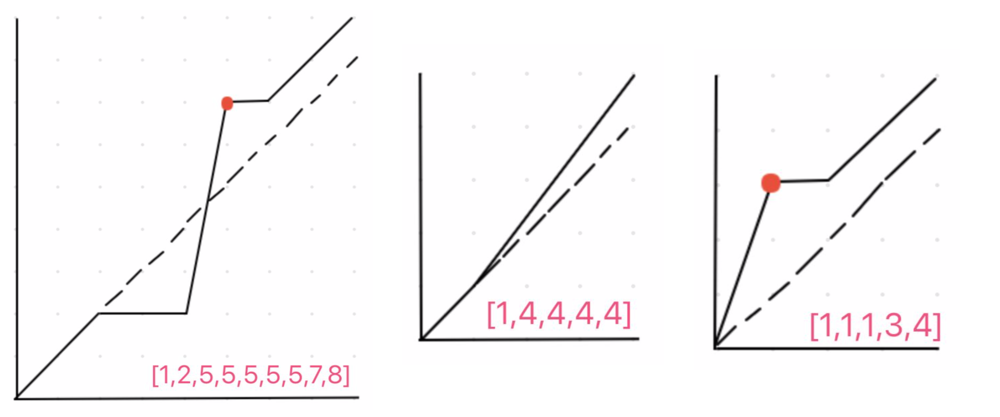

# Advanced Algorithms \(4\) - Sweep Line, Deque, Binary Search

## 1. Sweep Line 

扫描线的主要思想：将起点和终点打散排序

* \[\[1,3\], \[2,4\]\] =&gt; \[\[1,start\], \[2,start\], \[3,end\], \[4,end\]\]

扫描主要用来解决的问题特征：

* 事件往往是以区间的形式存在
* 区间两端代表事件的开始和结束
* 按照区间起点排序，起点相同的按照终点拍排序

#### [391. Number of Airplanes in the Sky](https://www.lintcode.com/problem/number-of-airplanes-in-the-sky/description)

先将所有start, end记录下来，之后对list进行排序，起飞就加1，降落就减1，然后维护一个最大的值。

* 这个题非常的经典

```python
"""
class Interval(object):
    def __init__(self, start, end):
        self.start = start
        self.end = end
"""

class Solution:

    def countOfAirplanes(self, airplanes):
        points = []
        for airplane in airplanes :
            points.append([airplane.start, 1])
            points.append([airplane.end, -1])
        
        max_num, cum_num = 0, 0
        for _, delta in sorted(points):
            cum_num += delta
            max_num = max(max_num, cum_num)
        return max_num
```

#### [919. Meeting Rooms II](https://www.lintcode.com/problem/meeting-rooms-ii/description)

和上面一道题一样，适合练习一下

```python
class Solution:
    """
    @param intervals: an array of meeting time intervals
    @return: the minimum number of conference rooms required
    """
    def minMeetingRooms(self, intervals):
        points = []
        for interval in intervals :
            points.append([interval.start, 1])
            points.append([interval.end, -1])
        
        max_num, cum_num = 0, 0
        for _, delta in sorted(points) :
            cum_num += delta
            max_num = max(max_num, cum_num)
        
        return max_num
```

#### [821. Time Intersection](https://www.lintcode.com/problem/time-intersection/description)

这个题比较有趣，是前面几个题的延伸版，非常的有价值。

```python
"""
class Interval(object):
    def __init__(self, start, end):
        self.start = start
        self.end = end
"""

class Solution:

    def timeIntersection(self, seqA, seqB):
        points = []
        for interval in seqA + seqB :
            points.append([interval.start, 1])
            points.append([interval.end, -1])
        
        results = []
        online, last_time = 0, None 
        for cur_time, delta in sorted(points) :
        # 如果找到了头和尾就merge
            if online == 2:
                self.merge(results, last_time, cur_time)
            online += delta
            last_time = cur_time
        
        return results
        
    def merge(self, results, last_time, cur_time) :
        # 起始时间不存在以及两个时间一致的情况
        if last_time is None or last_time == cur_time :
            return
        # 最后一个的时间可以延长
        if results and results[-1].end == last_time :
            results[-1].end = cur_time
            return
        
        results.append(Interval(last_time, cur_time))
```

#### [131. The Skyline Problem](https://www.lintcode.com/problem/the-skyline-problem/description)



硬骨头慢慢啃..

## 2 .Binary Search

#### [390. Find Peak Element II](https://www.lintcode.com/problem/find-peak-element-ii/description)

先码住，暴力解可以，但是不知道如何优化到O\(n\)

#### 二分答案

主要的特征是，不像其他题目，给出数组进行二分，但是要求还是找到满足某个条件的最大或者最小值。

解题方法： 通过猜值判断是否满足题意不对去搜索可能解

* a. 找到可行解范围
* b. 猜答案
* c. 检验条件
* d. 调整搜索范围

```python
# 1. 确定答案范围
start, end = 答案可能的值域范围

while start + 1 < end :
    # 2. 猜答案
    mid = (start + end) // 2
    # 3. 检测答案 
    if should_be_smaller(mid) :
        # 4. 范围调整
        end = mid
    else :
        # 4. 范围调整
        start = mid
        
最好再检测start 和 end，哪个是要的答案
```

#### [141. Sqrt\(x\)](https://www.lintcode.com/problem/sqrtx/description)

二分之后，看一下三种情况，然后确定范围和边界。

```python
class Solution:

    def sqrt(self, x):
        start, end = 0, x 
        
        while start + 1 < end :
            
            mid = (start + end) // 2
            # 三种情况
            if mid * mid == x :
                return mid
            elif mid * mid > x :
                end = mid
            else :
                start = mid
        # 二分答案后，看一下end即可，因为总是会偏左        
        if end * end == x :
            return end
            
        return start
```

#### [586. Sqrt\(x\) II](https://www.lintcode.com/problem/sqrtx-ii/description)

这个题非常好，1e-10就是精度，这里可以进行修改来确认精度。

```python
class Solution:

    def sqrt(self, x):
        # test > 1 or < 1
        if x >= 1 :
            start, end = 1, x
        else :
            start, end = x, 1
    
        while end - start > 1e-10 :
            # 使用//会变成整数，小心
            mid = (start + end) / 2
            
            if mid * mid < x :
                start = mid
            else :
                end = mid
        
        return start
```

#### [183. Wood Cut](https://www.lintcode.com/problem/wood-cut/description)

这个题比较巧妙，难度一般，不细说了

```python
class Solution:

    def woodCut(self, L, k):
        if not L :
            return 0
            
        start, end = 1, max(L)
        
        while start + 1 < end :
            mid = (start + end) // 2
            # 切的多，说明长度小，改start
            if self.get_pieces(L, mid) >= k :
                start = mid
            else :
                end = mid
                
        if self.get_pieces(L, end) >= k :
            return end
        if self.get_pieces(L, start) >= k :
            return start
        
        return 0
    
    def get_pieces(self, L, length) :
        pieces = 0
        for w in L :
            pieces += w // length
        return pieces
```

[437. Copy Books](https://www.lintcode.com/problem/copy-books/description)

[633. Find the Duplicate Number](https://www.lintcode.com/problem/find-the-duplicate-number/description)



方法二:快慢指针

假设有0-n 一共 n+1 个点 把数组看为记录了每个点的下一个节点的 next 数组 这样就有一个 n+1 个点的链表 且可以证明是带环的  
 Refer to LintCode 103. Linked List Cycle II

[617. Maximum Average Subarray II](https://www.lintcode.com/problem/maximum-average-subarray-ii/description)

## 3. Deque


