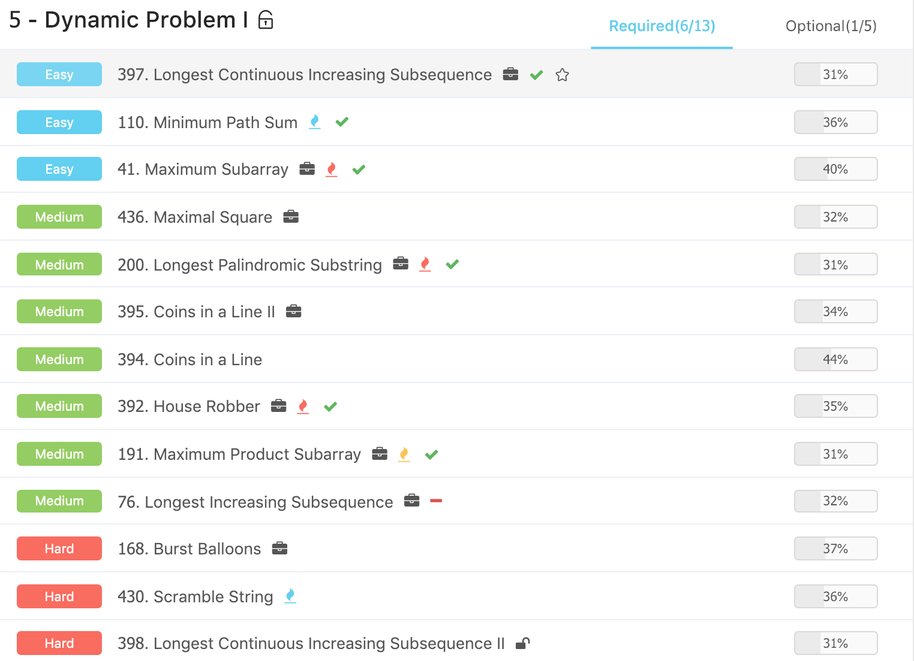
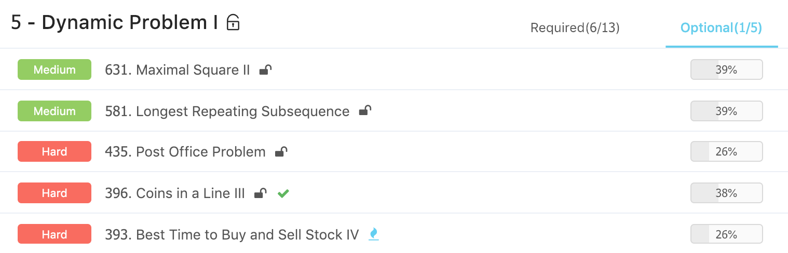

# Advanced Algorithms \(5\) - Dynamic Programming I

## 1. 动态规划初步

动态规划比较复杂，可能后面会有一个专题来详细研究动态规划，这里主要简单的提一下。

#### 什么时候使用动态规划？

动态规划一般用来解决以下三种问题：

* 最优解，也就是最大最小值
* 可行性问题，比如是否存在
* 方案总数问题

一般来说，动态规划问题每一个状态之间都存在着一定的联系，这样才可以使用动态规划来求解。

* 就我个人的理解来说，动态规划是在dfs基础之上的一种记忆化搜索，dfs也需要递归条件，也一般是一种状态转移，而动态规划将重复做的事情进行记忆化，因而减少了不必要的时间和空间耗费

#### 动态规划的四要素 ：

* **a. 状态** ：灵感，创造力，存储小规模问题的结果
  * 具体来说，是求极值，可行性还是计数
* **b. 方程** : 状态之间的转移过程
  * 状态之间的联系，怎么通过小的状态，来求得大的状态
* **c. 初始化** : 基本就是确认边界是什么
  * 最极限的小状态是什么, 起点
* **d. 答案** : 最终需要的是什么
  * 最大的那个状态是什么，终点

Review 

* 记得DFS的三要素么？定义，出口，拆解。和DP非常相似

#### 动态规划的利器 ：

* **滚动数组** ：不使用 n \* m 的空间去存储数据，而是使用 2 \* n , 从而节省了空间
  * mod : f\[i % 3\] = f\[\(i - 1\) % 3\] + f\[\(i - 2\) % 3\] 
    * 取模是四则运算中最慢的
  * old, new :  
    * ```python
      old, new = 0, 1
      old, new = new, 1 - old
      ```
* **记忆化搜索 :** 通过将访问过的结果存储以加速运算，典型是的斐波那契数列

## 2. 序列、矩阵型

#### [392. House Robber](https://www.lintcode.com/problem/house-robber/description)

基本所有的DP问题，只要想清楚那四要素就可以解决了，这个问题的本质其实是要不偷相邻的，突破点是如何转化为子问题：

* 状态 ： f\[i\] 表示前面i个房子能偷到的最大值
* 状态转移： f\[i\] = max\( f\[i-1\], f\[i-2\] + A\[i-1\]\)
  * 不偷最后一个，就是f\[i - 1\]
  * 偷最后一个获得A\[i -1\]，以及f\[i -2\]的最大值
* 初始化 ：f\[0\] = 0, f\[1\] = A\[0\]
  * 对于序列型，因为需要前面的和，n个状态需要n + 1的数组来存储
* 答案 : f\[n\]

```python
class Solution:
    """
    @param A: An array of non-negative integers
    @return: The maximum amount of money you can rob tonight
    """
    def houseRobber(self, A):
        n = len(A)
        # corner
        if not A and n == 0 :
            return 0
        
        f = []
        for i in range(n) :
            # init 
            if i == 0 or i == 1:
                f.append(A[i])
                continue 
            # state transfer
            f[i % 2] = max(f[(i - 1) % 2], f[(i - 2) % 2] + A[i]) 
            
        return f[(n - 1) % 2]
```

#### [534. House Robber II](https://www.lintcode.com/problem/house-robber-ii/description)

在前一个题的基础之上，将房子连成一个环，动态规划的四要素基本没有改变，但是对于环的情况需要进行处理:

* 偷第0个 ： 那么最后一个不能偷，因为换，所以范围是 0 ~ n - 1
* 不偷第0个 ： 那么就是正常偷，范围是 1 ~ n  

```python
class Solution:
    # @param nums: A list of non-negative integers.
    # return: an integer
    def houseRobber2(self, nums):
        # write your code here
        n = len(nums)
        if n == 0:
            return 0
        if n == 1:
            return nums[0]

        dp = [0] * n
        
        dp[0], dp[1] = 0, nums[1]
        # 偷第0个，不成环
        for i in range(2, n):
            dp[i] = max(dp[i - 2] + nums[i], dp[i - 1])

        answer = dp[n - 1]

        dp[0], dp[1] = nums[0], max(nums[0], nums[1])
        # 不偷第0个，成环
        for i in range(2, n - 1):
            dp[i] = max(dp[i - 2] + nums[i], dp[i - 1])

        return max(dp[n - 2], answer)
```

相关问题，maximum subarray

#### [436. Maximal Square](https://www.lintcode.com/problem/maximal-square/description)

这里要想清楚的是，状态到底是如何转移的：

```text
1, 0, 1 # 
0, 1, 1 # 
0, 1, 1 #
```

* 一开始先扫描第一行，接下来扫描第二行
* 如果第二行不为1，就跳过
* 如果第二行是1，则看一下它的左上，右，和上的最小长度，这样能确定现在的最小宽度
  * e.g 到 \[2, 2\] 这个点，左上是1，左是1，上也是1 （不能形成正方形）

由此这个题基本就解决了，然后确定dp的四要素:

* 状态 : 
  * f\[i\]\[j\] 表示以 i, j 为右下角的正方形的最大边长 
* 方程 : 
  * f\[i\]\[j\] = min\(f\[i-1\]\[j\], f\[i\]\[j-1\], f\[i-1\]\[j-1\]\) + 1 if matrix\[i\]\[j\] == 1 else 0
* 初始化 :  
  * f\[0\]\[i\] = matrix\[0\]\[i\] f\[i%2\]\[0\] = matrix\[i\]\[0\]
* 答案 : 
  * max\(f\[i\]\[j\]\)

#### [631. Maximal Square II](https://www.lintcode.com/problem/maximal-square-ii/description)

在前一个题的基础之上有了变化，那么需要记录的就有三个，一个是对角线，一个是上面，一个是left:

* diagonal
* up
* left

占坑

#### 对于矩阵型动态规划的小tips :

* 正方形用右下角作为定位角
* 长方形可以用左上角和右下角作为定位角

#### 记忆化搜索

* 动态规划就是解决了重复计算的搜索
*  动态规划的实现方式:
  * 循环\(从小到大递推\)
  * 记忆化搜索\(从大到小搜索\)
    * 画搜索树
    * 万金油

#### [397. Longest Continuous Increasing Subsequence](https://www.lintcode.com/problem/longest-continuous-increasing-subsequence/description)

这个题很简单，先从左向右，再从右向左，看一下最长的递增数是多少

```python
class Solution:
    """
    @param A: An array of Integer
    @return: an integer
    """
    def longestIncreasingContinuousSubsequence(self, A):
        if not A:
            return 0
        longest, incr, desc = 1, 1, 1
        for i in range(1, len(A)):
            if A[i] > A[i - 1]:
                incr += 1
                desc = 1
            elif A[i] < A[i - 1]:
                incr = 1
                desc += 1
            else:
                incr = 1
                desc = 1
            longest = max(longest, max(incr, desc))
            
        return longest
```

#### [398. Longest Continuous Increasing Subsequence II](https://www.lintcode.com/problem/longest-continuous-increasing-subsequence-ii/description)

如果暴力解，就会出现重复遍历，因此不管dp还是其他办法都没有办法规避，这里就是用记忆化搜索来进行优化，先找四要素:

* State: memo\[x\]\[y\] 以x,y作为开头的最长子序列
* Function: 
  * 遍历 x,y 上下左右四个格子 \(x\_, y\_\)
  * memo\[x\]\[y\] = max\(memo\[x\]\[y\], memo\[x\_\]\[y\_\] + 1\)  \(if A\[x\]\[y\] &lt; A\[x\_\]\[y\_\]\)
* Initialization : memo\[x\]\[y\] 是极小值时，初始化为1
*  Answer: memo\[x\]\[y\]中最大值

占坑

#### 什么时候用记忆化搜索? 

* 状态转移特别麻烦，不是顺序性
* 初始化状态不是很容易找到

#### 记忆化搜索缺陷

* 耗费更多空间，无法使用滚动数组优化
* 递归深度可能会很深

## 3. 博弈型

博弈有先后手，因此来决定整体的状态

* State: 先手是否能获胜 / 能够获得的最大利益
* Function: 循环枚举先手的策略可能性
* Initialization: 最极限/最小的状态下的先手的值
* Answer: 整个问题先手是否可能获胜

一般的思路:

* 先思考最小状态
* 然后思考大的状态-&gt; 往小的递推，那么非常适合记忆化搜索

#### [394. Coins in a Line](https://www.lintcode.com/problem/coins-in-a-line/description)

递归的四要素:

* State: dp\[i\] 现在还剩 i 个硬币，现在先手取硬币的人最后输赢状况
* Function: dp\[i\] = not dp\[i - 1\] or not dp\[i - 2\]
* Initialization: 
  * dp\[0\] = false 
  * dp\[1\] = true 
  * dp\[2\] = true
* Answer:  dp\[n\]

这个题最后会发现一个规律 =&gt; n%3 == 0 就会输，否则就赢。因为对方的策略可以是，无论你拿走多少 个硬币\(x\)，都拿走 3-x 个。

占坑

#### [395. Coins in a Line II](https://www.lintcode.com/problem/coins-in-a-line-ii/description)

* State: dp\[i\] 表示取 i ~ n-1 这些硬币时，先手取得的最大硬币总价
* Function: 
  * sum\[i\] 是后 i ~ n-1 这些硬币的价值总和 
  * dp\[i\] = max\(sum\[i\] - dp\[i + 1\],   sum\[i\] - dp\[i + 2\]）
  * 取决于 先手取第几个硬币
* Initialization:
  * dp\[n-1\] = coin\[n-1\]
  * dp\[n-2\] = coin\[n-1\] + coin\[n-2\]
* Answer:  dp\[0\]

占坑

#### [396. Coins in a Line III](https://www.lintcode.com/problem/coins-in-a-line-iii/description)

 区间型动态规划 • State:

• dp\[i\]\[j\] 现在还第i到第j的硬币，先手可以最多取走的硬币总价值 • Function:

sum\[i\]\[j\] 表示第i到第j的硬币价值总和  
 dp\[i\]\[j\] = max\(sum\[i\]\[j\] - dp\[i+1\]\[j\], sum\[i\]\[j\] - dp\[i\]\[j-1\]\);

• • •

• dp\[i\]\[i\] = coins\[i\]

• Answer:  
 • dp\[0\]\[n-1\]


状态转移特别麻烦，不是顺序性。

• Longest Continuous Increasing Subsequence II • 遍历 x,y 上下左右四个格子

• Coins in a Line III  
 • dp\[i\]\[j\] = sum\[i\]\[j\] - min\(dp\[i+1\]\[j\], dp\[i\]\[j-1\]\);

• 初始化状态不是很容易找到

• Longest Continuous Increasing Subsequence II • 初始化极小值

• Coins in a Line III • 初始化dp\[i\]\[i\]

• 从大到小

## Ladder





