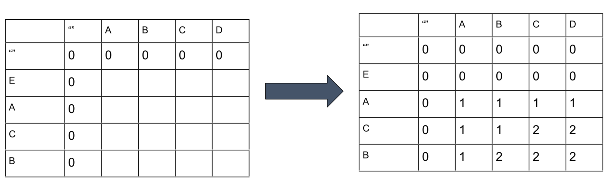
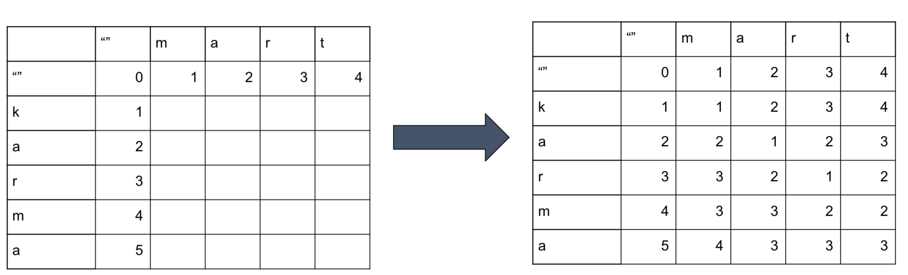
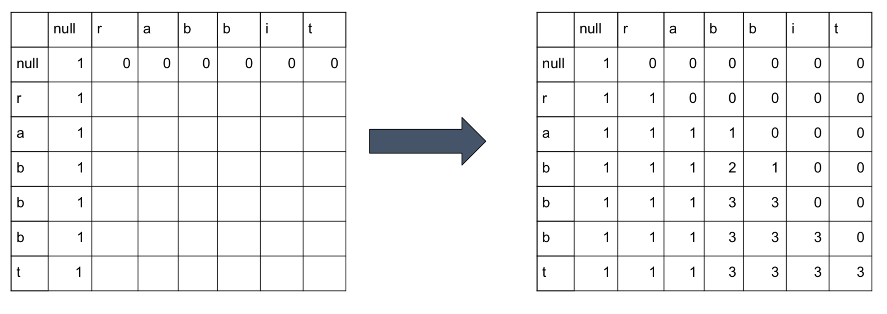
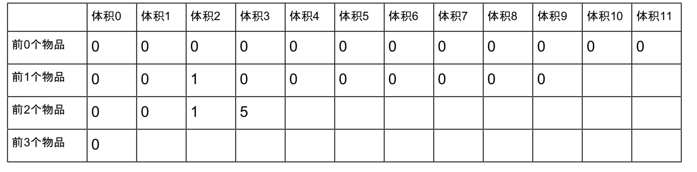
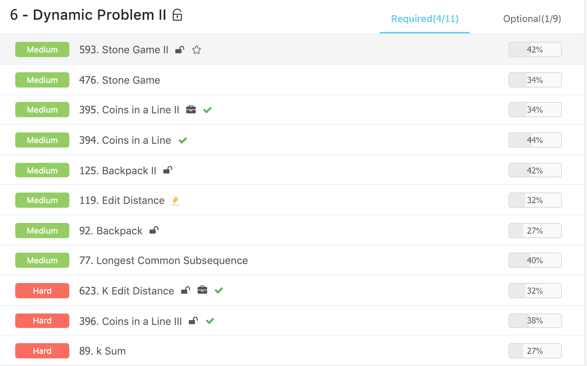
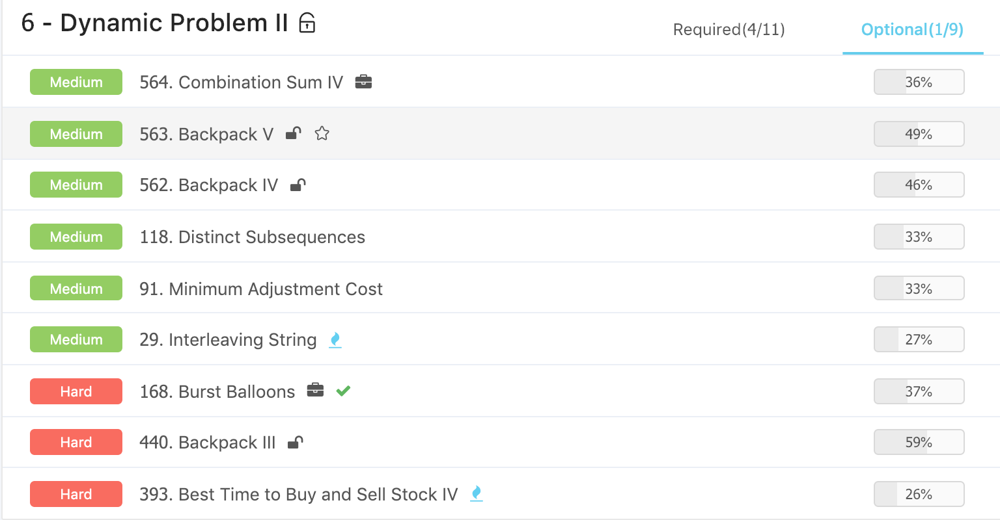

# Advanced Algorithms \(6\) - Dynamic Programming II

## 1. 区间类动态规划

* 求一段区间的解max/min/count 
* 转移方程通过区间更新
* 大区间的值依赖于小区间

#### [476. Stone Game](https://www.lintcode.com/problem/stone-game/description)

从观察的角度，先合并小的，这样合并的次数是相对比较小的，但这个题的这种思路是不太正确的，也就是贪心法是不行的。所以这个首先需要的是使用辅助的区间和来简化运算，然后确定分的位置在哪里，然后进行优化。

* 死胡同: 容易想到的一个思路从小往大，枚举第一次合并是在哪?
* 记忆化搜索的思路，从大到小，先考虑最后的0 - \(n-1\) 合并的总花费

分析的思路 ：

* State: dp\[i\]\[j\] 表示把第i到第j个石子合并到一起的最小花费
* Function:
  * 预处理sum\[i,j\] 表示i到j所有石子价值和
  * dp\[i\]\[j\] = min\(dp\[i\]\[k\]+dp\[k+1\]\[j\]+sum\[i,j\]\) 对于所有k属于{i,j-1}
* Initialize：dp\[i\]\[i\] = 0  For each i 
* Answer : dp\[0\]\[n-1\]

占坑

#### 区间类动态规划的小技巧

目的:先计算小区间，再计算大区间

1. 先循环区间长度，再循环起点位置 
   * ```python
     for length in range(2, n + 1):
         for i in range(n - length + 1):
             j = i + length - 1
     ```
2. 起点倒过来循环，终点正过去循环
   * ```python
     for i in range(n - 1, -1, -1) ：
         for j in range(i, n) :
     ```
3. 记忆化搜索 : 使用memo

#### [168. Burst Balloons](https://www.lintcode.com/problem/burst-balloons/description)

* 死胡同: 容易想到的一个思路从小往大，枚举第一次在哪吹爆气球?
* 记忆化搜索的思路，从大到小，先考虑最后一个气球被吹爆之后的获益 

#### 第一种方法

如果炸的是第k个气球，那么收益就是k左边的最大收益加上k右边的最大收益，再加上k本身的收益。

具体的递归四要素:

* State : dp\[i\]\[j\] 表示把第i到第j个气球打爆的最大价值
* Function:
  * 对于所有k属于{i,j}, 表示第k号气球最后打爆。
  * score = arr\[i-1\] \* arr\[k\] \* arr\[j+1\];
  * dp\[i\]\[j\] = max\(dp\[i\]\[k-1\]+dp\[k+1\]\[j\]+score\)
* Initialization : For each i, dp\[i\]\[i\] = arr\[i-1\] \* arr\[i\] \* arr\[i+1\];
* Answer : dp\[0\]\[n-1\]

#### 第二种方法

通过对两端加入1的方法，虽然增加了数组的长度，但是简化了现有的状态。 

* State : dp\[i\]\[j\] 表示把第i+1到第j-1个气球打爆，剩下i,j的最大收益
* Function: 
  * 对于所有k属于{i + 1,j - 1}, 表示第k号气球最后打爆。
    * score = arr\[i\] \* arr\[k\] \* arr\[j\]
    * dp\[i\]\[j\] = max\(dp\[i\]\[k\]+dp\[k\]\[j\]+score\)
* Initialization :  dp\[i\]\[i\] = 0
*  Answer : dp\[0\]\[n-1\]

占坑

#### [430. Scramble String](https://www.lintcode.com/problem/scramble-string/description)

• State:  
 • dp\[x\]\[y\]\[k\] 表示是从s1串x开始，s2串y开始，他们后面k个字符组成的substr是Scramble String

• Function:

* 对于所有i属于{1,k}
* s11 = s1.substring\(0, i\); s12 = s1.substring\(i, s1.length\(\)\);
* s21 = s2.substring\(0, i\); s22 = s2.substring\(i, s2.length\(\)\);
* s23 = s2.substring\(0, s2.length\(\) - i\); s24 = s2.substring\(s2.length\(\) - i, s2.length\(\)\);
* for i = x -&gt; x+k

• dp\[x\]\[y\]\[k\] = \(dp\[x\]\[y\]\[i\] && dp\[x+i\]\[y+i\]\[k-i\]\) \|\| dp\[x\]\[y+k-i\]\[i\] && dp\[x+i\]\[y\]\[k-i\]\)

• Intialize:  
 • dp\[i\]\[j\]\[1\] = s1\[i\]==s\[j\].

• Answer:  
 • dp\[0\]\[0\]\[len\]

-- 

* 看 f\[great\]\[rgreat\] 这个参考例子
* f\[gr\|eat\]\[rgreat\] =

  • f\[gr\]\[rg\] and f\[eat\]\[eat\] • f\[gr\]\[at\] and f\[eat\]\[rgr\]

这个题... 占坑.... -.- \|\|\|

#### 区间型动态规划总结

* 最后都是求 0~n-1 这段区间的值 
* 逆向思维:考虑最后一步如何做，而不考虑第一步如何做，使用记忆化搜索更容易实现

## 2. 匹配型动态规划

#### 一般特征：

* 匹配两个字符串的最优值/方案数/可行性 
* 可以使用滚动数组优化空间

#### 一般四要素：

* state: f\[i\]\[j\]代表了第一个sequence的前i个数字/字符，配上第二个sequence的前j个...
* function:  f\[i\]\[j\] = 研究第i个和第j个的匹配关系 \(实际上只需研究上，左，左上三个状态
*  initialization: f\[i\]\[0\] 和 f\[0\]\[i\]
* answer: 
  * f\[n\]\[m\] min/max/数目/存在关系
    * n = s1.length\(\)
    * m = s2.length\(\)

#### 解题技巧画矩阵，填写矩阵

#### [77. Longest Common Subsequence](https://www.lintcode.com/problem/longest-common-subsequence/description)

* state: f\[i\]\[j\]表示前i个字符配上前j个字符的LCS的长度
* function: f\[i\]\[j\] = 
  * max\(f\[i-1\]\[j\], f\[i\]\[j-1\], f\[i-1\]\[j-1\] + 1\)  // A\[i - 1\] == B\[j - 1\]
  * max\(f\[i-1\]\[j\], f\[i\]\[j-1\]\) // A\[i - 1\] != B\[j - 1\]
* initialize: f\[i\]\[0\] = 0 f\[0\]\[j\] = 0
* answer: f\[n\]\[m\]



#### [119. Edit Distance](https://www.lintcode.com/problem/edit-distance/description)

* state: f\[i\]\[j\]表示A的前i个字符最少要用几次编辑可以变成B的前j个字符
* function: f\[i\]\[j\] = 
  * min\(f\[i-1\]\[j\]+1, f\[i\]\[j-1\]+1, f\[i-1\]\[j-1\]\) // A\[i - 1\] == B\[j - 1\]
  * min\(f\[i-1\]\[j\]+1, f\[i\]\[j-1\]+1, f\[i-1\]\[j-1\]+1\) // A\[i - 1\] != B\[j - 1\]
* initialization: f\[i\]\[0\] = i, f\[0\]\[j\] = j
* answer: f\[n\]\[m\]



#### [118. Distinct Subsequences](https://www.lintcode.com/problem/distinct-subsequences/description)

* state: f\[i\]\[j\] 表示 S的前i个字符中选取T的前j个字符，有多少种方案
* function: f\[i\]\[j\] = f\[i - 1\]\[j\] + f\[i - 1\]\[j - 1\] // S\[i-1\] == T\[j-1\]
* = f\[i - 1\]\[j\] // S\[i-1\] != T\[j-1\]
* initialize: f\[i\]\[0\] = 1, f\[0\]\[j\] = 0 \(j &gt; 0\)
* answer: f\[n\]\[m\] \(n = sizeof\(S\), m = sizeof\(T\)\)



#### [29. Interleaving String](https://www.lintcode.com/problem/interleaving-string/description)

* state: f\[i\]\[j\]表示
  * s1的前i个字符
  * s2的前j个字符能否交替组成
  * s3的前i+j个字符 
* function: 
  * f\[i\]\[j\] = \(f\[i-1\]\[j\] && \(s1\[i-1\]==s3\[i+j-1\]\) \|\| \(f\[i\]\[j-1\] && \(s2\[j-1\]==s3\[i+j-1\]\)
* initialize: 
  * f\[i\]\[0\] = \(s1\[0..i-1\] == s3\[0..i-1\]\) 
  * f\[0\]\[j\] = \(s2\[0..j-1\] == s3\[0..j-1\]\) 
* answer: 
  * f\[n\]\[m\], n = sizeof\(s1\), m = sizeof\(s2\)

#### [623. K Edit Distance](https://www.lintcode.com/problem/k-edit-distance/description)

## 3. 背包型动态规划

#### 特点 :

1.  用值作为DP维度 
2. DP过程就是填写矩阵
3. 可以滚动数组优化

#### [92. Backpack](https://www.lintcode.com/problem/backpack/description)

* State:
  * f\[i\]\[S\] “前i”个物品，取出一些能否组成和为S
* Function：
  * a\[i-1\] 是第i个物品下标是i-1
  * f\[i\]\[S\] = f\[i-1\]\[S - a\[i-1\]\] or f\[i-1\]\[S\]
* Initialize:
  * f\[i\]\[0\] = true; f\[0\]\[1..target\] = false 
* Answer: 检查所有的f\[n\]\[j\]
* 时间复杂度 ： O\(n\*S\) ， 滚动数组优化


#### BackPack 马甲题型 

* 把一个\[1,24,5,6\]数组尽量平分。

#### [125. Backpack II](https://www.lintcode.com/problem/backpack-ii/description)

* 状态:  f\[i\]\[j\] 表示前i个物品当中选一些物品组成容量为j的最大价值
* 方程：f\[i\]\[j\] = max\(f\[i-1\]\[j\], f\[i-1\]\[j-A\[i-1\]\] + V\[i-1\]\);
* 初始化: f\[0\]\[0\]=0
* 答案: f\[n\]\[s\]
* 时间复杂度： O\(n\*s\)



#### [562. Backpack IV](https://www.lintcode.com/problem/backpack-iv/description)

* State: f\[i\]\[j\] “前i”个物品，取出一些物品，第i物品随便取多少个，组成和为j的个数
* Function: 
  * a\[i-1\] 是第i个物品，下标是i-1
  * k 是第i个物品选取的次数
  * f\[i\]\[j\] = sum\(f\[i-1\]\[j - k\*a\[i-1\]\]\)
* Initialization:  f\[i\]\[0\] = true; f\[0\]\[1..target\] = false
* Answer: f\[n\]\[target\]
* 进一步优化方程: f\[i\]\[j\] = f\[i - 1\]\[j\] + f\[i\]\[j - a\[i - 1\]\]

#### [89. k Sum](https://www.lintcode.com/problem/k-sum/description)

• n个数，取k个数，组成和为target

* State: f\[i\]\[j\]\[s\]前i个数取j个数出来能否和为s 
* Function: f\[i\]\[j\]\[s\] = f\[i - 1\]\[j - 1\]\[s - a\[i-1\]\] + f\[i - 1\]\[j\]\[s\]
* Initialization : f\[i\]\[0\]\[0\] = 1
* Answer: f\[n\]\[k\]\[target\]

#### [91. Minimum Adjustment Cost](https://www.lintcode.com/problem/minimum-adjustment-cost/description)

* State: f\[i\]\[v\] 前i个数，第i个数调整为v，满足相邻两数&lt;=target，所需要的最小代价
* Function: f\[i\]\[v\] = min\(f\[i-1\]\[v’\] + \|A\[i\]-v\|, \|v-v’\| &lt;= target\)
* Answer: f\[n\]\[a\[n\]-target~a\[n\]+target\]
* 时间复杂度 O\(n \* A \* T\)

## Ladder





