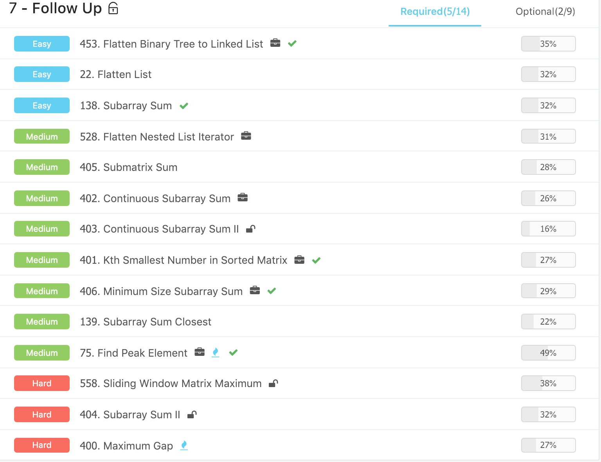
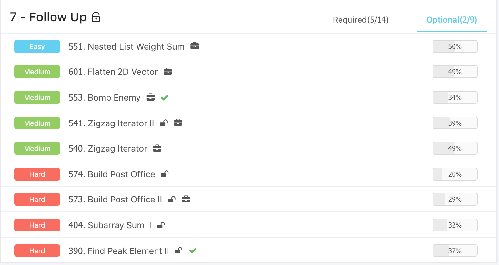

# Advanced Algorithms \(7\) - Follow Up

#### [138. Subarray Sum](https://www.lintcode.com/problem/subarray-sum/description)

prefix sum的简单应用

[139. Subarray Sum Closest](https://www.lintcode.com/problem/subarray-sum-closest/description)

[405. Submatrix Sum](https://www.lintcode.com/problem/submatrix-sum/description)

[404. Subarray Sum II](https://www.lintcode.com/problem/subarray-sum-ii/description)

[402. Continuous Subarray Sum](https://www.lintcode.com/problem/continuous-subarray-sum/description)

[403. Continuous Subarray Sum II](https://www.lintcode.com/problem/continuous-subarray-sum-ii/description)

[5. Kth Largest Element](https://www.lintcode.com/problem/kth-largest-element/description)

[508. Wiggle Sort](https://www.lintcode.com/problem/wiggle-sort/description)

[507. Wiggle Sort II](https://www.lintcode.com/problem/wiggle-sort-ii/description)

[399. Nuts & Bolts Problem](https://www.lintcode.com/problem/nuts-bolts-problem/description)

[22. Flatten List](https://www.lintcode.com/problem/flatten-list/description)

[528. Flatten Nested List Iterator](https://www.lintcode.com/problem/flatten-nested-list-iterator/description)

[601. Flatten 2D Vector](https://www.lintcode.com/problem/flatten-2d-vector/description)

[86. Binary Search Tree Iterator](https://www.lintcode.com/problem/binary-search-tree-iterator/description)

## Ladder

