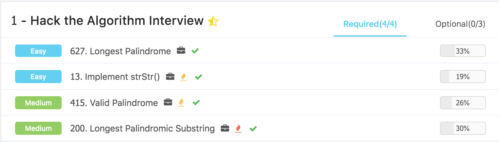
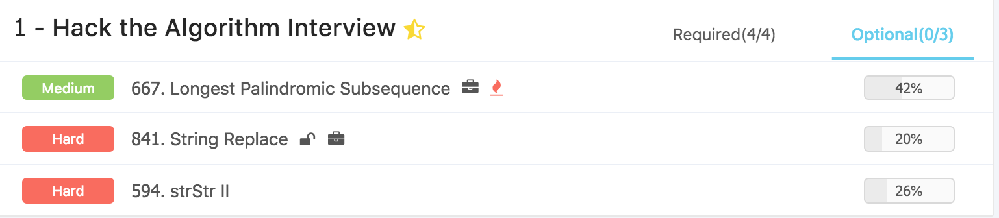

# Algorithms \(1\) - String

## 回文判断

这里的题基本都比较难，而且很多时候都是暴力求解。

#### 627. Longest Palindrome

使用了hash table来记录每一个元素出现的次数，然后区分一些特殊情况即可，这里特殊情况很多：

* 'aaa'
* ''
* 'a'
* 'aaaa'

对于test case的判断还是不够熟练

```python
class Solution:
    # @param {string} s a string which consists of lowercase or uppercase letters
    # @return {int} the length of the longest palindromes that can be built
    def longestPalindrome(self, s):
        # Write your code here
        if len(s) == 0 :
            return 0
            
        if len(s) == 1:
            return 1
        
        hash_map = {}
        
        for val in s :
            if val in hash_map :
                hash_map[val] += 1 
            else :
                hash_map[val] = 1
        
        cnt = 0
        
        for val in hash_map :
            cnt += hash_map[val] // 2
            
        if len(hash_map) > 1 :
            return 2*cnt + 1
        else:
            if hash_map[val] % 2 == 0 :
                return 2*cnt
            else :
                return 2*cnt + 1
```

#### 415. Valid Palindrome

相向双指针，进行检查

```python
class Solution:
    """
    @param s: A string
    @return: Whether the string is a valid palindrome
    """
    def isPalindrome(self, s):
        
        s = s.lower()
        start, end = 0, len(s) - 1
        
        if len(s) < 2 :
            return True
        
        while start <= end :
            
            while not s[start].isalnum() and start < end:
                start +=1
                
            while not s[end].isalnum() and start < end:
                end -=1
            
            if s[start] != s[end] :
                return False
            
            start += 1
            end -= 1
            
        return True

```

#### 13. Implement strStr\(\)

这里主要实现了Rabin Karp Algorithm，这里还没有完全理解，有时间再看。

```python
class Solution:
    def strStr(self, source, target):
            # write your code here
            if source == None or target == None: return -1
            if len(target) == 0: return 0
            power = 10**8 
            hash_target = 0
            for t in target:
                hash_target = (hash_target*31 + ord(t)) % power
            size = len(target)
            hash_source = 0 
            for i in range(len(source)):
                hash_source = (hash_source*31 + ord(source[i])) % power
                if i < size -1:
                    continue
                if hash_source == hash_target:
                    return i - size + 1 
                hash_source = (hash_source - ord(source[i-size+1]) * (31 ** (size-1)) ) % power
                if hash_source < 0:
                    hash_source += power
            return -1
```

#### 200. Longest Palindromic Substring

使用 Manacher's Algorithm, 可以在 O\(n\) 的时间内解决问题

```python
class Solution:
    """
    @param s: input string
    @return: the longest palindromic substring
    """
    def longestPalindrome(self, s):
        if not s:
            return

        # Using manacher's algorithm
        # abba => #a#b#b#a#
        chars = []
        for c in s:
            chars.append('#')
            chars.append(c)
        chars.append('#')
        
        n = len(chars)
        palindrome = [0] * n
        palindrome[0] = 1
        
        mid, longest = 0, 1
        for i in range(1, n):
            length = 1
            if mid + longest > i:
                mirror = mid - (i - mid)
                length = min(palindrome[mirror], mid + longest - i)

            while i + length < len(chars) and i - length >= 0:
                if chars[i + length] != chars[i - length]:
                    break;
                length += 1
            
            if length > longest:
                longest = length
                mid = i
            
            palindrome[i] = length
        
        # remove the extra #
        longest = longest - 1
        start = (mid - 1) // 2 - (longest - 1) // 2
        return s[start:start + longest]
```

## Ladder





