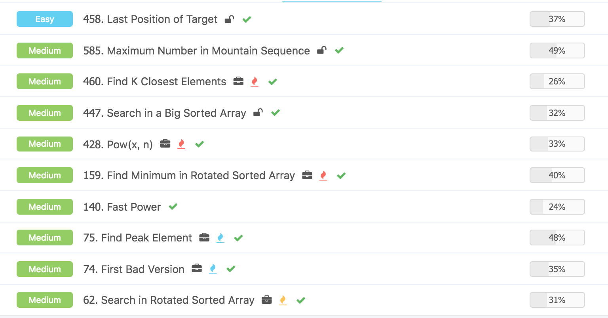
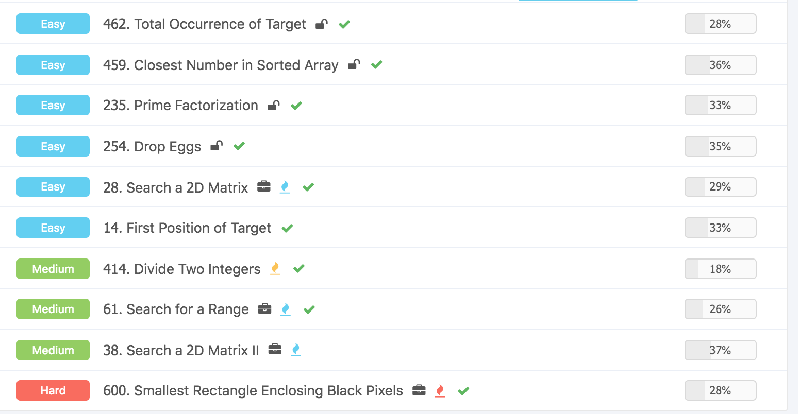
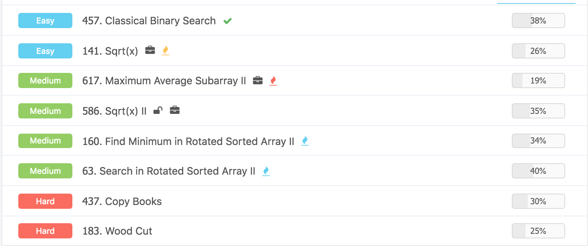

# Data Structure & Algorithms \(2\) - BST

## 1. Binary Search 第一重境界

#### Binary Search 基本模板：

```python
class Solution:
    """
    @param nums: An integer array sorted in ascending order
    @param target: An integer
    @return: An integer
    """
    def findPosition(self, nums, target):
        # write your code here        
        if len(nums) == 0:
            return -1
        
        start, end = 0, len(nums) - 1
        
        while start + 1 < end :
            mid = start + (end - start) // 2
            
            if nums[mid] < target :
                start = mid
            else :
                end = mid
                
        if nums[start] == target :
            return start
        if nums[end] == target:
            return end
            
        return -1
```


几种可能的变种，最后返回的是一个二元的list\[x,y\]，当两个是一样的时候，如果取左边就是start，取右边就是end。


#### 458. Last Position of Target

计算复杂度O\(n\)

没什么说的，就是遍历一遍整个数组就可以

```python
class Solution:
    """
    @param nums: An integer array sorted in ascending order
    @param target: An integer
    @return: An integer
    """
    def lastPosition(self, nums, target):
        
        # empty
        if len(nums) == 0 or target is None:
            return -1
        
        lastLocation = -1
        
        for i in range(len(nums)) :
            if target == nums[i] :
                lastLocation = i
        
        return lastLocation
```

计算复杂度O\(logn\)

就是处理左右指针相等的情况，这里比如说给\[1,2,2,4,5,5\]要找2的话，最后左右指针应该指的是\[2,2\]，这里就需要先输出右指针就可以。 

* mid = start + \(end - start\) // 2
* mid = \(start + end\) //2 
* 这两个是一样的，差别在于第一个防止stack overflow

```python
class Solution:
    """
    @param nums: An integer array sorted in ascending order
    @param target: An integer
    @return: An integer
    """
    def lastPosition(self, nums, target):
        
        if len(nums) == 0 :
            return -1
            
        start, end = 0, len(nums) - 1
        
        while start + 1 < end :
            mid = (start + end) // 2
            if nums[mid] <= target :
                start = mid
            else :
                end = mid
        
        if nums[end] == target :
            return end
        if nums[start] == target :
            return start
        return -1
```

## 2. Binary Search 第二重境界

* 判断XXOO类型的数组，特点是有明确的区分

#### 74. First Bad Version

计算复杂度 ： O\(logn\)

主要是二分查找锁定最后的xo，然后分别查找左右是否是bad version

```python
class Solution:
    """
    @param n: An integer
    @return: An integer which is the first bad version.
    """
    def findFirstBadVersion(self, n):
        # write your code here
        start, end = 0, n
        
        while start + 1 < end :
            
            mid = (start + end) // 2
            if SVNRepo.isBadVersion(mid) :
                end = mid
            else :
                start = mid
                
        if SVNRepo.isBadVersion(start):
            return start
        else :
            return end
```

#### 460. Find K Closest Elements

计算复杂度O\(logn + k\)

首先二分查找找到左右指针位置，然后判断左右哪一个离目标数更近，近的话就放进去，远的话就先不管。这里写了一个helper函数，就是判断左边是不是比右边小，如果小的话就是True，这样可以保证两个一样时，先选左边。

```python
class Solution:
    """
    @param nums: An integer array sorted in ascending order
    @param target: An integer
    @return: An integer
    """
    def lastPosition(self, nums, target):
        
        # empty
        if len(nums) == 0 or target is None:
            return -1
        
        lastLocation = -1
        
        for i in range(len(nums)) :
            if target == nums[i] :
                lastLocation = i
        
        return lastLocation
```

#### 447. Search in a Big Sorted Array

计算复杂度O\(logn\)

先使用倍增法 - Exponential Backoff，来判断值所处的区间，然后再使用二分法找到值的左右指针，然后因为要的是第一个值，所以start优先。

```python
class Solution:
    """
    @param: reader: An instance of ArrayReader.
    @param: target: An integer
    @return: An integer which is the first index of target.
    """
    def searchBigSortedArray(self, reader, target):
        # write your code here
        start, end = 0, 1
        
        while reader.get(end) < target :
            start = end
            end = start*2   
        
        while start + 1 < end :
            mid = (start + end) // 2
            if reader.get(mid) < target :
                start = mid
            else :
                end = mid
        
        if reader.get(start) == target :
            return start
        elif reader.get(end) == target :
            return end
        else :
            return -1
```

#### 159. Find Minimum in Rotated Sorted Array

计算复杂度O\(logn\)

这个题主要是中间切一刀之后，应该如何判断的问题，这里主要是和end比较。

```python
class Solution:
    """
    @param nums: a rotated sorted array
    @return: the minimum number in the array
    """
    def findMin(self, nums):
        # write your code here
        if len(nums) == 0 :
            return 0
            
        start, end = 0, len(nums) - 1
        
        while start + 1 < end :
            mid = (start + end) // 2
            
            if nums[mid] > nums[end]:
                start = mid
            else :
                end = mid 
        
        return min(nums[start],nums[end])
```

#### 585. Maximum Number in Mountain Sequence

计算复杂度O\(logn\)

这一类xxoo问题的关键是判断这一刀切下去之后，左右。

```python
class Solution:
    """
    @param nums: a rotated sorted array
    @return: the minimum number in the array
    """
    def findMin(self, nums):
        # write your code here
        if len(nums) == 0 :
            return 0
            
        start, end = 0, len(nums) - 1
        
        while start + 1 < end :
            mid = (start + end) // 2
            
            if nums[mid] > nums[end]:
                start = mid
            else :
                end = mid 
        
        return min(nums[start],nums[end])
```

#### 28. Search a 2D Matrix

计算复杂度O\(logn + logm\)

二分查找两次，第一次先找到行，第二次再找到列。

```python
class Solution:
    """
    @param matrix: matrix, a list of lists of integers
    @param target: An integer
    @return: a boolean, indicate whether matrix contains target
    """
    def searchMatrix(self, matrix, target):
        # write your code here
        
        
        def singleLine(List,target):

            start, end = 0, len(List) - 1
            
            while start + 1 < end :
                mid = (start + end) // 2
                if List[mid] < target :
                    start = mid
                else :
                    end = mid
                    
            if List[start] == target or List[end] == target :
                return True
            else :
                return False
        
        if len(matrix) == 0 :
            return False
            
        start, end = 0, len(matrix) - 1
        
        while start + 1 < end :
            mid = (start + end) // 2
            if matrix[mid][0] < target :
                start = mid
            else :
                end = mid
            
        if singleLine(matrix[start],target) or  singleLine(matrix[end],target) :
            return True      
            
        return False
```

#### 61. Search for a Range

计算复杂度O\(logn+m\)

先二分查找到左界，然后右移指针就可以了。

```python
class Solution:
    """
    @param A: an integer sorted array
    @param target: an integer to be inserted
    @return: a list of length 2, [index1, index2]
    """
    def searchRange(self, A, target):
        # write your code here
        start, end = 0, len(A) - 1
        
        if end < 0 :
            return [-1,-1]
        
        while start + 1 < end :
            mid = (start + end) // 2
            if A[mid] < target :
                start = mid
            else :
                end = mid
                
        result = []
        
        if A[start] == target :
            result.append(start)  
        elif A[end] == target :
            result.append(end)    
        else :
            return [-1,-1]
        
        while (end < len(A) - 1) :
            if A[end+1] == target :
                end += 1
            else :
                break
        
        result.append(end)
            
        if len(result) == 1 :
            return result + result
        else :
            return result
```

## 3. Binary Search 第三重境界

* Half-half 判断一半不符合就扔掉

#### 75. Find Peak Element

计算复杂度O\(logn\)

主要是可以判断出上升序列，就是。

```python
class Solution:
    """
    @param A: An integers array.
    @return: return any of peek positions.
    """
    def findPeak(self, A):
        # write your code here
        start, end = 0, len(A) - 1
        
        while start + 1 < end:
            mid = (start + end) // 2
            
            if A[mid] < A[mid+1] :
                start = mid
            else :
                end = mid
                
        if A[start] < A[end]:
            return end
        else :
            return start
```

#### 62. Search in Rotated Sorted Array

计算复杂度O\(logn\)

先找到最大值，然后判断一下，再二分查找，二分查找了两次，logn + log\(n/2\)还是logn。

```python
class Solution:
    """
    @param A: an integer rotated sorted array
    @param target: an integer to be searched
    @return: an integer
    """
    def search(self, A, target):
        # write your code here
        if len(A) == 0:
            return -1 
            
        start, end = 0, len(A) - 1
        
        while start + 1 < end :
            mid = (start + end) // 2
            if A[mid] < A[mid+1] and A[start] < A[mid]:
                start = mid
            else :
                end = mid
        
        if target <= A[end] or target >= A[end+1] :
            
            if A[0] > target :
                start, end = end, len(A) -1
            else :
                start = 0
                
            while start + 1 < end :
                mid = (start + end) // 2
                if A[mid] < target:
                    start = mid
                else :
                    end = mid

            if A[end] == target :
                return end
            if A[start] == target :
                return start
                
            
        return -1        
```

## 4. 其他Logn的算法

#### 140. Fast Power

计算复杂度O\(logn\)

使用的divide & conquer，先数学降低维度，基本上每一次只去一半取模，然后逐次相乘取模，这里一开始如果是30 -&gt; 15 -&gt; 7 -&gt; 3 -&gt; 1

```python
class Solution:
    """
    @param a: A 32bit integer
    @param b: A 32bit integer
    @param n: A 32bit integer
    @return: An integer
    """
    def fastPower(self, a, b, n):
        # write your code here
        ans = 1
        
        while n > 0 :
            if n % 2 == 1:
                ans = ans * a % b
                
            a = a * a % b
            n = n //2
            
            if ans == 0 or a == 0 :
                return 0
                
        return ans % b
```

#### 428. Pow\(x, n\)

计算复杂度O\(logn\)

需要注意的是这个题的corner case很多，需要把问题想清楚。

```python
class Solution:
    """
    @param x: the base number
    @param n: the power number
    @return: the result
    """
    def myPow(self, x, n):
        # write your code here
        ans, multiple, m = 1, x, abs(n)
        
        # corner case
        if x == 0 :
            return 0
        # fast mode    
        if n == 0 :
            return 1
        if n == 1 :
            return x
        
        while m > 0 :
            
            if m % 2 == 1:
                ans *= multiple 
            
            multiple = multiple * multiple
            m = m // 2
            
        # check negative value
        if n > 0 :
            return ans 
        else :
            return 1 / ans 
```

#### 分解质因数

Log\(sqrt\(n\)\)

```python
class Solution:
    """
    @param num: An integer
    @return: an integer array
    """
    def primeFactorization(self, num):
        # write your code here
        limit = int(math.sqrt(num)) + 1
        prime_list = []
        
        for prime in range(2,limit):
            while num % prime == 0 :
                prime_list.append(prime)
                num = num // 2
        if num > 1 :
            prime_list.append(num)
            
        return prime_list
        
```

## Ladder







