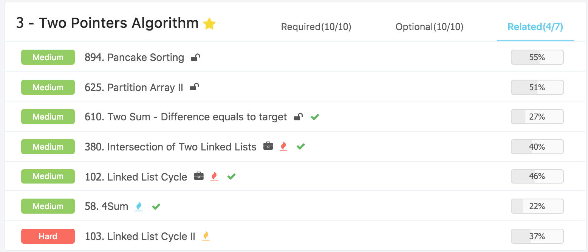

# Data Structure & Algorithms \(3\) - Two Pointers

双指针算法主要是在数组一端存在两个指针，同时向一边移动，用这样的方式来解决例如Two Sum的问题。

## 1. 相向双指针

* Reverse
* Two Sum
* Partition

相向双指针，指的是在算法的一开始，两根指针分别位于数组/字符串的两端，并相向行走，当它们相遇的时候就自动结束。

#### 39. Recover Rotated Sorted Array

三步翻转法，主要是两个指针相向而行，交换数组。

```python
class Solution:
    """
    @param nums: An integer array
    @return: nothing
    """
    def recoverRotatedSortedArray(self, nums):
        # write your code here
        n = len(nums)
        if n == 0 :
            return []
            
        def reverse_array(List) :

            start, end = 0, len(List) - 1
            n = len(List) // 2
            
            while n > 0 :
                temp = List[end]
                List[end] = List[start]
                List[start] = temp
                start += 1
                end -= 1
                n -= 1
                
            return List

        for i in range(n) :
            if nums[i] < nums[i - 1] :
                break

        if i == n - 1:
            pass
        else :
            nums[:i] = reverse_array(nums[: i])
            nums[i:] = reverse_array(nums[i:])
            nums = reverse_array(nums)
            
        return nums
```

### Exercise

#### 891. Valid Palindrome II

这里借鉴了quick sort的思路，找到左边的数字字母，然后找到右边的数字字母类，然后不等的话就不是，如果是的话左右指针相向就行。

```python
class Solution:
    """
    @param s: A string
    @return: Whether the string is a valid palindrome
    """
    def isPalindrome(self, s):
        
        s = s.lower()
        start, end = 0, len(s) - 1
        
        if len(s) < 2 :
            return True
        
        while start <= end :
            
            while not s[start].isalnum() and start < end:
                start +=1
                
            while not s[end].isalnum() and start < end:
                end -=1
            
            if s[start] != s[end] :
                return False
            
            start += 1
            end -= 1
            
        return True
```

#### 891. Valid Palindrome II

主要是前一个题的延续，这里有个特殊条件是给的string没有奇怪的符号，延续上一题的思路，遇到了不同的右指针移动一位即可。

```python
class Solution:
    """
    @param s: a string
    @return: nothing
    """
    def validPalindrome(self, s):
        # Write your code here
        if len(s) < 3 :
            return True
            
        start, end = 0, len(s) - 1
        count = 0
        
        while start < end :
            
            if s[start] == s[end] :
                start += 1
                end -= 1
            else :
                if count < 1:
                    end -= 1
                    count += 1
                else :
                    return False
                
        if  s[start] == s[end] :
            return True
        else :
            return False
```

#### 607. Two Sum III - Data structure design

Two Sum类，只能使用hash表来做的

```python
class TwoSum:
    A={}
    def add(self, number):
        if number in self.A:
            self.A[number] += 1
        else:
            self.A[number] = 1
        return 
    
    def find(self, value):
        for i in self.A:
            if value == 2*i:
                if self.A[i] > 1:
                    return True
            elif value - i in self.A:
                return True
        return False
```

#### 587. Two Sum - Unique Pairs

Two Sum中比较典型的问题，主要是记录一下是否有重复的。

```python
class Solution:
    """
    @param nums: an array of integer
    @param target: An integer
    @return: An integer
    """
    def twoSum6(self, nums, target):
        # paras
        count = 0
        result = []
        
        # check
        if len(nums) < 2 or target is None :
            return count
            
        nums.sort()
        
        left, right = 0, len(nums) - 1
        
        while left < right :
            
            if nums[left] + nums[right] < target :
                left += 1
            elif nums[left] + nums[right] > target :
                right -= 1
            else :
                conbination = [nums[left], nums[right]]
                if  conbination not in result :
                    count += 1
                    result.append(conbination)
                left += 1
                right -= 1   
                
        return count
```

#### 608. Two Sum II - Input array is sorted

双指针可以进行加速的，因为已经排序完成，如果值过大，移动右指针，过小的话，移动左指针。

```python
class Solution:
    """
    @param nums: an array of Integer
    @param target: target = nums[index1] + nums[index2]
    @return: [index1 + 1, index2 + 1] (index1 < index2)
    """
    def twoSum(self, nums, target):
        # write your code here
        n = len(nums) 
        
        if n == 0 :
            return []
            
        start,  end = 0, n - 1
        
        while start < end :
            
            if nums[start] + nums[end] == target :
                return [start + 1, end + 1]
                
            if nums[start] + nums[end] < target :
                start += 1
            if nums[start] + nums[end] > target :
                end -= 1

        return []
```

#### 57. 3sum

看成是2sum，只需要固定一个值，取-target，然后双指针如two sum遍历一遍数组就可以了，不是很难。

```python
class Solution:
    """
    @param numbers: Give an array numbers of n integer
    @return: Find all unique triplets in the array which gives the sum of zero.
    """
    def threeSum(self, nums):
        
        if len(nums) < 3 :
            return []
            
        index = 0
        visited = []
        nums.sort()
        
        while index < len(nums) :
            
            target = - nums[index]
            self.twoSum(0, index - 1, target, nums, visited)
            self.twoSum(index + 1, len(nums) - 1, target, nums, visited)
            index += 1
        
        return visited
            
    def twoSum(self, start, end, target, nums, visited) :
        
        left, right = start, end
        
        while left < right  :

            if nums[left] + nums[right] < target :
                left += 1
            elif nums[left] + nums[right] > target  :
                right -= 1
            else :
                combination = [-target, nums[left], nums[right]]
                combination.sort()
                if combination not in visited :
                    visited.append(combination)
                left += 1
                right -= 1
                
```

#### 382. Triangle Sum

排序后，先找到最大边，然后从0, i - 1找起， 如果左边满足，自然中间的都满足，依次节约时间进行快速运算即可。

```python
class Solution:
    """
    @param S: A list of integers
    @return: An integer
    """
    def triangleCount(self, S):
        S.sort()
        
        ans = 0
        for i in range(len(S)):
            left, right = 0, i - 1
            while left < right:
                if S[left] + S[right] > S[i]:
                    ans += right - left
                    right -= 1
                else:
                    left += 1
        return ans
```

#### Two Sum计数问题

#### 609. Two Sum - Less than or equal to target

简化的地方在于Two Sum右边最大，如果相加都小，那么中间所有的都小，移动左指针即可。  


```python
class Solution:
    # @param nums {int[]} an array of integer
    # @param target {int} an integer
    # @return {int} an integer
    def twoSum5(self, nums, target):
        # Write your code here
        l, r = 0, len(nums)-1
        cnt = 0
        nums.sort()
        while l < r:
            value = nums[l] + nums[r]
            if value > target:
                r -= 1
            else:
                cnt += r - l
                l += 1
        return cnt
```

#### 443. Two Sum - Greater than target

和上面一样，移动右指针就行。

```python
class Solution:
    """
    @param nums: an array of integer
    @param target: An integer
    @return: an integer
    """
    def twoSum2(self, nums, target):
        # write your code here
        left, right = 0, len(nums) - 1
        cnt = 0
        nums.sort()
        
        while left < right :
            
            twoSum = nums[left] + nums[right]
            
            if twoSum <= target :
                left += 1
            else :
                cnt += right - left
                right -= 1
        
        return cnt
```

#### 533. Two Sum - Closest to target

主要是不断更新，如果找到最小就返回。

```python
class Solution:
    """
    @param nums: an integer array
    @param target: An integer
    @return: the difference between the sum and the target
    """
    def twoSumClosest(self, nums, target):
        nums.sort()
        i, j = 0, len(nums)  - 1

        diff = sys.maxsize
        while i < j:
            if nums[i] + nums[j] < target:
                diff = min(diff, target - nums[i] - nums[j])
                i += 1
            else:
                diff = min(diff, nums[i] + nums[j] - target)
                j -= 1

        return diff
```

#### 59. 3Sum Closest

在前一个题的基础上不断找最大和最小，不断更新。

```python
class Solution:
    """
    @param numbers: Give an array numbers of n integer
    @param target: An integer
    @return: return the sum of the three integers, the sum closest target.
    """
    def threeSumClosest(self, numbers, target):
        numbers.sort()
        ans = None
        for i in range(len(numbers)):
            left, right = i + 1, len(numbers) - 1
            while left < right:
                sum = numbers[left] + numbers[right] + numbers[i]
                if ans is None or abs(sum - target) < abs(ans - target):
                    ans = sum
                    
                if sum <= target:
                    left += 1
                else:
                    right -= 1
        return ans
```

## 2. 同向双指针

计算复杂度 O\(n\)

#### 521. 数组去重问题 Remove duplicates in an array

第一种做法使用hash表进行记录，就是遍历一次如果不在hash table就扔掉

* 时间复杂度 O\(n\)   
* 空间复杂度 O\(n\)

```python
class Solution:
    """
    @param nums: an array of integers
    @return: the number of unique integers
    """
    def deduplication(self, nums):
        # Write your code here
        hashList, result = {}, 0
        
        for val in nums :
            if val not in hashList :
                nums[result] = val
                hashList[val] = 1
                result += 1
                
        return result
```

第二种做法，双指针同向，这里有两个指针一个slow\_pointer，另一个quick\_pointer，slow\_pointer一直从0开始，而quick\_pointer遍历整个数组，如果遇到不一样的，就写入slow\_pointer，然后slow\_pointer右移一格。

```python
class Solution:
    """
    @param nums: an array of integers
    @return: the number of unique integers
    """
    def deduplication(self, nums):
        # Write your code here
        n = len(nums) 
        
        if n == 0 :
            return 0
            
        nums.sort()
        slow_pointer = 1

        for quick_pointer in range(1, n) :
            
            if nums[quick_pointer - 1] != nums[quick_pointer] :
                nums[slow_pointer] = nums[quick_pointer]
                slow_pointer += 1
                
        return slow_pointer
```

#### 603. 滑动窗口问题 Window Sum

左右指针分别保持一定的距离，每次一进一出进行加减就可以了，不要使用\[:\]进行切片，如果滑动窗口非常大，计算复杂度会非常非常高

```python
class Solution:
    """
    @param nums: a list of integers.
    @param k: length of window.
    @return: the sum of the element inside the window at each moving.
    """
    def winSum(self, nums, k):
        # write your code here
        n = len(nums)
        
        if n == 0 or n < k :
            return []
            
        k_sum = sum(nums[0:k])
        result = [k_sum]
        
        for right in range(k, n) :
            left = right - k
            k_sum += nums[right] - nums[left]
            result.append(k_sum)
            
        return result
```

#### 610. 两数之差问题 Two Difference

双指针遍历即可

```python
class Solution:
    """
    @param nums: an array of Integer
    @param target: an integer
    @return: [index1 + 1, index2 + 1] (index1 < index2)
    """
    def twoSum7(self, nums, target):
        # write your code here
        if len(nums) == 0 :
            return []
            
        for left in range(0, len(nums)) :
            
            for right in range(left + 1, len(nums)) :
                
                if nums[left] - nums[right] == target :
                    return [left + 1, right + 1]
                
                if nums[right] - nums[left] == target :
                    return [left + 1, right + 1]
                    
        return []
```

#### 228. 链表中点问题 Middle of Linked List

快慢指针，主要是通过控制快指针走两步，而慢指针只走一步的方法，以此实现了取中点的方法。

```python
"""
Definition of ListNode
class ListNode(object):
    def __init__(self, val, next=None):
        self.val = val
        self.next = next
"""

class Solution:
    # @param head: the head of linked list.
    # @return: a middle node of the linked list
    def middleNode(self, head):
        # Write your code here
        if head == None :
            return None
        
        fast, slow = head, head
        
        while fast and fast.next and fast.next.next :
            slow = slow.next
            fast = fast.next.next
        
        return slow
```

#### 102. 带环链表问题 Linked List Cycle

主要是用快慢指针判断是否存在环，如果要判断入口，只需要将快指针重置到起点，并确定步长为1即可。

```python
"""
Definition of ListNode
class ListNode(object):
    def __init__(self, val, next=None):
        self.val = val
        self.next = next
"""
class Solution:
    """
    @param head: The first node of linked list.
    @return: True if it has a cycle, or false
    """
    def hasCycle(self, head):
        
        if not head or not head.next:
            return False

        slow = head
        fast = head

        while fast and fast.next:
            slow = slow.next
            fast = fast.next.next
            if slow is fast:
                return True
    
        return False
```

### 练习

#### 539. Move Zeros

思路：两个指针指向同一个点，如果后一个是0，就使得左指针多走一格，这样交换它们的位置，这样用n次扫描之后，就可以两两互换。

* 如果不要求改变顺序，可以使用quick sort进行快速排序

```python
class Solution:
    """
    @param nums: an integer array
    @return: nothing
    """
    def moveZeroes(self, nums):
        left, right = 0, 0
        while right < len(nums):
            if nums[right] != 0:
                nums[left], nums[right] = nums[right], nums[left]
                left += 1
            right += 1
```

Follow up : 如何使用最小的写入次数

就是不用继续交换了，每次都将左边的值赋给右边就可以，然后判断左指针位置，剩下的都给0就可以了。

```python
class Solution:
    """
    @param nums: an integer array
    @return: nothing
    """
    def moveZeroes(self, nums):
        left, right = 0, 0
        while right < len(nums):
            if nums[right] != 0:
                nums[left] = nums[right]
                left += 1
            right += 1
            
        while left < len(nums):
            nums[left] = 0
            left += 1
```


## 3. 经典排序算法

**Quick Sort**

主要思想：现在数组中随便找到一个数字，然后用头尾两个指针依次便利，如果相遇就退出，使得左边的数永远小于右边，如果在左右都找到了符合要求的数字，就进行互换。

* 注意需要left &lt;= right 防止死循环
* 因为在循环中left和right指针变化了，所以需要再次判断
* 因为left和right最后交错了，所以递归的时候注意起点和中点

```python
class Solution:
    # @param {int[]} A an integer array
    # @return nothing
    def sortIntegers2(self, A):
        # Write your code here
        self.quickSort(A, 0, len(A) - 1)
    
    def quickSort(self, A, start, end):
        if start >= end:
            return
        
        left, right = start, end
        # key point 1: pivot is the value, not the index
        pivot = A[(start + end) // 2]

        # key point 2: every time you compare left & right, it should be 
        # left <= right not left < right
        while left <= right:
            while left <= right and A[left] < pivot:
                left += 1
            
            while left <= right and A[right] > pivot:
                right -= 1
            
            if left <= right:
                A[left], A[right] = A[right], A[left]
                
                left += 1
                right -= 1
        
        self.quickSort(A, start, right)
        self.quickSort(A, left, end)
```

**Merge Sort**

主要思路：先将数组分成两个部分，依次比较数组左右的大小，并形成新的序列。

* 去右边边界的时候需要非常小心，要想一下是开区间还是闭区间
* 比较之后可能会有单个指针走的快的情况，因而要将慢一点的指针走完

```python
class Solution:
    # @param {int[]} A an integer array
    # @return nothing
    def sortIntegers2(self, A):
        # Write your code here
        temp = [0 for _ in range(len(A))]
        self.merge_sort(0, len(A) - 1, A, temp)
        
    def merge_sort(self, start, end, A, temp):
        if start >= end:
            return
        
        mid = (start + end) // 2
        self.merge_sort(start, mid , A, temp)
        self.merge_sort(mid + 1, end, A, temp)
        self.merge(start, mid, end, A, temp)
        
    def merge(self, start, mid, end, A, temp):
        left, right = start, mid + 1
        index = start
        while left <= mid and right <= end:
            if A[left] < A[right]:
                temp[index] = A[left]
                left += 1
            else:
                temp[index] = A[right];
                right += 1
                
            index += 1
            
        while left <= mid:
            temp[index] = A[left]
            left += 1
            index += 1
            
        while right <= end:
            temp[index] = A[right]
            right += 1
            index += 1
            
        for index in range(start, end + 1):
            A[index] = temp[index]
```

#### Quick Sort & Merge Sort 比较

一般来讲，如果不对空间进行要求，应该直接使用merge sort，因为merge sort至是损失了空间。

* 这两个算法非常重要也非常经典，需要**理解并背诵**

| 算法 | 时间复杂度 | 空间复杂度 | 稳定性 |
| :--- | :--- | :--- | :--- |
| Quick | nlogn | 1 | 不好，平均时间 |
| Merge | nlogn | n | 好，稳定 |

## Ladder





