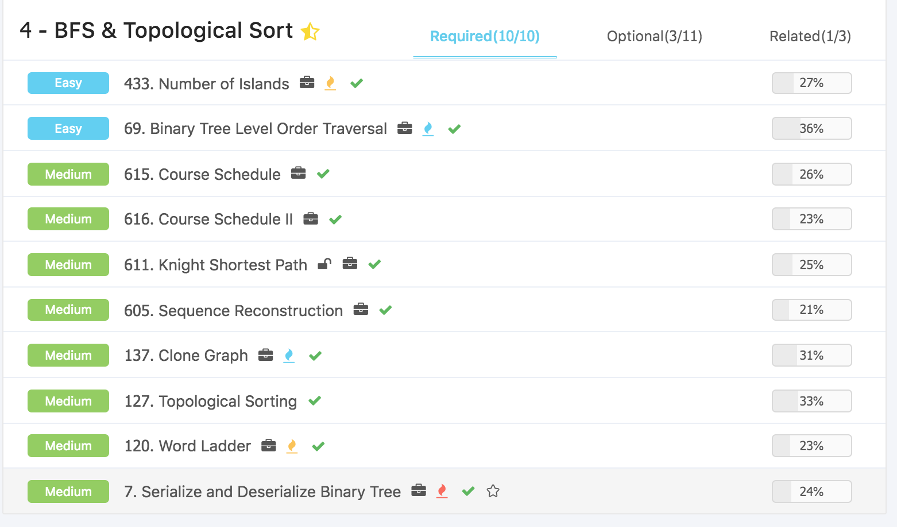
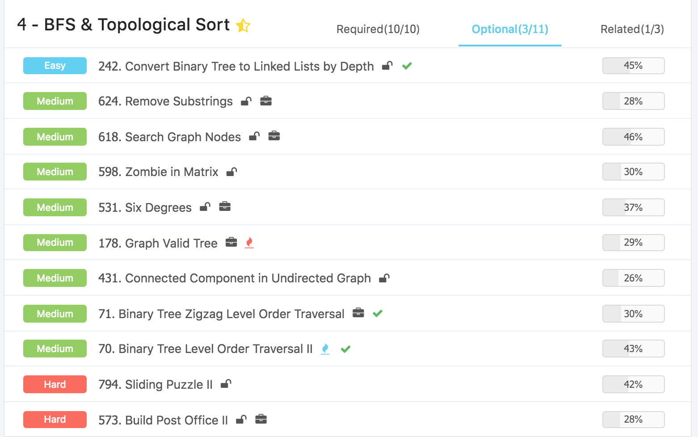
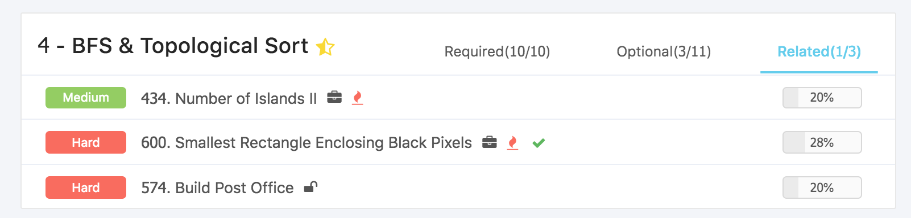

# Algorithms \(4\) - BFS & Topological Sorting

## 0. BFS解决的问题

* 最短路径
  * 简单图：BFS
  * 复杂图：Dijkstra, SPFA
* 最长路径
  * 图可以分层： DP
  * 图不可以分层 : DFS

而适用于BFS的问题

#### a. 图的遍历 Traversal in Graph

图的遍历，比如给出无向连通图\(Undirected Connected Graph\)中的一个点，找到这个图里的所有点。这就是一个常见的场景。LintCode 上的 [Clone Graph](http://www.lintcode.com/problem/clone-graph) 就是一个典型的练习题。

* 层级遍历 Level Order Traversal
  * 也就是说我不仅仅需要知道从一个点出发可以到达哪些点，还需要知道这些点，分别离出发点是第几层遇到的，比如 [Binary Tree Level Order Traversal](http://www.lintcode.com/problem/binary-tree-level-order-traversal/) 就是一个典型的练习题。
* 由点及面 Connected Component
* 拓扑排序 Topological Sorting

#### b .最短路径 Shortest Path in Simple Graph

最短路径算法有很多种，BFS 是其中一种，但是他有特殊的使用场景，即必须是在简单图中求最短路径。大部分简单图中使用 BFS 算法时，都是无向图。当然也有可能是有向图，但是在面试中极少会出现。

* **简单图（Simple Graph）:** 图中每条边长度都是1（或边长都相同）。

## 1. 图的基础以及实现

#### 二叉树中进行 BFS 和图中进行 BFS区别

最大的区别就是二叉树中无需使用 HashSet（Python: dict\) 来存储访问过的节点（丢进过 queue 里的节点）。因为二叉树这种数据结构，上下层关系分明，没有环（circle），所以不可能出现一个节点的儿子的儿子是自己的情况。  
但是在图中，一个节点的邻居的邻居就可能是自己了。

#### 常用存储图的方法

* 邻接矩阵 （Adjacent Matrix）: 稀松矩阵
* 邻接表 （Edge List）: 存储边与边的关系

#### Python实现：

```python
class DirectedGraphNode: # 有向图
    def __init__(self, x):
        self.label = x
        self.neighbors = []
```

以下图为例，node-0的neighbors是\[1,2,3\]，这里很重要，因为是有向的。


如果这里给的是 0 - 1，0 - 2 ，也就是from\_node - to\_node的形式的话，且不用原有方法进行存储。那么1，2，3的入度加1，而0的邻居为\[1，2，3\]，这里非常非常重要。

```python
for from_node, to_node in [[0, 1], [0, 2]]:
    node_indegree[to_node] += 1
    node_neighour[from_node].append(to_node)
```

### 链表 Dummy Node

Python弱化了链表的概念，所以这里是在处理图问题的时候，需要用到链表相关的概念，这里主要补充一下相关的知识点。

#### 什么是 Dummy Node

Dummy Node，翻译为哨兵节点。Dummy Node 一般本身不存储任何实际有意义的值，通常用作"占位"，或者链表的“虚拟头”。如很多的链表问题中，我们会在原来的头head的前面新增一个节点，这个节点没有任何值，但是 next 指向 head。这样就会方便对 head 进行删除或者在前面插入等操作。

```python
head->node->node->node ...
=>
dummy->head->node->node->node...
```

#### Dummy Node 在 BFS 中如何使用

在 BFS 中，我们主要用 dummy node 来做占位符。即，在队列中每一层节点的结尾，都放一个 `null`（or None in Python，nil in Ruby），来表示这一层的遍历结束了。这里 dummy node 就是一个 null。

* 在分层遍历中，在levels里面加入一个dummy node

## 2. 拓扑排序

这个应该是先掌握BFS之后才列的，这里我觉得和上面衔接比较好。

#### 拓扑排序 Topological Sorting

在图论中，由一个有向无环图的顶点组成的序列，当且仅当满足下列条件时，称为该图的一个拓扑排序（英语：Topological sorting）。也可以定义为：拓扑排序是对有向无环图的顶点的一种排序，它使得如果存在一条从顶点A到顶点B的路径，那么在排序中B出现在A的后面。

* 每个顶点出现且只出现一次；
* 若A在序列中排在B的前面，则在图中不存在从B到A的路径。

拓扑排序 Topological Sorting 是一个经典的图论问题。他实际的运用中，拓扑排序可以做如下的一些事情：

* 检测编译时的循环依赖
* 制定有依赖关系的任务的执行顺序

**拓扑排序不是一种排序算法**

拓扑排序是一种图的表述方法，使用拓扑排序主要是解决图的存储和表示。

虽然名字里有 Sorting，但是相比起我们熟知的 Bubble Sort, Quick Sort 等算法，Topological Sorting 并不是一种严格意义上的 Sorting Algorithm。

确切的说，一张图的拓扑序列可以有很多个，也可能没有。拓扑排序只需要找到其中一个序列，**无需**找到所有序列。

**算法流程**

拓扑排序的算法是典型的宽度优先搜索算法，其大致流程如下：

1. 统计所有点的入度，并初始化拓扑序列为空
2. 将所有入度为 0 的点，也就是那些没有任何**依赖**的点，放到宽度优先搜索的队列中
3. 将队列中的点一个一个的释放出来，放到拓扑序列中，每次释放出某个点 A 的时候，就访问 A 的相邻点（所有A指向的点），并把这些点的入度减去 1。
4. 如果发现某个点的入度被减去 1 之后变成了 0，则放入队列中。
5. 直到队列为空时，算法结束。

#### [127. Topological Sorting](https://www.lintcode.com/problem/topological-sorting/description)

```python
class Solution:

    def topSort(self, graph):
        node_to_indegree = self.get_indegree(graph)
        # bfs
        order = []
        start_nodes = [n for n in graph if node_to_indegree[n] == 0]
        queue = collections.deque(start_nodes)
        while queue:
            node = queue.popleft()
            order.append(node)
            for neighbor in node.neighbors:
                node_to_indegree[neighbor] -= 1
                if node_to_indegree[neighbor] == 0:
                    queue.append(neighbor)
                
        return order
    
    def get_indegree(self, graph):
        node_to_indegree = {x: 0 for x in graph}

        for node in graph:
            for neighbor in node.neighbors:
                node_to_indegree[neighbor] += 1
                
        return node_to_indegree
```

#### [615. Course Schedule](https://www.lintcode.com/problem/course-schedule/description) / [207. Course Schedule](https://leetcode.com/problems/course-schedule/)

#### [892. Alien Dictionary](https://www.lintcode.com/problem/alien-dictionary/description) / [269. Alien Dictionary](https://leetcode.com/problems/alien-dictionary/)

## 3. BFS

### BFS在二叉树上的应用

#### 分层遍历宽度优先搜索模板 :

主要是层级遍历，具体问题我写在注释里面。

* Level是时刻会变的，因为每一层级不一样，所以需要放入循环
* 这里默认了树的节点和值的setitem方法

#### [69. Binary Tree Level Order Traversal](https://www.lintcode.com/problem/binary-tree-level-order-traversal/description) / [102. Binary Tree Level Order Traversal](https://leetcode.com/problems/binary-tree-level-order-traversal/)

```python
class Solution:
    def levelOrder(self, root):
        # corner case check
        if root is None :
            return result
        # init
        result = []
        queue = collections.deque([root])
        # 1. traverse the whole queue - current levels
        # 2. if node in current level has left or right, add to queue
        # 3. merge current level to result - store as list
        while queue :
            level = []
            for _ in range(len(queue)) :
                node = queue.popleft()
                level.append(node.val)
                if node.left :
                    queue.append(node.left)
                if node.right :
                    queue.append(node.right)
            result.append(level)
        return result
```

#### 不要层级遍历

```python
from collections import deque
class Solution:
    def levelOrder(self, root):
        if root is None:                  # 基本检查，这里是二叉树
            return []
            
        queue = deque([root])             # 变成双向的queue
        result = []                       # 存储最后的结果
        while queue:                      # 当队列不为空 
            node = queue.popleft()
            result.append(node.val)
            if node.left:             # 如果左儿子存在，压入队列
                queue.append(node.left)
            if node.right:            # 如果右儿子存在，压入队列  
                queue.append(node.right)
            result.append(level)          # 合并
        return result
```

#### 几个Follow up的问题

* 这里可不可以用栈？就是不再使用deque而是用list ?
  * 从实现上面来说是可行的，但是需要两个stack
  * python的list，如果pop\(0\)，计算复杂度是O\(n\)，所以一般都是pop\(-1\)默认的
* 这里可不可以不用分层遍历？
  * 是可以的，其实就是去掉level那里的一个循环，直接将值写入result
* 常犯的错误
  * 在写if的时候如果写在了for的外面，就会少掉一层，特别需要注意

### BFS 重要应用 ：序列化

一般来讲数据存储在内存之中，如果需要保存内容的话，一般需要将数据从内存写入硬盘，这个过程一般就叫做序列化。

* 序列化： Object to String
* 反序列化：String to Object

#### 1. 将内存中的数据持久化存储时

内存中重要的数据不能只是呆在内存里，这样断电就没有了，所需需要用一种方式写入硬盘，在需要的 时候，能否再从硬盘中读出来在内存中重新创建

#### 2. 网络传输时 

机器与机器之间交换数据的时候，不可能互相去读对方的内存。只能讲数据变成字符流数据\(字符串\)后

通过网络传输过去。接受的一方再将字符串解析后到内存中。 常用的一些序列化手段:

* XML
* Json
* Thrift \(by Facebook\)
* ProtoBuf \(by Google\)

一些序列化的例子:

* 比如一个数组，里面都是整数，我们可以简单的序列化为”\[1,2,3\]”
* 一个整数链表，我们可以序列化为，”1-&gt;2-&gt;3”
* 一个哈希表\(HashMap\)，我们可以序列化为，”{\”key\”: \”value\”}”

#### 序列化算法设计时需要考虑的因素:

* **压缩率**。对于网络传输和磁盘存储而言，当然希望更节省。
  * Thrift, ProtoBuf 都是为了更快的传输数据和节省存储空间而设计的
* **可读性**。我们希望开发人员，能够通过序列化后的数据直接看懂原始数据是什么。
  * 如 Json，LintCode 的输入数据

#### [7. Serialize and Deserialize Binary Tree](https://www.lintcode.com/problem/serialize-and-deserialize-binary-tree/description)  / [297. Serialize and Deserialize Binary Tree](https://leetcode.com/problems/serialize-and-deserialize-binary-tree/)

```python
class Codec:
    def serialize(self, root):
        if not root:
            return ['#']
        
        q = collections.deque([root])
        ans = []
        while q:
            temp = q.popleft()
            if not temp:
                ans.append('#')
            else:
                ans.append(str(temp.val))
                q.append(temp.left)
                q.append(temp.right)
        return ans
                
    def deserialize(self, data):
        if data[0] == '#':
            return None
        
        data = collections.deque(data)
        root = TreeNode(int(data.popleft()))
        q = collections.deque([root])
        isLeft = True
        
        while data:
            ch = data.popleft()
            if ch != '#':
                node = TreeNode(int(ch))
                q.append(node)
                if isLeft:
                    q[0].left = node
                else:
                    q[0].right = node
            if not isLeft:
                q.popleft()
            isLeft = not isLeft
        return root
```

### BFS在图上的应用

使用宽度优先搜索 BFS 的版本。

第一步：找到所有的点  
第二步：复制所有的点，将映射关系存起来  
第三步：找到所有的边，复制每一条边

#### [137. Clone Graph](https://www.lintcode.com/problem/clone-graph/description) / [133. Clone Graph](https://leetcode.com/problems/clone-graph/)

```python
"""
Definition for a undirected graph node
class UndirectedGraphNode:
    def __init__(self, x):
        self.label = x
        self.neighbors = []
"""
class Solution:
    def cloneGraph(self, node):
        # 1. check corner case
        if node is None :
            return node
        root = node
        # 2. get nodes    
        nodes = self.getNodes(node)
        
        # 3. change node to graph type
        mapping = {}
        for node in nodes:
            mapping[node] = UndirectedGraphNode(node.label)
        
        # 4. build relationship
        for node in nodes:
            newNode = mapping[node]
            for neighbor in node.neighbors :
                newNeighbor = mapping[neighbor]
                newNode.neighbors.append(newNeighbor)

        return mapping[root]
    
    def getNodes(self, node):
        queue = collections.deque([node])
        nodes = set([node])
        # traverse without levels
        while queue :
            headNode = queue.popleft()
            for neighbor in headNode.neighbors :
                if neighbor not in nodes :
                    nodes.add(neighbor)
                    queue.append(neighbor)
        
        return nodes
```

#### 隐式图 \(Implicit Graph\) 最短路径 - Word Ladder

#### [120. Word Ladder](https://www.lintcode.com/problem/word-ladder/description) / [127. Word Ladder](https://leetcode.com/problems/word-ladder/)

分层遍历记录路径长度，每次遍历之后查看替换之后的下一个元素是不是在dict里面，不是就再换一次。

```python
class Solution:

    def ladderLength(self, start, end, dict):
        # 1. prepare
        dict.add(end)
        visited = set([start])
        queue = collections.deque([start])
        distance = 0 
        
        while queue :
            distance += 1
            for _ in range(len(queue)) :
                word = queue.popleft()
                if word == end :
                    return distance
                for next_word in self.get_next_word(word) :
                    if next_word not in dict or next_word in visited :
                        continue
                    queue.append(next_word)
                    visited.add(next_word)
                    
        return 0
                    
    def get_next_word(self, word) :
        words = []
        
        for i in range(len(word)) :
            left, right = word[:i], word[i + 1:]
            for char in 'abcdefghijklmnopqrstuvwxyz' :
                if char == word[i] :
                    continue
                words.append(left + char + right)
        
        return words
```

### BFS在矩阵中的应用

#### [433. Number of Islands](https://www.lintcode.com/problem/number-of-islands/description) / [200. Number of Islands](https://leetcode.com/problems/number-of-islands/)

* Leetcode和lintcode有不同，需要注意 

这个题还是有一点难度的，主要思路是检测一个点的上下左右在不在grid里面，如果在的话看它是不是1，如果是的话就把它变成0，再去看这个点的上下左右，这样的一个基本过程。

```python
class Solution:
    """
    @param grid: a boolean 2D matrix
    @return: an integer
    """
    def numIslands(self, grid):
        # 1. corner case
        if not grid and not grid[0] :
            return 0 
        islands = 0
        # 2. traverse
        for i in range(len(grid)) :
            for j in range(len(grid[0])) :
                if grid[i][j] :
                    self.bfs(grid, i, j)
                    islands += 1
        
        return islands
    
    
    def bfs(self, grid, x, y) :
        
        queue = collections.deque([(x, y)])
        # 3. check up, down, left, right 
        while queue :
            x, y = queue.popleft()            
            for delta_x, delta_y in [(1, 0), (-1, 0), (0, 1), (0, -1)] :
                next_x = x + delta_x
                next_y = y + delta_y
                # 4. check if in the grid
                if not self.is_valid(grid, next_x, next_y) :
                    continue
                queue.append((next_x, next_y))
                grid[next_x][next_y] = False
                
    def is_valid(self, grid, x, y) :
        m, n = len(grid), len(grid[0])
        return 0 <= x < m and 0 <= y < n and grid[x][y]
```

#### [611. Knight Shortest Path ](https://www.lintcode.com/problem/knight-shortest-path/description)

## 4. 双向BFS \(Bidirectional BFS\) 

1. 无向图
2. 所有边的长度都为 1 或者长度都一样
3. 同时给出了起点和终点

以上 3 个条件都满足的时候，可以使用双向宽度优先搜索来求出起点和终点的最短距离。

#### 算法描述

双向宽度优先搜索本质上还是BFS，只不过变成了起点向终点和终点向起点同时进行扩展，直至两个方向上出现同一个子节点，搜索结束。我们还是可以利用队列来实现：一个队列保存从起点开始搜索的状态，另一个保存从终点开始的状态，两边如果相交了，那么搜索结束。起点到终点的最短距离即为起点到相交节点的距离与终点到相交节点的距离之和。

**双向BFS效率**

假设单向BFS需要搜索 N 层才能到达终点，每层的判断量为 X，那么总的运算量为 X ^ N. 如果换成是双向BFS，前后各自需要搜索 N / 2 层，总运算量为 2 \* X ^ {N / 2}。如果 N 比较大且X 不为 1，则运算量相较于单向BFS可以大大减少，差不多可以减少到原来规模的根号的量级。

#### BFS深入解决



## 5. Ladder








