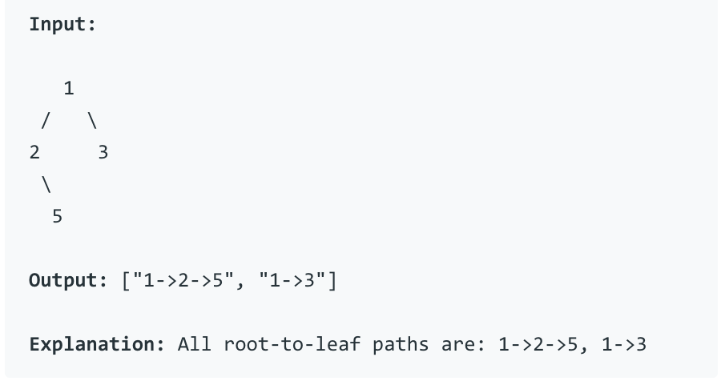
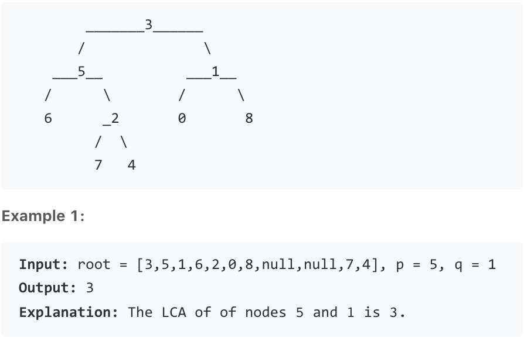

# Algorithms \(5\) - DFS & Binary Tree

## 1. 第一类考察形态 ：求值、路径

这里的基本解决思路是递归，既然是递归，那么重要的在于找到递归条件，并给出corner case，然后再进行解决，这个整体的解决思路。

#### [596. Minimum Subtree](https://www.lintcode.com/problem/minimum-subtree/description)

分析：先思考一下dfs的子问题是什么，划分到节点的时候，比较的是一个节点的左边和，右边和，以及左右加节点的和的最小值

* 需要记录的是，全局的最小值和节点
* 边界条件和出口是什么，如果是None，也就是到叶节点，就是0

这样思考一遍之后，整体的dfs的思路就会比较清晰了，dfs为什么一般都需要一个子函数来进行支持？

* 因为需要调用自己，而有的时候调用自己会带来一些额外的负载

```python
class Solution:
    def findSubtree(self, root):
        self.result = None 
        self.min_val = sys.maxsize
        self.helper(root)
        return self.result
        
    def helper(self, root) :
        # 出口 - 叶节点
        if root is None :
            return 0
        # 左右分别的和
        left_sum = self.helper(root.left)
        right_sum = self.helper(root.right)
        # 是否可以更新
        if left_sum + right_sum + root.val < self.min_val :
            self.min_val = left_sum + right_sum + root.val
            self.result = root
        return left_sum + right_sum + root.val 
```

#### [480. Binary Tree Paths](https://www.lintcode.com/problem/binary-tree-paths/) / [257. Binary Tree Paths](https://leetcode.com/problems/binary-tree-paths/)



分析：dfs的难点一般在于思路和如何实现，这个题举个例子，如果是上图的例子，应该怎样实现。规律就是在上面的路径基础上选择加左边还是加右边，这也就是递归的定义。

```python
1
[1 -> 2], [1 -> 3]
{[1 -> 2 -> None], [1 -> 2 -> 5]}, [1 -> 3] 
```

对于递归的实现部分，因为每次都要的是路径，所以应当是return paths，这里如果不断更新全局变量，会覆盖掉一边，好像不能实现。

对于递归的边界和出口，如果节点不存在就返回空串即可，也就不会再栈空间继续深入了。

```python
class Solution:
    def binaryTreePaths(self, root):
        # no root
        if root is None :
            return []
        # no childs    
        if root.right is None and root.left is None :
            return [str(root.val)]
        
        paths = []    
        # left 
        for path in self.binaryTreePaths(root.left) : # type list
            paths.append(str(root.val) + '->' + path)
        # right
        for path in self.binaryTreePaths(root.right) :
            paths.append(str(root.val) + '->' + path)
            
        return paths
```

#### [88. Lowest Common Ancestor of a Binary Tree](https://www.lintcode.com/problem/lowest-common-ancestor-of-a-binary-tree/description) / [236. Lowest Common Ancestor of a Binary Tree](https://leetcode.com/problems/lowest-common-ancestor-of-a-binary-tree/)



分析：如果需要找 5 和 8 的公共祖先，那么首先从3出发，发现了左边是5后停下来，然后看右边，1的left 和 right 是 0 和 8，应该只看8，由此确定了递归的定义。

当选择一个节点的时候，如果a, b都在节点左侧，那么左侧就是祖先，如果都在节点右侧，那么右侧就是祖先，不然就是root。

递归到底怎么定义边界呢，从叶节点出发，如果节点等于a 或者 b，那么return root，不然就return None。

* 这个题本质上union find是也可以做的

```python
class Solution:
    def lowestCommonAncestor(self, root, A, B):
        return self.dfs(root, A, B)
    
    def dfs(self, root, A, B) :
        if root is None :
            return None
        if root == A or root == B :
            return root
        
        left = self.dfs(root.left, A, B)
        right = self.dfs(root.right, A, B)
        
        if left is not None and right is not None :
            return root
        if left is not None :
            return left
        if right is not None :
            return right
        return None
```

#### 总结：

* dfs有时候思路什么的都比较好想，但是实际上等到写的时候却感觉无从下手，主要原因是没有分析清楚基本的逻辑和小问题
* 多对数据进行模拟和走一遍，会更加好的找到规律，如果只是看答案自己背一下写一下，可能很难理解dfs的本质


这里有个很好的follow up，578. Lowest Common Ancestor III

## 2. 第二类考察形态 ：二叉树结构变化

#### 453. Flatten Binary Tree to Linked List

这里不难主要按照递归三要素进行分解

* 递归的定义 : flatten 对象是root
* 递归的分解：每一次都指向右边先将右边拉成链式
* 递归的出口 ： 如果不存在就是null，如果存在构造新节点，左空，右边是原来的左边

```python
"""
Definition of TreeNode:
class TreeNode:
    def __init__(self, val):
        self.val = val
        self.left, self.right = None, None
"""

class Solution:
    """
    @param root: a TreeNode, the root of the binary tree
    @return: nothing
    """
    last_node = None

    def flatten(self, root):
        if root is None:
            return
        
        if self.last_node is not None:
            self.last_node.left = None
            self.last_node.right = root
            
        self.last_node = root
        right = root.right
        self.flatten(root.left)
        self.flatten(right)
```

## 3. 第二类考察形态 ：二叉树搜索树

#### 86. Binary Search Tree Iterator

这个题就是中序遍历的非递归做法，理解并背诵中序遍历的模板。

```python
"""
Definition of TreeNode:
class TreeNode:
    def __init__(self, val):
        self.val = val
        self.left, self.right = None, None

Example of iterate a tree:
iterator = BSTIterator(root)
while iterator.hasNext():
    node = iterator.next()
    do something for node 
"""


class BSTIterator:
    """
    @param: root: The root of binary tree.
    """
    def __init__(self, root):
        self.stack = []
        while root != None:
            self.stack.append(root)
            root = root.left

    """
    @return: True if there has next node, or false
    """
    def hasNext(self):
        return len(self.stack) > 0

    """
    @return: return next node
    """
    def next(self):
        node = self.stack[-1]
        if node.right is not None:
            n = node.right
            while n != None:
                self.stack.append(n)
                n = n.left
        else:
            n = self.stack.pop()
            while self.stack and self.stack[-1].right == n:
                n = self.stack.pop()
        
        return node
```

## 其他补充

### Morris 算法

与递归和使用栈空间遍历的思想不同，Morris 算法使用二叉树中的叶节点的right指针来保存后面将要访问的节点的信息，当这个right指针使用完成之后，再将它置为null，但是在访问过程中有些节点会访问两次，所以与递归的空间换时间的思路不同，Morris则是使用时间换空间的思想。

#### 用 Morris 算法进行中序遍历\(Inorder Traversal\)

```text
1. 如果当前节点的左孩子为空，则输出当前节点并将其右孩子作为当前节点。
2. 如果当前节点的左孩子不为空，在当前节点的左子树中找到当前节点在中序遍历下的前驱节点。
    1. 如果前驱节点的右孩子为空，将它的右孩子设置为当前节点。当前节点更新为当前节点的左孩子。
    2. 如果前驱节点的右孩子为当前节点，将它的右孩子重新设为空（恢复树的形状）。输出当前节点。当前节点更新为当前节点的右孩子。
3. 重复1、2两步直到当前节点为空。
```

**图示**

下图为每一步迭代的结果（从左至右，从上到下），cur代表当前节点，深色节点表示该节点已输出。


#### 用 Morris 算法实现先序遍历\(Preorder Traversal\)

```text
1. 如果当前节点的左孩子为空，则输出当前节点并将其右孩子作为当前节点。
2. 如果当前节点的左孩子不为空，在当前节点的左子树中找到当前节点在中序遍历下的前驱节点。
    1. 如果前驱节点的右孩子为空，将它的右孩子设置为当前节点。**输出当前节点**（与中序遍历唯一一点不同）。当前节点更新为当前节点的左孩子。
    2. 如果前驱节点的右孩子为当前节点，将它的右孩子重新设为空。当前节点更新为当前节点的右孩子。
3. 重复1、2两步直到当前节点为空。
```

**图示**


#### 用 Morris 算法实现后序遍历\(Postorder Traversal\)

**思路**

```text
* 后序遍历其实可以看作是和前序遍历左右对称的，
此处，我们同样可以利用这个性质，基于前序遍历的算法，可以很快得到后序遍历的结果。
我们只需要将前序遍历中所有的左孩子和右孩子进行交换就可以了。
```

### 非递归二叉树遍历

这里在一开始的二叉树专题里已经提到过，只是稍微提一下。

#### 先序遍历

遍历顺序为**根**、**左**、**右**

1. 如果根节点非空，将根节点加入到栈中。
2. 如果栈不空，弹出出栈顶节点，将其值加加入到数组中。
   1. 如果该节点的右子树不为空，将右子节点加入栈中。
   2. 如果左子节点不为空，将左子节点加入栈中。
3. 重复第二步，直到栈空。

**代码实现**

```python
class Solution:
    """
    @param root: The root of binary tree.
    @return: Preorder in list which contains node values.
    """
    def preorderTraversal(self, root):
        if root is None:
            return []
        stack = [root]
        preorder = []
        while stack:
            node = stack.pop()
            preorder.append(node.val)
            if node.right:
                stack.append(node.right)
            if node.left:
                stack.append(node.left)
        return preorder
```

#### 中序遍历

遍历顺序为**左**、**根**、**右**

1. 如果根节点非空，将根节点加入到栈中。
2. 如果栈不空，取栈顶元素（暂时不弹出），
   1. 如果左子树已访问过，或者左子树为空，则弹出栈顶节点，将其值加入数组，如有右子树，将右子节点加入栈中。
   2. 如果左子树不为空，则将左子节点加入栈中。
3. 重复第二步，直到栈空。

**代码实现**

```python
class Solution:
    """
    @param root: A Tree
    @return: Inorder in ArrayList which contains node values.
    """
    def inorderTraversal(self, root):
        if root is None :
            return []
            
        stack, result = [], []
        
        while root :
            stack.append(root)
            root = root.left
            
        while stack :
            current_node = stack.pop()
            result.append(current_node.val)
            
            if current_node.right :
                current_node = current_node.right 
                while current_node :
                    stack.append(current_node)
                    current_node = current_node.left
                    
        return result
```

#### 后序遍历

遍历顺序为**左**、**右**、**根**

1. 如果根节点非空，将根节点加入到栈中。
2. 如果栈不空，取栈顶元素（暂时不弹出），
   1. 如果（左子树已访问过或者左子树为空），且（右子树已访问过或右子树为空），则弹出栈顶节点，将其值加入数组，
   2. 如果左子树不为空，切未访问过，则将左子节点加入栈中，并标左子树已访问过。
   3. 如果右子树不为空，切未访问过，则将右子节点加入栈中，并标右子树已访问过。
3. 重复第二步，直到栈空。

**代码实现**

```python
class Solution:
    """
    @param root: A Tree
    @return: Postorder in ArrayList which contains node values.
    """
    def postorderTraversal(self, root):
        # 非递归
        result = []
        stack = []

        curNode = root
        while stack or curNode:
            # 能左就左，否则向右一步
            while curNode:
                stack.append(curNode)
                curNode = curNode.left if curNode.left else curNode.right

            # pop stack，添加到结果
            curNode = stack.pop()
            result.append(curNode.val)

            # 栈不空且当前节点是栈顶的左子节点，转到其右兄弟，否则退栈
            if stack and stack[-1].left == curNode:
                curNode = stack[-1].right
            else:
                curNode = None

        return result
```

