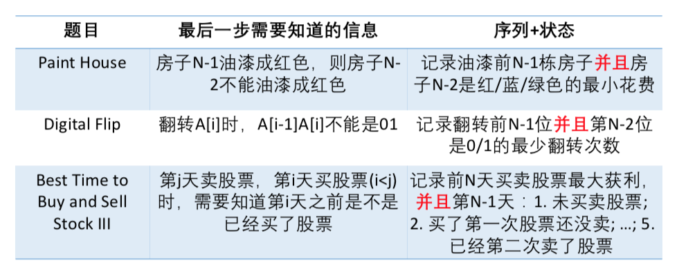

# DP Sequence \(3\)

## 序列型动态规划

* 给定一个序列
* 动态规划方程f\[i\]中的下标i表示前i个元素a\[0\], a\[1\], ... , a\[i - 1\]的某种性质
  * 坐标型动态规划f\[i\]表示以a\[i\]结尾的某种性质
* 初始化中，f\[0\]表示空序列的性质，所以一般需要多开一位
  * 坐标型动态规划的初试条件f\[0\]就是以a0为结尾的子序列的性质

#### [843. Digital Flip](https://www.lintcode.com/problem/digital-flip/description)

分析: 在最优策略之中，只需要看最后一位是否已经翻转，然后进而分析前一位是0还是1，还需要记录前n - 1位最少翻转了多少次

* 状态：
  * f\[i\]\[0\] 表示a\[i-1\]为0的状态，前i位最少翻转次数
  * f\[i\]\[1\] 表示a\[i-1\]为1的状态，前i位最少翻转次数
* 状态转移：
  * f\[i\]\[j\] = min\(f\[i-1\]\[k\] + I\)  --  I为是否需要翻转
* 初始条件和边界 ：
  * f\[0\]\[0\] = f\[0\]\[1\] = 0
* 计算顺序：
  * 因为需要前面的状态，所以是从左往右计算

516. Paint House II

* 状态 ：
  * f\[i\]\[k\] 前i个房子且第i - 1个房子涂k色的最小花费
* 转移方程 ：
  * f\[i\]\[k\] = min\(f\[i - 1\]\[l\]\) + cost\[i - 1\]\[k\] 这里l不等于k即可

动态规划极值优化：

如果最小/最大值是第i个元素，次小值是第j个元素

* 只要除掉的元素不是第i个，剩下的最小值就是第j个元素
* 如果除掉的是第i个元素，剩下的最小值就是第j个元素

149. Best Time to Buy and Sell Stock

从 0 到 n - 1枚举，即第几天卖，保存最低和最高的价格即可，

150 Best Time to Buy and Sell Stock II

今天买今天卖，从而拆成无数非常小的区间

151: Best Time to Buy and Sell Stock III

393 Best Time To Buy and Sell Stock IV

