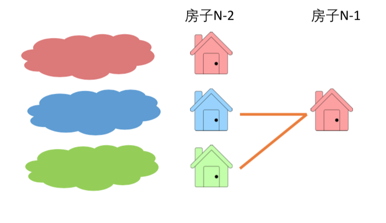
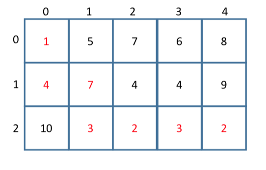
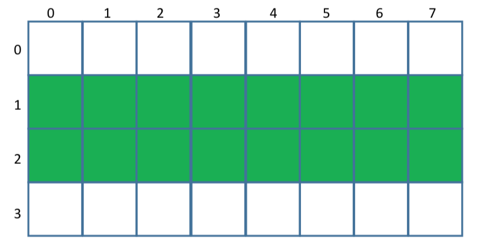

# DP Coordinates \(2\)

## 1. 坐标型动态规划

坐标型动态规划是一种比较简单的动态规划类型，主要是每一个坐标储存每一个值，然后转移方程主要是通过坐标来进行表示和运算的。

#### [115. Unique Paths II / ](https://www.lintcode.com/problem/unique-paths-ii/description)[63. Unique Paths II](https://leetcode.com/problems/unique-paths-ii/description/)

分析: 和之前的unique path基本一致，主要是增加了限制条件，也就是判断是否存在障碍。

#### 初始条件 ：

* 所有障碍点为0，如果障碍在第0行或者第0列，相应的后面的也为0，也就是存储前一个格子的状态
* 其他的基本条件并不改变

这个题使用了先初始化的方法，这里的小技巧是使用break，从而规避了之前小于的问题，感觉非常的巧妙，再次感觉算法的博大精深。

```python
class Solution:
    def uniquePathsWithObstacles(self, A):
        # init
        row, col = len(A), len(A[0])
        dp = [[0] * col for _ in range(row)]
        # row
        for i in range(row) :
            if A[i][0] :
                break
            else :
                dp[i][0] = 1
        # col
        for j in range(col) :
            if A[0][j] :
                break
            else :
                dp[0][j] = 1
        # other        
        for i in range(1, row) :
            for j in range(1, col) :
                if A[i][j]  :
                    dp[i][j] = 0
                else :
                    dp[i][j] = dp[i - 1][j] + dp[i][j - 1]           
        return dp[row - 1][col - 1]         
```

## 2. 序列型动态规划

#### [515. Paint House](https://www.lintcode.com/problem/paint-house/description) / [256. Paint House](https://leetcode.com/problems/paint-house/description/)

分析 : 从最后一步出发，第n个房子必然是红黄蓝三色之一，但是相邻的不同色，所以必然要记录之前染的颜色。



* 状态 ：
  * f\[i - 1\]\[j\]，染成一种颜色的时候，前i - 1的花费
* 转移方程 ：
  * f\[i\]\[0\] = min{f\[i-1\]\[1\]+ cost\[i-1\]\[0\], f\[i-1\]\[2\] + cost\[i-1\]\[0\]}
* 初始条件和边界：
  * f\[0\]\[0\] = f\[0\]\[1\] = f\[0\]\[2\] = 0

这里还不是很会滚动数组，先不用，然后习惯了之后再换回来...

```python
class Solution:
    def minCost(self, costs):
        # init
        n = len(costs)
        dp = [[0] * 3 for _ in range(n + 1)]
        
        for i in range(1, n + 1) :
            for j in range(3) :
                # set max
                dp[i][j] = sys.maxsize
                for k in range(3) :
                    if k != j :
                        dp[i][j] = min(dp[i][j], dp[i - 1][k] + costs[i - 1][j])
        
        return min([dp[n][j] for j in range(3)])
```

#### 总结：

* 序列型动态规划是求前i个，有点像prefix sum
* 一般的求解因为条件很多，比较复杂，所以一般使用 **序列 + 状态**

## 3. 划分性动态规划

#### [512.Decode Ways](https://www.lintcode.com/problem/decode-ways/description) / [91. Decode Ways](https://leetcode.com/problems/decode-ways/description/)

* 状态：
  * 主要看最后的字符到底如何进行划分，也就是可以化为1个或者两个
* 转移方程:
  * f\[i\] = f\[i - 1\] + f\[i -2\]
* 初始条件和边界：
  * f\[0\] = 1
* 计算顺序:
  * 应该是从左到右

```python
class Solution:
    def numDecodings(self, s):
        n = len(s)
        # corner
        if n == 0 :
            return 0
        
        dp = [1] + [0] * n
        for i in range(1, n + 1) :
            # ith - first digit
            if s[i - 1] != '0' :
                dp[i] += dp[i - 1]
            # last two digits 
            if i >= 2 and ((s[i - 2] == '1') or (s[i - 2] == '2' and s[i - 1] <= '6')) :
                dp[i] += dp[i - 2]
        return dp[n]
```

## 4. 坐标型动态规划深入

* 坐标型动态规划是最简单的动态规划，因为它本身有一个序列或者网格，这样再寻找状态转移和初始化的时候都比较好找，解决的方法也就比较容易。
* 一般特征还是动态规划的特定，但是要求是找序列或者子序列或者网格中的值
* 使用f\[i\]\[j\]就可以表达第i行第j列
* 初试条件f\[0\]就是以a0为结尾的子序列性质

#### [110. Minimum Path Sum](https://www.lintcode.com/problem/minimum-path-sum/description) / [64. Minimum Path Sum](https://leetcode.com/problems/minimum-path-sum/)



* 状态：
  * 同unique path一样，f\[m - 1\]\[n - 1\] 和 f\[m - 2\]\[n - 1\] 与 f\[m - 1\]\[n - 2\]有关
* 转移方程：
  * f\[i\]\[j\] = min{f\[i-1\]\[j\], f\[i\]\[j-1\]} + A\[i\]\[j\]
* 初始条件和边界情况：
  * f\[0\]\[0\] = A\[0\]\[0\]，i = 0 or j = 0只能走一个方向
* 计算顺序：
  * 从左到右

```python
class Solution:
    def minPathSum(self, grid):
        # corner case
        row, col = len(grid), len(grid[0])
        if row == 0 or col == 0 :
            return 0
        # main
        dp = [[sys.maxsize] * col for _ in range(row)]
        for i in range(row) :
            for j in range(col) :
                if i == 0 and j == 0 :
                    dp[i][j] = grid[i][j]
                    continue
                if i > 0 :
                    dp[i][j] = min(dp[i][j], dp[i - 1][j] + grid[i][j])
                if j > 0 :
                    dp[i][j] = min(dp[i][j], dp[i][j - 1] + grid[i][j])
                    
        return dp[row - 1][col - 1]
```

#### 空间优化

实际上，计算第i行的时候，只需要第i行和第i - 1行 



这里主要使用滚动数组进行优化，只开一个2 \* n的数组，每一次覆盖掉前一行的值，以此进行空间优化。

* 对于网格上的动态规划，如果f\[i\]\[j\]只依赖于本行的f\[i\]\[x\]与前一行的f\[i - 1\]\[y\]，那么就可以采用滚动数组的优化方法
* 反之，如果行数少儿列数多，则可以逐列进行计算

#### [553. Bomb Enemy](https://www.lintcode.com/problem/bomb-enemy/description) / [361. Bomb Enemy](https://leetcode.com/problems/bomb-enemy/)

这里为了简化问题，先仅仅只考虑垂直方向：

* 状态：
  * 如果\(i, j\)是空地 ： 则为 \(i - 1, j\) 
  * 如果\(i, j\)是敌人：则为（i - 1, j） + 1
  * 如果是墙 ： 则为 0
* 转移方程：
  * 因此，up\[i\]\[j\] 也就是上述三种情况
* 初始条件和边界情况：
  * up\[0\]\[j\] 0 if \(0, j\) is not enemy else 1
* 计算顺序：
  * 从左到右

```python
class Solution:
    def maxKilledEnemies(self, grid):
        if not grid or len(grid) == 0 or len(grid[0]) == 0 :
            return 0
        # init
        row, col = len(grid), len(grid[0])
        up = [[0] * col for _ in range(row)]
        down = [[0] * col for _ in range(row)]
        left = [[0] * col for _ in range(row)]
        right = [[0] * col for _ in range(row)]
        # up
        for i in range(row) : 
            for j in range(col) :
                if grid[i][j] != 'W' :
                    if grid[i][j] == 'E' :
                        up[i][j] = 1
                    if i > 0 :
                        up[i][j] += up[i - 1][j]
        # down
        for i in range(row - 1, -1, -1) :
            for j in range(col) :
                if grid[i][j] != 'W' :
                    if grid[i][j] == 'E' :
                        down[i][j] = 1
                    if i + 1 < row :
                        down[i][j] += down[i + 1][j]
        # right
        for i in range(row) : 
            for j in range(col - 1, -1, -1) :
                if grid[i][j] != 'W' :
                    if grid[i][j] == 'E' :
                        right[i][j] = 1
                    if j + 1 < col :
                        right[i][j] += right[i][j + 1]
                        
        # left
        for i in range(row) : 
            for j in range(col) :
                if grid[i][j] != 'W' :
                    if grid[i][j] == 'E' :
                        left[i][j] = 1
                    if j > 0 :
                        left[i][j] += left[i][j - 1]
        # sum 
        res = 0
        for i in range(row):
            for j in range(col) :
                if grid[i][j] == '0' :
                    res = max(res, up[i][j] + down[i][j] + left[i][j] + right[i][j])        
        return res
        
```

#### 小结：

* 这种写法比较复杂，主要是需要写四遍，但是整体思路的理解非常简单，先看看四个方向能炸死的最大的
* 小技巧是判断边界还是依靠j - 1之类的范围来判断会简单很多

#### 坐标型动态规划总结

* 给定输入为序列或者网格/矩阵
* 动态规划下标为序列下标i或者网格坐标（i，j）
  * f\[i\]: 以第i个元素结尾的某种性质
  * f\[i\]\[j\] : 到格子\(i, j\)的路径的性质
* 初始化设置f\[0\]或者f\[0\]\[0... n-1\]的值
* 可以使用滚动数组对空间进行优化

#### 位操作型动态规划

这个考的频率不太高，目前也就见过这一道，所以先放着了

#### [664. Counting Bits](https://www.lintcode.com/problem/counting-bits/description) / [338. Counting Bits](https://leetcode.com/problems/counting-bits/)

```python
class Solution:
    def countBits(self, num):
            f = [0] * (num + 1)
            for i in range(1, num+1):
                f[i] = f[i & i-1] + 1
            return f
```


