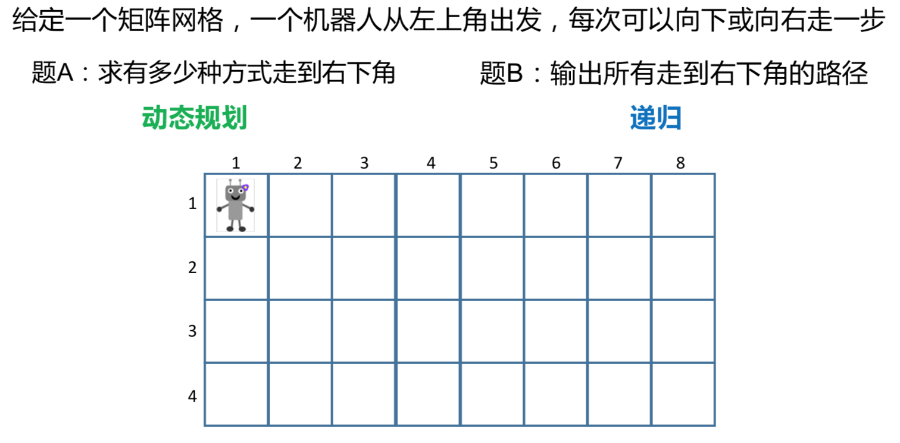
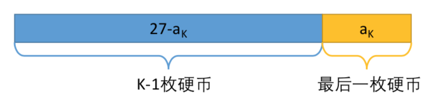
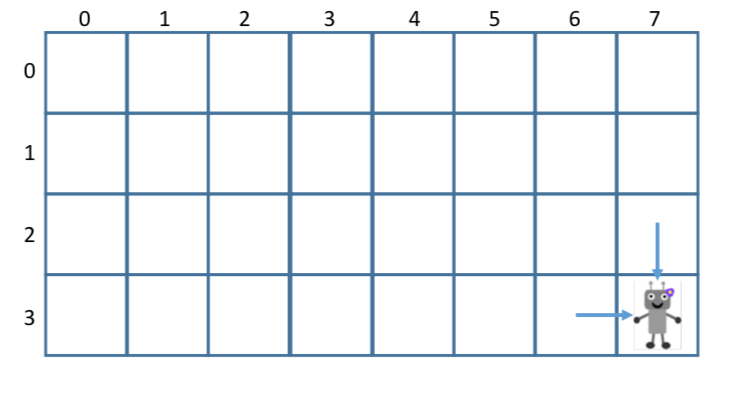
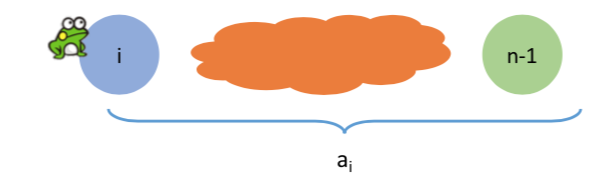
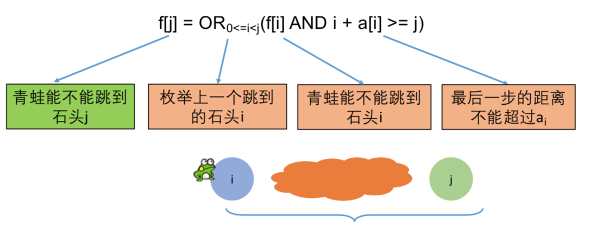
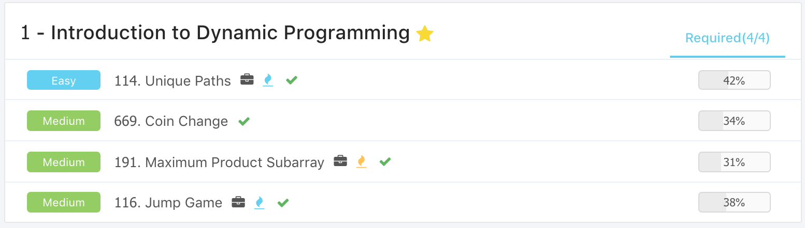

# DP Introduction \(1\)

## 1. 简介



从个人角度来讲，动态规划和递归是非常非常相似的，但是又存在着微小的区别 ，一般来说动态规划有以下特点: 

* 计数
  * 有多少种方法走到右下角
  * 有多少种方法选出k个数，使得和是Sum
* 求最大最小值
  * 从左上角走到右下角的最大数字和
  * 最长上升子序列长度
* 求存在性
  * 取石子游戏，判断先手是否必胜
  * 能不能选出k个数,使得和为Sum

## 2. 极值型动态规划

这里通过练习coin change，来穿插讲解了如何破解动态规划问题 ：

#### [669. Coin Change](https://www.lintcode.com/problem/coin-change/description) / [322. Coin Change](https://leetcode.com/problems/coin-change/description/)

这个题属于求最大最小值的动态规划问题，要求用最少的硬币数付钱，这里首先要想的是如何确认状态。

**确认状态**

* 状态在动态规划中的作用属于定海神针
* 简单地说，解动态规划的时候需要开一个数组，数组的每一个元素f\[i\]或者f\[i\]\[j\] 代表着什么
  * 类似于解数学题中，X、Y、Z代表着什么
* 确认状态需要两个意识
  * 最后一步是怎么样的
  * 如何拆解为子问题

在这个题之中，最优策略一定是 a1, a2, ... , ak 面值加起来是一定的，因此最后一定有一枚硬币 ak 等待着被加， 如何这个成立，那么前面的硬币和一定是 27 -  ak



#### 最后一步

* 这里忽略了前面k - 1枚硬币是怎么拼出27 - ak的，但是确定前面拼出了 27 - ak
* 因为要最优策略，所以拼出27 - ak的硬币一定要小，不然就不是最优了

#### 子问题和转移方程

* 这里逐渐变成了，求最少用多少硬币可以拼出 27 - ak
* 这里设 状态 f\(x\) = 最少用多少硬币拼出x 
* 最后这里只有三种可能，2，5，7
  * f\(x\) =min\( f\(x - 2\) , f\(x - 5\) , f\(x - 7\)\) + 1

```python
# 递归解法
# 主要问题是重复计算
def f(x) :
    if x == 0 : 
        return 0
    if x >= 2 :
        res = max(f(x - 2) + 1, res)
    if x >= 5 :
        res = max(f(x - 5) + 1, res)
    if x >= 7 :
        res = max(f(x - 7) + 1 , res)
    return res
```

因此对应的优化方法，就是将计算过的结果保留下来

#### 初试条件和边界情况

* 根据转移方向，如果x - 2, x - 5, x - 7 小于0怎么办
* 如果拼不出来，就设f\[x\] 为正无穷
* 初始条件 f\[0\] = 0

#### 计算顺序

* 应该从小到大，因为计算f\[x\]时，应该已经有f\[x - 2\], f\[x - 5\], f\[x - 7\]
* 每一步尝试三种硬币，一共27步
  * 同递归相比，没有任何重复

```python
class Solution:
    
    def coinChange(self, coins, amount):
        # init
        dp = [0] + [sys.maxsize] * amount
        # traverse
        for i in range(1, amount + 1) :
            min_coins  = sys.maxsize
            for coin in coins :
                if i >= coin :
                    min_coins = min(min_coins, dp[i - coin] + 1)
            dp[i] = min_coins
        # not find
        if dp[-1] == sys.maxsize :
            return -1
            
        return dp[-1]
```

#### 小结动态规划的四要素 ：

* 确定状态
  * 最后一步
  * 化成子问题
* 转移方程
  * f\[x\] = min\(f\[x - 2\], f\[x - 5\], f\[x -7\]\) + 1
* 初始条件和边界情况
  * f\[0\] = 0, f\[y\] = 正无穷 if y不能拼出
* 计算顺序
  * f\[0\], f\[1\], f\[2\]

## 3. 计数型动态规划

#### [114. Unique Paths](https://www.lintcode.com/problem/unique-paths/description) / [62. Unique Paths](https://leetcode.com/problems/unique-paths/description/)

#### 状态：

* 无论如何移动，总是只能向右或者向下，所以在走到右下角的时候\(m - 1, n - 1\)，前一个状态一定是 \(m - 2, n - 1\) 或者 \(m - 1, n - 2\)
* 子问题就是算一个状态的路径数目



#### 转移方程：

* f\[i\]\[j\] = f\[i - 1\]\[j\] + f\[i\]\[j - 1\] 两个状态的和

#### 初始条件和边界情况：

* f\[0\]\[0\] - 机器人只有一种方式到左上角
* 边界 当 i = 0 或者 j = 0 的时候只有一种走法

#### 计算顺序:

* 从左向右或者从上到下都是一种可行的方式，区别在于行遍历还是列遍历

这里之前尝试过先初始化第0行和第0列，遇到的问题是如果遇到（1，1）会报错，而且重复进行了计算，所以这里建议写在函数体之内

```python
class Solution:

    def uniquePaths(self, col, row):
        # init
        dp = [[0] * col for _ in range(row)]
        for i in range(row) :
            for j in range(col) :
                # set dp[0][0]
                if i == 0 and j == 0 :
                    dp[i][j] = 1
                    continue
                # set dp[0][j] and dp[i][0]    
                if i == 0 or j == 0 :
                    dp[i][j] = 1
                    continue
                dp[i][j] = dp[i - 1][j] + dp[i][j - 1]
        
        return dp[row - 1][col - 1]
        
```

## 4. 存在型动态规划

#### [116. Jump Game](https://www.lintcode.com/problem/jump-game/description) / [55. Jump Game](https://leetcode.com/problems/jump-game/description/)

#### 状态：

* 如果青蛙可以跳到i，并且i + ai 可以到达n - 1，就可以跳到



#### 转移方程 ：



#### 初始条件和边界：

* f\[0\] = True 

#### 计算顺序：

* 因为依赖前面的，所以需要顺着计算

这里使用了反向迭代的技巧来加速运算，正向预算的话如果遇到全是1的情况，会非常的慢。

```python
class Solution:
    def canJump(self, nums):
        n = len(nums)
        # init 
        dp = [True] + [False] * (n - 1)
        # traverse
        for i in range(n) :
            # n, n - 1 ... 0
            for j in range(i, -1, -1) :
                if dp[j] and j + nums[j] >= i :
                    dp[i] = True
                    break
        return dp[-1]
```

#### 总结：

整体来讲，所有的题都不是很难，但是更加系统地从基础开始讲起：

* 确定状态
  * 研究最优策略的最后一步
  * 化为子问题
* 转移方程
  * 根据子问题定义直接得到
* 初始条件和边界情况
  * 细心、考虑周全
* 计算顺序
  * 利用之前的计算结果进行优化，不要做重复运算

#### [191. Maximum Product Subarray](https://www.lintcode.com/problem/maximum-product-subarray/description?_from=ladder&&fromId=16) / [152. Maximum Product Subarray](https://leetcode.com/problems/maximum-product-subarray/description/)

#### 状态: 

* 比如 \[1 ,2, 3, -1, 1000\]，那么本身f\[i\]就是最大的
* 反之如果存在多个值，那么f\[i\]就依赖于前面的累计最大和最小乘积，因为不确定f\[i\]是正数还是负数

#### 转移方程：

* f\[i\] = max\(A\[i\]\*max\[i - 1\], A\[i\]\*min\[i - 1\], A\[i\]\)

#### 初始条件和边界：

* 最大和最小都是1，而result可以是第0个值

#### 计算顺序：

* 应当是从左到右的

需要注意的是，这里必须最大最小同时更新，不然就需要另外的变量进行存储，一种美观的方法是，将三个值存在一个List里面

```python
class Solution:
    def maxProduct(self, nums):
        # test corner
        if not nums :
            return 0
        
        mov_max, mov_min = 1, 1
        result = nums[0]
        for val in nums :
            mov_max, mov_min = max(mov_max*val, mov_min*val, val), min(mov_max*val, mov_min*val, val)
            result = max(result, mov_max, mov_min)
        return result
```

## 5. Ladder



