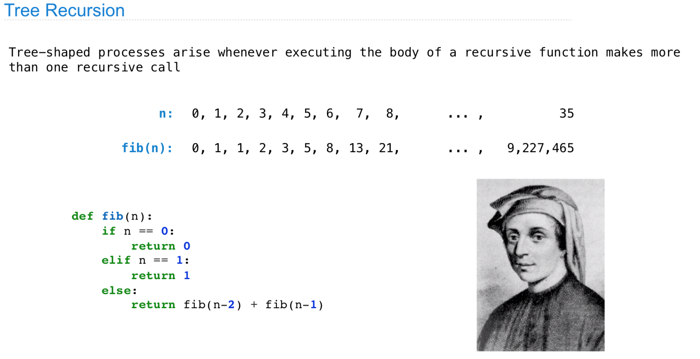
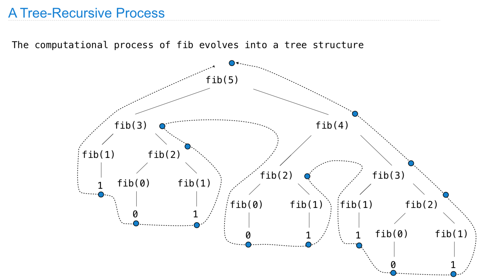
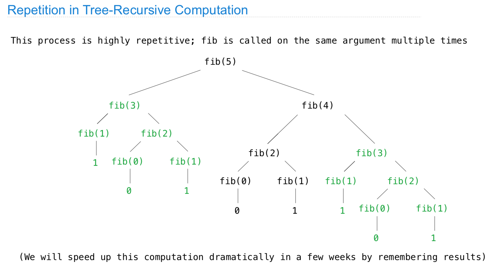
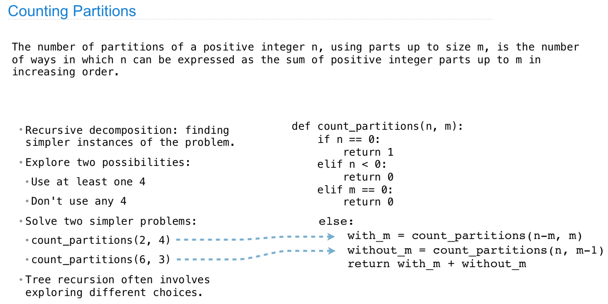
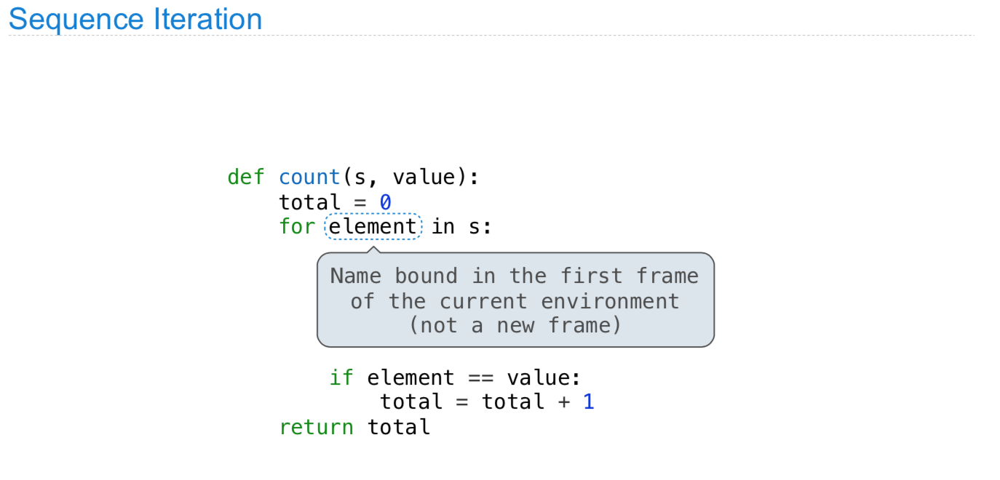
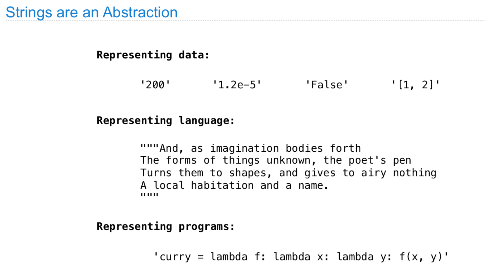
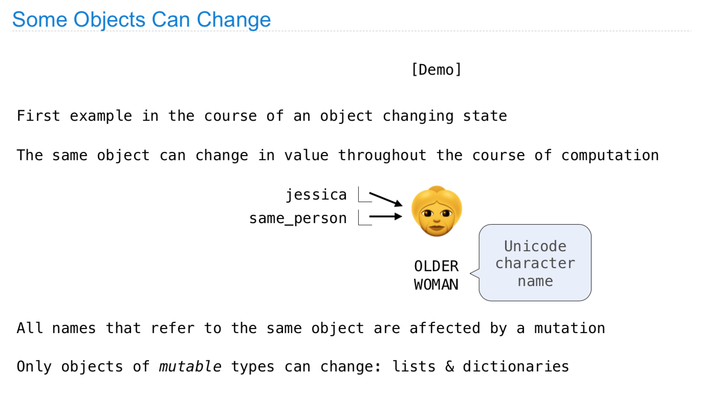
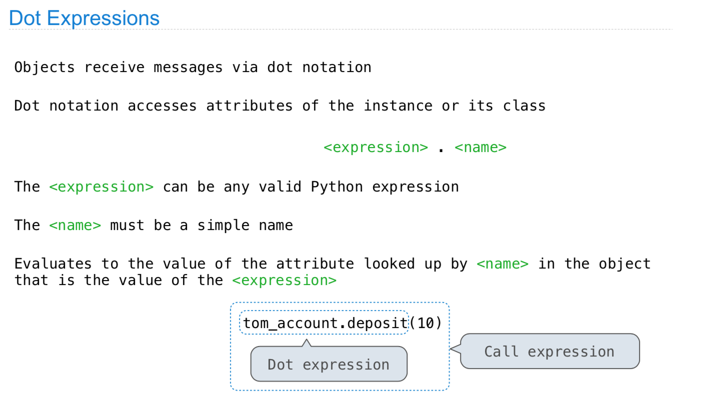
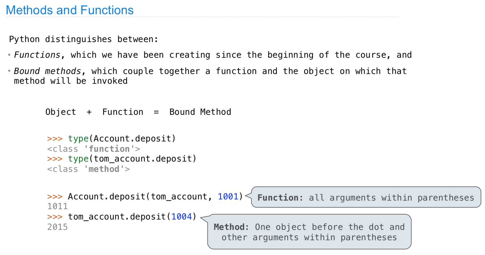

# CS 61A \(2\)

## 9. Tree Recursion











#### 小结：

主要讲了一下树形递归，对于函数的call应该是逐步的，一层一层的，不断由大到小，直到base cases。

## 10. Data Abstraction


这里的constructor依靠函数来获得实际结果，而selector也需要使用函数来选择需要使用的数据。


这里pair\[0\]实际是getitem实现的，这里主要涉及了一点python底层的实现，也就是magic functions。


在这里主要通过list越过了constructor和selector，直接使用了list给定了实际的地址，而越过了中间的函数调用。


## 11. Containers





这里详细讲解了for iteration的过程，后面的表达式必须是一个iterable的类型，也就就是必须有\_iter\_这个定义，从而每一次都会自动取下一个数，于此同时，现有变量的name的引用改变，name指向新的值，然后执行for 循环里面的命令。


这里很特殊的一点，需要新建的是一个frame，然后作为这个函数的上一级，非常不一样，一般都是在下层运算，但是这里是创建一个上层函数。




#### 小结：

这里主要介绍了python的基本数据结构，list、string、dict之类的，基本来说python通过list将array和linked list之类的进行了融合，从而简化实际的使用，但是这牺牲了比较多的性能。

## 12. Trees


这里需要记忆的是，range和slice都是左开右闭，这里一定一定要牢记，之前吃亏过。


这里的因为还是基本入门，所以是通过list来实现tree的，当时自己背下来学习感觉有点没有必要，还是要自己理解一下，如果这里可以实现一个TreeNode List就方便很多。

```python
class TreeNode :
    def __init__(self, root) :
        self.root = root
        self.left = None
        self.right = None
```

## 13. Mutable Values


python的ascii 码是支持直接比较的，具体实现好像是ord\(\)，bit\(\) 应该是二进制。





python在内置的时候，实际上改变的是指针指向的地址，所以有的时候需要比较两者到底是地址相同，还是包含的值相同，这里可以类比c++的\*&之类的。


#### 小结:

这里介绍了两种主要的数据结构，可变的一般用来存储一些遍历和运算结果，但是要小心的是它们的指针和地址，而不可变的数据结构一般用来存储一些比较重要的数据，比如在算法里面就用set/tuple来存储字典之类的，来查找不变得数。

## 14. Mutable Functions


nonlocal实际上是将调用环境的第一个环境变量作为全局变量，这样的话，每次只改变全局变量的值，而在每次的函数调用的子环境中，不再生成这个变量，以balance为例，当它为non-local的时候，就把它当做全局变量，每次函数调用进行改变即可，而不在每次的子环境变量中去生成一个balance的值。


#### 小结：

这里的主体想解释在高阶函数运行时候的实际计算流程，通过nonlocal来进行控制，从而可以对每次函数调用产生的frame有清晰的认识。

## 15. Iterators


dict的顺序是加入和赋值的顺序，并且并不发生改变。


#### 小结:

迭代器和生成器主要支持两种操作，一个是iter一个是next，对于两者的实现，一个是通过\_\_iter\_\_，一个是通过yield来实现。

## 16. Objects


这里一般比较难以理解的就是self，具体来说self就是java中的this指针，每次需要首先初始化一个实例，然后给实例的属性和方法进行复制和定义。








#### 小结:

这里是OOP的一个简单介绍，主要就是如何定义class，以及class的初始化、方法、属性之类的，平时写的比较多，这里就不赘述了。

