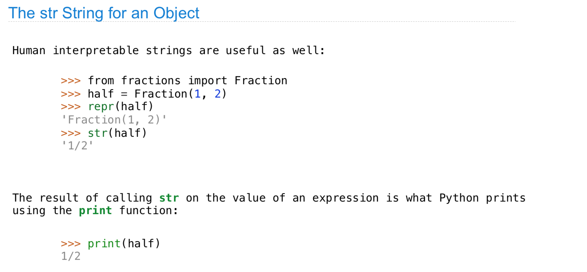
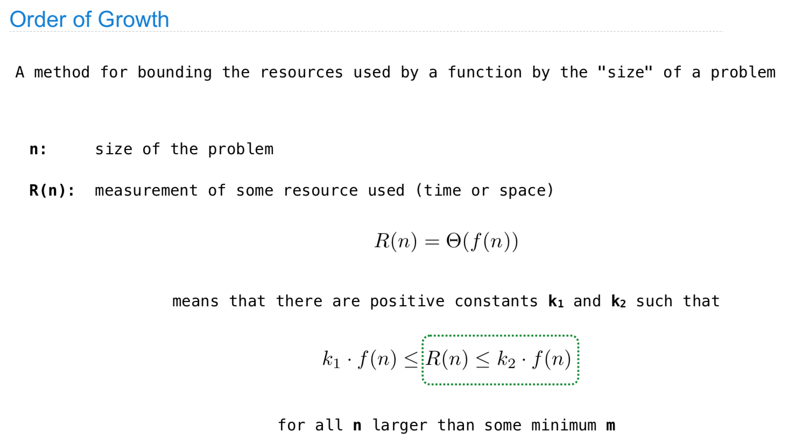
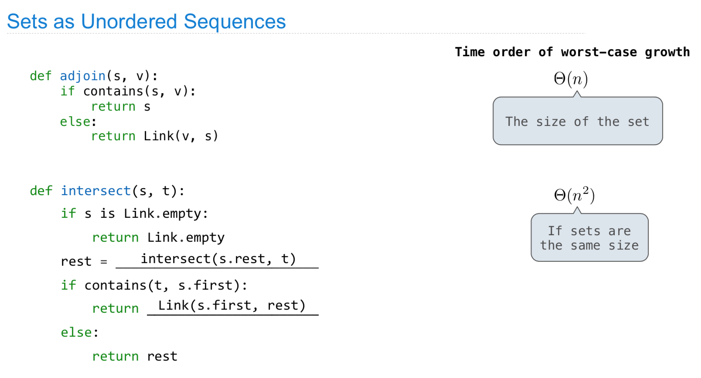

# CS 61A \(3\)

## 17. Inheritance

这里主要回顾了基本的Class是什么，具体来说，我一般理解Class为一个模板或者衣服，每次的初始化就像重新传一件衣服，然后需要在口袋什么的地方放进去需要的元素，并且定义方法。

而实际在实现Class的时候，都要去取地址来获取相应的函数和数据，从而划分为属性和方法，每一件衣服都独自构成一个local环境，非常的巧妙。这里主要是要为后面的继承做一个铺垫。

这里因为用的比较少，所以对于超类以及类的继承其实较少的涉及，这里提到了一些细节:

* Super\(\) 就是指的超类，当调用超类的时候不够给self指针来确认当前对象，因为Super\(\) 这时以及在本地环境有了指向关系，知道如何去取地址。
* 继承主要继承的是base class的method和属性，然后通过初始化重新bind属性或者method。

这里整体来说多重继承是比较难的一个话题，因为需要涉及重写等等方法，一般来说都比较复杂，这里会跟着lab和作业理解一下。

## 18. Representation

#### 小结：

这里主要设计了python的魔法类，这个的主要作用主要是在python开发部分，一般来说不需要通过这样来定义，但是如果比如要自己做一个类似numpy或者pandas的包的话，就很有必要了。

## 19. Growth

#### 小结:

这里主要做了一个基本的算法入门，大概讲解了一下时间复杂度和空间复杂度，并大致说了一下到底如何进行分析。

## 20. Composition

这里稍微说一下，这种写法绝对是最快的，但是这里感觉断言使用的不是很多，直接断言很容易bug，还不如抛出错误，也可能是我对这里的理解不够到位。

#### 小结:

这里主要是给数据结构开了个头，感觉希望鼓励后面大家去上CS61B，具体来说这里通过数据结构的定义和实现，讲解了比较多的python小技巧，比如propery装饰器之类的。

## 21. Ordered Sets

#### 小结：

这里讲了set的底层，比较重要，主要是用了有序链表来对数据进行存储，保证了O\(n\)时间的查找和插入。

## 22. Tree Sets

## 23. Data Example

