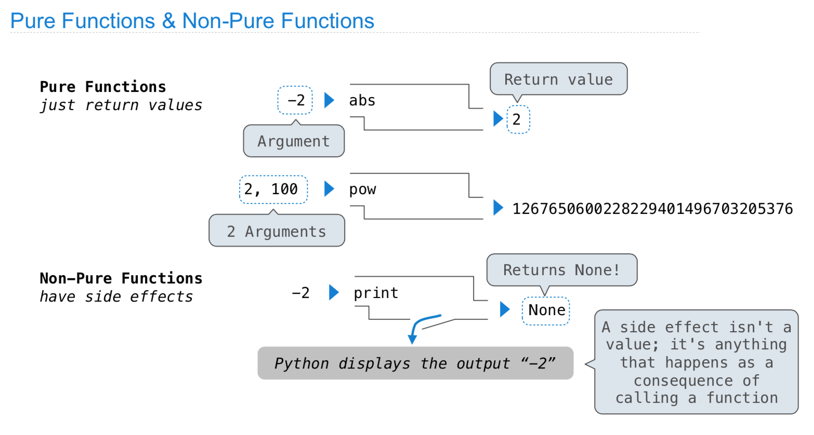
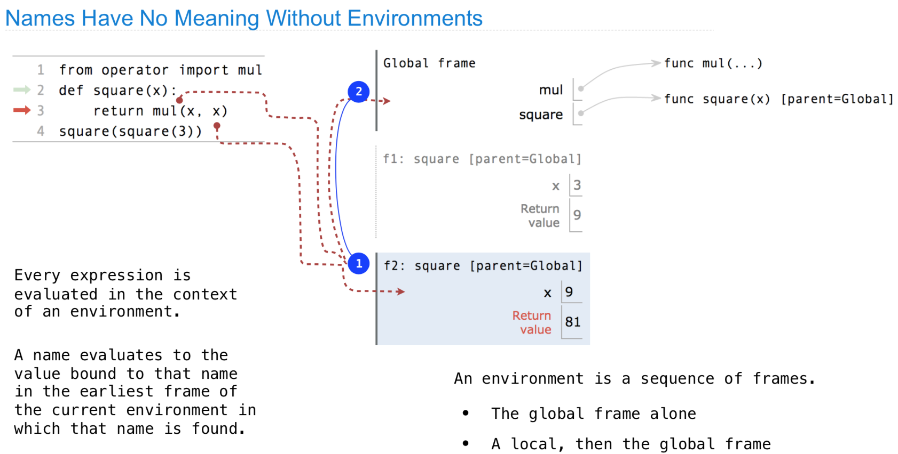
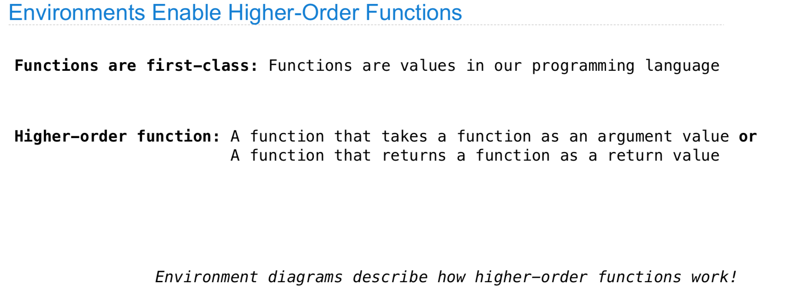
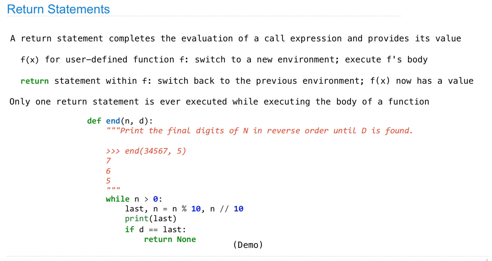

# CS 61A \(1\)

## 1. Functions

#### 小结：

这里主要是介绍了一些基本的操作，以及python内置到底是如何执行操作的，每次的\(\)都在call一个函数，然后将参数传入，执行函数，并且返回值，这里主要说明了这个原理。

## 2. Names

对于函数的定义，每一次调用函数就等同于进入栈空间，由此开辟了一个新的环境，也就是局部环境，而这时如果值能够在局部环境找到即可，而找不到才会向上查找，类似盗梦空间。

#### 小结：

命名的部分主要要解决的是 全局变量和局部变量 相互赋值和影响，主要通过这个来实际模拟程序的运行，可以知道整体执行过程。

## 3. Control

这个应该是有一个交互的环境来动态展示整个程序运行时候的环境的，这里找不到了，先放在这这里。

这里有个小tips吧，有的时候在写算法的时候，程序判断的顺序非常重要，对于写法来说，避免bug的前提是能够分析清楚整体函数的调用顺序，有时候毕竟不是科班出身，在写的时候，会莫名其妙地增加一定的运算量（不一定增加时间复杂度），或者throw error，这里需要注意。

#### 小结：

这里主要覆盖了一些基本的逻辑流运算，非常的基础。但是，却要非常的小心，如果实际用到了 i - 1，那么前面就要判断一下是否越界，如果每次需要判断的条件比较多，那么应该尽量提前。编程最重要的就是逻辑流，所以还是希望自己可以多重视一下。

## 4. High Order Functions

这里主要以lambda和其他函数为主，做了简单的介绍，所谓的高阶函数其实就是函数里面再调用函数，比较难的部分是因为不断的调用而造成的局部空间和全局空间的差异，有的时候不画图比较难以分析。编程的时候就很好解决，一般避免用一样的names就可以。 

## 5. Environment

这里提一下，对于return的理解，return在底层实际上是一个bind的过程，如果return None就是bind None，估计和内存分配和调用有关，这里不是很清楚。

#### 小结：

高阶函数的环境是非常难分析的，因为一旦调用次数过多或者一个地方错误，就整体都错了，这里提示的方法是用bind来将所有的函数和值进行记录，但是这个东西会变，如果自己手划过一次就知道这个是不容易的，这个应该也是有一个动画一样的东西的，可以便于自己理解。

## 6. Iteration

#### 小结：

这里的迭代有个非常重要的思想是，return实际上上返回了上一层的环境，从而继续执行，一般这里理解为楼梯的上下比较好理解，如果需要什么就上一层楼，拿到了东西或者运算结束，就下楼。

## 7. Recursion

迭代和递归的主要区别是对于空间的使用，迭代使用的是堆空间，也就是都是在一层楼内的计算，而递归使用的是栈空间，需要层层楼去计算。

#### 小结：

这节主要是比较了递归和迭代的区别和具体的实现，递归相对来说比较复杂，因为需要确定层级之间的关系，以及base cases也就是递归的出口，这些都是比较难的，而迭代主要是利用循环来进行计算，实际的实现难度是弱于递归的，但是当代码逻辑相对比较复杂的时候，递归的优势会非常非常明显。

## 8. Function Examples

这里涉及了比较多的代码风格和unit test的东西，我觉得非常有用：

* 问题定义和整体理解：首先确认自己正确理解问题，这种层面的test比闷头去写更加有价值。
* 由分到整：应该适当地理解每一部分的整体逻辑，然后有机地进行整合。

装饰器基本等同于函数嵌套，之所以叫装饰器是因为有的时候函数嵌套的目的在于美化输出结果之类的，而不单单函数嵌套递归，比如希望函数输出保证一定的长度、宽度之类的。

#### 小结:

这里开始初步涉及到一些pythonic的东西，以及python语言的特性，这里结合Fluent Python一起看比较好。

## 9. Tree Recursion

#### 小结：

主要讲了一下树形递归，对于函数的call应该是逐步的，一层一层的，不断由大到小，直到base cases。

