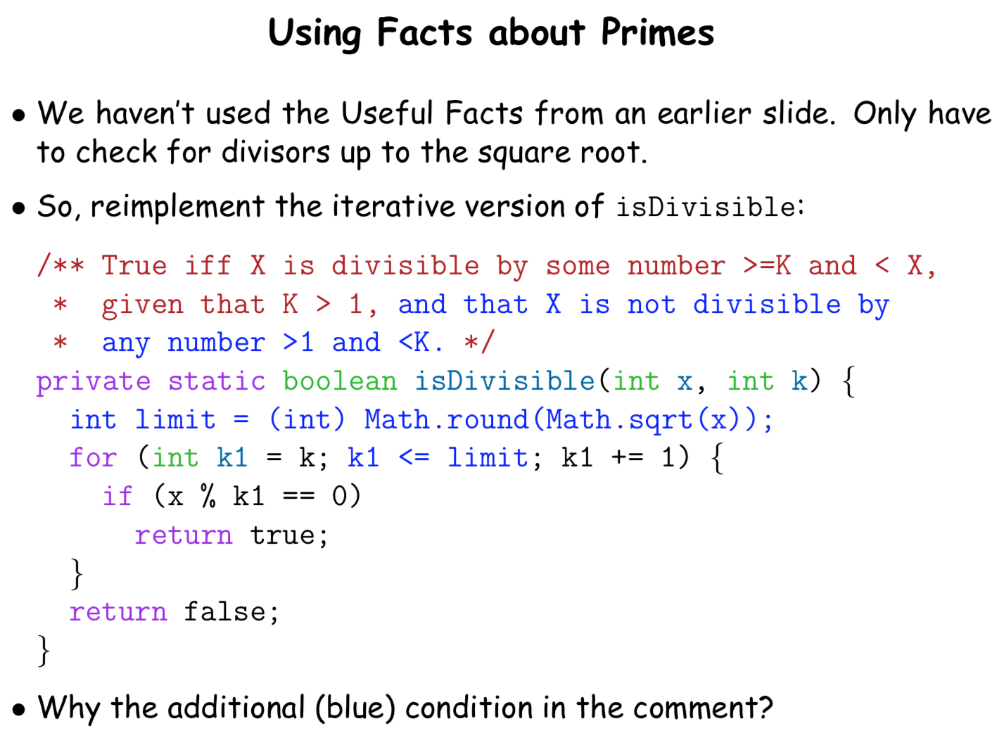

# CS 61B \(1\)

## 1. Java Introduction

```java
public class Hello {
    public static void main(String[] args) {
        System.out.println('Hello World!'); 
    }
}
// Java的comment可以使用 // 或者 /* */
```

* Java中的每一个函数和变量都以class存储，而所有的classes都属于一个pkg，这里Hello class属于匿名的pkg
* 函数的头部包含了返回值的类型以及输入参数的类型，这里的void并不返回任何值，而String \[\] 则是给了一个string数组
* main这里和python其实一致，当运行这个程序时才会使用，如果call的话，并不会执行
* public和private表明了访问的权限
* static 和 dynamic主要区别在于是否在class 内部定义-local environment





