# CS 61B \(1\) - Java 基础与数据结构

## 1. Intro, Hello World Java

#### Java万物且Class

Java is an object oriented language with strict requirements:

* Every Java file must contain a class declaration\*.
* All code lives inside a class\*, even helper functions, global constants, etc.
* To run a Java program, you typically define a main method using        public static void main\(String\[\] args\)

#### Java is statically typed!

* All variables, parameters, and methods must have a declared type.
* That type can never change.
* Expressions also have a type, e.g. “larger\(5, 10\) + 3” has type int.
* The compiler checks that all the types in your program are compatible before the program ever runs!
  * e.g. String x = larger\(5, 10\) + 3 will fail to compile.
  * This is unlike a language like Python, where type checks are performed DURING execution.

#### Java的优劣

* The Good:
  * Debugging is a lot easier, type errors are avoided.
  * Production code has no type errors, so that means people’s phones won’t crash because of type errors.
  * Programs run more efficiently in time and memory.
  * Self-documenting: YOU KNOW WHAT YOU’VE GOT.
* The Bad:
  * Code is more verbose.
  * Code is less general.

#### Tips :

Java整体来说和C非常的像，稍微简单一点，但是有一些小的坑，还是要踩一踩写一写才能明白的。

```java
public class HelloWorld {
    // 这里必须要public static void 目前还不明白，后面讲了，
    // 因为main是本地调用的所以应该是static
    public static void main(String[] args){
        System.out.println("Hello World");
        // 这里我试了一下 'Hello World'，这里说字符串不闭合
        // 也就是说要用双引号而不是单引号
    }
}
```

```java
public class PrintNumbers{
    public static void main(String[] args) {
        int x = 0; // 声明 + 定义
        while (x < 5) {
            System.out.println(x);
            x += 1;
        }
    }
}
```

## 2. Defining and Using Classes

**Compilation**

Java和C一样，需要先编译成机器语言，然后才能被执行，具体的过程如下，就不细说了：

```bash
javac HelloWorld.java
java HelloWorld // 不是 HelloWorld.class
```


**Defining and Instantiating Classes**

一般来讲，所有的方法和属性都存在一个class下面，


* instance variable 就是一般类的属性
* Constructor 类似python里面的\_\_init\_\_，主要作用是初始化，如果没有初始化是不能调用这个的
  * 这里比较难的地方在于，已经有了Dog Class，为什么还需要再写一个Dog，主要需要将这个类中的其他属性（WeightInPounds）进行初始化，这里是初始化的主要定义，有点不同
* 非静态和静态：这里还没有完全理解，我这里的理解就是你是否实例化为不同的实例，然后每个实例都有自己的方法，而非不变的，它会根据实例的不同而进行改变，因而是非静态


这里讲解的比较详细，因为有C++基础，我就不纠结在这里的，主要是不同于动态编程语言，静态语言需要先被转译为机器语言，因而需要声明、赋值等等过程来初始化一些变量。


过了一下HW0，感觉不是特别的难，这里初始化了一个Dog Array，等于说可以想象一个Dog House，里面存储的都是Dog类的变量，都具有Dog的属性。

#### **Static vs. Instance Members**


* Static 和 Non-static 主要的区别在于两者可不可以实例化，这个是主要区别，需要细细理解。
  * 具体来讲就是是否可以new一个新的实例，然后调用它的函数比如makenoise，而如果是static，则需要使用Dog.makenoise，因为这个特例没有这个方法，而必须去调不变的函数

**public static void main\(String\[\] args\)**


**Using Libraries**


后面主要是讲解了一下基本的命令行操作以及library 的载入。总之，这一节比较重要的时候讲解了static的具体使用，尤其是在初始化class的时候。

## 3. References, Recursion, and Lists



#### **Primitive Types**


对于java来说，存储的都是01的bits，因此不管数再大也是bits，所以在比较的时候是可以直接使用位运算符号进行比较的。

#### **Reference Types**


#### **Parameter Passing**


Java 所有的参数传递都是复制bits，64bits一般都是地址，而32bits一般是数字，也就说如果call了一个function而传递的是一个对象，那么会改变值，而x = 3这种是不会改变的。

#### **Instantiation of Arrays**


**IntList and Linked Data Structures**

这里开始讲了非常重要的链表的概念，这个对于后面的链表转换非常重要，需要吃透，然后才能继续走。


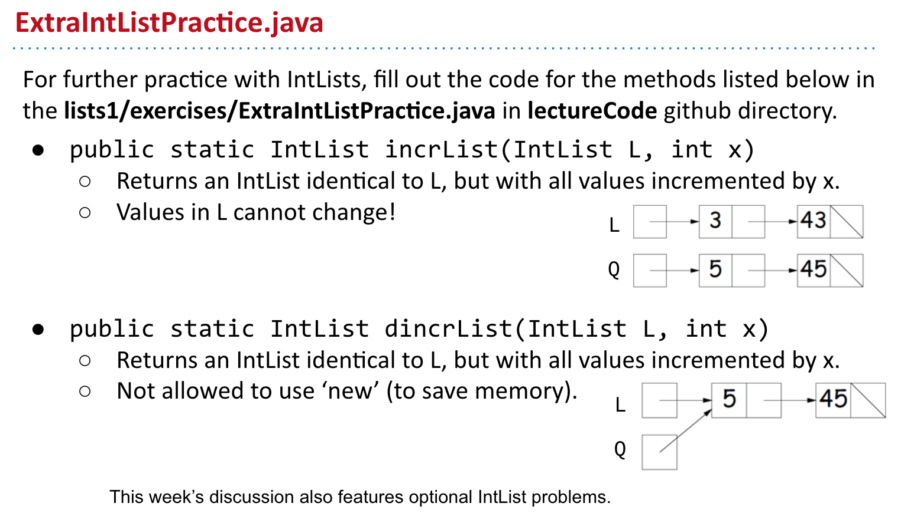

因为涉及到对链表进行处理，不能避免的就是使用递归，但是我自己递归的水平比较一般，都是靠刷题刷出来的，所以这里停了一段时间去做做leetcode来习惯一下递归。

## 4. SLLists, Nested Classes, Sentinel Nodes





* 链表和数组都是线性数据结构的一种，链表可以跨空间去连接不同内存片段和地址，而数组则是连续的，这是两者比较重要的区别
* 对链表来说，分为一个信息域，一个指针域，简单说就是一个存数，一个存指针指向的下一个节点

#### From IntList to SList

这里提到，intlist是一种naked链表，所以在java里面是非常难以使用的，所以这里需要将它变成Slist来使用，具体就是后面的参数是一个list，而不带有链表本身的next之类的特征。


* intlist -&gt; intnode
* tail -&gt; next


为了方便起见，这里需要对原有的数据进行改动，比如改动了Slist之类的，


* addFirst：打断原有的链表，在链表的头部加入新的node
* getFirst：直接返回first的值


这里就是具体讲解了一下为什么要用SLLists，没太明白


**Public vs. Private Nested Classes**

public和private主要是通过访问权限，对程序内容进行保护


**addLast\(\) and size\(\)** 

同之前的一样，基本的操作也是一样的


这里主要是讲原有进行遍历来求Size的方法进行了改变，改成了使用特殊的属性对这个进行记录，从而将时间从O\(n\)降到了O\(1\)


#### Sentinel Node

这个sentinel node就是dummy node，也就是哨兵节点，主要是为了解决front不存在的问题。


因为哨兵节点的存在，因而不需要去检查front是否是null了，所有的节点都一样，一开始也都指向哨兵节点，这个是非常重要的一种奇巧淫技。

## 5. DLLists, Arrays

**Doubly Linked Lists**


单向链表主要的缺陷在这里是，尽管可以得到最后一个node，但是很难得到前面一个node，为了得到前一个node，仍需要遍历原有的链表，这也就是后面双向链表产生的主要原因


这里主要是要避免都指向同一个sentinel的情况，所以使用了两个指针，所以这里就有了两个sentinel，一个back，一个front


**Generic SLists**

当一个函数需要面对不同类型的时候需要使用generic，类似于多态的一种实现，比如初始化是int，也可以是string


通过生成器，可以制定链表的类型，到底是char，还是Int还是double。

**Arrays**


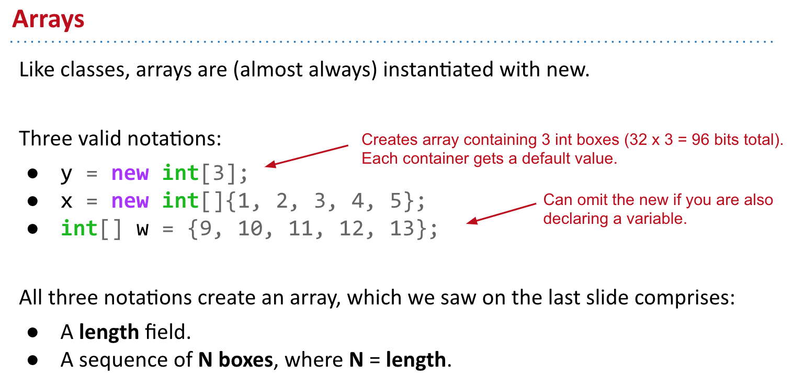


**2D Arrays**


**Arrays vs. Classes**


## 6. ALists, Resizing, vs. SLists

**A Last Look at Linked Lists**

* 首先回顾了之前实现的链表主要操作


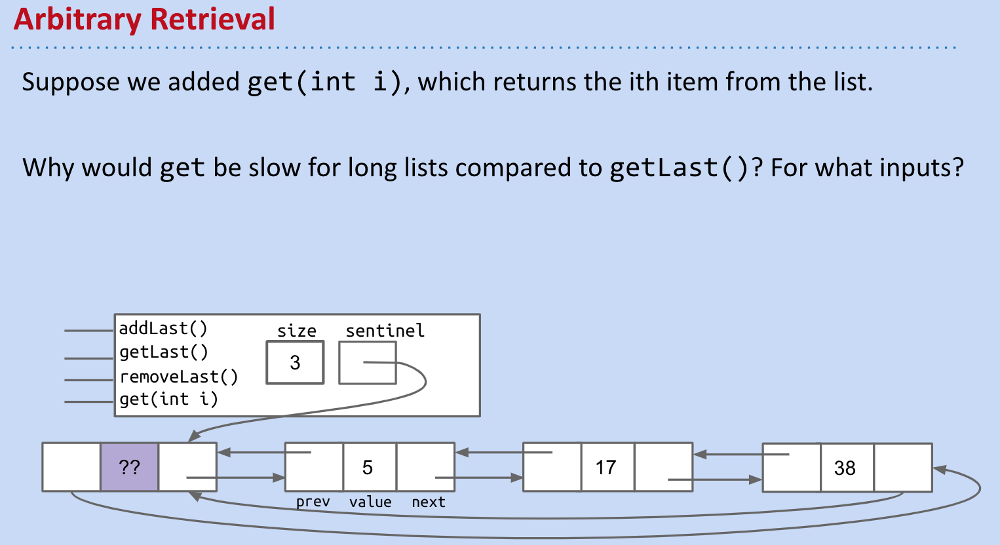

* 对于链表来说因为没有相应的索引，所以要得到某个数需要遍历全链表来得到这个数，平均的时间复杂度是O\(n\)
* 如果有可能使用Array，那么这个时间复杂度就会下降到O\(1\)

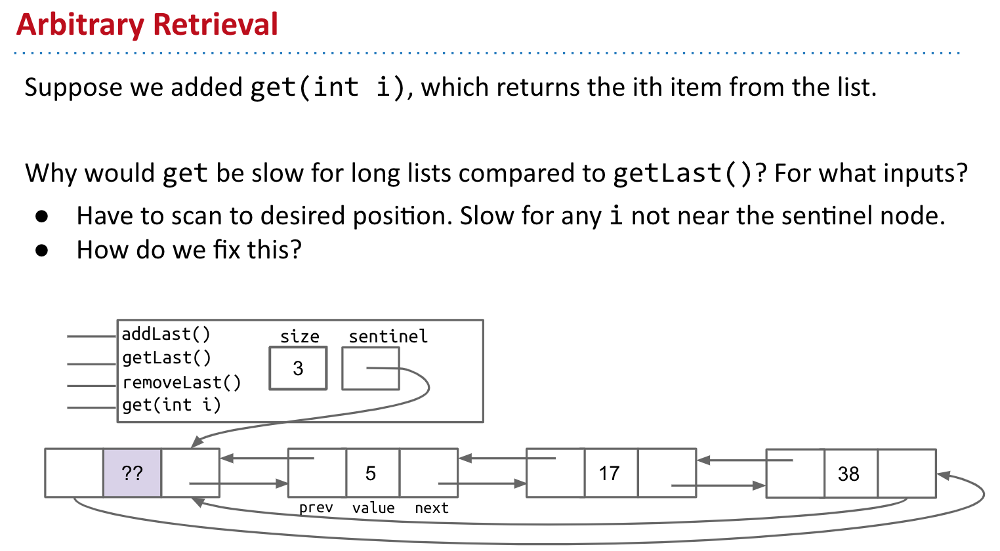


**Naive Array Lists**

* Array主要的特点就是Random Access - 随机访问，在硬件中的存储是连续的地址，因而在随机访问的时候就会非常非常快，而链表所指向的地址则是离散且分散的
* 这里提到了cs61c 比较偏向底层，有时间可以看一看


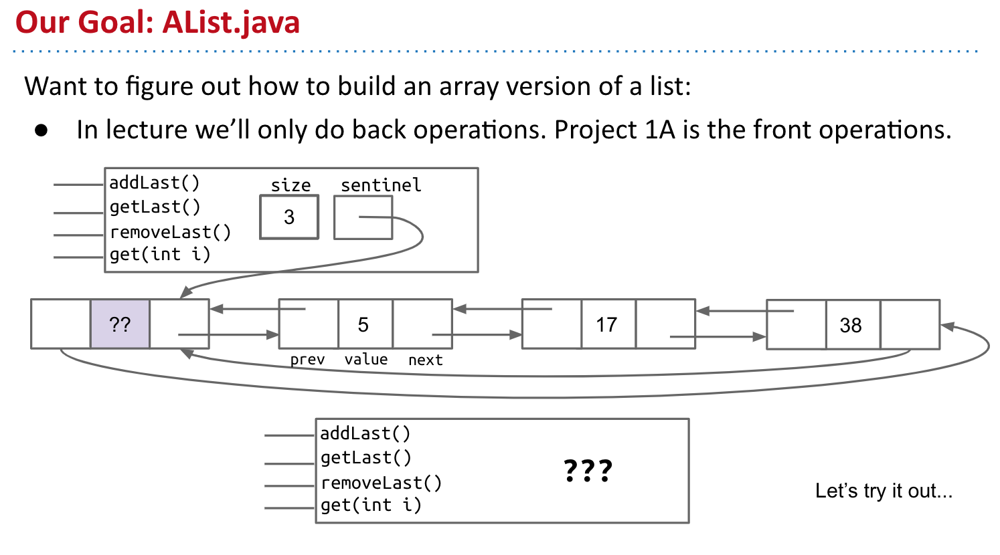


在这里具体的实现是非常重要也需要自己实际去做一遍的，不要因为简单就一下跳过:

* 规律是每次新加数的index就是size，因为size是从0开始的，所以每次对size同时进行调整即可
* 通过对size的控制，就可以做到随机访问


* 因为实际控制这个array的是size，所以对于remove来说，只需要调整size，并返还现在remove的就可以
* 从一般意义上说，并不需要对之前的数进行复制，但是如果这个不是intArray，那么其实是需要对最后一位进行操作，并将值设置为Null的，因为涉及到了garbage collection


**Resizing Arrays**

因为在java以及c之类的静态语言中，每次需要申请一个定额的空间，因此会出现一个空间用尽的问题，具体来讲就是超过了整个array的长度，这时候就需要对array进行resize

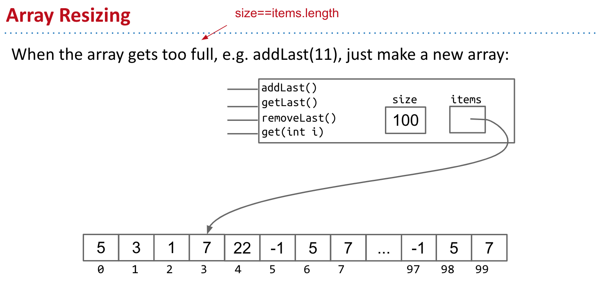


具体实现来说:

* 先new一个新的array，然后将之前的数复制到这个新的array里面，然后再将新的值放去新array里


这种处理方法的弊端是慢，因为对于array来说，只对size + 1进行复制，需要进行的操作比较多，所以后面实际实现的是倍增法


* 倍增法的思路可以有效地将整体的运算时间进行下降

**Generic ALists**

通用的ArrayList，需要不指定特殊的数据种类，而根据需要来设置实际存储的值


这里比较重要的是：

* （Glorp \[\]）new Object\[8\] 这个操作，目前来说还不是很清楚，在后面的casting里面应该会涉及到


这里主要是设为null之后，Java会清空不需要的objects，从而不会使原来的指向关系和存储的数值都变成“游荡”的孤儿。

**Obscurantism in Java**


* 主要是一些编程技巧，这里应该使用Private来限制其他人对这个对象的访问

## 7. Testing

程序员需要对code进行test来确保他们的程序能够运行，即使如此也很难确保程序能够正常运行，所谓的test都是尽可能接近程序的模拟来帮助debug。

#### **Ad Hoc Testing vs. JUnit**

```java
public static void testSort() {
    String[] input = {"I", "have", "an", "egg"};
    String[] expected = {"an", "egg", "have", "I"};
    Sort.sort(input);

    if (input != expected) {  // 这里如果写了 != 实际比较的事两者的地址是否一样
        System.out.println("Error!");
    }
    
    // 使用这种写法就是比较这个string list里面每一个元素是否一样    
    if (!java.util.Arrays.equals(input, expected)) {  
        System.out.println("Error!");
    }
}
```

下面的新写法就是尝试不实用java.util.Arrays，直接使用循环


实际coding的过程中，jUnit会自动做这些事情，类似于Python的断言函数来自动报错和检查

* org.junit.Assert.assertArrayEquals\(expected, input\);


* deprecated
  * 有时候因为代码修改需要淘汰一些函数，这里的问题是为什么不remove这个函数
  * 主要是为了保证以前的code也是可以运行的，这样可以做一个缓慢的过度

#### **Selection Sort**

* 永远把最小的提前

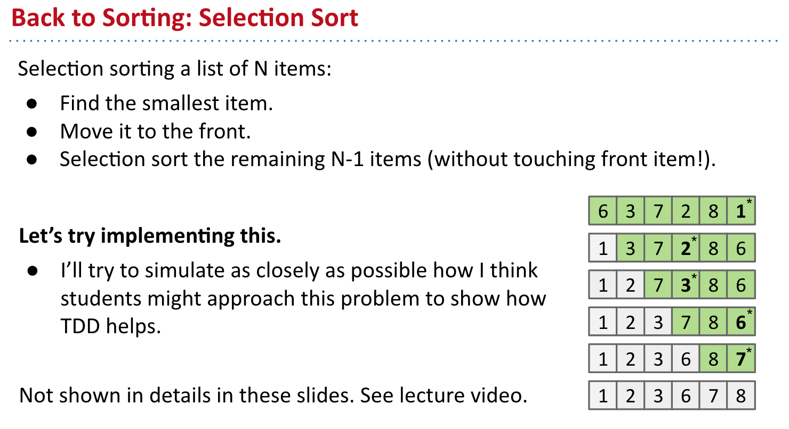

```java
// 找到最小的值

public static String findSmallest(String[] x) {
    int smallestIndex = 0;
    for (int x = 0; i < x.length; i += 1) {
        if (x[i] < x[smallestIndex]) { // 这里因为比较的事字符串，所以会报错
            smallestIndex = i;
        }
    }
    return smallestIndex;
}

// 修正

public static String findSmallest(String[] x) {
    int smallestIndex = 0;
    for (int x = 0; i < x.length; i += 1) {
        int cmp = x[i].compareTo(x[smallestIndex]); // 改成字符串比较
        if (cmp < 0 ) {
            smallestIndex = i;
        }
    }
    return smallestIndex;
}
```

Josh Hug真的是非常好的老师，在上课的过程中讲了如何debug，而且是从一个完全初学者的角度去理解，实现了找到最小的之后，只需要对内容进行swap即可。

```java
public static void Swap(String x[], int a , int b){
    String temp = x[a];
    x[a] = x[b];
    x[b] = temp;
}
```


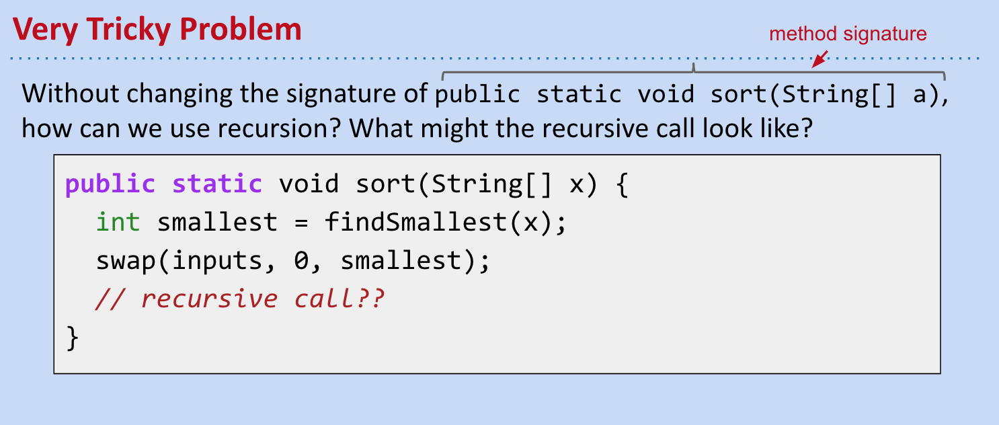


这里有非常重要的一个技巧，就是记忆实际index的位置，因为java并没有python切片的函数，所以实际在get Array的时候，得到的整个Array

* 这里主要是通过int k来记忆之前开始的位置
* 同样这里也需要修改findSmallest，在传入的参数之中应该有int start

```java
public class Sort {
    public static void sort(String[] x){
        sort(x, 0);
    }

    private static void sort(String[] x, int start) {
        if (start == x.length()) {
            return ;
        }
        int smallest = findSmallest(x, start);
        Swap(x, start, smallest);
        sort(x, start + 1);
    }

    public static String findSmallest(String[] x, int start) {
        int smallestIndex = 0;
        for (int x = start; i < x.length; i += 1) {
            int cmp = x[i].compareTo(x[smallestIndex]);
            if (cmp < 0 ) {
                smallestIndex = i;
            }
        }
        return x[smallestIndex];
    }
    
    public static void Swap(String x[], int a , int b){
        String temp = x[a];
        x[a] = x[b];
        x[b] = temp;
    }
}
```

**Simpler JUnit Tests**


这里使用@org.junit.Test可以不用手动运行main function，因此非常简便，但是这是在intellij环境下的，并没有在其他的IDE或者文本编辑器下实际运行过，所以并不知道实际效果。

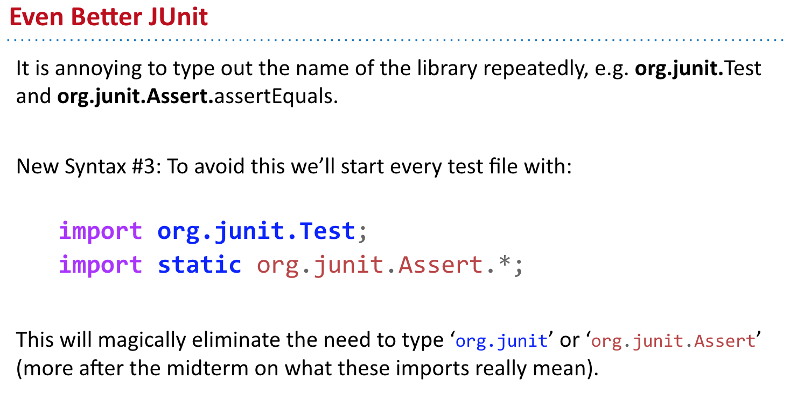

#### **Testing Philosophy**


对于test来说，有利有弊吧，这里就是抓哟讨论了一下使用test的利弊

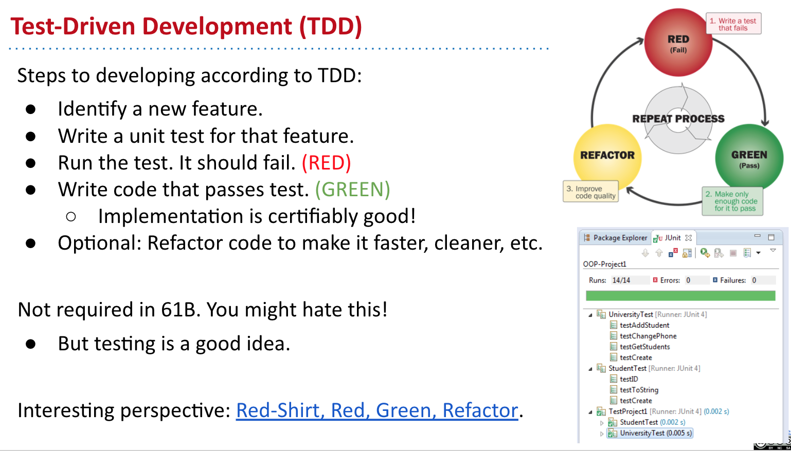


* junit
* Unit test
* Integration Test

#### **More On JUnit \(Extra\)**

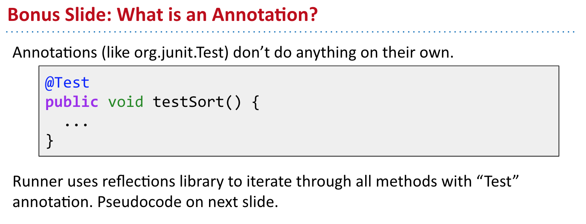


