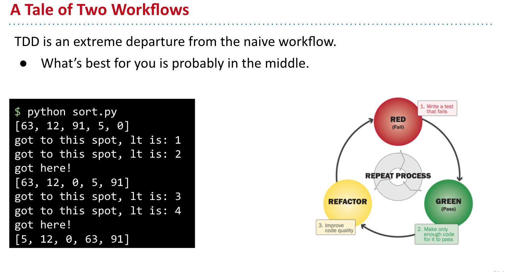
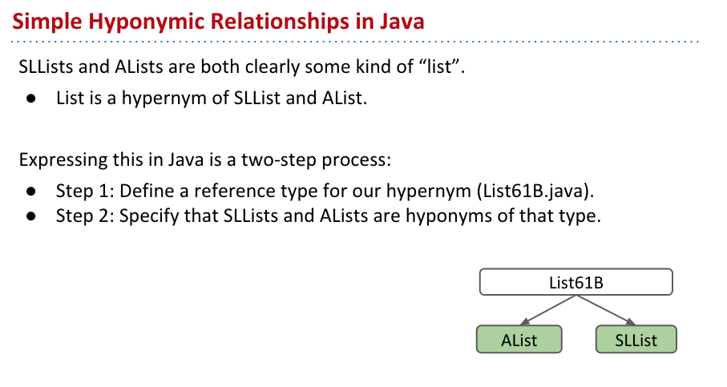
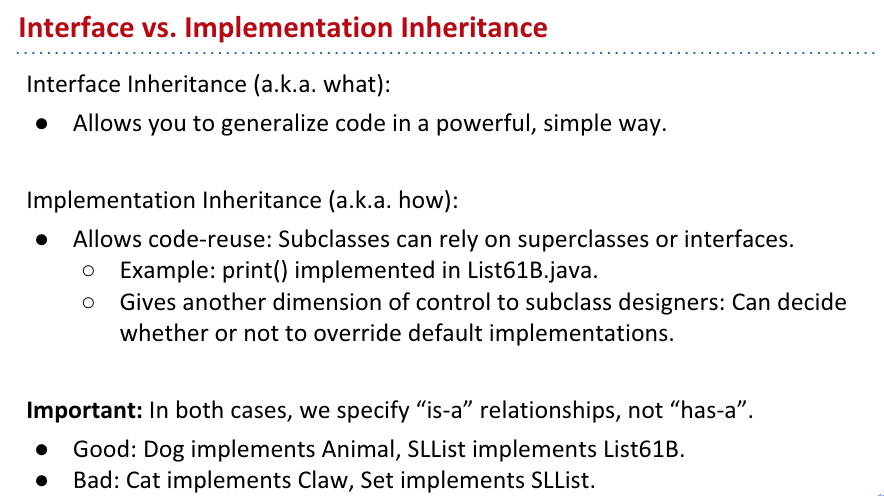
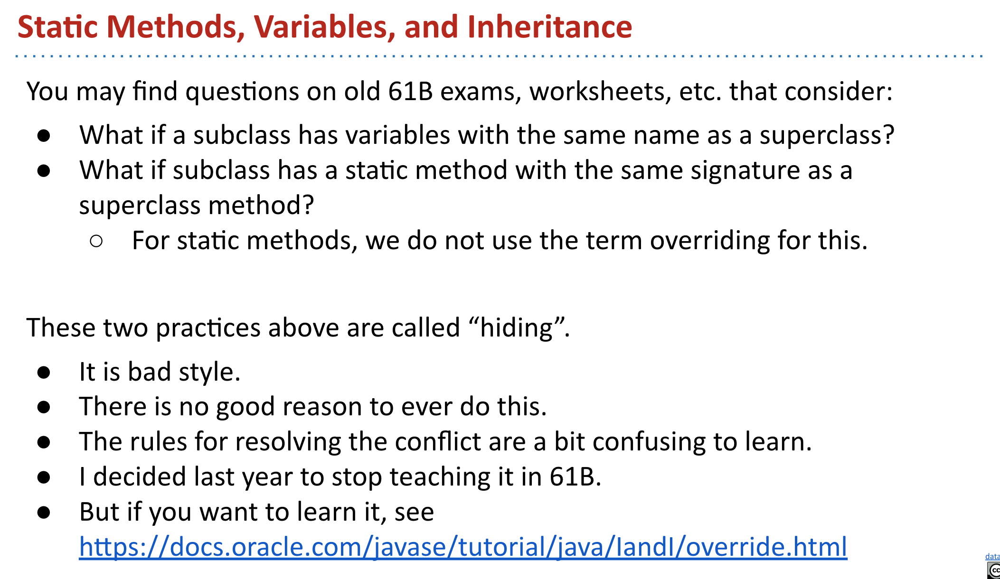
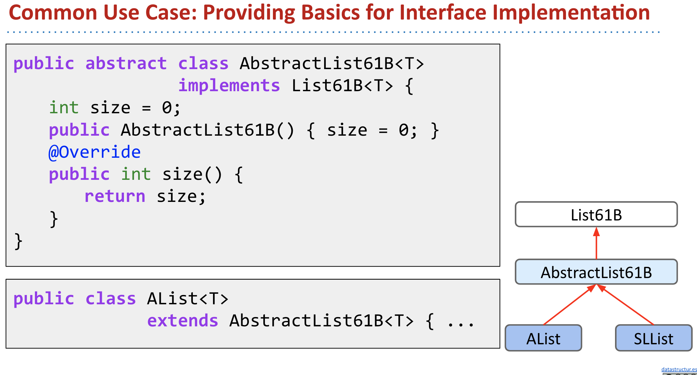
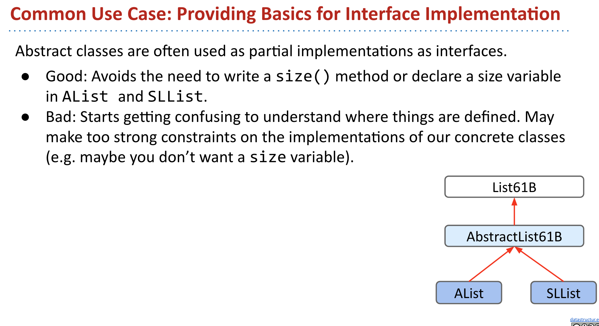

# CS 61B \(2\)

## 6. ALists, Resizing, vs. SLists

**A Last Look at Linked Lists**

* 首先回顾了之前实现的链表主要操作


* 对于链表来说因为没有相应的索引，所以要得到某个数需要遍历全链表来得到这个数，平均的时间复杂度是O\(n\)
* 如果有可能使用Array，那么这个时间复杂度就会下降到O\(1\)


**Naive Array Lists**

* Array主要的特点就是Random Access - 随机访问，在硬件中的存储是连续的地址，因而在随机访问的时候就会非常非常快，而链表所指向的地址则是离散且分散的
* 这里提到了cs61c 比较偏向底层，有时间可以看一看


在这里具体的实现是非常重要也需要自己实际去做一遍的，不要因为简单就一下跳过:

* 规律是每次新加数的index就是size，因为size是从0开始的，所以每次对size同时进行调整即可
* 通过对size的控制，就可以做到随机访问


* 因为实际控制这个array的是size，所以对于remove来说，只需要调整size，并返还现在remove的就可以
* 从一般意义上说，并不需要对之前的数进行复制，但是如果这个不是intArray，那么其实是需要对最后一位进行操作，并将值设置为Null的，因为涉及到了garbage collection


**Resizing Arrays**

因为在java以及c之类的静态语言中，每次需要申请一个定额的空间，因此会出现一个空间用尽的问题，具体来讲就是超过了整个array的长度，这时候就需要对array进行resize


具体实现来说:

* 先new一个新的array，然后将之前的数复制到这个新的array里面，然后再将新的值放去新array里


这种处理方法的弊端是慢，因为对于array来说，只对size + 1进行复制，需要进行的操作比较多，所以后面实际实现的是倍增法


* 倍增法的思路可以有效地将整体的运算时间进行下降

**Generic ALists**

通用的ArrayList，需要不指定特殊的数据种类，而根据需要来设置实际存储的值


这里比较重要的是：

* （Glorp \[\]）new Object\[8\] 这个操作，目前来说还不是很清楚，在后面的casting里面应该会涉及到


这里主要是设为null之后，Java会清空不需要的objects，从而不会使原来的指向关系和存储的数值都变成“游荡”的孤儿。

**Obscurantism in Java**


* 主要是一些编程技巧，这里应该使用Private来限制其他人对这个对象的访问

## 7. Testing

程序员需要对code进行test来确保他们的程序能够运行，即使如此也很难确保程序能够正常运行，所谓的test都是尽可能接近程序的模拟来帮助debug。

#### **Ad Hoc Testing vs. JUnit**

```java
public static void testSort() {
    String[] input = {"I", "have", "an", "egg"};
    String[] expected = {"an", "egg", "have", "I"};
    Sort.sort(input);

    if (input != expected) {  // 这里如果写了 != 实际比较的事两者的地址是否一样
        System.out.println("Error!");
    }
    
    // 使用这种写法就是比较这个string list里面每一个元素是否一样    
    if (!java.util.Arrays.equals(input, expected)) {  
        System.out.println("Error!");
    }
}
```

下面的新写法就是尝试不实用java.util.Arrays，直接使用循环


实际coding的过程中，jUnit会自动做这些事情，类似于Python的断言函数来自动报错和检查

* org.junit.Assert.assertArrayEquals\(expected, input\);


* deprecated
  * 有时候因为代码修改需要淘汰一些函数，这里的问题是为什么不remove这个函数
  * 主要是为了保证以前的code也是可以运行的，这样可以做一个缓慢的过度

#### **Selection Sort**

* 永远把最小的提前


```java
// 找到最小的值

public static String findSmallest(String[] x) {
    int smallestIndex = 0;
    for (int x = 0; i < x.length; i += 1) {
        if (x[i] < x[smallestIndex]) { // 这里因为比较的事字符串，所以会报错
            smallestIndex = i;
        }
    }
    return smallestIndex;
}

// 修正

public static String findSmallest(String[] x) {
    int smallestIndex = 0;
    for (int x = 0; i < x.length; i += 1) {
        int cmp = x[i].compareTo(x[smallestIndex]); // 改成字符串比较
        if (cmp < 0 ) {
            smallestIndex = i;
        }
    }
    return smallestIndex;
}
```

Josh Hug真的是非常好的老师，在上课的过程中讲了如何debug，而且是从一个完全初学者的角度去理解，实现了找到最小的之后，只需要对内容进行swap即可。

```java
public static void Swap(String x[], int a , int b){
    String temp = x[a];
    x[a] = x[b];
    x[b] = temp;
}
```


这里有非常重要的一个技巧，就是记忆实际index的位置，因为java并没有python切片的函数，所以实际在get Array的时候，得到的整个Array

* 这里主要是通过int k来记忆之前开始的位置
* 同样这里也需要修改findSmallest，在传入的参数之中应该有int start

```java
public class Sort {
    public static void sort(String[] x){
        sort(x, 0);
    }

    private static void sort(String[] x, int start) {
        if (start == x.length()) {
            return ;
        }
        int smallest = findSmallest(x, start);
        Swap(x, start, smallest);
        sort(x, start + 1);
    }

    public static String findSmallest(String[] x, int start) {
        int smallestIndex = 0;
        for (int x = start; i < x.length; i += 1) {
            int cmp = x[i].compareTo(x[smallestIndex]);
            if (cmp < 0 ) {
                smallestIndex = i;
            }
        }
        return x[smallestIndex];
    }
    
    public static void Swap(String x[], int a , int b){
        String temp = x[a];
        x[a] = x[b];
        x[b] = temp;
    }
}
```

**Simpler JUnit Tests**


这里使用@org.junit.Test可以不用手动运行main function，因此非常简便，但是这是在intellij环境下的，并没有在其他的IDE或者文本编辑器下实际运行过，所以并不知道实际效果。


#### **Testing Philosophy**


对于test来说，有利有弊吧，这里就是抓哟讨论了一下使用test的利弊





* junit
* Unit test
* Integration Test

#### **More On JUnit \(Extra\)**


## 8.  Inheritance, Implements


这里希望解决的是，如果code从SLlist变到ALlist，是否找到最长元素还可以工作


* String longest\(**SLList**&lt;String&gt; list\) -&gt; String longest\(**AList**&lt;String&gt; list\)
* 对原函数进行重载


* 重载的劣势是非常难以维护

**Hypernyms, Hyponyms, and Interface Inheritance**

hypernyms - 上位词





发现它们都有同样的methods，所以主要实现的也在这里


java的继承方法主要是通过implements，比较神奇


**Overriding vs. Overloading**

* overriding 覆盖和重写，会改变函数的方法和内容
* overloading 重载，只是改变函数的类型


* @override主要只是帮助理解和debug ，来看这个方法是否是被重写了

**Interface Inheritance**


**Implementation Inheritance: Default Methods**

* default 关键词 会强迫子类继承超类的方法


**Static and Dynamic Type, Dynamic Method Selection**


每次override之后，那么相应的类型也会相应改变

#### **More Dynamic Method Selection, Overloading vs. Overriding**


* a.greet\(d\) 
* a.sniff\(d\) 重写了
* d.fatter\(d\) 重载了，并没有同样的signatures


**Interface vs. Implementation Inheritance**

* interface更像是一种抽象，只是说它是什么，也就是后面说的is的问题
* interface 的实现，则表明了具体一种方法是如何被实现的




## 9. Extends, Casting, Higher Order Functions

**Implementation Inheritance: Extends**

* implements 指的实现具体的interface
* extends 则是主要继承原因借口和类的方法和成员


* 需要注意的是每一次重新都要确定重写的到底是哪个方法，如果没有super，会默认为之前的


* 本质上来说所以的类都继承自ojbect
* 一定要想是is还是has的问题


**Encapsulation**

* 封装这里我比较熟悉就不多说了


**Type Checking and Casting**

* 类型的强制转换是 使用（），这里比较重要，因为是根据类型来call函数的


**Dynamic Method Selection and Casting Puzzle**


**Higher Order Functions**


## 10. Subtype Polymorphism vs. HoFs

**Dynamic Method Selection Puzzle \(Online Only\)**


* 第一行，是否showdog是object? 是，所以可以
* 第二行，showdog是否可以强制转换为showdog? 可以
* 所以 sdx就是showdog，showdog有bark方法么？有
* 第四行，dog是一个dog？是
* dx是dog，dog 有 bark 方法么？有
* 第六行，还是dog的bark方法
* 第七行，dog是object? 是
* o3 是object 有bark方法么？没有



**Subtype Polymorphism**

子类 - 同一函数的输入类型为不同的类型，如int，string


* 高阶函数和子类是比较不同的
  * 高级函数依赖于其他函数进行判断
  * 子类则是自己就可以通过比较判断来确定返回的类型

**DIY Comparison**


dog是一个object，所以第三个没问题，那么同理因为传入的是dogs，也是一个object list，所以第一个也是没有问题的，第二个就有问题了，因为无法进行比较，object之间是无法比较的


因为这里出了问题， 所以不能采用打擂台的形式来确认最大的，而是要用下面的方式来寻找最大的，这里没有详细讲解是怎么实现的，而是侧重于默认Dog有这个方法。

* 具体来说就是给一个“狗链”，然后找到“狗链”中size最大的狗，然后返回这个狗


如果想要fix原有的问题怎么办，其实很类似，还是给一个狗链比较size，在c++和python里面， 实际上可以重新定义这里比较的意义，然而在java中，这个是不能实现的，只能建立一个interface。


* 这里就是创建了一个接口，而这个接口具有对Dog比较的方法，这里跟着Hug写了一下
* 然后Dog实现了这个接口，也就是说可以使用这个接口


* 好处在于会自动根据类型来实现同一方法，从而减少了实际需要的重复劳动


因为dog实现了接口，当dog没有compareTo方法的时候，Dog是不能通过编译的


DogLauncher不能编译的原因是当它call max函数的时候，给的是dogs，而max期望的时候OurComparables，因此这里会直接使得编译无法通过


**Comparables**


因为强制转换的存在，会使得代码整体比较复杂，每次都要强制转换，需要利用java自带的方法来实现，它本身自己会接入一个generic 类型，根据需要自行转换类型，但是在实际使用的时候，还是需要\(Dog\) 对Maximizer来进行强制转换


**Comparators**

根据什么来进行排序


这里如果使用高阶函数，那么需要传递非常多的comapre函数，因而非常的不方便


这里的技术比较复杂，首先需要通过内置的java.util.Comparator新建一个接口，  然后实现这个接口，在实际的操作中通过GetComparator  再对函数进行封装


## 11. Libraries, Abstract Classes, Packages

**Java Libraries**


**Interfaces and Abstract Classes**







**Packages**


**Extra Slides For Command Line Users \(no video\)**


