# CS 61B \(2\) - Java 函数封装与包管理

## 8.  Inheritance, Implements


这里希望解决的是，如果code从SLlist变到ALlist，是否找到最长元素还可以工作


* String longest\(**SLList**&lt;String&gt; list\) -&gt; String longest\(**AList**&lt;String&gt; list\)
* 对原函数进行重载


* 重载的劣势是非常难以维护

**Hypernyms, Hyponyms, and Interface Inheritance**

hypernyms - 上位词


发现它们都有同样的methods，所以主要实现的也在这里


java的继承方法主要是通过implements，比较神奇


**Overriding vs. Overloading**

* overriding 覆盖和重写，会改变函数的方法和内容
* overloading 重载，只是改变函数的类型


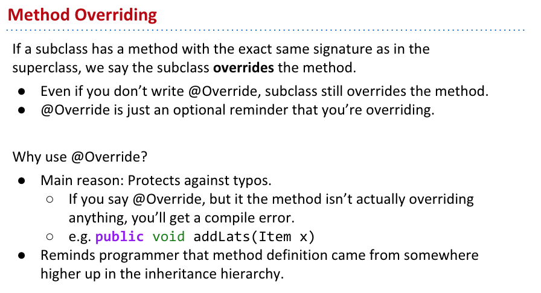

* @override主要只是帮助理解和debug ，来看这个方法是否是被重写了

**Interface Inheritance**


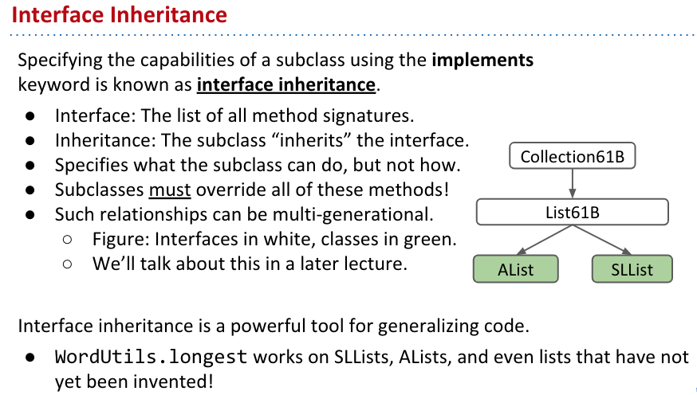


**Implementation Inheritance: Default Methods**

* default 关键词 会强迫子类继承超类的方法


**Static and Dynamic Type, Dynamic Method Selection**


每次override之后，那么相应的类型也会相应改变

#### **More Dynamic Method Selection, Overloading vs. Overriding**


* a.greet\(d\) 
* a.sniff\(d\) 重写了
* d.fatter\(d\) 重载了，并没有同样的signatures


**Interface vs. Implementation Inheritance**

* interface更像是一种抽象，只是说它是什么，也就是后面说的is的问题
* interface 的实现，则表明了具体一种方法是如何被实现的


## 9. Extends, Casting, Higher Order Functions

**Implementation Inheritance: Extends**

* implements 指的实现具体的interface
* extends 则是主要继承原因借口和类的方法和成员


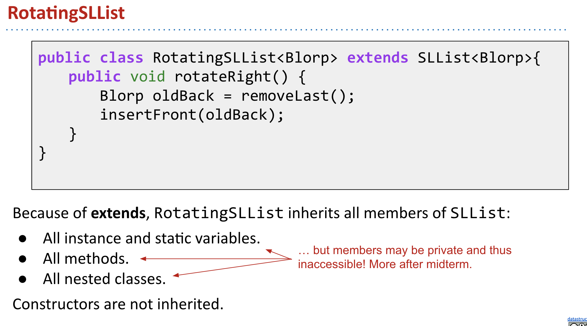


* 需要注意的是每一次重新都要确定重写的到底是哪个方法，如果没有super，会默认为之前的


* 本质上来说所以的类都继承自ojbect
* 一定要想是is还是has的问题


**Encapsulation**

* 封装这里我比较熟悉就不多说了


**Type Checking and Casting**

* 类型的强制转换是 使用（），这里比较重要，因为是根据类型来call函数的


**Dynamic Method Selection and Casting Puzzle**


**Higher Order Functions**


## 10. Subtype Polymorphism vs. HoFs

**Dynamic Method Selection Puzzle \(Online Only\)**


* 第一行，是否showdog是object? 是，所以可以
* 第二行，showdog是否可以强制转换为showdog? 可以
* 所以 sdx就是showdog，showdog有bark方法么？有
* 第四行，dog是一个dog？是
* dx是dog，dog 有 bark 方法么？有
* 第六行，还是dog的bark方法
* 第七行，dog是object? 是
* o3 是object 有bark方法么？没有


**Subtype Polymorphism**

子类 - 同一函数的输入类型为不同的类型，如int，string


* 高阶函数和子类是比较不同的
  * 高级函数依赖于其他函数进行判断
  * 子类则是自己就可以通过比较判断来确定返回的类型

**DIY Comparison**


dog是一个object，所以第三个没问题，那么同理因为传入的是dogs，也是一个object list，所以第一个也是没有问题的，第二个就有问题了，因为无法进行比较，object之间是无法比较的


因为这里出了问题， 所以不能采用打擂台的形式来确认最大的，而是要用下面的方式来寻找最大的，这里没有详细讲解是怎么实现的，而是侧重于默认Dog有这个方法。

* 具体来说就是给一个“狗链”，然后找到“狗链”中size最大的狗，然后返回这个狗


如果想要fix原有的问题怎么办，其实很类似，还是给一个狗链比较size，在c++和python里面， 实际上可以重新定义这里比较的意义，然而在java中，这个是不能实现的，只能建立一个interface。


* 这里就是创建了一个接口，而这个接口具有对Dog比较的方法，这里跟着Hug写了一下
* 然后Dog实现了这个接口，也就是说可以使用这个接口


* 好处在于会自动根据类型来实现同一方法，从而减少了实际需要的重复劳动


因为dog实现了接口，当dog没有compareTo方法的时候，Dog是不能通过编译的


DogLauncher不能编译的原因是当它call max函数的时候，给的是dogs，而max期望的时候OurComparables，因此这里会直接使得编译无法通过


**Comparables**


因为强制转换的存在，会使得代码整体比较复杂，每次都要强制转换，需要利用java自带的方法来实现，它本身自己会接入一个generic 类型，根据需要自行转换类型，但是在实际使用的时候，还是需要\(Dog\) 对Maximizer来进行强制转换


**Comparators**

根据什么来进行排序


这里如果使用高阶函数，那么需要传递非常多的comapre函数，因而非常的不方便


这里的技术比较复杂，首先需要通过内置的java.util.Comparator新建一个接口，  然后实现这个接口，在实际的操作中通过GetComparator  再对函数进行封装

```java
import java.util.Comparator;

public static class NameComparator implements Comparator<Dog> {
    public int compare(Dog a, Dog b) {
        return a.name.compareTo(b.name);
    }
}

public static Comparator<Dog> getNameComparator() {
    return new NameComparator();
}
```


## 11. Libraries, Abstract Classes, Packages

**Java Libraries**


回顾了之前学的基本所有的类型，从这里开始转向数据结构，也就是抽象数据类型


* 堆：后进先出，堆在一起


这里一快的原因是，可以将指针指到队末，从而实现和array一样的功能


Array快是因为可以对元素进行随机访问， 而链表慢是因为不能对元素进行随机访问， 最坏需要遍历整个链表来获取元素


* 类似于for s in xxx:


这里将java 和python 比较的原因是，python少了类型声明，这里想引出语言特性


对于静态语言会声明传入和传出的类型，这在编程上面非常的好，而且这会更加符合机器语言的特性

**Interfaces and Abstract Classes**


抽象类需要在继承的过程中强行重写原有的方法


**Packages**


**Extra Slides For Command Line Users \(no video\)**


## 12. Coding in the Real World, Review

12这一章主要是回顾了一下真是世界中的码农都是在搬砖，然后不是放在学习知识上就快速过掉了。

## 13. Generics, Autoboxing


ArrayList的实际类型是String，当我把它改成int的时候，就会报错，而如果是Interger就没有问题，以此为印子，来讲解实际的Reference Types

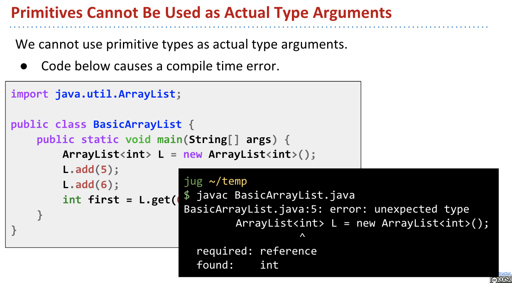

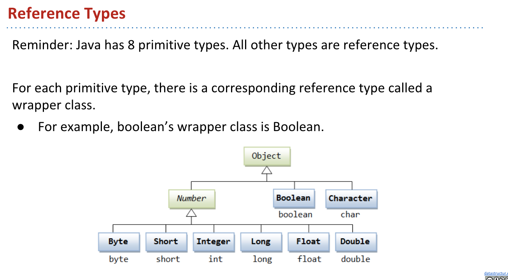

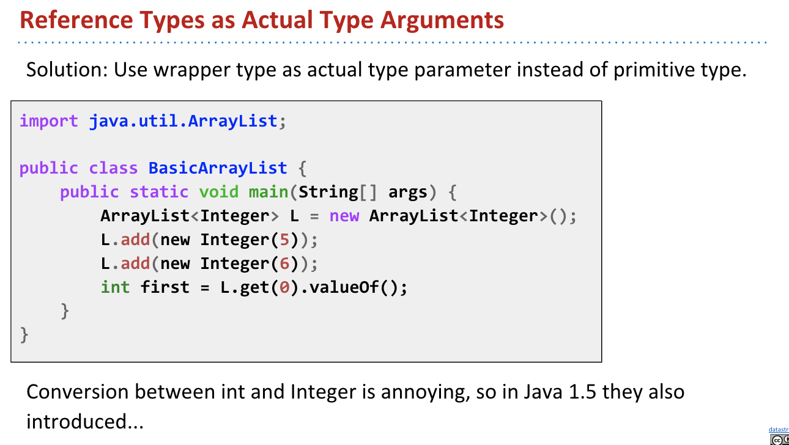

这里每次实际上给的是一个指针的地址，然后去地址里面去取元素


所谓的auto-boxing其实是指，Java会同时识别实际的指针和内容，从而不用担心实际取的，因为我们本身需要的还是内容


* Integer 实际实现了一个类，从而可以直接获取实际的内容，也就是数字，自动封装
* int 指针指向的地址，也就是被包装

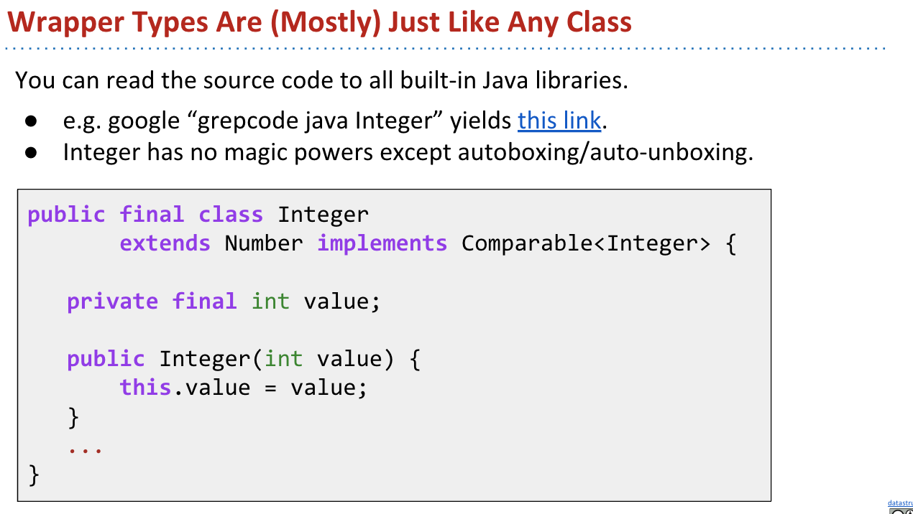


* 用窄到宽是可以的，而从宽到窄是需要强制执行的

**Immutability**


非常重要的是，String是不能改变的，这里给出来Date的类定义，可以看到里面是直接用final写死的，不能运行任何更改

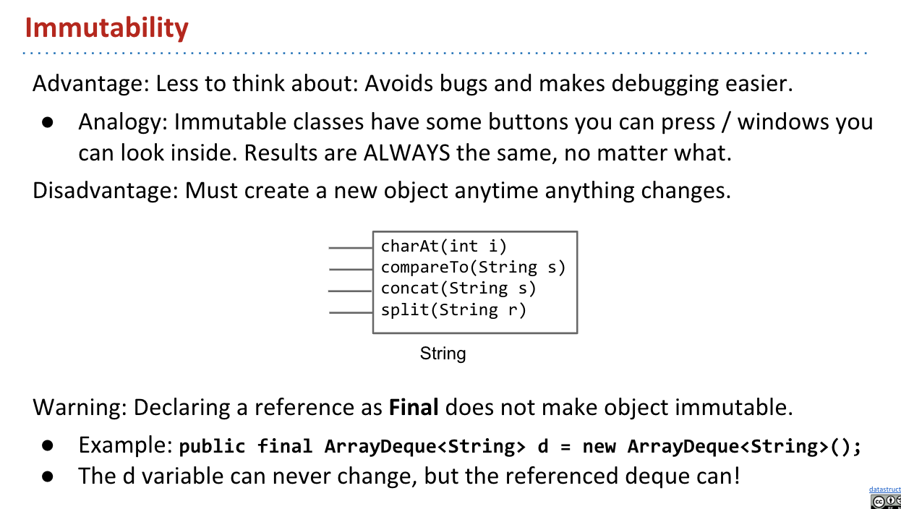

这里主要是比较了一下，总体来说这避免了String出错，还是比较好的

**Defining Generic Classes**

这节具体实现了一下


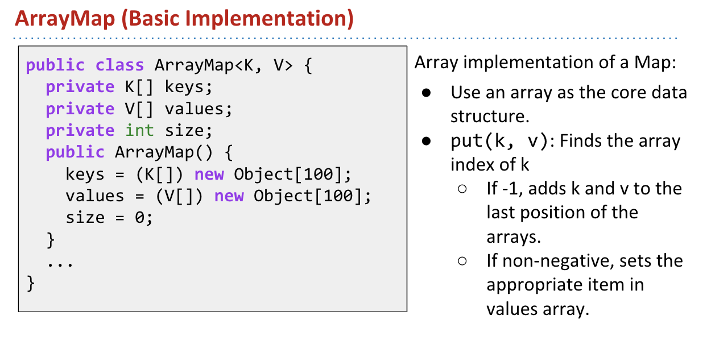

这里跟着josh实际写了一遍，整体的实现难度不是很大，难在如何使用简单的代码就直接进行实现，也就是如何对代码进行优化。

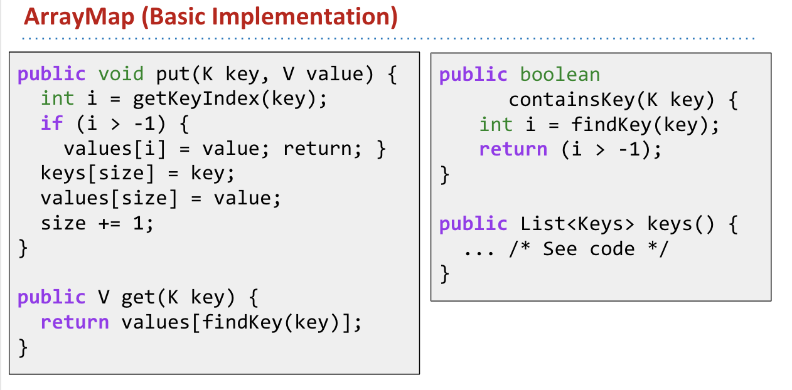


这里加入了设计理念，也就是使其具有generics的性质

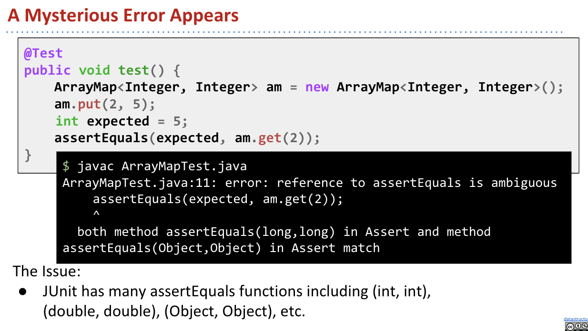

这里需要的是long，但是实际给进去的int


所以可以widen，也可以取值也就是valueOf\(\)

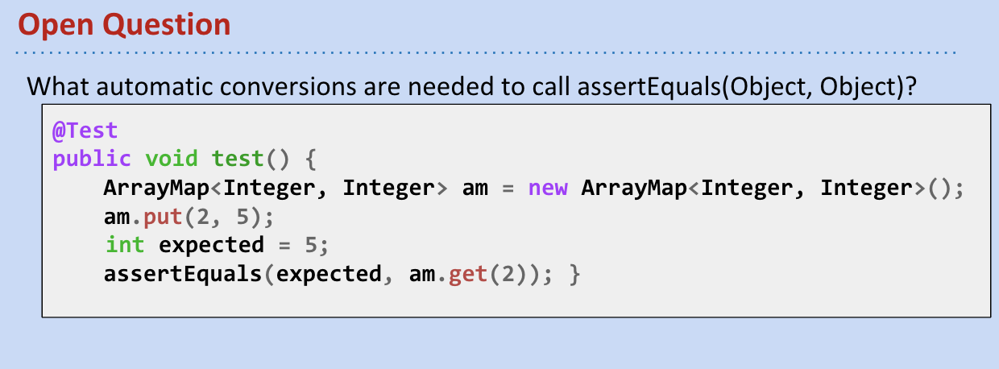

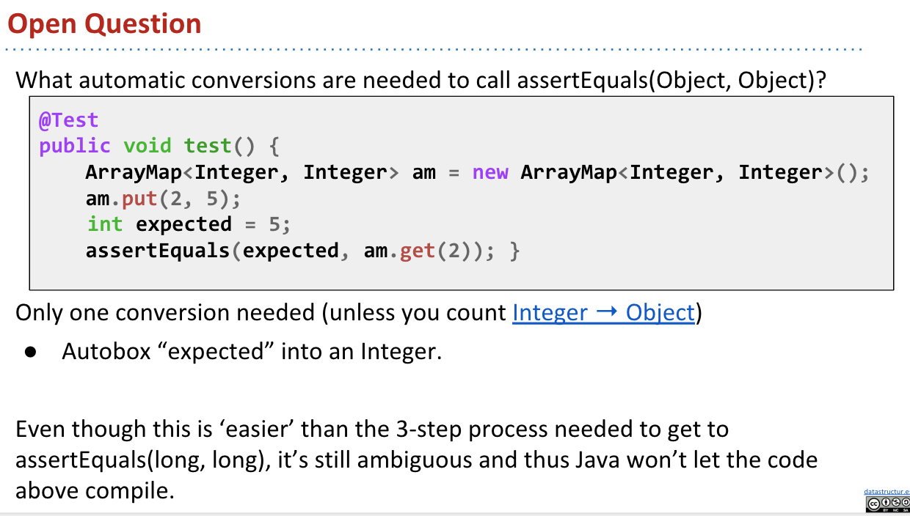

如果这里是object，这里需要自动封装，这里需要的实际知道怎么解决就行


这里给出的解决办法使通过强制转换使得两者完全相同

**Generic Methods**


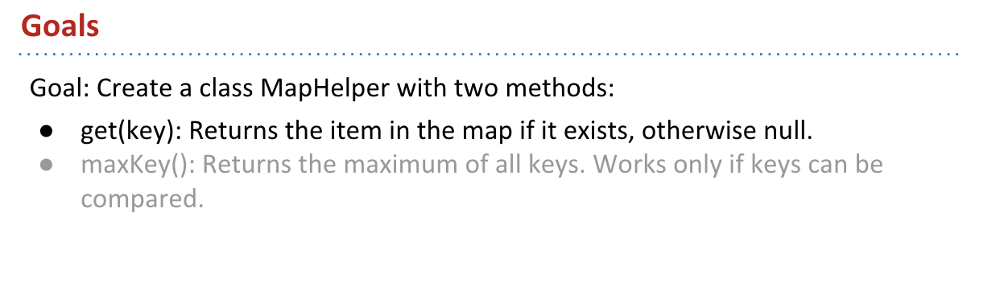


如果创建新函数，需要处理generic方法，而java只认可类似 int，String这类的默认数据结构

* 如果在类定义中，给的数据结构是&lt;X, Zerp&gt; 会破坏之前定义的结果，也不符合实际使用
* 也就是ArrayMap&lt;X, Zerp&gt;

这就引出来如何使一个类变成generic

* 也就是在函数前面加入&lt;, &gt;


这里两者直接是不能比较的，所以需要调取compareTo，但是下面的还会报错是因为，K没有compareTo的方法


所以这里需要使得K具有有可比性，也就是继承OurComparable的方法


更好的方法是，使得Comparable对所有的K都可以使用，而不是OurComparable

* 这里的extends并不是继承方法，而是拓展某个方法


## 14. Exceptions, Iterators, Iterables

**Exceptions**

主要是涉及到了一些异常出来，这个是非常非常有用的


对java来说使用的syntax事throw来捕捉所有的异常，一旦发现异常就抛出来提醒用户和开发人员


对于不同的错误是有不同的错误类型的


这里等于重写了RuntimeException，非常的简单，抛出的错误类型是Runtime


这里想说的是，如果捕捉到了异常，可以通过receivePat来解决，需要注意的是这里，这里先尝试运行receivePat，如果出现异常再eatTreat，之后再receivePat，这个思路是需要学习的。


这里说的非常好，一般逻辑是逐个排错，但是实际上这种逻辑是比较低效率的，而且人往往不能想的这么全面，所以实际上是下面的一种异常处理更加实用


直接做一堆事情，如果出现了错误再实际去检查到底错误在哪里，而不是一步步走。


一旦出现错误，对于异常的捕捉是往上游走的（图上显得是下游，其实运行逻辑是upstream failures），如果错误触底都没有找到bug，那么整个程序就会奔溃，然后直接抛出所有错误


这里的想讲的事情是，有的时候对于抛出异常的类和方法，是不能进行编译的，它需要去看这种异常是checked还是unchecked异常。


到底什么是checked 异常，比如IOException，这里只是简单给出例子，后面会详细区分


而unchecked 异常，比如Runtime 异常就没关系


总体来讲，基本的异常可以分成两类 \(在视频里面讲的\)：

* uncheck 蓝色 ：unchecked是说再人能力范围之外的，我们很难做什么区弥补
* checked 红色：checked是说在我们能力之内，比如io流找不到了之类的


编译器需要去检查所有的checked异常都被捕捉

* 一种是上面的，使用catch block
* 一种是下面的，使用利用 throws 关键词来特定一种类


如果使用了第二种方法，会使得gulgate方法和main权限一样，这样就会发生一些潜在的错误，这里的意思是如果io流出问题，那我们肯定会去main里面看，而如果改变了就不能debug了，所以这里说的意思就是『自己不要变成怪兽！』。


前面说了为什么要按这两种类来划分 - 看是否可以「人为提前避免」

**Iteration**

这里讲解了一下迭代器到底是如何运行的，本质上和python的实现基本一致


这里先给了一个例子，为什么 for \(int x : friends\) 可以运行，本质上friends是一个迭代器。


迭代器主要做两件事情：

* 判断是否有下一个，然后print，然后移动指针
* 最初指向自己


具体如何工作：

* 先指向5，然后看看有没有下一个，如果有就不断print
* 没有的话，就结束循环


左边只是右边的简写，实际再运行过程中需要A和D

首先，seer初始化为一个类型为interger的iterator，为完成这个操作，之后要看friends是否有iterator这个方法，因为friends是List，也就是List Interface 有没有iterator这个方法，也就是A.

然后，seer成功被初始化，要判断seer.hasnext\(\)，需要重新查看seer是否有hasnext，seer是一个iterator，它需要看看有没有hasNext和next的方法，也就是D

详细见下面


前面已经知道了，如果右边的想要执行需要检查什么，所以我们向其中添加了所需要的所有方法，比如iterator\(\)，hasNext\(\)，但是不幸的是，我们仍然不能运行。

这里有点过快了，因为video还是比ppt快一点


在实际写的过程中，遇到了很多问题，这里又重新回顾了一下:

* List&lt;T&gt; 继承自Iterable&lt;T&gt;，为此还必须重写hasNext和next方法
* 一般需要在新的interface里面，声明具有iterator\(\)
* 之后重新这个iterator\(\)，返回一个新的类
* 这个类必须初始化，并具有hasNext和next方法


我们自己简历了一个KeyIterator类的方法，可以自动帮我们实现所有的方法，但是它并不是一个iterator\(\)，所以后面我们需要实现iterator这个方法，也就是需要implements Iterable&lt;K&gt;，也就是说迭代器iterator，接受的必须是一个可迭代的对象iterable


这里是两个操作，很重要，还是看视频比较好，**这里修改的是 ArrayMap，让K是可迭代的**，从而再去实现迭代器。

* 如果不这样做，直接 implements Iterable &lt;K&gt;，之后只需要修改 Iterator里面，使得List&lt;K&gt; keylist = keys\(\) 即可，因为list自带iterator和iterable属性


当我们使得K是iterable之后，需要同时修改**KeyIterator**，使它变成一个可以迭代K iterable的迭代器


## 15. Packages, Access Control, Objects

这节主要想教如何自己写一个项目，然后如何导入pkg

**Packages and JAR Files**


package 需要一个namespace 来说明具体位置


创建package，再首行写好名字，.代表的目录层级


使用package可以直接使用具体地址，也可以是直接import


尽量避免使用default包，主要是为了程序的稳定性和debug考虑的


这里路径错误，需要重新确定路径


使用这种方法建立一个jar包，将所有的包进行封装，形成一个新的lib


另一种建立包的方法是使用ant、maven这些工具来建立

**Access Control**


对java来说，只要是private类型，只能在类内调用，而不能超越类


对protected来说，主要是传输限制，不能跨网络


如果什么也不加，这可以跨package


都可以跨包


这里是不能跨越不同packages的


* 我们很少继承自己的类，而更多的继承自已经写好的类
* 包是别人写的，内容都被封装，所以并没有保护


对于默认的package，如果我们这里不加public，则所有的都是私有的


* 这里先建立了一个BlackHole，之后HasHair实现了这个interface，然后CreationUtils返回来一个新的 BlackHole 类
* 第一个，hirsute是public，BlackHole也是public
* 第二个，这里的add本应该是priviate，但是它是默认package，所以还是public
* 第三个，b没有get方法，因为在interface里面只有add
* 第四个，也不能强制转换

这里想说，即使我们并不能使用实际是有的HasHair，但是我们还是可以通过call interface里面的函数，来调取函数的，所以需要很小心


也就是说，虽然一些变量是私有的，但是并不影响我们调取函数


子包是不存在的，只不过是共享了一个folder


* private 只能用在自己的类里面
* package-private 封装到包里，只能调用
* protected 不能传输

**Object Methods: Equals and toString\(\)**


如果希望可以println，就需要一个toString方法


* ==检查的是地址
* equals检查的是内容，有时候需要重写


* AssertEquals 也是比较地址


这里优化了一下，先检查地址是否一致


这里讲了一些设计原则

## 16. Encapsulation, Lists, Delegation vs. Extension


这里讲的还是挺好的

* 开发时间和可读性很重要
* 执行时间也很重要


* semantic : 内容
* syntactic : 名称


适当隐藏书籍，利用TimeSeries的形式


**ADT Implementations**


* Queue : FIFO
* Stack : LIFO


* Extension 直接继承
* Delegation 内部抽象，改写method来实现
* Adaptation 不断修正和增加原有方法，从基本的数据结构开始

**Designing ADTs**


* 继承是一个is的问题，它是一个什么什么，它就应该具备什么方法
* interface是一个has的问题，它定义了有什么


Delegation可以避免一些问题

**Views**


\*\*\*\*

