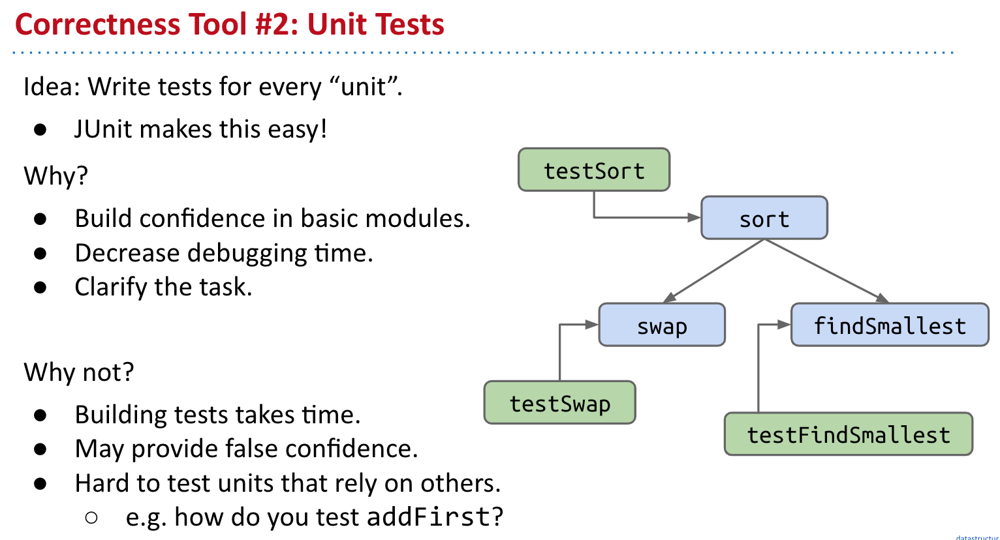

# CS 61B \(2\)

## 6. ALists, Resizing, vs. SLists

**A Last Look at Linked Lists**

* 首先回顾了之前实现的链表主要操作

* 对于链表来说因为没有相应的索引，所以要得到某个数需要遍历全链表来得到这个数，平均的时间复杂度是O\(n\)
* 如果有可能使用Array，那么这个时间复杂度就会下降到O\(1\)

**Naive Array Lists**

* Array主要的特点就是Random Access - 随机访问，在硬件中的存储是连续的地址，因而在随机访问的时候就会非常非常快，而链表所指向的地址则是离散且分散的
* 这里提到了cs61c 比较偏向底层，有时间可以看一看

在这里具体的实现是非常重要也需要自己实际去做一遍的，不要因为简单就一下跳过:

* 规律是每次新加数的index就是size，因为size是从0开始的，所以每次对size同时进行调整即可
* 通过对size的控制，就可以做到随机访问

* 因为实际控制这个array的是size，所以对于remove来说，只需要调整size，并返还现在remove的就可以
* 从一般意义上说，并不需要对之前的数进行复制，但是如果这个不是intArray，那么其实是需要对最后一位进行操作，并将值设置为Null的，因为涉及到了garbage collection

**Resizing Arrays**

因为在java以及c之类的静态语言中，每次需要申请一个定额的空间，因此会出现一个空间用尽的问题，具体来讲就是超过了整个array的长度，这时候就需要对array进行resize

具体实现来说:

* 先new一个新的array，然后将之前的数复制到这个新的array里面，然后再将新的值放去新array里

这种处理方法的弊端是慢，因为对于array来说，只对size + 1进行复制，需要进行的操作比较多，所以后面实际实现的是倍增法

* 倍增法的思路可以有效地将整体的运算时间进行下降

**Generic ALists**

通用的ArrayList，需要不指定特殊的数据种类，而根据需要来设置实际存储的值

这里比较重要的是：

* （Glorp \[\]）new Object\[8\] 这个操作，目前来说还不是很清楚，在后面的casting里面应该会涉及到

这里主要是设为null之后，Java会清空不需要的objects，从而不会使原来的指向关系和存储的数值都变成“游荡”的孤儿。

**Obscurantism in Java**

* 主要是一些编程技巧，这里应该使用Private来限制其他人对这个对象的访问

## 7. Testing

#### **Ad Hoc Testing vs. JUnit**

#### **Selection Sort**

**Simpler JUnit Tests**

#### **Testing Philosophy**

#### **More On JUnit \(Extra\)**

