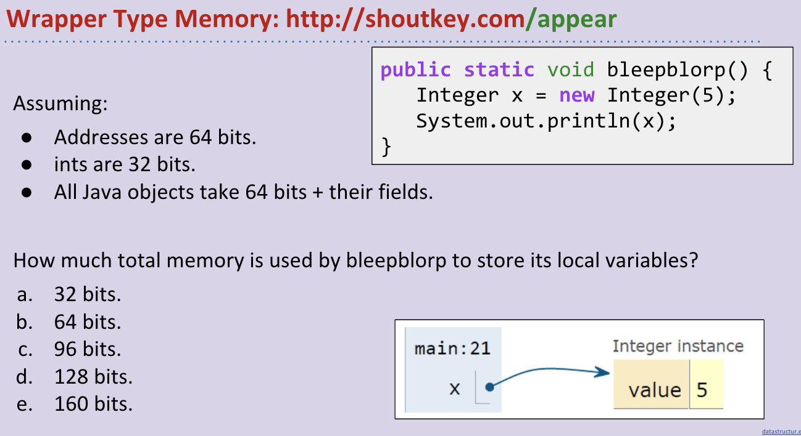

# CS 61B \(3\)

## 12. Coding in the Real World, Review

12这一章主要是回顾了一下真是世界中的码农都是在搬砖，然后不是放在学习知识上就快速过掉了。

## 13. Generics, Autoboxing

**Immutability**

**Defining Generic Classes**

**Generic Methods**

## 14. Exceptions, Iterators, Iterables

**Exceptions**

**Iteration**

