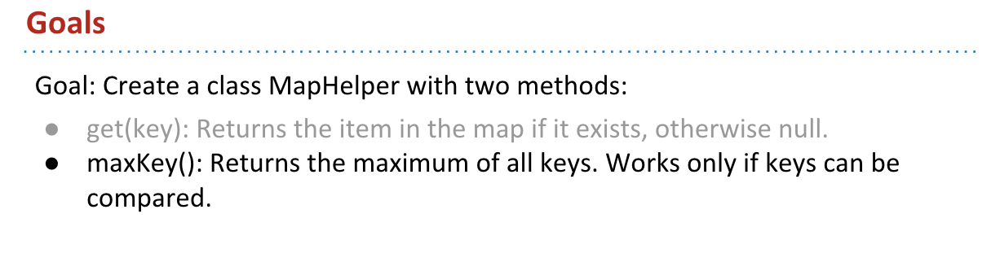

# CS 61B \(3\)

## 12. Coding in the Real World, Review

12这一章主要是回顾了一下真是世界中的码农都是在搬砖，然后不是放在学习知识上就快速过掉了。

## 13. Generics, Autoboxing

ArrayList的实际类型是String，当我把它改成int的时候，就会报错，而如果是Interger就没有问题，以此为印子，来讲解实际的Reference Types

这里每次实际上给的是一个指针的地址，然后去地址里面去取元素

所谓的auto-boxing其实是指，Java会同时识别实际的指针和内容，从而不用担心实际取的，因为我们本身需要的还是内容

* Integer 实际实现了一个类，从而可以直接获取实际的内容，也就是数字，自动封装
* int 指针指向的地址，也就是被包装

* 用窄到宽是可以的，而从宽到窄是需要强制执行的

**Immutability**

非常重要的是，String是不能改变的，这里给出来Date的类定义，可以看到里面是直接用final写死的，不能运行任何更改

这里主要是比较了一下，总体来说这避免了String出错，还是比较好的

**Defining Generic Classes**

这节具体实现了一下

这里跟着josh实际写了一遍，整体的实现难度不是很大，难在如何使用简单的代码就直接进行实现，也就是如何对代码进行优化。

这里加入了设计理念，也就是使其具有generics的性质

这里需要的是long，但是实际给进去的int

所以可以widen，也可以取值也就是valueOf\(\)

如果这里是object，这里需要自动封装，这里需要的实际知道怎么解决就行

这里给出的解决办法使通过强制转换使得两者完全相同

**Generic Methods**

如果创建新函数，需要处理generic方法，而java只认可类似 int，String这类的默认数据结构

* 如果在类定义中，给的数据结构是&lt;X, Zerp&gt; 会破坏之前定义的结果，也不符合实际使用
* 也就是ArrayMap&lt;X, Zerp&gt;

这就引出来如何使一个类变成generic

* 也就是在函数前面加入&lt;, &gt;

这里两者直接是不能比较的，所以需要调取compareTo，但是下面的还会报错是因为，K没有compareTo的方法

所以这里需要使得K具有有可比性，也就是继承OurComparable的方法

更好的方法是，使得Comparable对所有的K都可以使用，而不是OurComparable

* 这里的extends并不是继承方法，而是拓展某个方法

## 14. Exceptions, Iterators, Iterables

**Exceptions**

主要是涉及到了一些异常出来，这个是非常非常有用的

对java来说使用的syntax事throw来捕捉所有的异常，一旦发现异常就抛出来提醒用户和开发人员

对于不同的错误是有不同的错误类型的

这里等于重写了RuntimeException，非常的简单，抛出的错误类型是Runtime

这里想说的是，如果捕捉到了异常，可以通过receivePat来解决，需要注意的是这里，这里先尝试运行receivePat，如果出现异常再eatTreat，之后再receivePat，这个思路是需要学习的。

这里说的非常好，一般逻辑是逐个排错，但是实际上这种逻辑是比较低效率的，而且人往往不能想的这么全面，所以实际上是下面的一种异常处理更加实用

直接做一堆事情，如果出现了错误再实际去检查到底错误在哪里，而不是一步步走。

一旦出现错误，对于异常的捕捉是往上游走的（图上显得是下游，其实运行逻辑是upstream failures），如果错误触底都没有找到bug，那么整个程序就会奔溃，然后直接抛出所有错误

这里的想讲的事情是，有的时候对于抛出异常的类和方法，是不能进行编译的，它需要去看这种异常是checked还是unchecked异常。

到底什么是checked 异常，比如IOException，这里只是简单给出例子，后面会详细区分

而unchecked 异常，比如Runtime 异常就没关系

总体来讲，基本的异常可以分成两类 \(在视频里面讲的\)：

* uncheck 蓝色 ：unchecked是说再人能力范围之外的，我们很难做什么区弥补
* checked 红色：checked是说在我们能力之内，比如io流找不到了之类的

编译器需要去检查所有的checked异常都被捕捉

* 一种是上面的，使用catch block
* 一种是下面的，使用利用 throws 关键词来特定一种类

如果使用了第二种方法，会使得gulgate方法和main权限一样，这样就会发生一些潜在的错误，这里的意思是如果io流出问题，那我们肯定会去main里面看，而如果改变了就不能debug了，所以这里说的意思就是『自己不要变成怪兽！』。

前面说了为什么要按这两种类来划分 - 看是否可以「人为提前避免」

**Iteration**

这里讲解了一下迭代器到底是如何运行的，本质上和python的实现基本一致

这里先给了一个例子，为什么 for \(int x : friends\) 可以运行，本质上friends是一个迭代器。

迭代器主要做两件事情：

* 判断是否有下一个，然后print，然后移动指针
* 最初指向自己

具体如何工作：

* 先指向5，然后看看有没有下一个，如果有就不断print
* 没有的话，就结束循环

左边只是右边的简写，实际再运行过程中需要A和D

首先，seer初始化为一个类型为interger的iterator，为完成这个操作，之后要看friends是否有iterator这个方法，因为friends是List，也就是List Interface 有没有iterator这个方法，也就是A.

然后，seer成功被初始化，要判断seer.hasnext\(\)，需要重新查看seer是否有hasnext，seer是一个iterator，它需要看看有没有hasNext和next的方法，也就是D

详细见下面

前面已经知道了，如果右边的想要执行需要检查什么，所以我们向其中添加了所需要的所有方法，比如iterator\(\)，hasNext\(\)，但是不幸的是，我们仍然不能运行。

这里有点过快了，因为video还是比ppt快一点

我们自己简历了一个KeyIterator类的方法，可以自动帮我们实现所有的方法，但是它并不是一个iterator\(\)，所以后面我们需要实现iterator这个方法，也就是需要implements Iterable&lt;K&gt;，也就是说迭代器iterator，接受的必须是一个可迭代的对象iterable

这里是两个操作，很重要，还是看视频比较好，**这里修改的是 ArrayMap，让K是可迭代的**，从而再去实现迭代器。

* 如果不这样做，直接 implements Iterable &lt;K&gt;，之后只需要修改 Iterator里面，使得List&lt;K&gt; keylist = keys\(\) 即可，因为list自带iterator和iterable属性

当我们使得K是iterable之后，需要同时修改**KeyIterator**，使它变成一个可以迭代K iterable的迭代器

