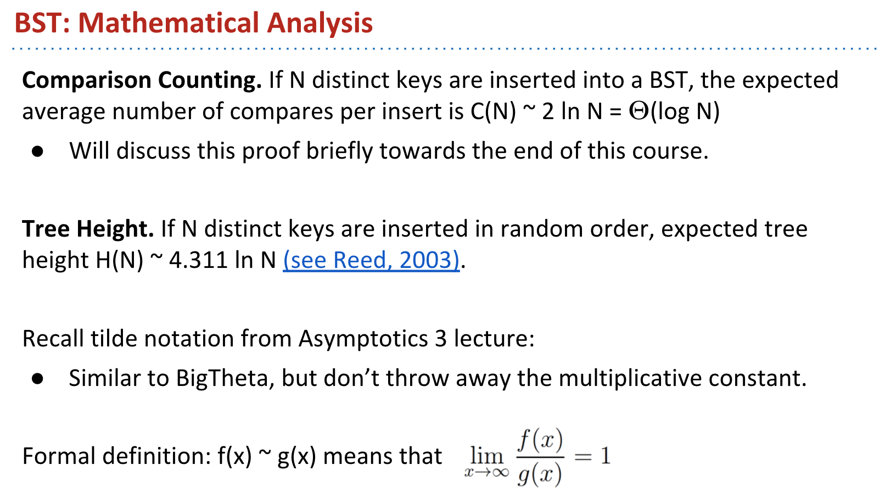

# CS 61B \(3\) - 算法分析与数据结构

## **17: Introduction to Asymptotic Analysis**

这里因为主要是将如何分析算法以及如何入门，这里我已经非常熟悉了，毕竟刷了非常长时间的算法，所以没有过度关注这里，我会在自己熟悉的地方稍微标注一下。

**Intuitive Runtime Characterizations**

这里涉及到了如何度量具体的时间花费的问题 :

* 一种是多跑几次实际测一测
* 一种是从数学的角度，来进行具体的计算给出一个公式

**Worst Case Order of Growth**

因为实际的运算时间是非常受限的，它显著地受单个计算机性能以及在某一时点计算机状态的约束：

* 所以，对于渐进性的分析，更多关注单个操作的最坏时间，忽略了低阶和常数项，因为同最高阶相比，它们实际的影响太小了

**Simplified Analysis**

**Big-Theta**

大小O主要是用来分析运算时间的上界和下界，通过夹逼得方式来获得一个大致的运行时间，这些基本都比较基础

## 18. Asymptotics II

**Example 1/2:For Loops**

**Example 3: Recursion**

**Example 4: Binary Search**

**Example 5: Mergesort**

这里主要是给出来很多例子来说明，具体的时间复杂度是如何计算的，根据个人经验，应该在刷题的时候搞清楚具体的计算复杂度，有很多递推式之类的问题不容易算出来，更应该侧重于找规律。

## 19. Asymptotics II

**Big O Notation**

**Runtime Analysis Subtleties**

**Big Omega**

**Amortized Analysis \(Intuitive\)**

**Amortized Analysis \(Rigorous\)**

**Complexity Theory \(Sneak Preview \(Extra\)**

整体来说对于算法，我已经非常熟悉了，这里就直接过了。

## 20. Disjoint Sets

并查集是非常重要的一种数据结构，主要用来解决连通性问题 - 动态连通性

因为刷过题，这里其实是找father的过程，通过fatehr实现联通集

**Quick Find**

查找操作很粗暴，就是看一下father是不是一样

* 一种是返回集合里面所有的元素，明显不行，要是10000个元素呢
* 另一种是移sets里面，和上面是一样的还是O\(L\)

其实还是需要一个同样size的Array，然后指向自己的father，father一样就是一个集合呗，这样就是O\(1\)了

这里连接需要O\(n\)的时间，太慢了

**Quick Union**

这里就是选代表，看看有没有father，赋值father就可以了，把3的father或者0的father改一下就行

这样会使得整个树非常的高，最坏还是O\(n\)，这里需要flatten这个树，包括后面的压缩路径

**Weighted Quick Union**

另一种也就是说记录实际的树大小，也就是实际需要改变的数目，然后只全部修改数目小的那一个数

这种方法使得整体时间复杂度下降到O\(logN\)，主要是每次都会对N一刀切，分成两组，比较两组的实际大小

**Path Compression**

路径压缩是最优的方法

每次isConnected的时候，遍历所有的节点，修改它们的值，从而将计算复杂度下降到lg \* N ~ 1，阿克曼函数的反函数

Reference :



最终，整体时间复杂度会下降到线性

## 21. Trees, BSTs

* 一种是直接加入额外的链接进行快速跳转

另一种就是使用二叉搜索树，binary search tree

**BST Definitions**

这里强调了具体的二叉树的定义，主要问题在于rooted trees，这里只是保证了二叉树，而不一定是二叉搜索树

二叉搜索树的特点是，左边小与中间，中间小于右边

**BST Operations**

基本操作就是 ：小了往左，大了往右走

这里主要讲解了插入的过程，先查找，如何需要可以互换或者加入新节点

* 这里提到了一些不太好的习惯，右边的那里 - arms length recursion

没儿子的，直接删掉就行

一个儿子的，指向左儿子或者右儿子，然后删掉就行

要删有两个儿子的就相对复杂了，需要和原来的节点比较，这里具体说一下

* 要删dog，应该遍历左儿子的最右边，也就是cat，然后遍历右儿子的最左边，也就是elf
* 然后选举产生谁是新的root，也就是比较一下

用到上面说到的方法就可以了

**BST Performance**

这里希望解决的避免 『spindly』tree的形式，这里少了两个视频，一个是插入节点，平均来讲还是维持了一个较好的树的高度，另一个是删除节点，它并不能很好地位置树的高度

这里josh说，尽管两者都是随机的，但是大家也不知道为什么删除操作会这样

**BST Implementation Tips**

## 22. Balanced BSTs

这里提到了一个渐进性的符号表示问题：

* Big O 算是上界，Bit Omega 算是下界，Bit Theta则是差不多多少
* 既然从基础重新学习和夯实了，那么就应该深刻地去理解，并搞懂每一个琐碎的知识点



接上面，这里就是说随机插入的话，树的高度是O\(logN\)

**Tree Rotation**

RotateLeft的意思是说，将G的右节点P作为root，然后将P的左节点给G，然后G变成P的儿子。



上面的链接具体说明了如何使用rotation来得到一个平衡的二叉树，也就是每次的插入和删除后都需要rotate一下

**B-trees / 2-3 trees / 2-3-4 trees**

这里发现的不平衡的问题来源于加入叶子，所以如果不加入叶子，就会保持整个树的高度不变，而新加入的叶子都会堆在一起

这种方式的问题在于，会有一个非常大的叶子，这会使得具体的运算非常的复杂

如果将之前的大叶子分割，并将中间的向上移动，会减少子叶的大小，但是这会使得上一个叶子变得不合理，这里新的解决方法就是，将子叶进行详细划分，这样可以进行两次比较

这里需要理解一下这个结构，如果小于o，就是n，如果大于o但小于q，就是p，不然就是rs

这种叫做Splitting-trees 也就是 2-3 tree，没分一次整体高度加一

所以整体树的高度在于logM\(N\)和log2\(N\) :

* M = 4 就是 2-3-4 tree，M = 3 就是 2-3 tree，M确定了最大的儿子数

在这里稍微小结一下，B tree的好处是什么，是限制了整个树的高度，从而使得查找非常的快，但是呢，在写入过程是比较复杂的，要看一看是不是满了，然后上下移动，这也是为什么它这么适合文件系统

**Red-Black Trees**

因为B tree实现不容易，而二叉搜索树又不是平衡的，所以从2-3 tree开始探索如何解决平衡的问题

利用2-3 tree的想法，虚拟出来一个节点，利用红色的线来连接，这就是红色部分

这里重复了一下，因为觉得这种基本概念非常重要:

* 一个点最多只有一条红线
* 从根节点到叶子的黑线是一样的
* 红线都是左倾的，所以也叫LLRB

**Maintaining Isometry Through Rotations \(Optional\)**

这里还是详细看了一下具体2-3 tree如何变成红黑树

首先写成2-3 tree 的形式，然后建立红线水平虚拟节点，然后下移

增加节点的时候，先增加叶子的元素数量，再重复之前的操作

几个小点:

* 2 - 3 tree是需要插入删除后 拆分的，而LLRB 是需要每次插入删除后旋转的

## 23. Hashing

这里的元素必须是可比较的，这个还是很重要的

这里的意思是存一个大数组，里面存的都是blooean，然后取地址直接返回T和F

从上面可以看出来整体的数组会非常的大，也就是说空间复杂度会非常高

**Binary Representations DataIndexedSet**

如果只存开头字母的话会出现重复，而且不能储存其他的字母型

这里其实是在用一种27进制来表示26个字母，使用这种方式计算出实际的值

上面这些就是实际讲了一下不同的进制问题，下面会涉及到如何将进制度和文本联系起来

* bits就是二进制的位元，一般是32或者64
* 5 bits = 32，所以32用的都是5位5位的

但对于很长的字符串，会出现的问题是会出现重复，也就是一个数字代表同样的字符串，这是这种进制无法解决的问题

上面讲了具体如何实现

这里遇到了hash table需要解决的两个问题:

* 重复哈希值
* 将任意数据转换成hash值

**Handling Collisions**

因为java对数组存储是有限的，所以肯定会有一样的数共享一个box，这里需要使用链表将box里面的值全部连起来，从而可以建立具体的hash table，也就是下面图所展示出来了的，每一个box里面有一个非常长的链表

因为使用率链表来表示同样的值，所以这里实际的查找和插入时间复杂度改变了

通过取模的方法，使得存储的值不用特别大，比如mod 27，则只会有27个box

根据load factor，为了维持一个相对较小的时间复杂度，需要根据需要增大格子数目，新的位置是原值取模得到的

这里出现的问题是 -1 的取模问题，解决办法使 floorMod 方法

这里给出来基本定义，非常重要！

* 如果是fixed size，L会不断变大，而resize，则会位置L不变，因而维持了O\(1\)

我们希望有冲突的值尽量平均分布，所以我们使用hash function来实现

**Hash Functions**

消除了小写字母转换，因为要根据ASCII码要转换，但是还是存在丢掉前两个bits的风险，因为如果是32的话，就会5位5位轮转，所以对于java来说一般都会取素数和奇数来解决

这里该用了31而不是32的原因上面已经说过了，不用使用5位了之后，c、a、t都可以使用32位来表示，然后将它们合并起来就可以完整表示一个数了

所有java对象都有- hashCode\(\)这个方法

HashSet和HashMap的区别是实现的基础数据结构不同，这里提到了非常重要的一点，就是equals和hashCode要同时重写

**Collision Resolution \(Extra\)**

* external chaining也就是链地址法，将冲突的存成一个链
* 这里提到的另一种的开地址，就是每次去寻找剩下的空地址

## 24. Heaps

只能得到最小heap，如果想要最大heap，只要取相反数

这里是一个引例，主要是用尽可能少的Memory实现

**Heaps**

还是从BST的角度来想问题，主要是保证父节点比左右儿子都小就行

最小堆要满足两个特性，一个是最小的问题，另一个是完备，也就优先填满上面的和左边的

* Insert: 随便插入也就是5的右儿子，然后再不断的sift\_up，直到不能调整，也就是只用和上面的进行调整就行
* Delete：拿最后一个盖掉最小值，然后看一下是否可以sift\_down

具体 Demo



**Tree Representations**

* 1a : 使用一个size为3的array不断指向

* 1b : 存具体的地址，这样每一个都可以有无穷多个儿子

* 1c : 一个指向儿子们，一个指向同一级的

第二种方法类似并查集，一个记录值，一个记录father

第三种方法就是常用的，root是0，第n个元素的左儿子是2n + 1，右儿子是 2n + 2

这里写了如何实现heap

heap本质还是一种tree，只是优化了获得最小值的操作

**Data Structures Summary**

## 25. Advanced Trees, incl. Geometric

**Traversals**

这里比较重要的要搞清楚前序遍历、中序遍历、后序遍历

* 前序遍历：DBACFEG 根左右
* 中序遍历：ABCDEFG 左根右
* 后序遍历：ACBEGFD 左右根

这个方法很聪明，就顺时针走，但是还是习惯了根左右这种方法

这里建立了一个generics的方法，然后定义了todo来定义每一种操作

**Level Order Traversal**

**Range Finding**

几何范围查找

这里存在一种剪枝的方法来实现

**Spatial Trees**

二维搜索，肯定是要使用坐标变换数组的，这里侧重的是如何剪枝

Demo :



具体思想，以A为原点，分割为4个方向，然后向下一个方向进行，不断进行重复，就可以避免整体扫描，从而建立了一个非常非常大的树

如果要找特定的方向，就只用向特定的方向走，而不用去遍历别的方向，这就是剪枝的意义和具体实现方法

**Optional: Tree Iterators**

