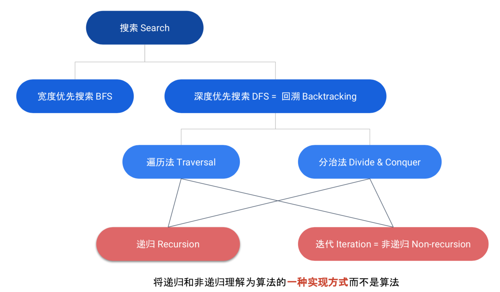

# Data Structure & Algorithms

## 0. 核心思想

这里我的主要目的是强化算法应对面试，因而所有的题解和思路都是基于面试和套路的，主要是快速熟悉算法和解决问题，非常面向工程，而非系统地学习算法，具有非常强的功利性，主要是因为时间紧迫。

**方法论**：一套模板为基础来解决所有相似的问题，并通过不断地重复以实现不断对自己的模板进行深入的理解，从而形成自己的风格并不断提高。

#### 独孤**九剑**

* **1.总决式**：最容易出卖你的，就是你的Coding Style工程师的代码长什么比脸长什么样重要
* **2.破剑式**：比O\(n\)更优的时间复杂度几乎只能是O\(logn\)的二分法
* **3.破掌式**：对于求两个变量如何组合的问题，可以循环其中一个变量，然后研究另一个变量如何变化
* **4.破枪式**：能够用BFS解决的问题，一定不要用DFS去做，因为recursion可能stack-overflow
* **5.破枪式**：碰到二叉树的问题，就想想整棵树在该问题上的结果和左右儿子在该问题上的结果直接的联系
* **6.破鞭式**：碰到让你找所有方案的题，基本可以确定是DFS，除了二叉树以外90%DFS的题，那么是排列要么是组合
* **7. 破箭式**： 哈希表的任何时间复杂度从严格意义上都是O\(Keysize\)而不是O\(1\)

## 1. 栈

### 什么是栈（Stack）？

栈（stack）是一种采用**后进先出**（LIFO，last in first out）策略的抽象数据结构。比如物流装车，后装的货物先卸，先转的货物后卸。栈在数据结构中的地位很重要，在算法中的应用也很多，比如用于非递归的遍历二叉树，计算逆波兰表达式，等等。

栈一般用一个存储结构（常用数组，偶见链表），存储元素。并用一个指针记录**栈顶位置**。**栈底位置**则是指栈中元素数量为0时的栈顶位置，也即栈开始的位置。  
栈的主要操作：

* `push()`，将新的元素压入栈顶，同时栈顶上升。
* `pop()`，将新的元素弹出栈顶，同时栈顶下降。
* `empty()`，栈是否为空。
* `peek()`，返回栈顶元素。

Python，直接使用`list`，查看栈顶用`[-1]`这样的切片操作，弹出栈顶时用`list.pop()`，压栈时用`list.append()`

### 栈的实现

```python
class Stack:
    # initialize your data structure here.
    def __init__(self):
        self.queue = []

    # @param x, an integer, push a new item into the stack
    # @return nothing
    def push(self, x):
        # Write your code here
        self.queue.append(x)

    # @return nothing, pop the top of the stack
    def pop(self):
        # Write your code here
        for x in range(len(self.queue) - 1):
            self.queue.append(self.queue.pop(0))
        self.queue.pop(0)

    # @return an integer, return the top of the stack
    def top(self):
        # Write your code here
        top = None
        for x in range(len(self.queue)):
            top = self.queue.pop(0)
            self.queue.append(top)
        return top

    # @return an boolean, check the stack is empty or not.
    def isEmpty(self):
        # Write your code here
        return self.queue == []
```

### 栈在计算机内存当中的应用

我们在程序运行时，常说的内存中的堆栈，其实就是栈空间。这一段空间存放着程序运行时，产生的各种临时变量、函数调用，一旦这些内容失去其作用域，就会被自动销毁。

函数调用其实是栈的很好的例子，后调用的函数先结束，所以为了调用函数，所需要的内存结构，栈是再合适不过了。在内存当中，**栈从高地址不断向低地址扩展**，随着程序运行的层层深入，栈顶指针不断指向内存中更低的地址。

## 2. 队列

### 什么是队列（Queue）？

队列（queue）是一种采用**先进先出**（FIFO，first in first out）策略的抽象数据结构。比如生活中排队，总是按照先来的先服务，后来的后服务。队列在数据结构中举足轻重，其在算法中应用广泛，**最常用的就是在宽度优先搜索\(BFS）中，记录待扩展的节点**。

队列内部存储元素的方式，一般有两种，**数组**（array）和**链表**（linked list）。两者的最主要区别是：

* 数组对**随机访问**有较好性能。
* 链表对**插入**和**删除**元素有较好性能。

Python中，使用`collections.deque`，双端队列。

队列的主要操作有：

* `add()`队尾追加元素
* `poll()`弹出队首元素
* `size()`返回队列长度
* `empty()`判断队列为空

### 队列的实现

```python
class MyQueue:

    def __init__(self):
        self.stack1 = []
        self.stack2 = []

    def adjust(self):
        if len(self.stack2) == 0:
            while len(self.stack1) != 0:
                self.stack2.append(self.stack1.pop())
                
    def push(self, element):
        self.stack1.append(element)

    def top(self):
        self.adjust()
        return self.stack2[len(self.stack2) - 1]

    def pop(self):
        self.adjust()
        return self.stack2.pop()
```

## 3. 哈希表

哈希表（Hash Table，也叫散列表），是根据关键码值 \(Key-Value\) 而直接进行访问的数据结构。也就是说，它通过把关键码值映射到表中一个位置来访问记录，以加快查找的速度。哈希表的实现主要需要解决两个问题，哈希函数和冲突解决。

### 哈希函数 {#哈希函数}

哈希函数也叫散列函数，它对不同的输出值得到一个固定长度的消息摘要。理想的哈希函数对于不同的输入应该产生不同的结构，同时散列结果应当具有同一性（输出值尽量均匀）和雪崩效应（微小的输入值变化使得输出值发生巨大的变化）。  


## Heap

## 数组

## 链表

## 5. 二叉树专题



### 1. 遍历\(Traverse\)

遍历（Traversal），顾名思义，就是**通过某种顺序，一个一个访问一个数据结构中的元素**。比如我们如果需要遍历一个数组，无非就是要么从前往后，要么从后往前遍历。但是对于一棵二叉树来说，他就有很多种方式进行遍历：

1. 层序遍历（Level order）
2. 先序遍历（Pre order）
3. 中序遍历（In order）
4. 后序遍历（Post order）

我们在之前的课程中，已经学习过了二叉树的层序遍历，也就是使用 BFS 算法来获得二叉树的分层信息。通过 BFS 获得的顺序我们也可以称之为 BFS Order。而剩下的三种遍历，都需要通过深度优先搜索的方式来获得。而这一小节中，我们将讲一下通过深度优先搜索（DFS）来获得的节点顺序，

**a. 先序遍历（又叫先根遍历、前序遍历）**

首先访问根结点，然后遍历左子树，最后遍历右子树。**遍历左、右子树时，仍按先序遍历**。若二叉树为空则返回。

该过程可简记为**根左右**，注意该过程是**递归的**。如图先序遍历结果是：**ABDECF**。  


```python
# Version 0: Recursion 
"""
Definition of TreeNode:
class TreeNode:
    def __init__(self, val):
        this.val = val
        this.left, this.right = None, None
"""
class Solution:
    """
    @param root: The root of binary tree.
    @return: Preorder in ArrayList which contains node values.
    """
    def preorderTraversal(self, root):
        self.results = []
        self.traverse(root)
        return self.results
        
    def traverse(self, root):
        if root is None:
            return
        self.results.append(root.val)
        self.traverse(root.left)
        self.traverse(root.right)

# Version 1: Non-Recursion  
"""
Definition of TreeNode:
class TreeNode:
    def __init__(self, val):
        this.val = val
        this.left, this.right = None, None
"""
class Solution:
    """
    @param root: The root of binary tree.
    @return: Preorder in list which contains node values.
    """
    def preorderTraversal(self, root):
        if root is None:
            return []
        stack = [root]
        preorder = []
        while stack:
            node = stack.pop()
            preorder.append(node.val)
            if node.right:
                stack.append(node.right)
            if node.left:
                stack.append(node.left)
        return preorder
```

**b. 中序遍历（又叫中根遍历）**

首先遍历左子树，然后访问根结点，最后遍历右子树。**遍历左、右子树时，仍按中序遍历**。若二叉树为空则返回。简记为**左根右**。  
上图中序遍历结果是：**DBEAFC**。

```python
"""
Definition of TreeNode:
class TreeNode:
    def __init__(self, val):
        self.val = val
        self.left, self.right = None, None
"""
#1. Recursion
class Solution:
    """
    @param root: A Tree
    @return: Inorder in ArrayList which contains node values.
    """
    def inorderTraversal(self, root):
        # write your code here
        self.result = []
        self.traverse(root)
        return self.result
        
    def traverse(self, root) :
        if root is None :
            return 
        
        self.traverse(root.left)
        self.result.append(root.val)
        self.traverse(root.right)

#2.traverse
class Solution:
    """
    @param root: A Tree
    @return: Inorder in ArrayList which contains node values.
    """
    def inorderTraversal(self, root):
        if root is None :
            return []
            
        stack, result = [], []
        
        while root :
            stack.append(root)
            root = root.left
            
        while stack :
            current_node = stack.pop()
            result.append(current_node.val)
            
            if current_node.right :
                current_node = current_node.right 
                while current_node :
                    stack.append(current_node)
                    current_node = current_node.left
                    
        return result
```

**c. 后序遍历（又叫后根遍历）**

首先遍历左子树，然后遍历右子树，最后访问根结点。**遍历左、右子树时，仍按后序遍历**。若二叉树为空则返回。简记为**左右根**。  
上图后序遍历结果是：**DEBFCA**。

```python
"""
Definition of TreeNode:
class TreeNode:
    def __init__(self, val):
        self.val = val
        self.left, self.right = None, None
"""
# 1. Recursion
# class Solution:
#     """
#     @param root: A Tree
#     @return: Postorder in ArrayList which contains node values.
#     """
#     def postorderTraversal(self, root):
#         # write your code here
#         self.result = []
#         self.traverse(root)
#         return self.result
        
#     def traverse(self, root) :
#         if root is None :
#             return
        
#         self.traverse(root.left)
#         self.traverse(root.right)
#         self.result.append(root.val)
        
# 2. Traverse
class Solution:
    """
    @param root: A Tree
    @return: Postorder in ArrayList which contains node values.
    """
    def postorderTraversal(self, root):
        # 非递归
        result = []
        stack = []

        curNode = root
        while stack or curNode:
            # 能左就左，否则向右一步
            while curNode:
                stack.append(curNode)
                curNode = curNode.left if curNode.left else curNode.right

            # pop stack，添加到结果
            curNode = stack.pop()
            result.append(curNode.val)

            # 栈不空且当前节点是栈顶的左子节点，转到其右兄弟，否则退栈
            if stack and stack[-1].left == curNode:
                curNode = stack[-1].right
            else:
                curNode = None

        return result
```

### 2. 分治法\(Divide & Conquer）

分治法（Divide & Conquer Algorithm）是说将一个大问题，拆分为2个或者多个小问题，当小问题得到结果之后，合并他们的结果来得到大问题的结果。

#### 为什么二叉树的问题适合使用分治法？

在一棵二叉树（Binary Tree）中，如果将整棵二叉树看做一个大问题的话，那么根节点（Root）的左子树（Left subtree）就是一个小问题，右子树（Right subtree）是另外一个小问题。这是一个天然就帮你完成了“分”这个步骤的数据结构。

**小结两者之间的关系**

分治法（Divide & Conquer）与遍历法（Traverse）是两种常见的递归（Recursion）方法。从程序实现角度分治法的递归函数，通常有一个`返回值`，遍历法通常没有。

* **分治法解决问题的思路**
  * 先让左右子树去解决同样的问题，然后得到结果之后，再整合为整棵树的结果。
* **遍历法解决问题的思路**
  * 通过前序/中序/后序的某种遍历，游走整棵树，通过一个全局变量或者传递的参数来记录这个过程中所遇到的点和需要计算的结果。

### 3. 递归

**什么是递归 \(Recursion\) ？**

很多书上会把递归（Recursion）当作一种算法。事实上，递归是包含两个层面的意思的：

1. 一种由大化小，由小化无的解决问题的算法。类似的算法还有动态规划（Dynamic Programming）。
2. 一种程序的实现方式。这种方式就是一个函数（Function / Method / Procedure）自己调用自己。

与之对应的，有非递归（Non-Recursion）和迭代法（Iteration），你可以认为这两个概念是一样的概念（番茄和西红柿的区别）。不需要做区分。

**什么是搜索 \(Search\)？**

搜索分为深度优先搜索（Depth First Search）和宽度优先搜索（Breadth First Search），通常分别简写为 DFS 和 BFS。搜索是一种类似于枚举（Enumerate）的算法。比如我们需要找到一个数组里的最大值，我们可以采用枚举法，因为我们知道数组的范围和大小，比如经典的打擂台算法：

```python
int max = nums[0];
for i in range(len(nums)) :
    max = Math.max(max, nums[i]);
```

枚举法通常是你知道循环的范围，然后可以用几重循环就搞定的算法。比如我需要找到 所有 x^2 + y^2 = K 的整数组合，可以用两重循环的枚举法：

```python
// 不要在意这个算法的时间复杂度
for x in range(k + 1) :
    for y in range(k + 1) :
        if x*x + y*y == k :
            print (x, '-', y)
```

而有的问题，比如求 N 个数的全排列，你可能需要用 N 重循环才能解决。这个时候，我们就倾向于采用递归的方式去实现这个变化的 N 重循环。这个时候，我们就把算法称之为`搜索`。因为你已经不能明确的写出一个不依赖于输入数据的多重循环了。

通常来说 DFS 我们会采用递归的方式实现（当然你强行写一个非递归的版本也是可以的），而 BFS 则无需递归（使用队列 Queue + 哈希表 HashMap就可以）。**所以我们在面试中，如果一个问题既可以使用 DFS，又可以使用 BFS 的情况下，一定要优先使用 BFS。**因为他是非递归的，而且更容易实现。

**什么是回溯\(Backtracking\)？**

有的时候，深度优先搜索算法（DFS），又被称之为回溯法，所以你可以完全认为回溯法，就是深度优先搜索算法。在我的理解中，回溯实际上是深度优先搜索过程中的一个步骤。比如我们在进行全子集问题的搜索时，假如当前的集合是 {1,2} 代表我正在寻找以 {1,2}开头的所有集合。那么他的下一步，会去寻找 {1,2,3}开头的所有集合，然后当我们找完所有以 {1,2,3} 开头的集合时，我们需要把 3 从集合中删掉，回到 {1,2}。然后再把 4 放进去，寻找以 {1,2,4} 开头的所有集合。这个把 3 删掉回到 {1,2} 的过程，就是回溯。

```text
subset.add(nums[i]);
subsetsHelper(result, subset, nums, i + 1);
subset.remove(len(nums) - 1) // 这一步就是回溯
```

### 4. AVL Tree

平衡二叉树（Balanced Binary Tree，又称为AVL树，**有别于AVL算法**）是二叉树中的一种特殊的形态。二叉树当且仅当满足如下两个条件之一，是平衡二叉树：

* 空树。
* **左右子树高度差绝对值不超过1**且**左右子树都是平衡二叉树**。


节点旁边的数字表示左右两子树高度差。\(a\)是AVL树，\(b\)不是，\(b\)中5节点不满足AVL树，故4节点，3节点都不再是AVL树。

#### AVL树的高度为 O\(logN\)

当AVL树有N个节点时，高度为O\(logN\)O\(logN\)。为何？  
试想一棵满二叉树，每个节点左右子树高度相同，随着树高的增加，叶子容量指数暴增，故树高一定是O\(logN\)O\(logN\)。而相比于满二叉树，**AVL树仅放宽一个条件，允许左右两子树高度差1**，当树高足够大时，可以把1忽略。如图是高度为9的最小AVL树，若节点更少，树高绝不会超过8，也即为何AVL树高会被限制到O\(logN\)O\(logN\)，因为**树不可能太稀疏**。严格的数学证明复杂,略去。  


为何普通二叉树不是O\(logN\)？这里给出最坏的单枝树，若单枝扩展，则树高为O\(N\)  


#### AVL树有什么用？

若[二叉搜索树](http://www.jiuzhang.com/tutorial/algorithm/399)是AVL树，则最大作用是保证查找的**最坏**时间复杂度为O\(logN\)。而且较浅的树对插入和删除等操作也更快。

### 5. BST Tree

二叉搜索树（Binary Search Tree，又名排序二叉树，二叉查找树，通常简写为BST）定义如下：

**空树**或是**具有下列性质的二叉树**：

1. 若左子树不空，则左子树上所有节点值均小于或等于它的根节点值
2. 若右子树不空，则右子树上所有节点值均大于或等于它的根节点值
3. 左、右子树也为二叉搜索树


#### BST 的特性

* 按照[中序遍历](http://www.jiuzhang.com/tutorial/algorithm/405#)（inorder traversal）打印各节点，会得到**由小到大**的顺序。
* 在BST中搜索某值的平均时间复杂度为O\(logN\)，其中N为节点个数。类似二分查找（binary search），将待寻值与节点值比较，若不相等，则**通过是小于还是大于，可断定该值只可能在左子树还是右子树，继续向该子树搜索**。故一次比较平均排除半棵树。

#### BST 的作用

* 通过中序遍历，可快速得到升序节点列表。
* 在BST中查找元素，只需要**平均**O\(logN\)的时间，这与有序数组（sorted array）一样。但BST**平均**log\(N\)即可实现元素的增加和删除，有序数组却需要O\(N\)。

BST是一种**重要**且**基本**的结构，其相关题目也十分经典，并延伸出很多算法。  
在BST之上，有许多高级且有趣的变种,以解决各式各样的问题，例如:

* 用于数据库或各语言标准库中索引的[红黑树](https://baike.baidu.com/item/%E7%BA%A2%E9%BB%91%E6%A0%91/2413209?fr=aladdin)
* 提升二叉树性能底线的[伸展树](https://baike.baidu.com/item/%E4%BC%B8%E5%B1%95%E6%A0%91/7003945?fr=aladdin)
* 优化红黑树的[AA树](https://baike.baidu.com/item/AA%E6%A0%91/9246960?fr=aladdin)
* 随机插入的[树堆](https://baike.baidu.com/item/Treap?fromtitle=%E6%A0%91%E5%A0%86&fromid=4478083)
* 机器学习kNN算法的高维快速搜索[k-d树](https://baike.baidu.com/item/kd-tree/2302515)


