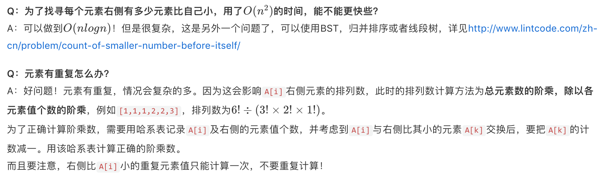

# Data Structure & Algorithms \(7\) - DFS Permutation & Graph

全排列问题是“排列式”深度优先搜索问题的鼻祖。很多搜索的问题都可以用类似全排列的代码来完成。包括我们前面学过的全子集问题的一种做法。

#### 全排列搜索问题

* 问题模型: 求出所有满足条件的“排列”
* 判断条件: 组合中的元素是顺序“相关”的
* 时间复杂度: 与 n! 相关。

这一小节中我们需要掌握：

## 0. 下一排列

#### 问题描述

给定一个若干整数的排列，给出按整数大小进行字典序从小到大排序后的下一个排列。若没有下一个排列，则输出字典序最小的序列。

例如`1,2,3` → `1,3,2`，`3,2,1` → `1,2,3`，`1,1,5 → 1,5,1`

原题链接：  
[http://www.lintcode.com/problem/next-permutation-ii/](http://www.lintcode.com/zh-cn/problem/next-permutation-ii/#)  
[http://www.lintcode.com/problem/next-permutation/](http://www.lintcode.com/zh-cn/problem/next-permutation/#)  
（两题类似，一个要求原地修改，一个要求返回新的排列）

#### 算法描述

如果上来想不出方法，可以试着找找规律，我们关注的重点应是原数组末尾。

从末尾往左走，如果一直递增，例如`...9,7,5`，那么下一个排列一定会牵扯到左边更多的数，直到一个非递增数为止，例如`...6,9,7,5`。对于原数组的变化就只到`6`这里，和左侧其他数再无关系。`6`这个位置会变成`6`**右侧所有数中比`6`大的最小的数**，而`6`会进入最后3个数中，且后3个数必是**升序数组**。

所以算法步骤如下：

* 从右往左遍历数组`nums`，直到找到一个位置`i`，满足`nums[i] > nums[i - 1]`或者`i`为`0`。
* `i`不为0时，用`j`再次从右到左遍历`nums`，寻找第一个`nums[j] > nums[i - 1]`。而后交换`nums[j]`和`nums[i - 1]`。**注意，满足要求的`j`一定存在！且交换后`nums[i]`及右侧数组仍为降序数组**。
* 将`nums[i]`及右侧的数组翻转，使其升序。

```python
class Solution:
    def nextPermutation(self, nums):
    	# 倒序遍历
        for i in range(len(nums) - 1, -1, -1):
            # 找到第一个数值变小的点，这样代表右边有大的可以和它换，而且可以保证是next permutation
            if i > 0 and nums[i] > nums[i - 1]:
                # 找到后再次倒序遍历，找到第一个比刚才那个数值大的点，互相交换
                for j in range(len(nums) - 1, i - 1, -1):
                    if nums[j] > nums[i - 1]:
                        nums[j], nums[i - 1] = nums[i - 1], nums[j]
                        # 因为之前保证了，右边这段数从右到左是一直变大的，所以直接双指针reverse
                        left, right = i, len(nums) - 1
                        while left <= right:
                            nums[left], nums[right] = nums[right], nums[left]
                            left += 1 
                            right -= 1 
                        return nums
    	# 如果循环结束了，表示没找到能替换的数，表示序列已经是最大的了
        nums.reverse()
        return nums
```

#### 需要注意的事项

* **i为0怎么办？**
  * i为0说明整个数组是降序的，直接翻转整个数组即可。
* **有重复元素怎么办？**
  * 在遍历时只要严格满足`nums[i] > nums[i - 1]`和`nums[j] > nums[i - 1]`就不会有问题。
* **元素过少是否要单独考虑？**
  * 当元素个数小于等于1个时，可以直接返回。

## 1. 普通的全排列问题

全排列问题和组合问题的代码模板基本一样，差异在于全排列需要用每次遍历全数组，因此需要用visited或者哈希表来控制不要访问这个元素。而组合天然可以使用index来控制不回头即可。

```python
class Solution:
    """
    @param: nums: A list of integers.
    @return: A list of permutations.
    """
    def permute(self, nums):
        # 初始化
        self.results = []
        self.dfs([], nums)
        return self.results
        
    def dfs(self, path, nums) :
        # 达到长度
        if len(path) == len(nums) : 
            self.results.append(path[:])
            return
        
        for i in range(len(nums)) :
            # 没有visited
            if nums[i] not in path :
                # 回溯
                path.append(nums[i])
                self.dfs(path, nums)
                path.pop()
```

## 2. 有重复的全排列问题

全排列问题是一样的，基本几个要点:

* 先排序，不影响时间复杂度
* 使用visited来记录是否走过
* 使用和前一个元素的比较方法来判断是否重复的数字走过

```python
class Solution:
    """
    @param: :  A list of integers
    @return: A list of unique permutations
    """

    def permuteUnique(self, nums):
        self.results = []
        # 引入Visited来记录
        self.visited = {i: False for i in range(len(nums))}
        self.dfs([], sorted(nums))
        return self.results
        
    def dfs(self, path, nums) :
        if len(path) == len(nums) :
            self.results.append(path[:])
            return
        
        for i in range(len(nums)) :
            if self.visited[i] :
                continue
            # 选代表，只选符合的
            if i != 0 and nums[i] == nums[i - 1] and self.visited[i - 1]:
                continue
            # 回溯
            self.visited[i] = True
            path.append(nums[i])
            self.dfs(path, nums)
            path.pop()
            self.visited[i] = False    
```

## 3. 非递归的全排列算法

#### 基本思路

非递归的全排列，采用的是**迭代**方式，在[如何求下一个排列](http://www.jiuzhang.com/tutorial/algorithm/439)中，我们讲过如何求下一个排列，那么我们**只需要不断调用这个`nextPermutation`方法即可**。

**一些可以做得更细致的地方**：

* 为了确定何时结束，建议在迭代前，先对输入`nums`数组进行升序排序，迭代到降序时，就都找完了。有心的同学可能还记得在`nextPermutation`当中，当且仅当数组完全降序，那么从右往左遍历的指针`i`**最终会指向0**。所以可以为`nextPermutation`带上布尔返回值，当`i`为0时，返回`false`，表示找完了。要注意，排序操作在这样一个NP问题中，消耗的时间几乎可以忽略。
* 当数组长度为1时，`nextPermutation`会直接返回`false`；当数组长度为0时，`nextPermutation`中`i`会成为-1，所以返回`false`的条件可以再加上`i`为`-1`。

```python
class Solution:
    """
    @param nums: A list of Integers.
    @return: A list of permutations.
    """
    def permute(self, nums):
        if nums is None:
            return []
        if nums == []:
            return [[]]
        nums = sorted(nums)
        permutation = []
        stack = [-1]
        permutations = []
        while len(stack):
            index = stack.pop()
            index += 1
            while index < len(nums):
                if nums[index] not in permutation:
                    break
                index += 1
            else:
                if len(permutation):
                    permutation.pop()
                continue

            stack.append(index)
            stack.append(-1)
            permutation.append(nums[index])
            if len(permutation) == len(nums):
                permutations.append(list(permutation))
        return permutations
```

## 4.第几个排列

#### 题目描述

给出一个不含重复数字的排列，求这些数字的所有排列按字典序排序后该排列的编号，编号从1开始。例如排列`[1,2,4]`是第`1`个排列。  
[http://www.lintcode.com/zh-cn/problem/permutation-index/](http://www.lintcode.com/zh-cn/problem/permutation-index/)

#### 算法描述

只需计算有多少个排列在当前排列`A`的前面即可。如何算呢?举个例子，`[3,7,4,9,1]`，在它前面的必然是**某位置`i`对应元素比原数组小，而`i`左侧和原数组一样**。也即`[3,7,4,1,X]`，`[3,7,1,X,X]`，`[3,1或4,X,X,X]`，`[1,X,X,X,X]`。

而第`i`个元素，比原数组小的情况有多少种，其实就是`A[i]`右侧有多少元素比`A[i]`小，乘上`A[i]`右侧元素全排列数，即`A[i]`右侧元素数量的阶乘。`i`从右往左看，比当前`A[i]`小的右侧元素数量分别为`1,1,2,1`，所以最终字典序在当前`A`之前的数量为1×1!+1×2!+2×3!+1×4!=39，故当前`A`的字典序为40。

**具体步骤：**

* 用`permutation`表示当前阶乘，初始化为1,`result`表示最终结果，初始化为0。由于最终结果可能巨大，所以用`long`类型。
* `i`从右往左遍历`A`，循环中计算`A[i]`右侧有多少元素比`A[i]`小，计为`smaller`，`result += smaller * permutation`。之后`permutation *= A.length - i`，为下次循环`i`左移一位后的排列数。
* 已算出多少字典序在`A`之前，返回`result+1`。

```python
class Solution:
    """
    @param n: n
    @param k: the k-th permutation
    @return: the k-th permutation
    """
    def getPermutation(self, n, k):
        fac = [1]
        for i in range(1, n + 1):
            fac.append(fac[-1] * i)
        
        elegible = range(1, n + 1)
        per = []
        for i in range(n):
            digit = (k - 1) / fac[n - i - 1]
            per.append(elegible[digit])
            elegible.remove(elegible[digit])
            k = (k - 1) % fac[n - i - 1] + 1
        return "".join([str(x) for x in per])
```



## 5. 补充

### N皇后问题

#### 33. N-Queens

本质还是一道permutation问题，选出符合条件的permutation 比如 \[0,1,2,3\]，然后分列计算，第一列的第0个，第二列的第一个之类的。整体题的难度不是很大，但是要能够搞清楚行和列的计算比较复杂。

```python
class Solution:
    """
    @param: n: The number of queens
    @return: All distinct solutions
    """
    def solveNQueens(self, n):
        self.boards = []
        self.visited = { 'col': set(),
                         'sum': set(),
                         'diff': set()}
        self.dfs(n, [])
        return self.boards
        
    def dfs(self, n, permutation) :
        if len(permutation) == n :
            self.boards.append(self.draw(permutation)) 
            return
        
        row = len(permutation) 
        
        for col in range(n) :
            if not self.is_valid(permutation, col) :
                continue
            permutation.append(col)
            self.visited['col'].add(col)
            self.visited['sum'].add(row + col)
            self.visited['diff'].add(row - col)
            self.dfs(n, permutation)
            self.visited['col'].remove(col)
            self.visited['sum'].remove(row + col)
            self.visited['diff'].remove(row - col)            
            permutation.pop()
        
    def draw(self, permutation) :
        board = []
        n = len(permutation)
        for col in permutation :
            list_str = ''.join(['Q' if c == col else '.' for c in range(n)])
            board.append(list_str)
        return board
        
    def is_valid(self, permutation, col) :
        
        row = len(permutation)
        
        if col in self.visited['col'] :
            return False
        if row + col in self.visited['sum'] :
            return False
        if row - col in self.visited['diff'] :
            return False
        return True
```

### word四兄弟

#### 582. Word Break II

```python
class Solution:
    """
    @param: s: A string
    @param: wordDict: A set of words.
    @return: All possible sentences.
    """
    def wordBreak(self, s, wordDict):
        return self.dfs(s, wordDict, {})
        
    def dfs(self, s, wordDict, memo) :
        # 记忆化搜索
        if s in memo :
            return memo[s]
        # 递归的出口
        if len(s) == 0 :
            return []
            
        partitions = []    
        # 每一次遍历整个字符串    
        for i in range(1, len(s)) :
            prefix = s[:i]
            # 直到找到第一个在字典里的字符
            if prefix not in wordDict :
                continue
            # 继续对后面字符进行寻找
            sub_partitions = self.dfs(s[i:], wordDict, {})
            # 前缀加上后面所以的可能性
            for partition in sub_partitions :
                partitions.append(prefix + ' ' + partition)
        # corner case - 整个字符串在dict里
        if s in wordDict :
            partitions.append(s)
        # 记忆化搜索    
        memo[s] = partitions 
        
        return partitions
```


