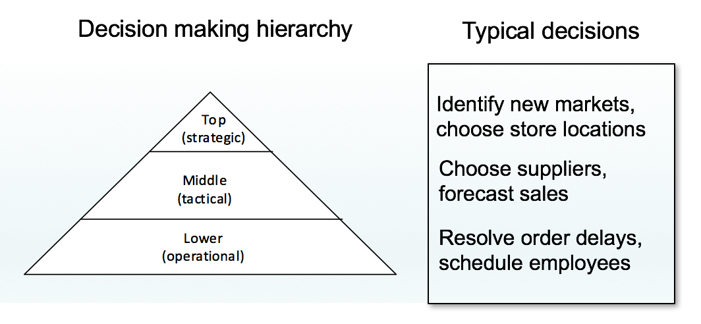
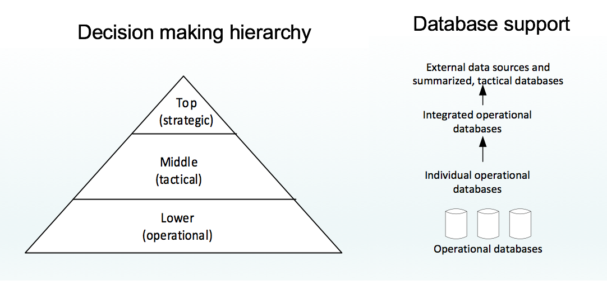
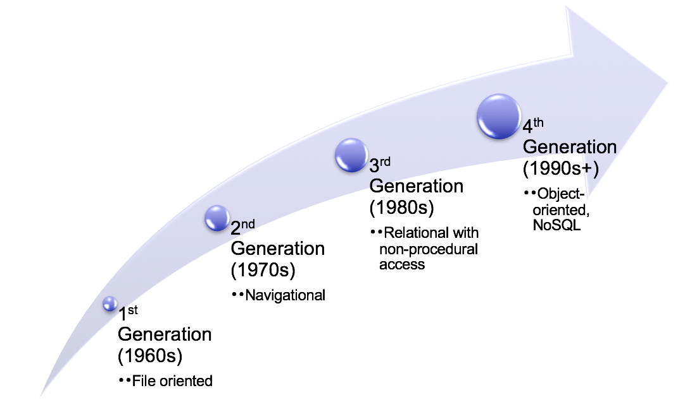
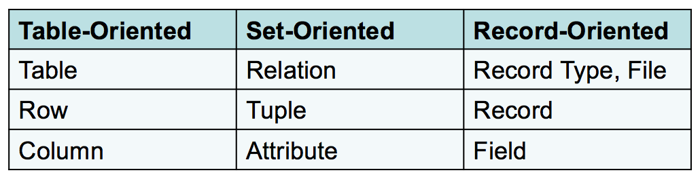
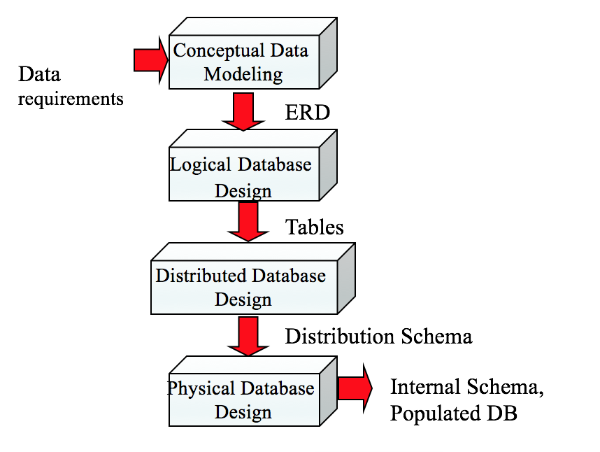
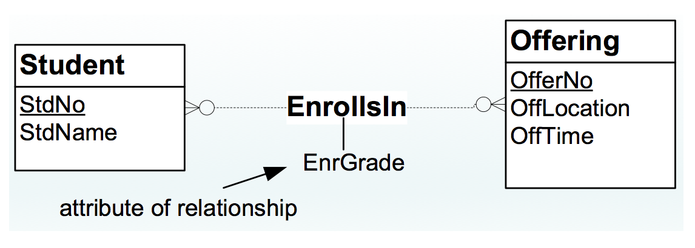

# Database Management Essentials （1）

## 1. Overview

从商业决策的角度讲，要先区分data和information，因为最终的目的是为了管理决策而服务，所以数据清洗的目的在于商业附加值。就data和information而言，只有能够为决策提供信息的才是information。

* Data: 关于事情和时间的原始数据
  * conventional facts v.s. unconventional facts
* Information: 将data进行转换后能直接服务于管理决策

数据库主要具有以下的特性，具体来讲数据库要足够稳定，支持内部交互以及共享。

* Persistent : 死机后，数据不丢失
* Inter-related ：Entities直接要管理
* Shared ：用户同时访问

数据的存储都是以table的形式来进行，这里就讲到了entities和relationship，relationship将entities相互连接，进而形成一个diagram。

**Entities & Relationship :**

* Entities : 特定的主体，包括学生
* Relationship : 主体间存在的关系，比如师生之类


**DBMS的具体职位和职能分工:**

这里主要将同DBMS相关的分成了两个部分，一个是功能部门，主要是借助数据发挥作用，比如分析师。另一个就是IT部门，主要是管理和支持。具体的划分其实相对比较模糊


* Indirect user : 从数据库中直接fetch数据和报告
* Parametric user : 通过改变数据库中的参数，来改变已有的报告
* Power user: 能够用自己的能力直接做一个report
* Database Administrator: 
  * focused on individual databases and DBMSs
  * Need strong skills in specific DBMSs
* Data administrator
  * Planning: databases and technology
  * Standards setting
  * Computerized and non-computerized databases

**DBMS的主要区分 ：**

* DBMS \(Database Management System\): collection of components 
* Enterprise DBMS: 
  * 支持非常重要的数据决策
  * 数据库非常大，用户多，性能要求高
* Desktop DBMS: 主要是终端部门和单机用户
* Embedded DBMS: 嵌入在大型系统中例如 Personal Digital Assistant 和 smart card. 
  * limited transaction processing features 
  * **low memory, processing, and storage requirements.**

**Non-procedural Database Access**

这个是DBMS的主要特征，非过程和过程化的区别就在于有没有Loop，非过程化是没有Loop的，它主要是用query去回答问题，它关注的是去哪里拿，拿什么的问题，而不关注如何去拿这样的过程化细节。

* Improve productivity and improve accessibility
* SQL SELECT statement and graphical tools

**过程化和非过程化的结合**

主要是时间工作中需要使用其他的辅助脚本语言比如Python来和SQL结合解决问题，因此出现了例如 PL/SQL \(Oracle\), Transact-SQL \(SQL Server\)。

* Batch processing: 更多的商业行为需要批量化进行，在线处理越来越流行
* Customization: 定制化输入表格的要求和行为
* Automation: 要求自动化处理和检查数据和结构
* Performance: 更强调控制

**交易过程**

交易过程主要是在每天的基本操作中，虽然很平凡但是很重要，尤其是当互联网增长快速的时候，举一个ATM的例子，先从数据库中fetch数据，然后进行逐步交易。


这种operational transaction，比较重要的是两个以下特征：

* 有效 ：控制并发的用户数，
* 可靠 ：错误修复

具体到DBMS ：

* Concurrency control manager
* Recovery manager
* Transparent services for application developers

从管理决策上面来说，不同的层级对应不同的决策要求，具体如下：



但这种决策要求反映到数据库层面的时候，就变成了下图：



  
由此，就要求data warehouse具有以下特性:

* 从operational databases 和 external data sources演变
* Integrated and transformed data
* Optimized for reporting

数据库技术的发展和演变：



* 第一代：支持序列化和随机查找，如果是排序和文件系统，它需要程序辅助。
* 第二代：真正实现了entity types 和 relationships，但依赖程序员写程序来指引文件存储的相关位置，所以也就是natigational级别的。
* 第三代：relational DBMSs 主要是从数学上设计和实现了全面功能，并且支持使用non-procedural languages，从而使得效率有了明显提高。
* 第四代：主要向分布式存储、新型格式（XML）等新型领域进行了发展。

## 2. SQL

**常用的术语**



**完整性要求：**

* 主体完整性（Entity integrity）: primary keys
  * 表中总有一列的值是唯一的
  * 主码没有缺失值
  * 主体可追溯
* 参考完整性（Referential integrity）: foreign keys
  * 一表中的值必须要同另一个表匹配
  * 保证表间有效匹配

**创建Table:**

基本语法 ：

```text
CREATE TABLE <table-name> ( <column-list> [<constraint-list>] )
```

```sql
CREATE TABLE Student (
    StdNo CHAR(11),
    StdFirstName VARCHAR(50),
    StdLastName VARCHAR(50),
    StdCity VARCHAR(50),
    StdState CHAR(2),
    StdZip CHAR(10),
    StdMajor CHAR(6),
    StdClass CHAR(6),
    StdGPA DECIMAL(3 , 2 )
);
```

**基本的数据种类:**

* CHAR\(L\) : 固定长度
* VARCHAR\(L\) ： 长度可以变化
* INTEGER
* FLOAT\(P\) 
* DECIMAL\(W, R\) ：固定精度
* Date/Time: DATE, TIME, TIMESTAMP
* BOOLEAN

**完整性约束的基本种类：**

* Primary key : 设置主码
* Foreign key : 设置外码
* Unique：保证唯一性 
* Required \(NOT NULL\) ： 不得为空
* Check ：检查数值范围之类的

在写完整性约束的时候有两种写法：

基本语法 ：

```sql
CONSTRAINT [ ConstraintName ] <Constraint-Spec>
```

* Inline : 就是在列定义的同一行
* External ： 在列定义之后

```sql
CREATE TABLE Offering (
    OfferNo INTEGER,
    CourseNo CHAR(6) NOT NULL, // inline
    OffLocation VARCHAR(50),
    OffDays CHAR(6),
    OffTerm CHAR(6) NOT NULL,
    OffYear INTEGER NOT NULL,
    FacNo CHAR(11),
    OffTime DATE,
    CONSTRAINT PKOffering PRIMARY KEY (OfferNo), // External
    CONSTRAINT FKCourseNo FOREIGN KEY (CourseNo)
        REFERENCES Course,
    CONSTRAINT FKFacNo FOREIGN KEY (FacNo)
        REFERENCES Faculty
    CONSTRAINT ValidYear CHECK ( OffYear BETWEEN 2000 AND 2018 )
);

```

MySQL建表操作比较复杂，具体见下面的地址，在完整性约束这里，如果是inline，MySQL简化了constraint内容，直接省略。



#### SQL主要分类

SQL按照功能大概分成以下三类：

* 数据库定义: 主要是建表
* 数据库操作: select, update, insert, delete
* 数据库控制: 主要是完整性和安全性约束

| Statement | Statement Type |
| :--- | :--- |
| CREATE TABLE | Definitional, Control |
| CREATE VIEW | Definitional |
| CREATE TYPE | Definitional |
| SELECT | Manipulation |
| INSERT, UPDATE, DELETE | Manipulation |
| COMMIT, ROLLBACK | Manipulation |
| CREATE TRIGGER | Control, Manipulation |
| GRANT, REVOKE | Control |

接下来主要是回顾了一下基本的SQL语法，因为这个我比较熟悉，就简单过一下

#### SELECT语法

```sql
 SELECT <list of column expressions>
 FROM <list of tables and join operations>
 WHERE <list of logical expressions for rows>
 ORDER BY <list of sorting specifications>
```

* 列表达式: 主要是一些约束、算术运算等操作
  * FacSalary \* 1.1
* 逻辑表达式: 主要涉及OR、AND和NOT
  * OffTerm = 'FALL' AND OffYear = 2016

其他的一些小的知识点补充:

* 文本匹配: 主要使用like，MySQL应该使用rlike
  * 任意字符 .
  * 范围 \[\]
  * 开头和结尾 ^ $

{% embed data="{\"url\":\"http://www.runoob.com/mysql/mysql-regexp.html\",\"type\":\"link\",\"title\":\"MySQL 正则表达式 \| 菜鸟教程\",\"description\":\"MySQL 正则表达式  在前面的章节我们已经了解到MySQL可以通过 LIKE ...% 来进行模糊匹配。   MySQL 同样也支持其他正则表达式的匹配， MySQL中使用 REGEXP 操作符来进行正则表达式匹配。  如果您了解PHP或Perl，那么操作起来就非常简单，因为MySQL的正则表达式匹配与这些脚本的类似。 下表中的正则模式可应用于 REGEXP 操作符中。  \\t   模式描述   ^匹配输入字符串的开始位置。如果设置了..\",\"icon\":{\"type\":\"icon\",\"url\":\"http://static.runoob.com/images/icon/mobile-icon.png\",\"aspectRatio\":0}}" %}

#### Join基本解释

* Left Join : The LEFT JOIN keyword returns all records from the left table , and the matched records from the right table 
* Inner Join : The INNER JOIN keyword selects records that have matching values in both tables.

后面主要是讲了一些多表间查询的技巧，因为比较基础，就略过了。

#### Insert基本语法

```sql
INSERT INTO table_name (column1, column2, column3, ...)
VALUES (value1, value2, value3, ...);
```

#### Update基本语法

```sql
UPDATE table_name
SET column1 = value1, column2 = value2, ...
WHERE condition;
```

#### Delete基本语法

```sql
DELETE FROM table_name
WHERE condition;
```

## 3. Database Development

数据库基本的发展阶段



#### Entity-Relationship 深入


* Entity type
  * 主要是一系列类别的合集 persons, places, things, events
  * 含有属性，比如CourseNo
  * Primary key
  * Entity: Entity Type的实例化
* Relationship
  * 实体间已命名的关系: 命名很重要
  *  Bidirectional 
* Attribute
  * entity types或relationships的属性
  * 数据类型以及许可的操作
  * 展示内部的特性

 Cardinalities ：限制Relationship的参与数量

#### ERD的基本表示以及定义

这里比较重要的是看懂这个竖线和圈圈


| Classification | Cardinality Restrictions |
| :---: | :---: |
| Mandatory | Minimum cardinality ≥ 1 |
| Optional | Minimum cardinality = 0 |
| Functional or single-valued | Minimum cardinality = 1 |
| 1-M | Maximum cardinality = 1 in one direction; maximum cardinality &gt; 1 in the other direction |
| M-N | Maximum cardinality &gt; 1 in both directions |
| 1-1 | Maximum cardinality = 1 in both directions |

#### M-N关系的构建

* 两个1-M的合并



#### 自引用

* 对于自连接很重要


#### M-Way 型关系

* 一个表同多个表连接


#### ERD涉及的基本Rules ：

#### Completeness rules: 不能有缺失值

* Primary Key Rule: 必须有PK
* Naming Rule: 必须有名字
* Cardinality Rule: 关系的方向必须确定
* Entity Participation Rule: 至少一个关系


#### Consistency rules: 不能有冲突

* Entity Name Rule: 命名要具有唯一性
* Attribute Name Rule: 属性命名必须要有唯一性

#### 额外的数据库规则

####  Connection Consistency Rules ：

* Relationship/Entity Connection Rule: 必须连接的是实体 \(not necessarily distinct\)
* Relationship/Relationship Connection Rule: 关系不同其他相连
* Redundant Foreign Key Rule: 多余外键不必要

#### Dependency Rules :

* Weak entity type rule: 至少一个关系
* Identifying relationship rule: 至少一个主题
* Identification dependency cardinality rule: 最大最小都必须是1 （一一映射）

