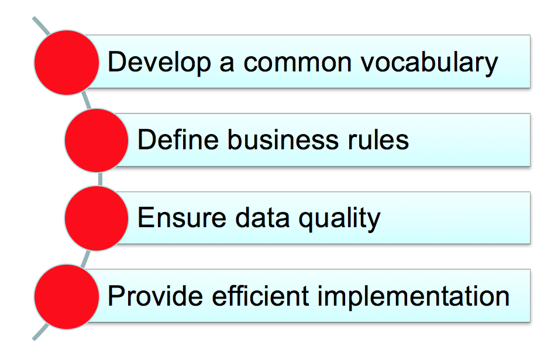
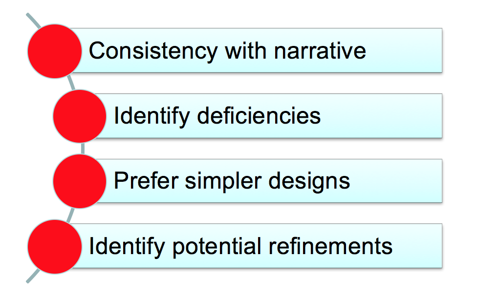
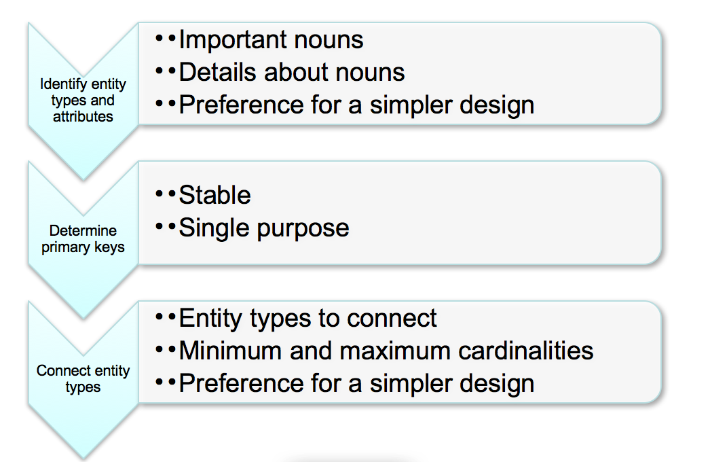
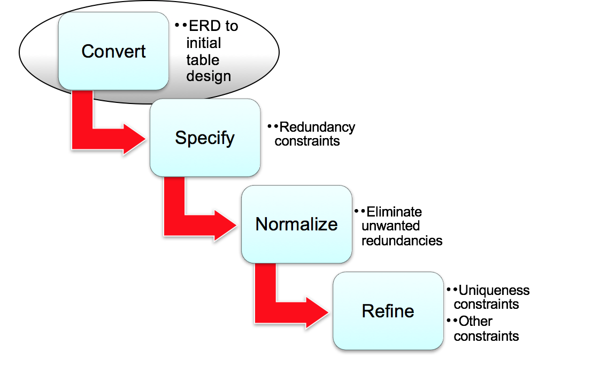
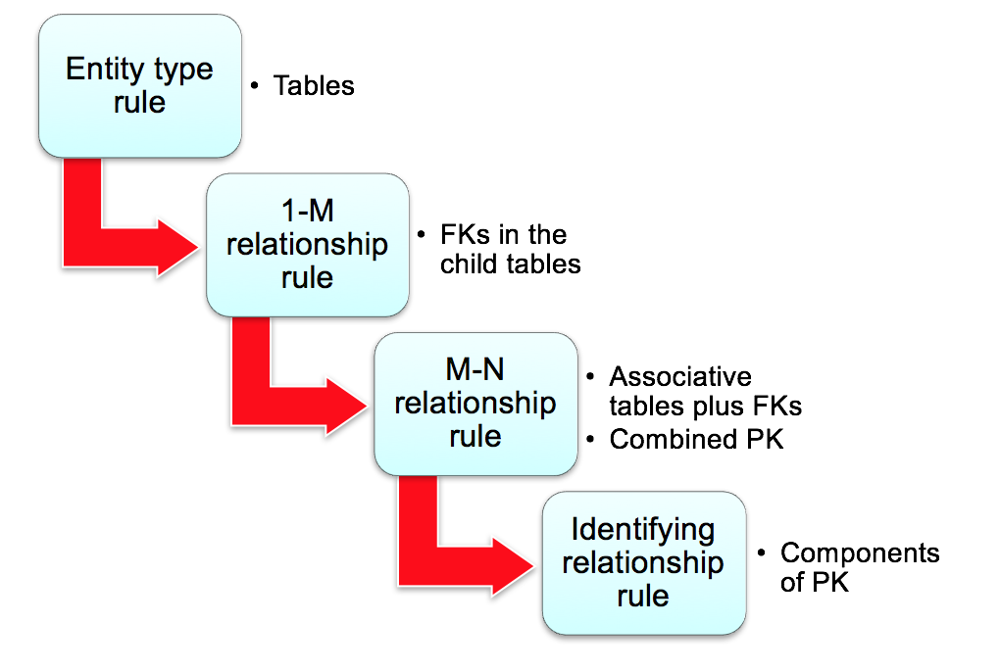

# Database Management Essentials （2）

## 1.数据库基本概念设计

数据库设计的基本四个步骤 :

####  Develop a Common Vocabulary

* 区分用户群体
* 难以达成共识，主要是主体的命名
* 需要找到最优的解决方案
* 需要整个组织去实施

####  Define Business Rules

* 支持组织的政策
* 定义适当的限制
  * Too restrictive: 阻止了有效的商业互动
  * Too loose: 允许有害的行业互动
* 为一些特殊情况开绿灯，提供便利

#### Narrative Problem

这里提到了Narrative Problem就是讲实际的需求转化成技术，不要将问题复杂化。

后面主要是以一些实际的案例来尝试解决这些问题，包括了Design Transformation和Data Model。

## 2. 数据库逻辑设计

主要是根据已有的概念设计来消除不必要的冗余，并且检查完整性和独立性。

#### 具体的转换原则

先从表开始，然后检查FK之类的。

主要在实现的时候需要先检查一对多关系的双方，从一开始建表。

