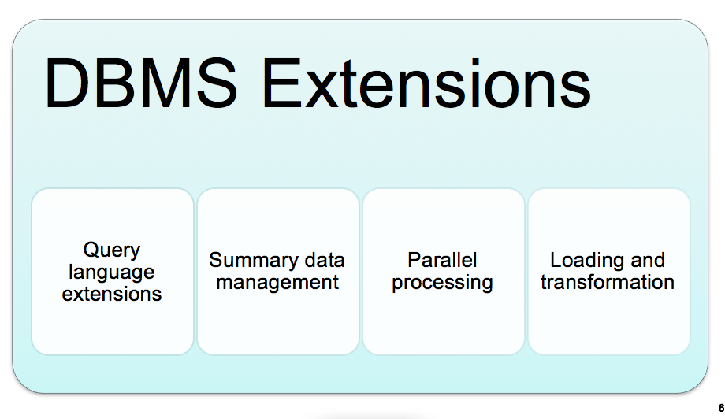
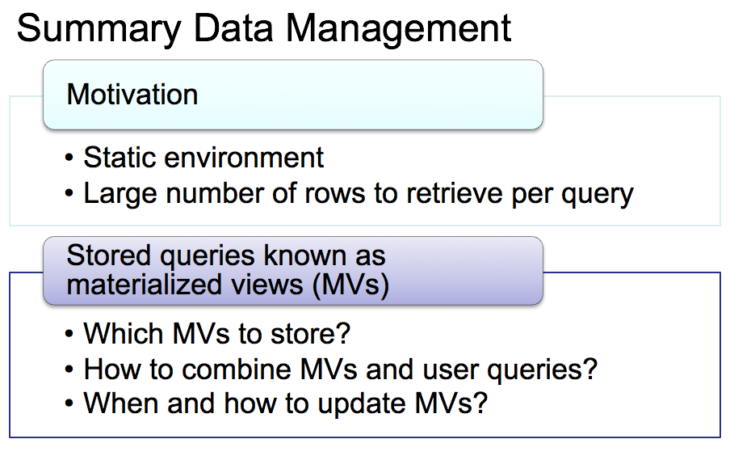
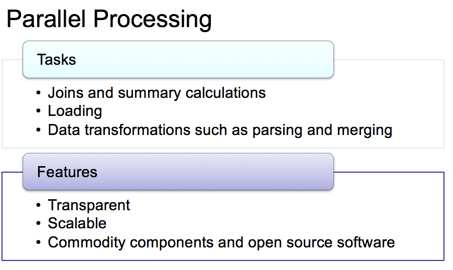

# Relational Database Support for Data Warehouses \(2\)

## 1. Overview

#### Data Warehouse 和 Operational Database的比较

主要差异在于DW是过去的Summerized的数据

* Missing DBMS features 
* Performance limitation
* Lack of integration

#### DBMS对DW的支持

* Relational model dominance
* Lack of scalability for data cube engines
* Large amounts of research and development of relational database performance
* New features

#### 什么是DBMS 扩展？

