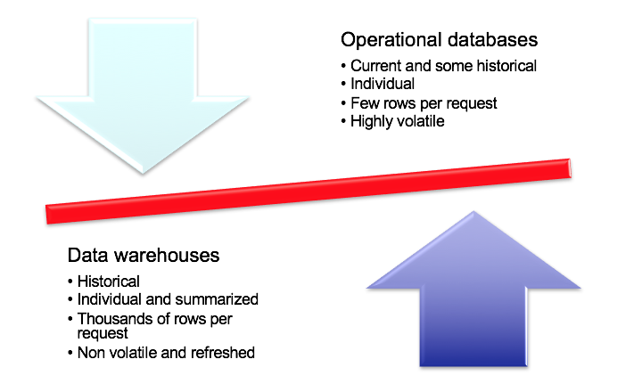
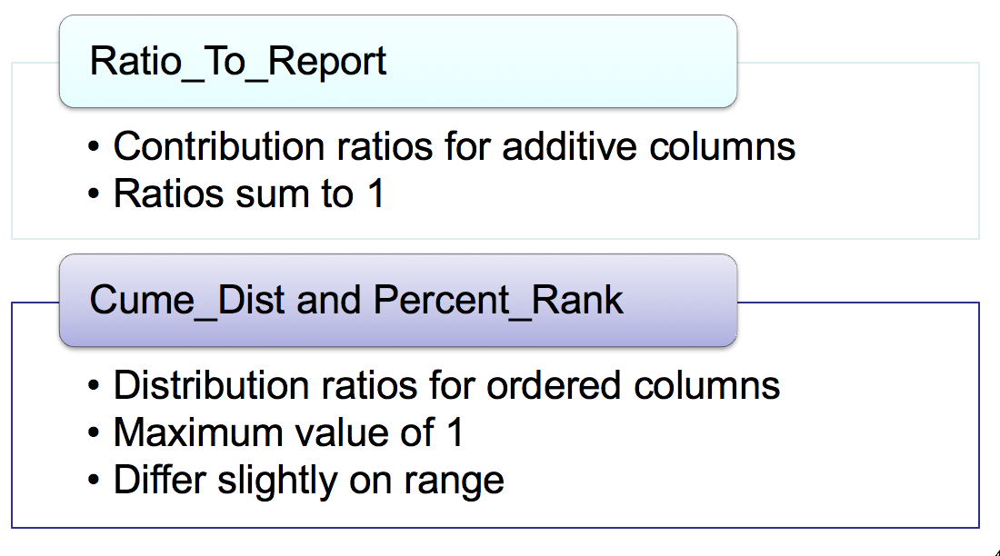
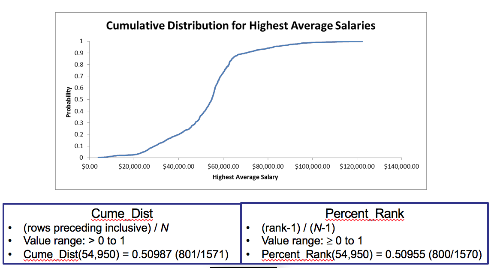

# Relational Database Support for Data Warehouses \(1\)

## 1. Overview

#### Data Warehouse 和 Operational Database的比较

主要差异在于DW是过去的Summerized的数据



* Missing DBMS features 
* Performance limitation
* Lack of integration

#### DBMS对DW的支持

* Relational model dominance
* Lack of scalability for data cube engines
* Large amounts of research and development of relational database performance
* New features

#### 什么是DBMS 扩展？


## 2. Analytics Functions

#### BI的分析对聚合函数有额外的要求

* Top and worst performing units
* Trends:
  * 需要定义时间段之间的差异
  * 需要在移动的窗口中使用聚合函数
* Numeric contributions
  * 排序、累计分布、百分比

#### 而现有的Select 函数并不支持：

* Difficult to write
* Poor productivity
* Poor performance

####  Analytic Function versus Aggregate Function

* Analytic function processing 在 row and group by 之后执行


#### Syntax

```sql
<AnalyticFunction> ([<column-list>]) 
OVER ([PARTITION BY <partitioning>] [ORDER BY <ordering>] 
```

#### Example

```sql
SELECT CustState, CustName, SUM(SalesDollar) AS SumSales,
  RANK() OVER (PARTITION BY CustState 
               ORDER BY SUM(SalesDollar) DESC) SalesRank
 FROM SSSales, SSCustomer
 WHERE SSSales.CustId = SSCustomer.CustI
 GROUP BY CustState, CustName
 ORDER BY CustState;
```

* Rank
  * Leaves gaps 
* Dense rank
  * No ranking gaps
* Ntile
  * Rows divided into equal divisions
* Row\_Number

#### Window的概念


#### 累计函数


#### Ratio





