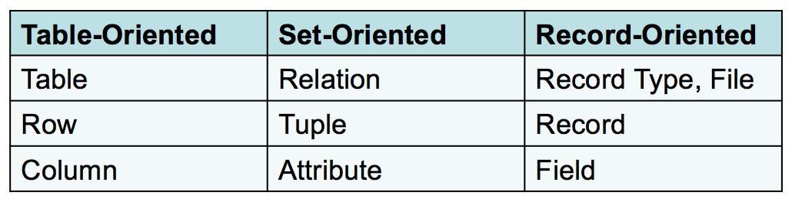
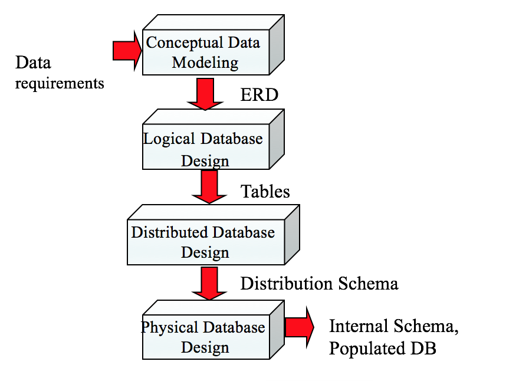
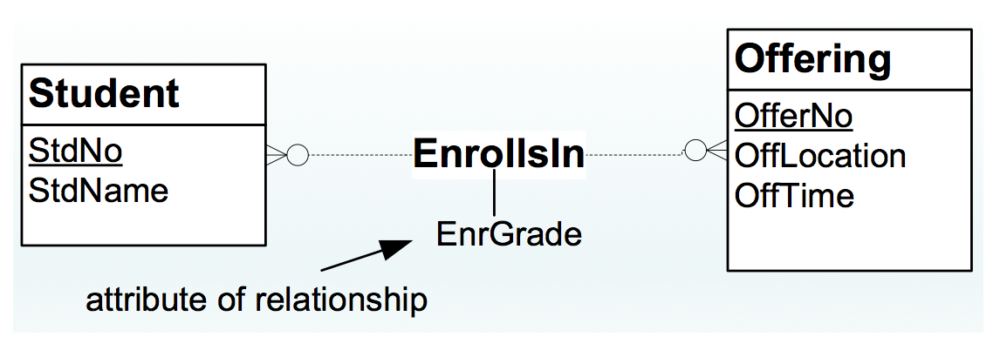

# 1.Database Management Essentials

## 1. Overview

从商业决策的角度讲，要先区分data和information，因为最终的目的是为了管理决策而服务，管理层关心的是数据中所包含的信息以及这些信息能够带来多少商业价值。就data和information而言，只有能够为决策提供信息的才是information，这里是一些简单的区分。

* Data: 关于事情和时间的原始数据
  * conventional facts v.s. unconventional facts
* Information: 将data进行转换后能直接服务于管理决策

数据库主要具有以下的特性，具体来讲数据库要足够稳定，支持内部交互以及共享。

* Persistent : 死机后，数据不丢失
* Inter-related ：Entities之间需要进行有序的管理
* Shared ：用户同时访问

数据的存储都是以table的形式来进行，这里就讲到了entities和relationship，relationship将entities相互连接，进而形成一个diagram。

**Entities & Relationship :**

* Entities : 特定的主体，包括学生
* Relationship : 主体间存在的关系，比如师生之类


**DBMS的具体职位和职能分工:**

这里主要将DBMS相关的分成了两个部分，一个是功能部门，主要是借助数据发挥作用，比如分析师。另一个就是IT部门，主要是管理和支持。具体的划分其实相对比较模糊


* Indirect user : 从数据库中直接fetch数据和报告
* Parametric user : 通过改变数据库中的参数，来改变已有的报告
* Power user: 能够用自己的能力直接做一个report
* Database Administrator: 
  * focused on individual databases and DBMSs
  * Need strong skills in specific DBMSs
* Data administrator
  * Planning: databases and technology
  * Standards setting
  * Computerized and non-computerized databases

**DBMS的主要区分 ：**

* DBMS \(Database Management System\): collection of components 
* Enterprise DBMS: 
  * 支持非常重要的数据决策
  * 数据库非常大，用户多，性能要求高
* Desktop DBMS: 主要是终端部门和单机用户
* Embedded DBMS: 嵌入在大型系统中例如 Personal Digital Assistant 和 smart card. 
  * limited transaction processing features 
  * **low memory, processing, and storage requirements.**

**Non-procedural Database Access**

这个是DBMS的主要特征，非过程和过程化的区别就在于有没有Loop，非过程化是没有Loop的，它主要是用query去回答问题，它关注的是去哪里拿，拿什么的问题，而不关注如何去拿这样的过程化细节。

* Improve productivity and improve accessibility
* SQL SELECT statement and graphical tools

**过程化和非过程化的结合**

主要是时间工作中需要使用其他的辅助脚本语言比如Python来和SQL结合解决问题，因此出现了例如 PL/SQL \(Oracle\), Transact-SQL \(SQL Server\)。

* Batch processing: 更多的商业行为需要批量化进行，在线处理越来越流行
* Customization: 定制化输入表格的要求和行为
* Automation: 要求自动化处理和检查数据和结构
* Performance: 更强调控制

**交易过程**

交易过程主要是在每天的基本操作中，虽然很平凡但是很重要，尤其是当互联网增长快速的时候，举一个ATM的例子，先从数据库中fetch数据，然后进行逐步交易。


这种operational transaction，比较重要的是两个以下特征：

* 有效 ：控制并发的用户数，
* 可靠 ：错误修复

具体到DBMS ：

* Concurrency control manager
* Recovery manager
* Transparent services for application developers

从管理决策上面来说，不同的层级对应不同的决策要求，具体如下：


但这种决策要求反映到数据库层面的时候，就变成了下图：


  
由此，就要求data warehouse具有以下特性:

* 从operational databases 和 external data sources演变
* Integrated and transformed data
* Optimized for reporting

数据库技术的发展和演变：


* 第一代：支持序列化和随机查找，如果是排序和文件系统，它需要程序辅助。
* 第二代：真正实现了entity types 和 relationships，但依赖程序员写程序来指引文件存储的相关位置，所以也就是natigational级别的。
* 第三代：relational DBMSs 主要是从数学上设计和实现了全面功能，并且支持使用non-procedural languages，从而使得效率有了明显提高。
* 第四代：主要向分布式存储、新型格式（XML）等新型领域进行了发展。

## 2. SQL

**常用的术语**



**完整性要求：**

* 主体完整性（Entity integrity）: primary keys
  * 表中总有一列的值是唯一的
  * 主码没有缺失值
  * 主体可追溯
* 参考完整性（Referential integrity）: foreign keys
  * 一表中的值必须要同另一个表匹配
  * 保证表间有效匹配

**创建Table:**

基本语法 ：

```text
CREATE TABLE <table-name> ( <column-list> [<constraint-list>] )
```

```sql
CREATE TABLE Student (
    StdNo CHAR(11),
    StdFirstName VARCHAR(50),
    StdLastName VARCHAR(50),
    StdCity VARCHAR(50),
    StdState CHAR(2),
    StdZip CHAR(10),
    StdMajor CHAR(6),
    StdClass CHAR(6),
    StdGPA DECIMAL(3 , 2 )
);
```

**基本的数据种类:**

* CHAR\(L\) : 固定长度
* VARCHAR\(L\) ： 长度可以变化
* INTEGER
* FLOAT\(P\) 
* DECIMAL\(W, R\) ：固定精度
* Date/Time: DATE, TIME, TIMESTAMP
* BOOLEAN

**完整性约束的基本种类：**

* Primary key : 设置主码
* Foreign key : 设置外码
* Unique：保证唯一性 
* Required \(NOT NULL\) ： 不得为空
* Check ：检查数值范围之类的

在写完整性约束的时候有两种写法：

基本语法 ：

```sql
CONSTRAINT [ ConstraintName ] <Constraint-Spec>
```

* Inline : 就是在列定义的同一行
* External ： 在列定义之后

```sql
CREATE TABLE Offering (
    OfferNo INTEGER,
    CourseNo CHAR(6) NOT NULL, // inline
    OffLocation VARCHAR(50),
    OffDays CHAR(6),
    OffTerm CHAR(6) NOT NULL,
    OffYear INTEGER NOT NULL,
    FacNo CHAR(11),
    OffTime DATE,
    CONSTRAINT PKOffering PRIMARY KEY (OfferNo), // External
    CONSTRAINT FKCourseNo FOREIGN KEY (CourseNo)
        REFERENCES Course,
    CONSTRAINT FKFacNo FOREIGN KEY (FacNo)
        REFERENCES Faculty
    CONSTRAINT ValidYear CHECK ( OffYear BETWEEN 2000 AND 2018 )
);

```

MySQL建表操作比较复杂，具体见下面的地址，在完整性约束这里，如果是inline，MySQL简化了constraint内容，直接省略。



#### SQL主要分类

SQL按照功能大概分成以下三类：

* 数据库定义: 主要是建表
* 数据库操作: select, update, insert, delete
* 数据库控制: 主要是完整性和安全性约束

| Statement | Statement Type |
| :--- | :--- |
| CREATE TABLE | Definitional, Control |
| CREATE VIEW | Definitional |
| CREATE TYPE | Definitional |
| SELECT | Manipulation |
| INSERT, UPDATE, DELETE | Manipulation |
| COMMIT, ROLLBACK | Manipulation |
| CREATE TRIGGER | Control, Manipulation |
| GRANT, REVOKE | Control |

接下来主要是回顾了一下基本的SQL语法，因为这个我比较熟悉，就简单过一下

#### SELECT语法

```sql
 SELECT <list of column expressions>
 FROM <list of tables and join operations>
 WHERE <list of logical expressions for rows>
 ORDER BY <list of sorting specifications>
```

* 列表达式: 主要是一些约束、算术运算等操作
  * FacSalary \* 1.1
* 逻辑表达式: 主要涉及OR、AND和NOT
  * OffTerm = 'FALL' AND OffYear = 2016

其他的一些小的知识点补充:

* 文本匹配: 主要使用like，MySQL应该使用rlike
  * 任意字符 .
  * 范围 \[\]
  * 开头和结尾 ^ $



#### Join基本解释

* Left Join : The LEFT JOIN keyword returns all records from the left table , and the matched records from the right table 
* Inner Join : The INNER JOIN keyword selects records that have matching values in both tables.

后面主要是讲了一些多表间查询的技巧，因为比较基础，就略过了。

#### Insert基本语法

```sql
INSERT INTO table_name (column1, column2, column3, ...)
VALUES (value1, value2, value3, ...);
```

#### Update基本语法

```sql
UPDATE table_name
SET column1 = value1, column2 = value2, ...
WHERE condition;
```

#### Delete基本语法

```sql
DELETE FROM table_name
WHERE condition;
```

## 3. Database Development

数据库基本的发展阶段



#### Entity-Relationship 深入


* Entity type
  * 主要是一系列类别的合集 persons, places, things, events
  * 含有属性，比如CourseNo
  * Primary key
  * Entity: Entity Type的实例化
* Relationship
  * 实体间已命名的关系: 命名很重要
  *  Bidirectional 
* Attribute
  * entity types或relationships的属性
  * 数据类型以及许可的操作
  * 展示内部的特性

 Cardinalities ：限制Relationship的参与数量

#### ERD的基本表示以及定义

这里比较重要的是看懂这个竖线和圈圈


| Classification | Cardinality Restrictions |
| :---: | :---: |
| Mandatory | Minimum cardinality ≥ 1 |
| Optional | Minimum cardinality = 0 |
| Functional or single-valued | Minimum cardinality = 1 |
| 1-M | Maximum cardinality = 1 in one direction; maximum cardinality &gt; 1 in the other direction |
| M-N | Maximum cardinality &gt; 1 in both directions |
| 1-1 | Maximum cardinality = 1 in both directions |

#### M-N关系的构建

* 两个1-M的合并



#### 自引用

* 对于自连接很重要


#### M-Way 型关系

* 一个表同多个表连接


#### ERD涉及的基本Rules ：

#### Completeness rules: 不能有缺失值

* Primary Key Rule: 必须有PK
* Naming Rule: 必须有名字
* Cardinality Rule: 关系的方向必须确定
* Entity Participation Rule: 至少一个关系


#### Consistency rules: 不能有冲突

* Entity Name Rule: 命名要具有唯一性
* Attribute Name Rule: 属性命名必须要有唯一性

#### 额外的数据库规则

####  Connection Consistency Rules ：

* Relationship/Entity Connection Rule: 必须连接的是实体 \(not necessarily distinct\)
* Relationship/Relationship Connection Rule: 关系不同其他相连
* Redundant Foreign Key Rule: 多余外键不必要

#### Dependency Rules :

* Weak entity type rule: 至少一个关系
* Identifying relationship rule: 至少一个主题
* Identification dependency cardinality rule: 最大最小都必须是1 （一一映射）

## 4. 数据库基本概念设计

数据库设计的基本四个步骤 :


####  Develop a Common Vocabulary

* 区分用户群体
* 难以达成共识，主要是主体的命名
* 需要找到最优的解决方案
* 需要整个组织去实施

####  Define Business Rules

* 支持组织的政策
* 定义适当的限制
  * Too restrictive: 阻止了有效的商业互动
  * Too loose: 允许有害的行业互动
* 为一些特殊情况开绿灯，提供便利

#### Narrative Problem

这里提到了Narrative Problem就是讲实际的需求转化成技术，不要将问题复杂化。


后面主要是以一些实际的案例来尝试解决这些问题，包括了Design Transformation和Data Model。

## 5. 数据库逻辑设计

主要是根据已有的概念设计来消除不必要的冗余，并且检查完整性和独立性。


#### 具体的转换原则

先从表开始，然后检查FK之类的。


主要在实现的时候需要先检查一对多关系的双方，从一开始建表。

## 6. 数据库的规范化和基本范式

#### 修正异常值：

* 阻止未预料到的行操作
* 防止数据的过度删除，主要源于数据本身设计不规范
* 防止数据过于冗余
* 尽量保证数据本身的差异性，一行一个不一样的数据

#### 函数依赖 ：

简单的说就是，X是唯一的，每一个X可以找到同样的Y，就和Hash table一样，这样的X比较适合做PK

* 符号: X -&gt; Y 就是 X函数依赖Y
* For each X value, there is at most one Y value

  * X: left-hand side \(LHS\) or determinant
  * Y: right-hand side \(RHS\)

#### 范式 Normal Forms: 

范式主要是通过表的设计和函数依赖关系将表的关系进行最优化，一般来讲，最优的范式起码是第三范式。范式并不是越高越好，因为越高你需要的表就更加多，这么这就需要跨表查询，降低了数据库的性能。


具体划分 ：


* 1NF: 最小的限制性，列不可再分
* 2NF: 非主键属性全部依赖于主键属性
* 3NF/BCNF: 非主键属性之间无依赖关系
* 4NF: 主键属性之间无依赖关系
* 5NF: does not involve FDs; Inappropriate usage of an M-way relationship; more specialized than 4NF
* DKNF: ideal rather than a practical normal form

补充：




