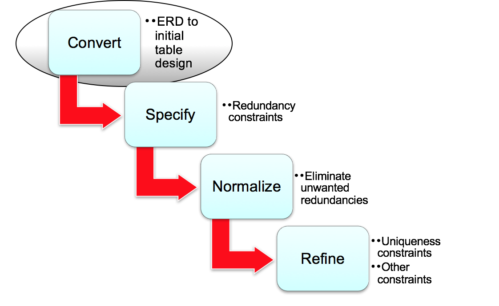
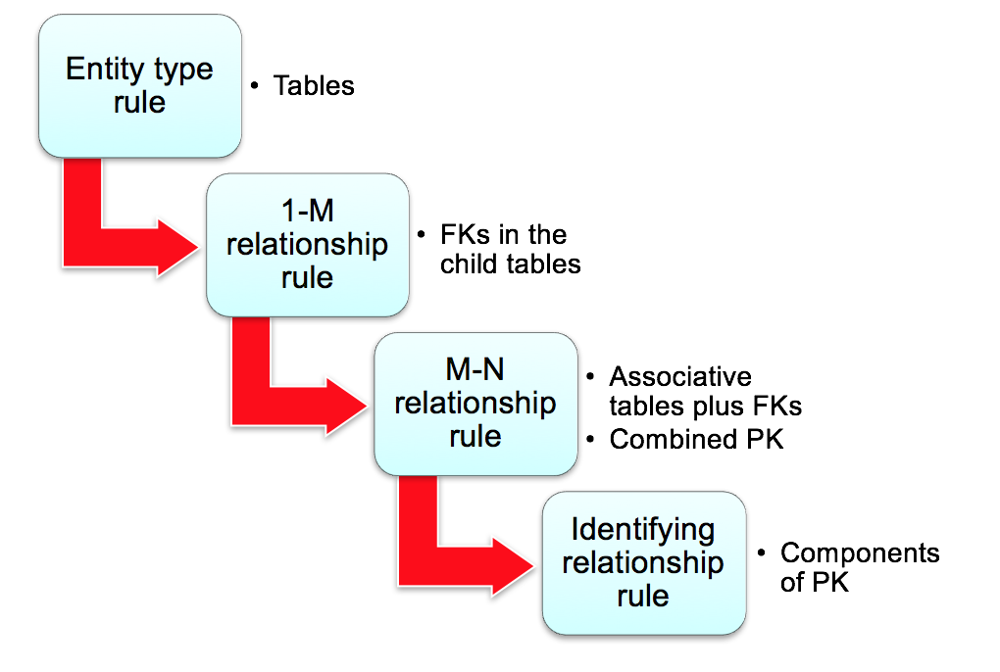

# Database Management Essentials （2）

## 1. 数据库基本概念设计

数据库设计的基本四个步骤 :

####  Develop a Common Vocabulary

* 区分用户群体
* 难以达成共识，主要是主体的命名
* 需要找到最优的解决方案
* 需要整个组织去实施

####  Define Business Rules

* 支持组织的政策
* 定义适当的限制
  * Too restrictive: 阻止了有效的商业互动
  * Too loose: 允许有害的行业互动
* 为一些特殊情况开绿灯，提供便利

#### Narrative Problem

这里提到了Narrative Problem就是讲实际的需求转化成技术，不要将问题复杂化。

后面主要是以一些实际的案例来尝试解决这些问题，包括了Design Transformation和Data Model。

## 2. 数据库逻辑设计

主要是根据已有的概念设计来消除不必要的冗余，并且检查完整性和独立性。

#### 具体的转换原则

先从表开始，然后检查FK之类的。

主要在实现的时候需要先检查一对多关系的双方，从一开始建表。

## 3. 数据库的规范化和基本范式

#### 修正异常值：

* 阻止未预料到的行操作
* 防止数据的过度删除，主要源于数据本身设计不规范
* 防止数据过于冗余
* 尽量保证数据本身的差异性，一行一个不一样的数据

#### 函数依赖 ：

简单的说就是，X是唯一的，每一个X可以找到同样的Y，就和Hash table一样，这样的X比较适合做PK

* 符号: X -&gt; Y 就是 X函数依赖Y
* For each X value, there is at most one Y value

  * X: left-hand side \(LHS\) or determinant
  * Y: right-hand side \(RHS\)

#### 范式 Normal Forms: 

范式主要是通过表的设计和函数依赖关系将表的关系进行最优化，一般来讲，最优的范式起码是第三范式。范式并不是越高越好，因为越高你需要的表就更加多，这么这就需要跨表查询，降低了数据库的性能。

具体划分 ：

* 1NF: 最小的限制性，列不可再分
* 2NF: 非主键属性全部依赖于主键属性
* 3NF/BCNF: 非主键属性之间无依赖关系
* 4NF: 主键属性之间无依赖关系
* 5NF: does not involve FDs; Inappropriate usage of an M-way relationship; more specialized than 4NF
* DKNF: ideal rather than a practical normal form

补充：



