# 2.Data Warehouse Concepts, Design, and Data Integration

## 1. Data Warehouse基本概念

#### 为什么需要DW?

主要基于三个原因，主要是数据库不单单是数据库，而要向reporting和data analysis方向发展，因而需要对数据进行一步步的处理，这是主要动因。

这里英文写的非常好，理解并背诵。

* Missing features for summary data
  * Storage and optimization techniques for summary queries
  * Data modeling approaches
  * Support for precomputed query results
  * Support for different business analyst query tools
* Performance limitation
  * Performance problems with a separate database for both transaction processing and business intelligence decision making
  * Never solved. Use a separate database
* Lack of integration
  * Most important issue
  * Management issue
  * Lack of integration with transaction databases and external data sources
    * Add value: integrate, standardize, clean, and summarize both internal and external data sources

#### 什么是DW？

* 数据源 ：operational databases， external data sources产生
* 过程：Many transformations to clean, standardize, and integrate
* 特征: no need to identify individual transactions although transaction details
* 好处：支持灵活的数据仓库，为报表优化做准备

#### DW的特征 

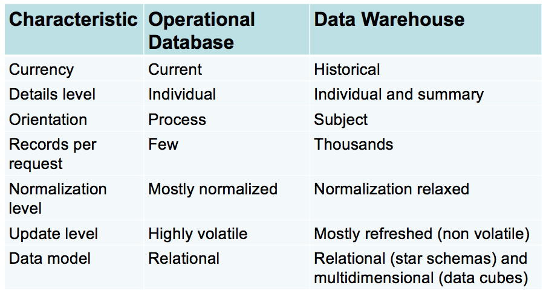

* Subject-oriented: Organized around business entities \(e.g., customers, products, and employees\) rather than business processes
* Integrated: many transformations to unify source data from independent data sources \(units of measure, data formats, naming conventions\)
* Time-variant: historical data \(time stamped\); snapshots of business processes captured at different points in time
* Nonvolatile: new data are appended periodically; existing data is not changed; warehouse data may be archived after its usefulness declines

#### 原始数据库和DW的比较

具体来说，DW主要是为了决策而服务的。

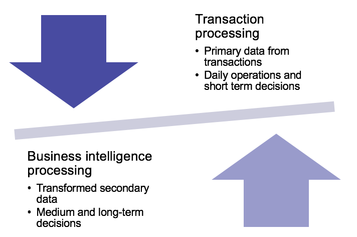

#### 搭建数据仓库的主要困难 ：

* 需要组织之间的合作 
* 数据源的数据质量有差异，很难估计时间完成时间
* 无法度量实际DW的规模，通常都比预计的大很多

**数据库的无形好处：**

* 对组织成功非常重要
* 提高了数据质量
  * 缺失值更少
  * 更多匹配的主体
  * 更多数据
  * 更高层面的数据合规
* 时间长了会成为一种有型资产

#### 具体的DW设计框架：

* 基本的两种结构 - 自上而下和自下而上
* Decentralized & Centralized : 去中心化这里指的是将数据存储在不同的地方，而中心化有一个统一的数据库，这个概念重要是因为涉及后面数据库的分布式搭建。

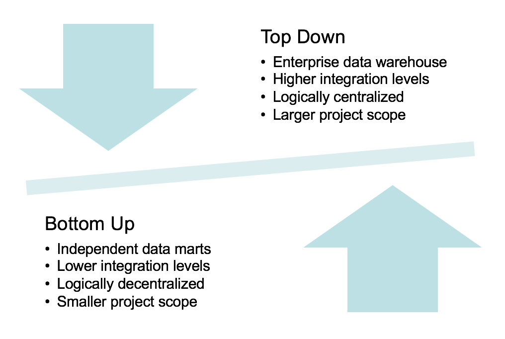

#### Top-Down Architecture的具体实现

先将数据存入Staging DB，然后进行整合和ETL进入DW，从而进行整个企业级层面的分析。

#### Bottom-up Architecture 的具体实现

Data marts: 小型数据仓库，主要为个体或部门服务

争议 :

* 这种方法会失去长期的收益，主要是分析端
* 最终还是需要集成成一个中心化的数据库

####  Federated Architecture 

#### 基本系统框架的发展

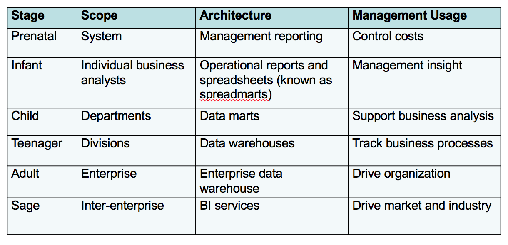

实际上能够跨越不同的阶段是非常难：

* Infant to child stages : investment level
* Teenager to adult : strategic importance of data warehouse

####  TPC-DS Data Warehouse

#### 主要的职位:

码一下，以后也能清楚自己的发展路径

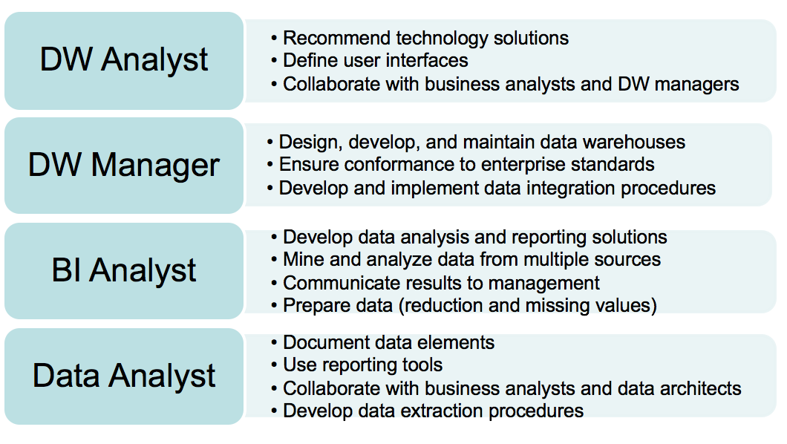

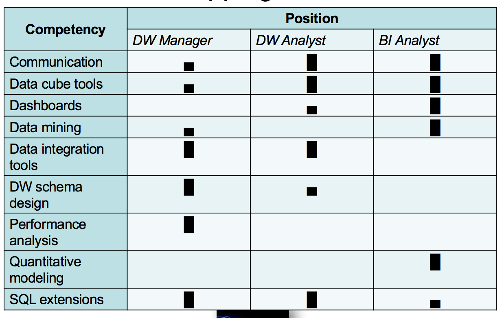

## 2.  Data Cube基本概念

Data Cube主要是特定话的小型Data Warehouse，主要服务的对象是特定的部门，使用者主要是Business Analyst，所以这里主要是从BA的角度来讲解。

* 思考问题是一个多方位的，考虑的更多
* 指标是需要量化的
* 更关注非常利益相关的点

基于此，Data Cube就被设计出来了，主要为BA服务，需要注意的是它不一定是三维的，但是它应当是一个多维的DW，这样才可以满足BA的需要。

一些常用的术语 ：

* Dimension: 行和列的名字
* Member: 行和列的值
* Measure: 存储在cell里面的值

#### 一个简单的例子：

* Dimensions : Location, Product, Time
* Members : Colorado, Mono laser, 1/1/2017
* Measure :  Sales

#### Cube的一些特性：

* Hierarchies:
  * Member可以由子成员，就是可以支持drill down，比如，国家-省-城市
* Sparsity:
  * 因为很多值是空缺的所以是稀松的
  * 一旦数据维度上升，就会有很多空缺值
* Measure :
  * 可以通过计算得出一些Derived Measure
  * 一个cell里面有很多measure

#### Measure的聚合特性：

* Additive ：Credit hours
* Non-Additive :  Grade

#### 基本的Cube操作

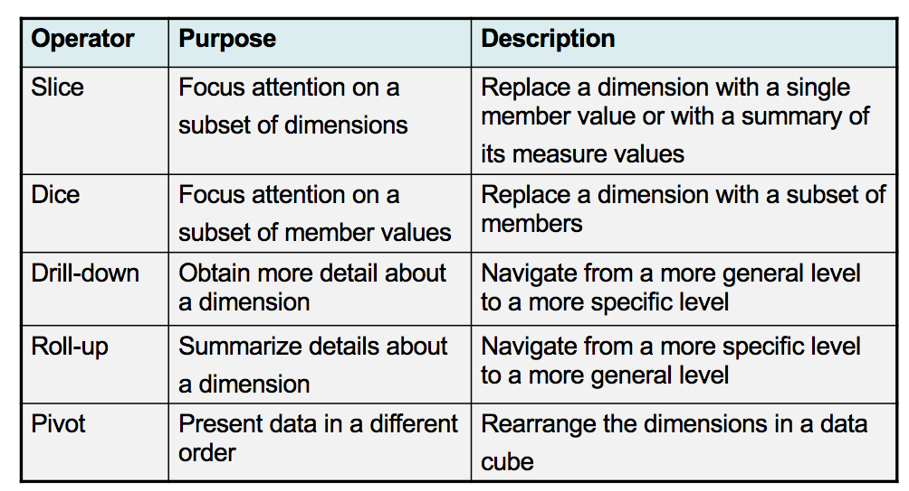



#### Microsoft多维表示

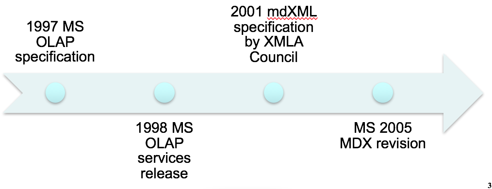

## 3. Data Cube的基本实现

#### 为什么需要table design ?

这里其实想解决的是，为什么使用关系型表的设计来实现Data Cube。

* 缺乏规模性以及Data Cube存储的引擎
* 已有大量关系型数据库主导的产品
* 大量的研究和投资已经进入Data Warehouse领域
* 大型Data Warehouse已经使用了关系型数据库

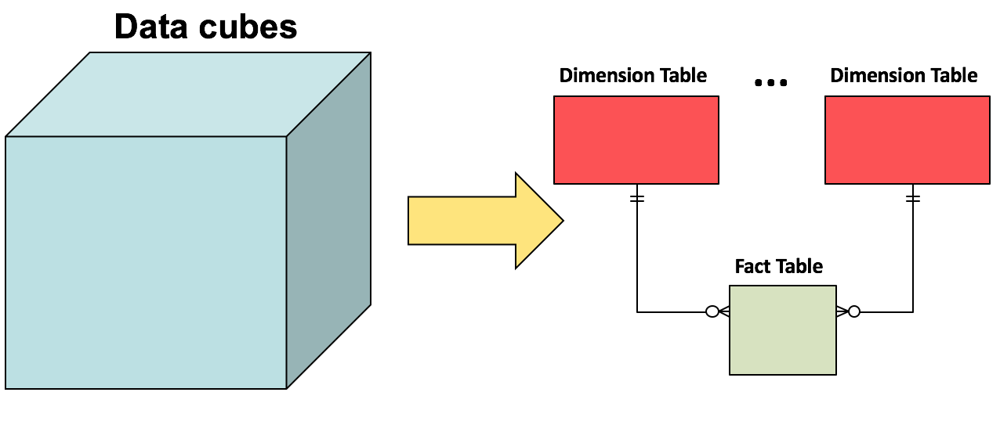

#### Data Cube的实现 ：

* 仍然使用1-M关系来连接表
* Dimensions 以 dimension tables 表示
* Measures 以 fact tables 表示 
* Grain: 主要存储measure values

具体细节 :

* Dimension table:
  * 只存储一维数据
  * 通常不标准化
* Fact table:
  * 主要存储measure
  * 通常含有非常多的外键
* Grain:
  * Fact tables中更多的细节
  * 主要受到维度的控制

#### Fact Table的种类 ：

* Transaction
  * 更加普遍，主要是可以相加
* Snapshot
  * 周期性更新，半可加
* Factless
  * 主要是事物型

#### 数据库大小限制 ：

* 数据库维度受限因素 ：dimension, cardinalities, times, sparsity
* Grain too small: DW太大，计算时间太长
* Grain too large: 当涉及到dimension的时候，不能回答dimension的问题

#### Schema patterns

Start Schema : 主要是所有表环绕，连接中间的一个表

 Constellation Schema :  存在多个Star Schema

Snowflake : 在Star Schema的基础上，再连接一些其他的表

#### 完整性变化：

* Type II alternative involves multiple rows for the same customer, but the entire history is represented. 
* Type III alternative involves just a single row for each customer, but only a limited history can be represented.

#### 主要的一些问题 ：

* Drill down incomplete 和 Rollup Incomplete:
  * 上下级关系没有定义清楚
  * 使用了默认或者重复的下级
* Non strict dimension relationship:
  * 通过层级消除 M-N relationship关系
  * 使用主要上级
  * 使用上级的group

技术一点地说 ：

* Drill down incomplete:
  * Min cardinality = 0 for parent \(coarse\) entity type
  * Some parent \(fine\) entities may not have a child entity
* Rollup incomplete:
  * Min cardinality = 0 for child \(fine\) entity type
  * Some child \(fine\) entities may not have a parent entity
* Non strict:
  * Child \(fine\) entity may have multiple parents
  * Parent entity expected to have multiple children

#### 解决方法：

* Resolving Incomplete Dimension-Fact Relationships
  * Conceptually simple
  * Data integration process changes
  * Use default dimension entities
*  Resolving Non Strict Dimension-Fact Relationships
  * Source data may have M-N relationships, not 1-M relationships
  * Adjust fact or dimension tables for a fixed number of exceptions
  * More complex solutions to support M-N relationships with a variable number of connections

#### 主要的设计理念：

* 决定 Grain 以及相对的大小
* 简化
* 从数据库源发展到 data warehouse 

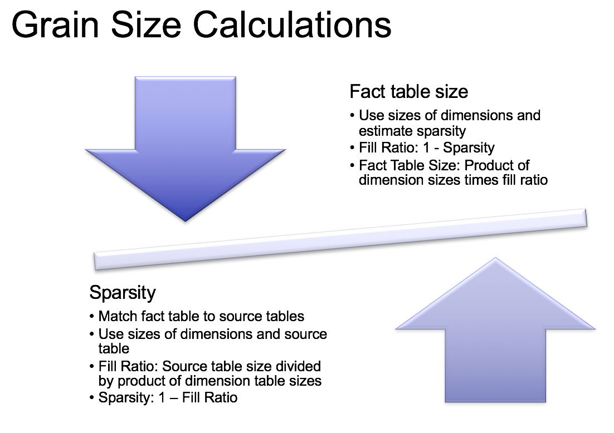

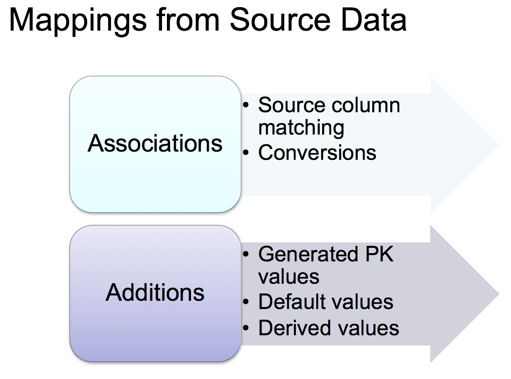

#### 设计方法： 

#### Demand-driven data warehouse design methodology 

* 也叫 requirements driven approach
* 强调定义 data marts 来捕捉Data Warehouse的特性
  * Identify data marts
  * Identify dimensions for data marts
    * Matrix relating data marts and dimensions
    * Standardize \(conform\) dimensions
  * Design fact tables
    * Define grain
    * Determine details of dimensions
    * Define measures

####  Supply-Driven Methodology

* 强调分析现有数据
* Classify entity types
  * Transactional entity types: events
  * Component entity types: related to events in 1-M relationships
* Define dimensions
  * Classification entity types: related to component entity types in 1-M relationship
  * Dimension hierarchies for component/classification entity types
* Refine dimension model
  * Collapse
  * Aggregate

####  Hybrid Methodology

* 强调目标导向
* Collect user requirements:
  * Use Goal/Question/Metric approach
  * Develop dimensions and measures \(demand driven\)
* Analyze existing ER diagrams
  * Identify entity types representing facts and dimensions
  * Create star schemas \(supply driven\)
* Integrate star schemas
  * Convert schemas to common terminology
  * Match demand and supply models

## 4. Data Integration （ETL） 

#### Refreshing Process 

基本更新过程，首先合并数据源，然后进入数据整合。

#### Workflow  

更新的流程

#### Data Problems 

* Major development activity
* More open ended than refresh with difficult to estimate time requirements
* Use profiling tools to discover data quality problems
* Perform for major data warehouse extensions

####  Refresh Processing Decision Making 

需要权衡约束，时间节点以及成本的问题。

#### Refresh Constraints 

#### Data Change Concept 

* 从internal 和 external 数据源读写和合并
* 更新数据库 data warehouse
  * Insert rows in fact and dimension tables
  * Update rows in dimension tables
* 主要挑战
  * 数据源难以改变，尤其是外部数据源
  * 缺少SQL路径和描述性数据特别是对于遗留数据 （Legacy Data）

具体分类

* Cooperative
  * Notification using triggers
  * Requires source system changes
* Logged
  * Readily available
  * Extraneous data in logs
* Queryable
  * Queries using timestamps
  * Requires timestamps in source data
* Snapshot
  * Periodic dumps of source data
  * Significant processing for difference operations

## 5. Data Cleaning 

#### 数据解析 Parsing 

将数据从源数据读入，产生成table的形式

#### 数据值的处理 

* Missing values
  * 使用默认值
  * 用average, median, or mode填补
  * 用relationships 或者 other fields 填补
* Conflicting values
  * 使用最近的数据
  * 找更加可靠的数据源

#### 数据标准化 Standardization 

* Applies conversion routines to transform data into preferred formats
* Uses both standard and custom business rules
* Common standardizations:
  * Unit of measure transformations
  * Standard abbreviations \(state names, titles, street types\)

#### 正则表达式 

这里比较熟悉了就不细说了，主要掌握常用的。

## 6. Data Integration Tool 

ETL工具产生的原因如下:

* 支持最初的数据库填充和过程更新
* 解决缺乏工具和性能不佳的问题
* 提高现有DBMS软件的生产能力
  * 集成开发环境、图形化及可视化环境、减少自定义的代码
* 实现高性能

#### 两种主流的框架 

#### ETL ： 

#### ELT 

两个框架之间的主要评价:

* 优势
  * ETL 不依赖于 DBMS ET
  * 对 relational DBMS 有更高的优化科技
* 其他问题
  * ETL 在 transformations 过程更加复杂
  * ELT 需要较少的网络带宽

不管怎样，这种集成的IDE都有以下的特性:

#### IDE Overview 

​

