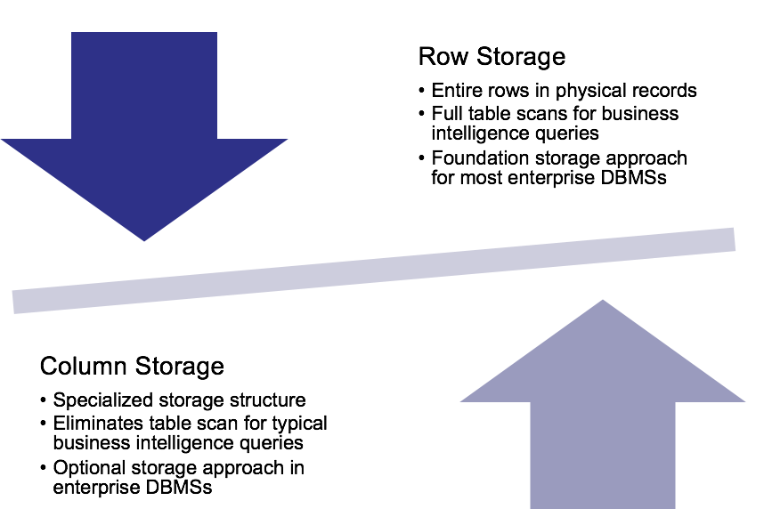

# 3.Relational Database Support for Data Warehouses

## 1. Overview

#### Data Warehouse 和 Operational Database的比较

主要差异在于DW是过去的Summerized的数据


* Missing DBMS features 
* Performance limitation
* Lack of integration

#### DBMS对DW的支持

* Relational model dominance
* Lack of scalability for data cube engines
* Large amounts of research and development of relational database performance
* New features

#### 什么是DBMS 扩展？


## 2. Analytics Functions

#### BI的分析对聚合函数有额外的要求

* Top and worst performing units
* Trends:
  * 需要定义时间段之间的差异
  * 需要在移动的窗口中使用聚合函数
* Numeric contributions
  * 排序、累计分布、百分比

#### 而现有的Select 函数并不支持：

* Difficult to write
* Poor productivity
* Poor performance

####  Analytic Function versus Aggregate Function

* Analytic function processing 在 row and group by 之后执行


#### Syntax

```sql
<AnalyticFunction> ([<column-list>]) 
OVER ([PARTITION BY <partitioning>] [ORDER BY <ordering>] 
```

#### Example

```sql
SELECT CustState, CustName, SUM(SalesDollar) AS SumSales,
  RANK() OVER (PARTITION BY CustState 
               ORDER BY SUM(SalesDollar) DESC) SalesRank
 FROM SSSales, SSCustomer
 WHERE SSSales.CustId = SSCustomer.CustI
 GROUP BY CustState, CustName
 ORDER BY CustState;
```

* Rank
  * Leaves gaps 
* Dense rank
  * No ranking gaps
* Ntile
  * Rows divided into equal divisions
* Row\_Number

#### Window的概念


#### 累计函数


#### Ratio


## 3. View

#### 什么是View?

视图是一个虚拟表，其内容由查询定义。

同真实的表一样，视图包含一系列带有名称的列和行数据。但是，视图并不在数据库中以存储的数据值集形式存在。行和列数据来自由定义视图的查询所引用的表，并且在引用视图时动态生成。

对其中所引用的基础表来说，视图的作用类似于筛选，基于数据表\(可为多个表\)的查询结果来筛选。定义视图的筛选可以来自当前或其它数据库的一个或多个表，或者其它视图。分布式查询也可用于定义使用多个异类源数据的视图。

视图是存储在数据库中的查询的SQL 语句，它主要出于两种原因：安全原因， 视图可以隐藏一些数据，如：手机联系人表，可以用视图只显示姓名，电话号码，而不显示住址和职位等，另一原因是可使复杂的查询易于理解和使用，自由组合增强可读性。

* Derived table
* 并不仅仅是子集，而是有着特殊的目的 （我一般理解为缓存cache）



#### View的主要advantages :

* Reduce impact of changes
* Simplification
* Security
* Performance penalty

Example :

```sql
CREATE VIEW Connex20142016SumSales_View AS
 SELECT SSItem.ItemId, ItemName, ItemCategory, 
        ItemUnitPrice, TimeYear, TimeMonth,
        SUM(SalesDollar) AS SumSalesDollar,
        SUM(SalesCost) AS SumSalesCost
  FROM SSItem, SSSales, SSTimeDim
  WHERE ItemBrand = 'Connex' 
    AND TimeYear BETWEEN 2014 AND 2016
    AND SSItem.ItemId = SSSales.ItemId
    AND SSTimeDim.TimeNo = SSSales.TimeNo
  GROUP BY SSItem.ItemId, ItemName, ItemCategory, 
        ItemUnitPrice, TimeYear, TimeMonth;
```

####  Query修正过程


####  Comparison of Traditional and Materialized Views


## 4. Storage  Architectures


* OLAP：所有的多表都这么叫，online analytics processing
* ROLAP：关系型OLAP，DBMS vendors
  * 支持物化视图 
  * 支持大量cubes
* MOLAP：多维OLAP
  * 强调Cube的物理存储
  * 对稀疏数据进行压缩
  * 受到物理Cube现在
  * 比ROLAP快
* HOLAP：混合OLAP

 

Bitmap Index




