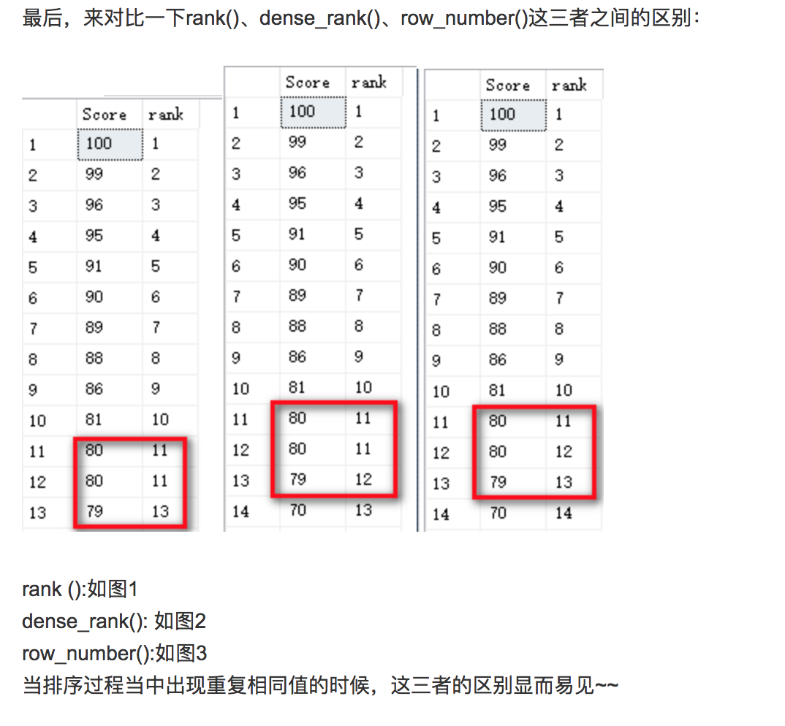

# Window Functions

## 1. Over\(\)

#### 什么是window function ?

window function对表中的数据进行运算，而当前的运算操作和其他行是相关的，见下动图


这个东西被叫做window function是因为行在一个滑动窗口之中，这个窗口就是**window** or a **window frame。**

```text
<window_function> OVER (...)
```

`<window_function>` 可以是 **aggregate function**  \(`COUNT()`, `SUM()`, `AVG()`etc.\), 或者 **ranking** or **analytical function** 

*  window frame 在 `OVER(...)`  中定义

#### Over 概念

简单的over概念，`aggregate function + OVER()`

```sql
SELECT
  title,
  editor_rating,
  AVG(editor_rating) OVER()
FROM movie;
```

over的本质就是group by，当什么都不放入的时候就是全部的集合，当需要partition的时候，就加入partitiion by即可。

* partition by = group by 这里省去了子查找，后面会细细说

```sql
SELECT
  first_name,
  last_name,
  country,
  COUNT(id) OVER(PARTITION BY country)
FROM customer;
```

#### 小结

* Use `<window_function> OVER()` to compute an aggregate for all rows in the query result.
* The window functions is applied **after** the rows are filtered by `WHERE`.
* The window functions are used to compute aggregates but keep details of individual rows at the same time.
* You **can't use** window functions in `WHERE` clauses.

## 2. Partition By

这一部分主要讲，可以在over\(\)进行分组，主要的syntax是 `PARTITION BY`

```sql
<window_function> OVER (PARTITION BY column1, column2
... column_n)
```

`PARTITION BY` 同`GROUP BY` 基本一样 ：就是按照列进行分组。

*  不同于 `GROUP BY`, `PARTITION BY`  并不好实际上合并行，更像是扫描


#### 小结

* `OVER(PARTITION BY x)`works in a similar way to `GROUP BY`, defining the window as all the rows in the query result that have the same value in **x**.
* **x** can be a single column or multiple columns separated by commas.

## 3. Ranking

排序的基本语法如下：

```sql
<ranking function> OVER (ORDER BY <order by columns>)
```

因为需要排序，所以在over中需要使用order by来进行排序

#### 主要函数的区别（从前面的搬运过来）：

* **Row\_number\(\):** 类似一个统计函数，就是计数函数，比如从1到n，如果不用partition by 就是行的index。
* **RANK\(\) ：**主要是给出具体的排序，但是rank不一样在于，它允许一种并列的情况，而且会自动允许存在gap
*  **DENSE\_RANK\(\):** 和rank很像，只是它会取消之间的gap
  * 有并列 :  Rank & Dense\_Rank 
    * 有gap :  Rank
    * 无gap ：Dense\_Rank 
  * 无并列 :  Row\_number 



#### Ntile

这个函数我一直用的比较少，大致是将数据分成n个部分。

```sql
SELECT
  name,
  genre,
  editor_rating,
  NTILE(3) OVER (ORDER BY editor_rating DESC)
FROM game;
```

* 在分组的过程之中是可能存在不能均分的情况的

![\[Part4\_graphic\]](https://academy.vertabelo.com/static/window-functions-part4-ex15.png)

CTE函数的应用

因为使用了Window Function，所以不能进行filter，必须用cte作为缓存表来存储所有的数据，这里cte可以理解为subquery。

```sql
WITH ranking AS
  (SELECT
    title,
    RANK() OVER(ORDER BY editor_rating DESC) AS rank
  FROM movie)

SELECT title
FROM ranking
WHERE rank = 2;
```

## 4. Window Frame

这里主要是讲如何控制窗口的大小，主要通过rows来进行控制。

* ROWS BETWEEN UNBOUNDED PRECEDING AND CURRENT ROW

```sql
SELECT
  id,
  payment_date,
  payment_amount,
  SUM(payment_amount) OVER(ORDER BY payment_date
    ROWS BETWEEN UNBOUNDED PRECEDING AND CURRENT ROW)
FROM subscription;
```

这里的一些关键词

* unbounded 无限制往上或往下
* preceding 前面
* following 后面
* current row 现在的一行

#### Range & Rows

* ROWS：是按物理行来进行窗口级别里再次进行范围选择的。
* RANGE：是按逻辑行来进行窗口级别里再次进行范围选择的。

RANGE时，相同行会被合并成同一条数据再进行计算，相同行窗口计算时的结果也是相同的。 是否是相同行，是根据ORDER BY排序时的结果决定的。 

* 有ORDER BY时：同行是说在ORDER BY排序时不唯一的行。【即具有相同数值的行】 
  * 不同行是说ORDER BY排序时具有不同的数值的行。
*  没有ORDER BY：那么就是当前分区的所有行都包含在框架中，因为所有行都会成为当前行的相同行。【特别要注意最后一句的意思】

{% embed url="https://dreamer-yzy.github.io/2015/01/01/PostgreSQL%E7%AA%97%E5%8F%A3%E5%87%BD%E6%95%B0%E4%B8%AD-ROWS-%E5%92%8C-RANGE-%E6%A8%A1%E5%BC%8F%E7%9A%84%E5%8C%BA%E5%88%AB/" %}

## 5. Analytics Function

这些函数都需要在window frame里面才可以发挥作用，基本可以分为两类。

* 对列移动的：
  * lead - 列往上移n格
  * lag - 列往下移n格
* 对列求值的:
  * first\_value : 列的第一个值
  * last\_value : 列的最后一个值

#### Over中含有聚合函数

如果在over中也含有聚合函数，是需要group by的，因为这里本质上需要group by 两次。

