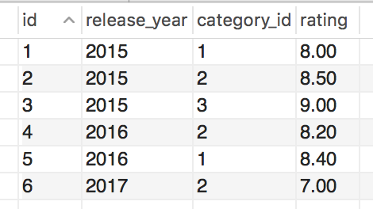
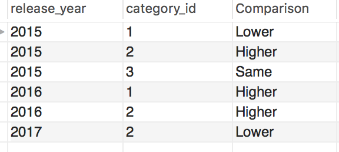

# SQL其他技术补充

## 导言

虽然SQL以及学了很多遍了，但是感觉学的都是非常经典也就是古老的SQL知识，现在的SQL以及有了非常长足的发展。在刷了一遍Leetcode的SQL之后，明显感觉到很多查询都太繁琐而冗长。这里主要将几种主要的技术作为补充。

## With -  Common Table Expression

在MySQL 8.x之后，同T-SQl以及其他语言保持一致，所以很多技术都慢慢出现了。

这里主要以films这个表作为例子，进行演示，存储这个table的schema是test



借用Leetcode中的一道题的思路，如果这里要求计算，是否某一年的category的rating和总的三年间这个平均值的比较，也就是返回下表。



思路：如果用传统的subquery，要先算出每个category 的rating，然后再将表join起来，用case when来比较得出最后的结果。

```sql
select f.release_year,f.category_id,
		case when f.rating < temp.avg then 'Lower'
			 when f.rating > temp.avg then 'Higher'
             else 'Same'
		end as Comparison
from films as f
left join (select category_id,avg(rating) as avg
		   from films
           group by category_id) as temp 
on temp.category_id = f.category_id
order by f.release_year,f.category_id
```

这里如果使用CTE函数，就可以做一个暂时的表，也就是SAS中的in-line-view。这里先将temp存为一个暂时的表，不断调用即可，这里猜测的原理可能是，先建一个表再删除掉，这会使得整个SQL query变得非常清晰。

```sql
with temp as (select category_id,avg(rating) as avg
		   from films
           group by category_id) 

select f.release_year,f.category_id,
		case when f.rating < temp.avg then 'Lower'
			 when f.rating > temp.avg then 'Higher'
             else 'Same'
		end as Comparison
from films as f
left join temp
on temp.category_id = f.category_id
order by f.release_year,f.category_id
```

从我自己做题的感觉来看，CTE函数的好处主要在：

* **清晰**：增强了SQL query 的可读性，便于读者快速理解其中的思路。
* **可重复和延展性**：如果可以允许过渡表的存在，等于我们可以多次调用temp这个表，这剩下来很多写subquery的空间。

这里给一个follow up的问题，如果我想知道根据这个comparison，第一年低于平均，但第二年高于平均的年和category\_id，怎么进行计算。

```sql
with temp as (select category_id,avg(rating) as avg
		   from films
           group by category_id) ,

     temp2 as( select f.release_year,f.category_id,
                      case when f.rating < temp.avg then 'Lower'
			               when f.rating > temp.avg then 'Higher'
                           else 'Same'
		               end as Comparison
               from films as f
               left join temp
               on temp.category_id = f.category_id
               order by f.release_year,f.category_id)

select t1.release_year,t1.category_id,t1.comparison,t2.comparison
from temp2 as t1, temp2 as t2
where t1.comparison = 'Lower' and t2.comparison = 'Higher'
and t1.category_id = t2.category_id and t1.release_year = t2.release_year -1
```

这里我调用了temp2两次，也就是刚才写的query，而temp2调用了temp一次，如果这样直接用subquery写，就会非常非常占用空间，而且思路不清晰。有兴趣的话，可以自己试一试。

## Window Function

开窗函数是我觉得非常非常好用的一个函数，它的好处基本和CTE一样，它直接优化了原有所有的算法和query，使得原有query的逻辑变得非常清晰。这个函数非常值得掌握。

仍然以刚才的表为例，先计算Running Total。

如果要计算每一年的平均评分，在依次加入新的category之后，平均评分如何进行变化，也就是产生下表的结果。


传统做法就是subquery子查询控制法，用id来控制依次取平均就可以

```sql
select f.id,f.release_year,f.category_id,f.rating,
		(select avg(f1.rating)
        from films as f1
        where f1.release_year = f.release_year and f.category_id >= f1.category_id)
from films as f

```

有了窗口函数就简单很多很多了。

```sql
select f.id,f.release_year,f.category_id,f.rating,
avg(f.rating) over(partition by release_year order by category_id) as running_total
from films as f
```

这里可以follow up一下，如果我们要累计的平均，累计的计数，理解的rank，怎么算。

如果使用传统的方法，就是写很多很多子查询，如果两个使用的条件一样还好，可以用一个query写完，可是如果不一样就要写很多，而用开窗函数就会简单非常多。

* 窗口函数可以想象成一个小窗一点一点进行移动扫描，然后将每个窗口的结果返还再做一个Join

MySQL定义的窗口函数如下:



具体参见MySQL官方文档:

[https://dev.mysql.com/doc/refman/8.0/en/window-function-descriptions.html](https://dev.mysql.com/doc/refman/8.0/en/window-function-descriptions.html)



这里等我慢慢一个一个写。


## Data Cleaning

除了这些技巧之外，还有一些常见的函数，比较有用，天色已晚，我明天整理一下。

* left & right
* position , strpos, lower, upper
* concat
* cast
* coalease

