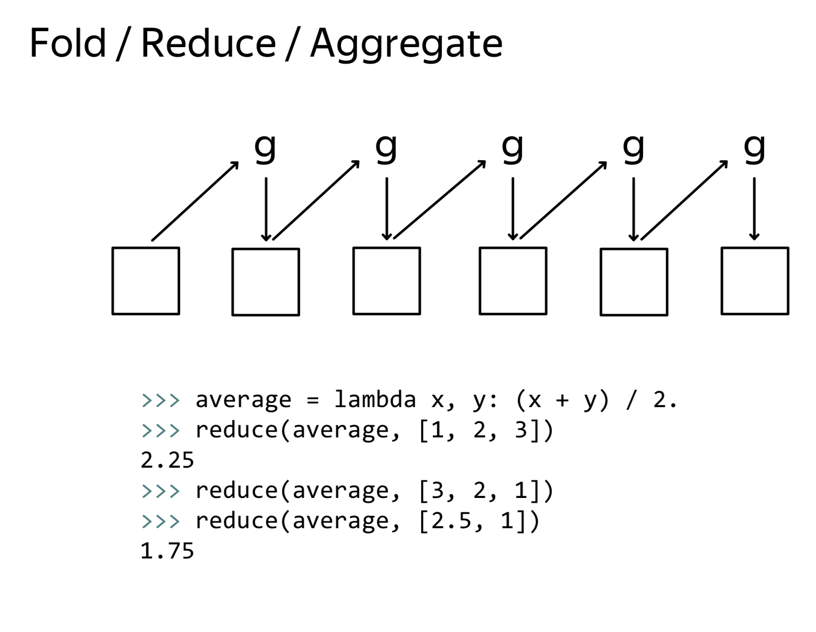

# HDFS, MapReduce and Spark RDD \(2\)

### **1.** Hadoop MapReduce: How to Build Reliable System from Unreliable Components

#### Unreliable Components

If we have a cluster, we need first to read data from local disks, to do some computations, and to aggregate results over the network. What components can break in this system? To be honest, each and all. Cluster nodes can break any time because of power supply, disk damages, overheated CPUs, and so on. From the distributed system, clearer perspective.


**Types of Nodes Faliures**

* Fail-Stop : It means that if machines get out of service during a computation then you have to have an external impact to bring system back to a working state.
* Fail-Recovery : During computations, nodes can arbitrarily crash and return back to servers.What is interesting, this behavior doesn't influence correctness and success of computations. No external impact necessary to reconfiguring the system at such events. 
* Byzantine failure : A distributed system is robust Byzantine failures if it can correctly work despite some of the nodes behaving out of protocol. In other words, you have nodes that are going to lie through their little digital teeth to destabilize the system.

**What is Byzantine failure** ？

A problem can be expressed expertly in terms of group of generals of the Byzantine army camped with their troops around an enemy city. Communicating only by a messenger, the generals must agree upon a common battle plan. However, one or more of them may be a traitor who trying to confuse the others.


In the first image, you have the second lieutenant as a traitor. The first lieutenant got a comment, attack, from the commander and got a message, commander ordered to retreat, from the second lieutenant. In the second image, you have the general as a traitor. Without lost of generality, the first lieutenant got a comment, attack, from the commander and a message, commander ordered to retreat, from the second lieutenant. In both images, you have the same message in different situations. And loyal participants should come to a different plan, attack in the first scenario, and retreat in the second one.

**Types of Links Failures** In addition to node failures, there can be problems with network connections.

* perfect link: it means that all the sent messages must be delivered and received without any modification in the same order. 
* Fail-loss link: means that some part of the messages can be lost but the probability of message loss does not depend on contents of a message.Packet loss is a very common problem for network connections. 
  * For instance, the well-known TCP/IP protocol tries to solve this problem by re-transmitting messages if they were not received. 
* Byzantine links: If you have byzantine links in the system, it means that some messages can be filtered according to some rule, some messages can be modified, and some messages could be created out of nowhere, really.


**The Two Generals Paradox** Similar story, there are two generals on a campaign. They have an objective, a tower that they want to capture. If they simultaneously march to the objective, they win. Otherwise, the one who march will be destroyed. Due to technical difficulties, they can communicate only via messengers. Unfortunately, the world is occupied by the city's defenders and there is a chance that any given method sent through the wall will be captured. The problem is to find a protocol that allows the generals to march together even, through some methods, get lost. There is a simple proof that no fixed plans protocol exists.


**Clock synchronization problem.** Imagine you have a booking system and the only one ticket is left. You have two customers who tried to purchase a ticket more or less at the same time. Then, each of the nodes of our distributed system notifies the other about tickets selling. Who was there first?


* clock skew : This  the time can be different on different machines.
* clock drift : There can be a different clock rate called drift, to mitigate the first problem. 

Any clock synchronization mechanism is subject to some precision. That is why logical clocks were invented. Logical clocks help to track happened before events and therefore, order events to build reliable protocols.

Systems can be divided into **synchronous** and **asynchronous**.

* Synchronous systems : Every network packet should be delivered within a limited time bound. Clock drift is limited in size and each CPU instruction is also limited in time.
* Asynchronous systems : Not Synchronous systems

The example, which will be discussed in the course, is fail-recovery, fair-loss link, and asynchronous model.

#### MapReduce

MapReduce was invented by Jeffrey Dean and Sanjay Ghenawat. And presented on Symposium on Operating Systems Design and Implementation in 2004. It was just one year after the article about distributed Google file system was published.

* map : apply the same function to each element of your collection.
* shuffle and sort phase: Sort data and build hash table
* reduce : In the world of functional programming, it could have been named as fault or aggregate. 
  * Reduce function computes the value from left to right. mean function is not associative.




#### Distributed Shell

Find the most popular words in the Wikipedia with MapReduce.The first step is to count how many times each word appear in a data set. This problem is called, word count. If you have a small data set, then you can process data on one computer with a few simple CLI calls. cat, tr, sort, and uniq.


For a distributed MapReduce application,

* cat is used to read data. 
* tr is a map function to split text into words
* uniq is obviously a reduced function. 

Actual Process

* During the map phase, the text is split in two words. 
* Then, during shuffle and sort phase, words are distributed to a reduce phase in a way that reduce functions can be executed independently on different machines. 
  * For word count application, it means that words are distributed by a word hash. In a simple example, if you have 26 independent reducers, and only English words, then you could spread their words alphabetically by their first character from a to z. 
* Reduce phase will count all the letters.


#### Fault Tolerance

In a distributed file system, you store information with duplication in order to overcome node failures. MapReduce framework should also provide robustness against node failures during the job execution.

* Application master program : control the execution 
* Mapper Worker Dies : launch mappers to process input blocks or splits of data. Using other replica
  * To overcome the issues of correction execution mappers, you have to recollect functional programming benefits.
* Reducer Worker Dies : shuffle and sort data for this particular reducer to another worker.


**Map reduce Version One**


First of all, you have jobs and tasks. One MapReduce application is a job. It is a big chunk of work. Whereas, a task can be either mapper or reducer. It is a map or reduce function applied to some chunk of data.

In the first version of Hadoop MapReduce framework, there was one **global JobTracker** to direct execution of MapReduce jobs. It is usually located on one high-cost and high-performance node with HDFS namenode.

* TaskTrackers are located once per every node where you store data, or where datanode daemon is working. TaskTracker spawns workers from mapper or reducer. 
* It is easy to see that in this scenario, JobTracker is a single point of failure. That is why to reduce the load on JobTracker, some functionality of future versions was delegated to other cluster nodes. 

**Mapreduce Version Two - YARN**


The next generation of MapReduce framework is called YARN. It stands for **Yet Another Resource Negotiation**.

* There are no more TaskTrackers. They are substituted by NodeManagers who can provide a layer of CPU and RAM containers. 
* ResourceManager overseas NodeManagers, and client request resources for execution from there. 
* MapReduce applications can work on top of this resource layer. And at last, there is no concept such as a global JobTracker because application master can start on any node. 
* All of these enable Hadoop to share resources dynamically between MapReduce and other parallel processing frameworks. 

### 2. Haddop MapReduce Streaming Applications in Python

#### Streaming

To wite Python code in Hadoop, we have many options.

* Jython to write java code on Python
  * Hadoop is written on Java, so this approach will provide a seamless interaction between two languages. 
  * On the one hand, you will have more flexibility to integrate with Hadoop-Java functionality.
  * It is not possible to use NumPy and SciPy packages, for numerical calculations, because there is no way to interface with extensions written in C. 
* Python application in streaming mode. 
  * Hadoop Streaming

If we want to use user self-defined mapper and reducer, Hadoop also supports these functionality.

* mapper 
  * parsing input data
  * processing data
  * outputting the data in such a way that Hadoop framework will recognize keys and values.
* reducer 
  * parsing input data
  * aggregating sorted data by keys
  * processing data
  * outputting data. 


One of the simplest examples is to count the number of lines in a dataset. Instead of using command line or shell programming language, we can also use bash script or awk script.


To clean up the folder, you can simply call HDFS command you see on the screen.

```text
hdfs dfs -rm -r wc_mr
```

#### Streaming in Python

After understanding the Streaming, we want to use Python to complement all the Streaming.

We can pack all scripts into a Jar package. To do this job, you have to provide mapper.py which reads data from the standard input, and prints it out to the standard output.


#### Wordcount Example in Python

Mapper :

```python
from __future__ import print_function import re

import sys
for line in sys.stdin:
  article_id, content = line.split("\t", 1)
  words = re.split("\W+", content) 
for word in words:
  if word:
    print(word, 1, sep="\t")
```

Reducer :

```python
from __future__ import print_function 
import sys
current_word = None 
word_count = 0

for line in sys.stdin:
  word, counts = line.split("\t", 1) counts = int(counts)
  if word == current_word:
    word_count += counts 
  else:
    if current_word:
      print(current_word, word_count, sep="\t")
        current_word = word
        word_count = counts

if current_word:
  print(current_word, word_count, sep="\t")
```


The results are saved in 6 different parts.

#### Distributed Cache

Upload local file for distributed file system to allow computation, genearally speaking, there are three types of caches

* "-files" : names.txt
* "-archieves" : jar 
* "-libjars"


#### Environment and Counters

We can use global environment to help us track the mapreduce process. Moreover, we can report progress back to Hadoop MapReduce Framework.


#### Testing

Python unit testing tool here is pytest.It has a good integration with debugging functionality. Let me show you how to debug a simple function with pytest.

The aim of testing is to validate your scripts in a reproducible environment as close as possible to the production of one. Emulation of MapReduce locally is a natural choice aligned with this idea.

* Unit Testing : a well known approach that can save you a number of sleepless nights.
* Integration testing : you can validate the whole pipeline with mapper and reducer, or independent mapper or reducer with the hand-crafted input. 
* System tesing:Hadoop MapReduce framework provides an empty config which you can use for HDFS, MapReduce and the Yarn clients. If you provide a Hadoop empty config, then you execute the whole MapReduce application in a standalone mode. 
* Acceptance Testing :  Validation of your streaming scripts against a sample dataset is usually the final stage before shipping your code into the production system. If your testing dataset is small, then you should be able to compare result with Athlon solution. In addition to this, if your script contain bugs, then you will find them early without wasting your time and CPU cycles. 

### 3. Hadoop MapReduce Application Tuning : Job Configuration, Comparator, Combiner, Partitioner

#### Combiner

After mapping in each datanode, redundant data may exit. To eliminate the redundancy, we can combine the data at firtst. This is combiner.


  

It will make the operation time faster.


#### Partitioner

Partitioner helps to split the data using self-defined method.

* Collocation is a sequence occur to get unusual often. The only difference is that you will count bigrams of words instead of independent words. 

Command line arguments you can specify the way to split as three mapper or reduce your output to a key value pair. In this case you would like to split the line into key value pairs by the second tab character.


#### Comparator

Similar to Partitioner, it will compare all the data.


#### Speculative Execution & Backup Task

One of the most common problems that causes a MapReduce application to wait longer for a job completion is a straggler. A stroller is a machine that takes an unusually long time to complete one of the last few tasks in the computation.

* There can be problems with hard drive, operation system configurations, swap space uses network connections or CPU overutilization and whatnot. 

The solution for this problem was provided by the authors of MapReduce in the original article. They call it Backup Tasks. Due to the deterministic behavior of the Mapper and Reducer, you can easily re-execute straggler body of work on other note.

* In this case, the worker which processes data, they first outputs data to a distributed file system. All the other concurrent executions will be killed. Of course, the MapReduce framework is not going to have a copy for each running task. It is only used when a MapReducer application is close to completion. 


#### Compression

Data compression is essentially a trade-off between

* disk I/O required to read and write data
* network bandwidth required to send data across the network. 
* in-memory calculation capacity, where the in-memory calculation capacity is a composite of speed and usage of CPU and RAM. 
* The correct balance of these factors depends on the characteristics of your cluster, your data, your applications, or usage patterns, and the weather forecast. 


