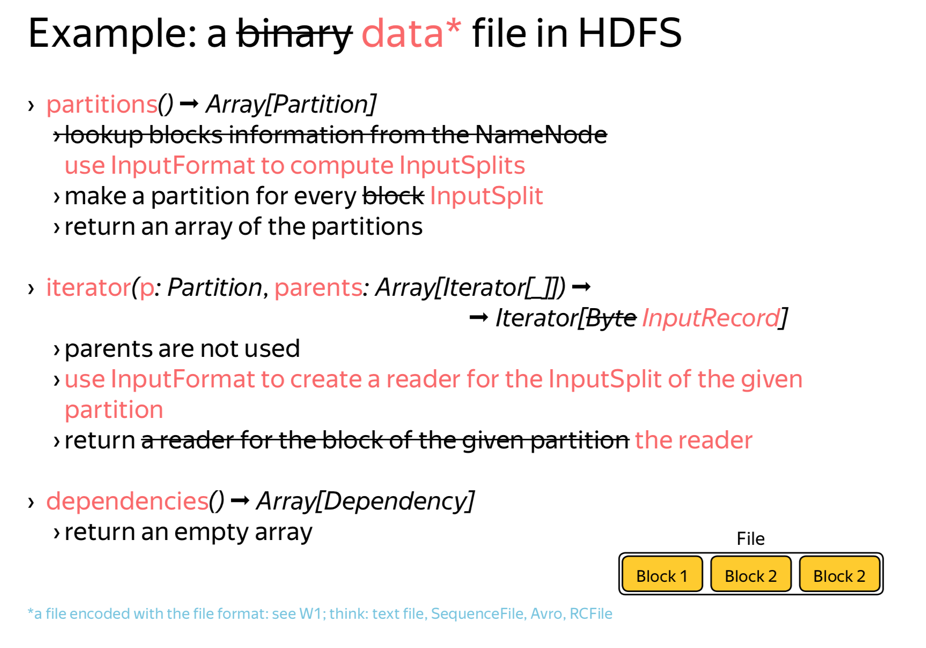
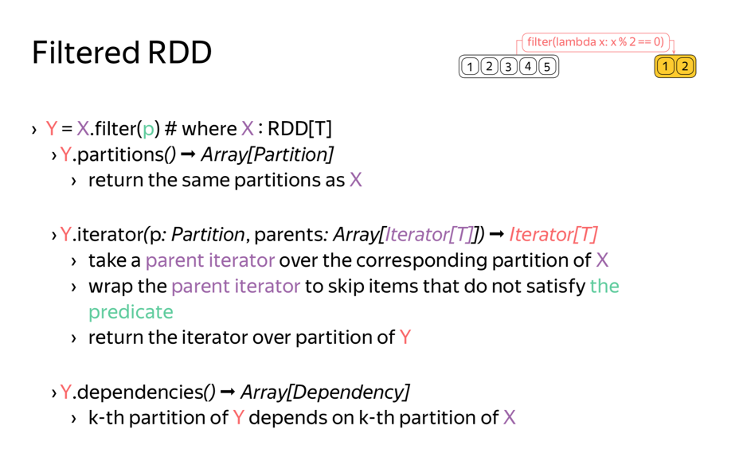
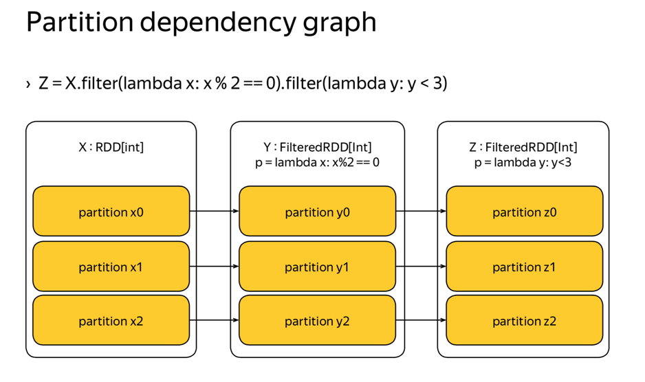

# HDFS, MapReduce and Spark RDD \(4\)

### Core Concepts and Abstractions

**First epoch \(2009-2012\)**

**Existing Problem:**

* Underutilization of cluster memory
  * for many companies data can fit into memory either now, or soon 
  * memory prices were decreasing year-over-year at that time
* Redundant disk I/O
  * especially in iterative MR jobs
* Lack of higher-level primitives in MR
  * one has to redo joins again and again
  * one has to carefully tune the algorithm

**Solution:**

* RDD abstraction with rich API
* In-memory distributed computation platform

**Second epoch \(2012-2014\)**

**Existing Problem:**

* No "one system to rule them all"
  * typical cluster would include a dozen of different systems tailored for specific applications
  * recurrent data copying between the systems increases timings
* Increasing demand for interactive queries and stream processing 
  * due to raise of data-driven applications
  * need for fast ad-hoc analytics 
  * need for fast decision-making

**Solution:**

* Spark SQL
* Spark Streaming
* Spark GraphX
* Spark MLlib

**Third epoch \(2014-now\)**

**Existing Problem:**

* Increasing use of machine learning
* Increasing demand for integration with other software\(Python, R, Julia...\)

**Solution:**

* Focus on ease-of-use
* Spark Dataframes as first-class citizens

#### RDD

RDD stands for Resilient Distributed Datasets.Formally, a read-only, partitioned collection of records.

* Resilient — able to withstand failures
* Distributed — spanning across multiple machines

To adhere to RDD interface, a dataset must implement:

* partitions\(\) -&gt; Array\[Partition\]
* iterator\(p: Partition, parents: Array\[Iterator\]\) -&gt; Iterator 
* dependencies\(\) -&gt; Array\[Dependency\]

#### Transformations

To construct RDD, there are generally two ways.

* Data in a stable storage \(previous video\)
  * Example: files in HDFS, objects in Amazon S3 bucket, lines in a text file
  * RDD for data in a stable storage has no dependencies
* From existing RDDs by applying a transformation \(this video\) › Example: filtered file, grouped records, ...
  * RDD for a transformed data depends on the source data

Types of transformation - execute when iteration \(lazy\)

* filter\(lambda x: x % 2 == 0\)
* map\(lambda x: 2 \* x\)
* groupByKey\(\) 
* reduceByKey\(\)
* cogroup\(\)
* join\(\)

**Narrow dependencies & Wide dependencies**

* Narrow dependencies :at most one child partition for every parent partition
* Wide dependencies :more than one child partition for every parent partition

#### Actions

Driver program runs your Spark application. Driver delegates tasks to executors to use cluster resources.

* In local mode, executors are collocated with the driver
* In cluster mode, executors are located on other machines

Actions: Triggers data to be materialized and processed on the executors and then passes the outcome to the driver

* collect\(\) :collects items and passes them to the driver
* take\(n: Int\) : collects only n items and passes them to the driver
  * tries to decrease amount of computation by peeking on partitions
* top\(n: Int\) :collects n largest items and passes them to the driver
* reduce\(\) :reduces all elements of the dataset with the given associate, commutative binary function and passes the result back to the driver
* saveAsTextFile\(\): each executor saves its partition to a file under the given path with every item converted to a string and confirms to the driver
* saveAsHadoopFile\(\) :each executor saves its partition to a file under the given path using the given Hadoop file format and confirms to the driver
* foreach\(\) :each executor invokes f over every item and confirms to the driver
* foreachPartition\(\) : each executor invokes f over its partition and confirms to the driver

