# System Design \(1\)  - Twitter Design

## 1. 系统设计基础

#### 系统设计 vs 面向对象设计

* 形式上:
  *  面向对象设计手把手的 Coding 
  * 系统设计高屋建瓴的“扯淡”
* 考察的知识点上:
  * 面向对象设计:  
    * Class, Object, Method, Inheritance, Interface ...
  * 系统设计考的是:  
    * Database, Schema, SQL, NoSQL, Memcached, File System, Distributed System, Latency, Scalbility, Master Slave, Load Balancer, Web Server, Message Queue, Sharding, Consistent Hashing, QPS ...
* 典型题:
  * 面向对象设计:  电梯设计，游戏设计 
  * 系统设计:  短网址系统设计，新鲜事系统设计

## 2. 系统设计的主要流程

系统时间非常忌讳一上来就抛出复杂的概念，如下:

* Load Balancer, Memcache, NodeJS, MongoDB, MySQL, Sharding, Consistent Hashing, Master Slave, HDFS, Hadoop

而是应该从客户出发，从需求的角度逐步去分析和解决问题：

#### 4S分析法 Scenario, Service, Storage, Scale

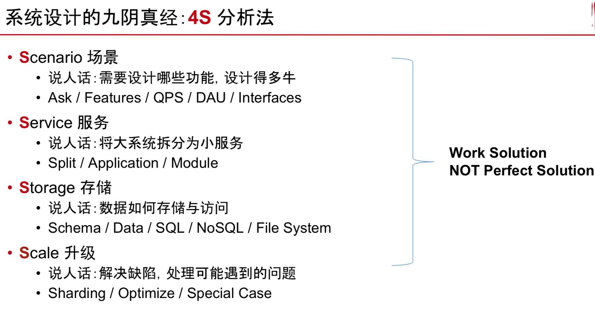

### Scenario 场景

* 需要哪些功能，目标客户是谁
* 分析

#### 首先了解需求

* DAU :  Daily Active User
* MAU : Monthly Active User

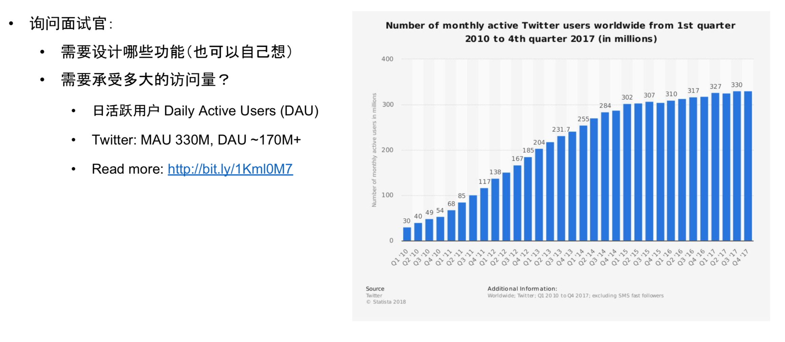

* **Step 1: Enumerate**
  * 说人话: 把Twitter的功能一个个罗列出来
  * Register / Login
  * User Profile Display / Edit
  * Upload Image / Video \*
  * Search \*
  * Post / Share a tweet
  * Timeline / News Feed
  * Follow / Unfollow a user
* **Step 2:Sort**
  * 说人话: 选出核心功能，因为你不可能这么短的时间什么都设计
  * Post a Tweet
  * Timeline
  * News Feed
  * Follow / Unfollow a user
  * Register / Login

#### 其次分析需要的机器性能

这里的数字估计并不是很准确，重要的不是计算结果而是计算过程。

* **并发用户 Concurrent User**
  * 日活跃 \* 每个用户平均请求次数 / 一天多少秒 = 150M \* 60 / 86400~ 100k
  * 峰值 Peak = Average Concurrent User \* 3 ~ 300k
  * 快速增长的产品 Fast Growing
    *  MAX peak users in 3 months = Peak users \* 2 
* **读频率 Read QPS \(Queries Per Second\)**
  * 300k
* **写频率 Write QPS**
  *  5k

#### 根据QPS选择适合的数据库和机器

* **QPS = 100**
  * 用你的笔记本做 Web 服务器就好了
* **QPS = 1k**
  * 用一台好点的 Web 服务器就差不多了
  * 需要考虑 Single Point Failure
* **QPS = 1m**
  * 需要建设一个1000台 Web 服务器的集群
  * 需要考虑如何 Maintainance\(某一台挂了怎么办\)
* **QPS和 Web Server \(服务器\) / Database \(数据库\) 之间的关系**
  * 一台 Web Server 约承受量是 1k 的 QPS \(考虑到逻辑处理时间以及数据库查询的瓶颈\)
  * 一台 SQL Database 约承受量是 1k 的 QPS\(如果 JOIN 和 INDEX query比较多的话，这个值会更小\)
  * 一台 NoSQL Database \(Cassandra\) 约承受量是 10k 的 QPS
  * 一台 NoSQL Database \(Memcached\) 约承受量是 1M 的 QPS

### Service 服务

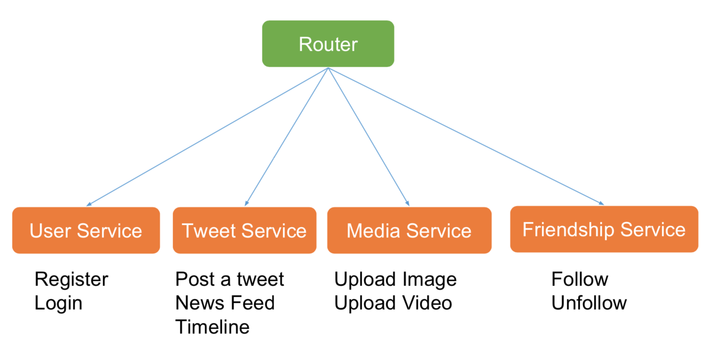

#### 首先将大系统拆成小服务

* **Step 1: Replay**
  * 重新过一遍每个需求，为每个需求添加一个服务 
* **Step 2: Merge**

  * 归并相同的服务

* 什么是服务 Service?
  * 可以认为是逻辑处理的整合
  * 对于同一类问题的逻辑处理归并在一个 Service 中
  * 把整个 System 细分为若干个小的 Service

### Storage 存储 

* Select 为每个 Service 选择存储结构 
* Schema 细化表结构

#### 数据如何存储与访问

* 数据库系统 Database
  * 关系型数据库 SQL Database 
    * 用户信息 User Table
  * 非关系型数据库 NoSQL Database 
    * 推文 Tweets
    * 社交图谱 Social Graph \(followers\)
* 文件系统 File System
  * 图片、视频 Media Files
* 缓存系统 Cache
  * 不支持数据持久化 Non-persistent
  * 效率高，内存级访问速度

数据库系统是建立在文件系统之上的，数据库系统只是对此进行了优化。

* **关系**: 数据库系统是文件系统的一层包装，他们不是独立的关系，是依赖的关系。数据库系统依赖于文件系统。
* **区别**:  数据库系统提供了更丰富的数据操作，很细；文件系统只提供了简单的文件操作接口，很粗。
  * 以关系型数据库\(Relational Database\) 为例，提供了 SQL 语句这样的丰富的查询语言，可以一些复杂的 filter，如快速找出学生信息表中，所有 20-24 岁的学生信息。如果直接在文件系统上，则需要扫描完所 有的学生数据后才能找到。

数据库系统中读取的数据，大部分情况下\(除了被 cache 的\)，都还是会到文件系统上去读取出来的。因此两个系统的读写效率\(不考虑复杂查询\)可以认为是差不多的。

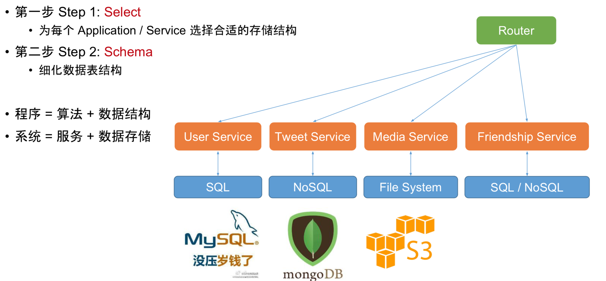

#### 进一步设计需要的schema

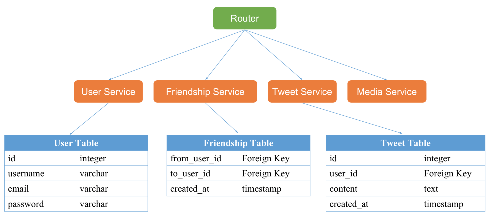

#### 新鲜事系统

新鲜事系统 News Feed System，通常是指一些有 “订阅” / "关注" 机制的系统。  
如，Facebook, Twitter, Instagram, 微信朋友圈，Google RSS Reader。  
这类系统的设计思路是通用的，学会了一个，就可以触类旁通。

* 什么是新鲜事 News Feed?
  * 你登陆 Facebook / Twitter / 朋友圈 之后看到的信息流
  * 你的所有朋友发的信息的集合
* 有哪些典型的新鲜事系统?
  * Facebook
  * Twitter
  * 朋友圈
  * RSS Reader

    • 新鲜事系统的核心因素? • 关注与被关注

    • 每个人看到的新鲜事都是不同的

#### Pull Model

每次用户发出请求，就从数据库之中获取信息。

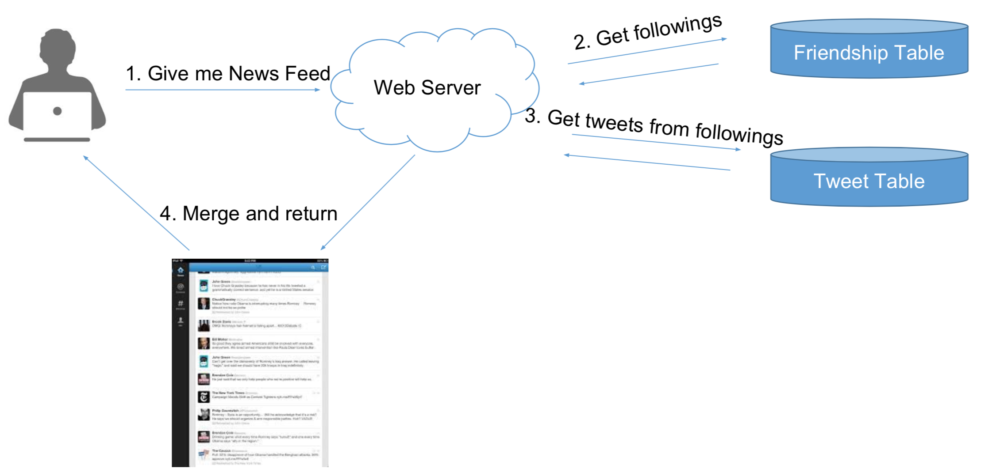

* **算法**
  * 在用户查看News Feed时，获取每个好友的前100条Tweets，合并出前100条News Feed
  * K路归并算法 Merge K Sorted Arrays
* **复杂度分析**

  * News Feed =&gt; 假如有N个关注对象，则为N次DB Reads的时间 + K路归并时间\(可忽略\)
  * Post a tweet =&gt; 1次DB Write的时间

#### 缺陷

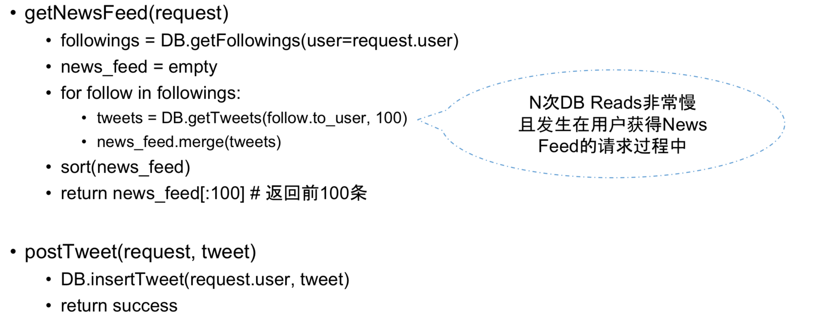

#### Push Model 

每一次一个用户发一条twitter，提前将数据准备好给用户。

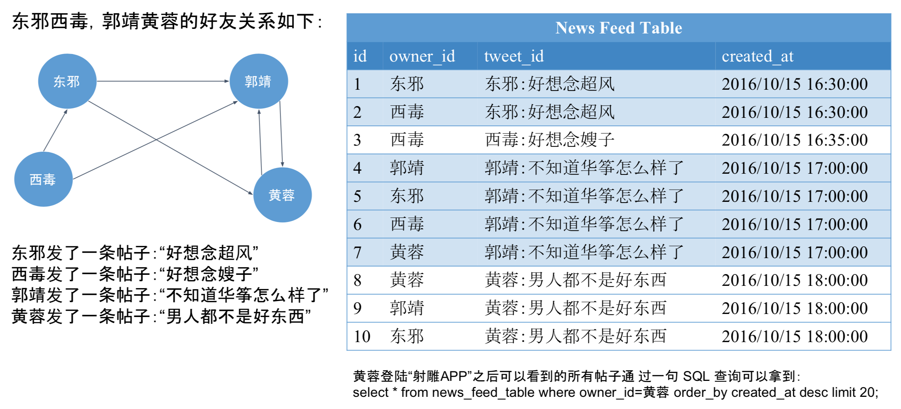

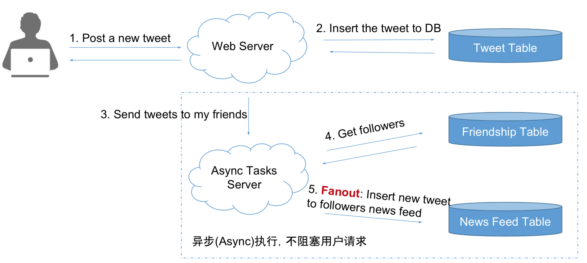

* 算法
  * 为每个用户建一个List存储他的News Feed信息
  * 用户发一个Tweet之后，将该推文逐个推送到每个用户的News Feed List中
* 关键词: Fanout
  * 用户需要查看News Feed时，只需要从该News Feed List中读取最新的100条即可
* 复杂度分析
  * News Feed =&gt; 1次DB Read
  * Post a tweet =&gt; N个粉丝，需要N次DB Writes
  * 好处是可以用异步任务在后台执行，无需用户等待

#### 缺陷

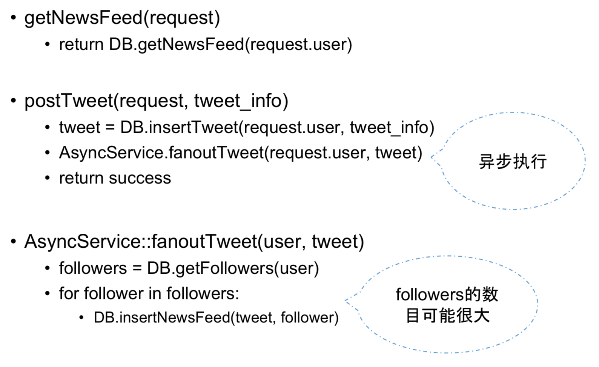

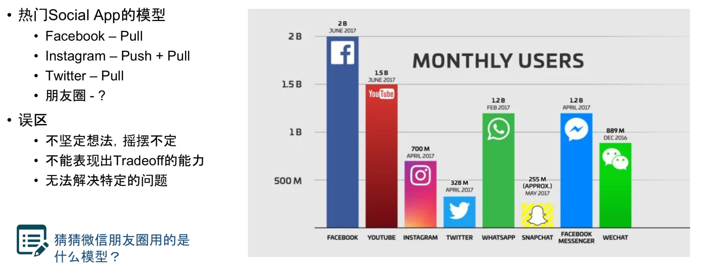

#### 前三个S的小节

用过前3个步骤的分析，我们已经得到了一个可行方案

*  **Scenario 场景**
  * 和面试官讨论
  * 搞清楚需要设计哪些功能
  * 并分析出所设计的系统大概所需要支持的 Concurrent Users / QPS / Memory / Storage 等
* **Service 服务**
  * 合并需要设计功能，相似的功能整合为一个Service
* **Storage 存储**
  * 对每个 Service 选择合适的存储结构
  * 细化数据表单
  * 画图展示数据存储和读取的流程
  * 得到一个 Work Solution 而不是 Perfect Solution
  * 这个Work Solution 可以存在很多待解决的缺陷

### Scale 扩展

* **Step 1: Optimize**
  * 解决设计缺陷 Solve Problems
    * Pull vs Push
  * 更多功能设计 More Features
    * Like, Follow & Unfollow, Ads
  * 一些特殊情况 Special Cases
    * 鹿晗关晓彤搞挂微博，僵尸粉
* **Step 2: Maintenance**
  * 鲁棒性 Robust
    * 如果有一台服务器/数据库挂了怎么办
  * 扩展性 Scalability
    * 如果有流量暴增，如何扩展

#### Pull模型缺陷的解决

最慢的部分发生在用户读请求时\(需要耗费用户等待时间\) ，使用cache来进行优化。

* 在DB访问之前加入Cache
* Cache每个用户的Timeline
  * N次DB请求 → N次Cache请求 \(N是你关注的好友个数 \)
  * Trade off: Cache所有的?  Cache最近的1000条?
* Cache 每个用户的 News Feed
  * 没有Cache News Feed的用户: 归并N个用户最近的100条Tweets，然后取出结果的前100条
  * 有Cache News Feed的用户
  * 归并N个用户的在某个时间戳之后的所有Tweets

#### Push模型缺陷的解决

* 浪费更多的存储空间 Disk
  * 与Pull模型将News Feed存在内存\(Memory\)中相比
  * Push模型将News Feed存在硬盘\(Disk\)里完全不是个事儿
  * Disk is cheap
* 不活跃用户 Inactive Users
  * 粉丝排序 Rank followers by weight \(for example, last login time\)
* 粉丝数目 followers &gt;&gt; 关注数目 following
  * Lady Gaga问题
  * 无解?完全切换回Pull?
  * Trade off: Pull + Push vs Pull

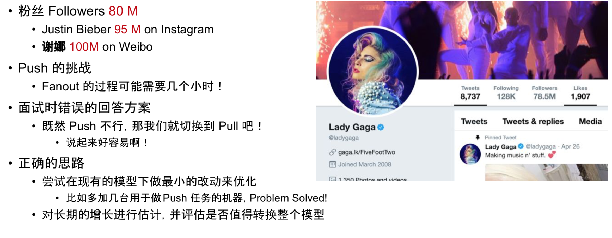

* Push 结合 Pull 的优化方案
  * 普通的用户仍然 Push
  * 将 Lady Gaga 这类的用户，标记为明星用户
  * 对于明星用户，不 Push 到用户的 News Feed 中
  * 当用户需要的时候，来明星用户的 Timeline 里取，并合并到 News Feed 里

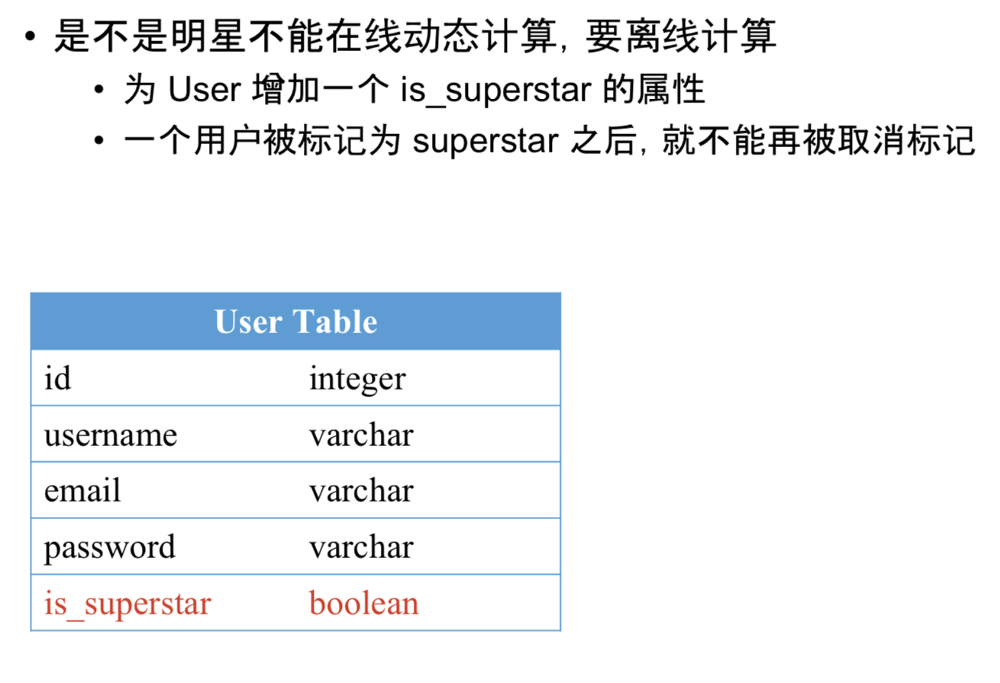

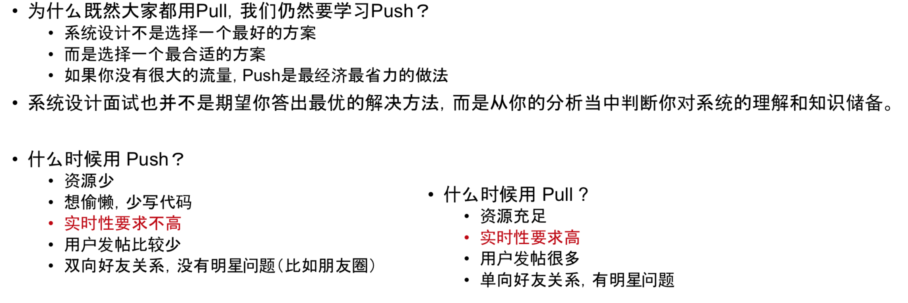

#### 小结：

* Ask before design 
  * 问清楚再动手设计 不要一上来就冲着一个巨牛的方案去设计 切忌不要做关键词大师
* No more no less
  * 不要总想着设计最牛的系统 要设计够用的系统
* Work solution first
  * 先设计一个基本能工作的系统，然后再逐步优化
* Analysis is important than solution
  * 系统设计没有标准答案 记住答案是没用的 通过分析过程展示知识储备 权衡各种设计方式的利弊

## 3. 拓展和补充

**什么是异步任务（Async Task）？**

当我们采用 Push 模型的时候，每当有一个帖子被创建的时候，都需要把这个帖子 fanout 给所有的粉丝。

由于粉丝的数目可能会很多，因此不能在用户发帖的时候实时的完成（这样会 block 用户发帖的这个过程）。而是需要创建一个异步任务（Aysnc Task\)，这个异步任务会被创建到一个消息队列（Message Queue\)中，有一些异步任务的执行者（Worker）会订阅这个消息队列。

每当消息队列中有新的任务时，就会有一个 Worker 抢到这个任务，并执行这个任务所需要做的事情（fanout）。

**什么是消息队列（Message Queue\) ?**

消息队列是生产者消费者模型中的中间存储结构（Producer & Consumer\)，用于存放一个一个任务。

当生产和消费的速度不匹配的时候，就需要消息队列来进行`缓冲`了。常见的消息队列软件有：RabbitMQ，ZeroMQ， Kafka，AntMQ，Redis\(可以用来当作消息队列用，但 Redis 本身不仅仅可以做消息队列）

消息队列是用于存储数据（任务）的，和其他数据库相比，区别是，当一个消息队列中的消息（任务）被领走之后，就会被删除。消息队列`不是`用来做聊天系统的。

#### 拓展问题1: 果取关问题 

* 如何实现 follow 与 unfollow?
  * Follow 一个用户之后，异步地将他的 Timeline 合并到你的 News Feed 中 
    * Merge timeline into news feed asynchronously.
  * Unfollow 一个用户之后，异步地将他发的 Tweets 从你的 News Feed 中移除
    *  Pick out tweets from news feed asynchronously.
  * 为什么需要异步 Async?
    * 因为这个过程一点都不快呀
* 异步的好处?
  * 用户迅速得到反馈，似乎马上就 follow / unfollow 成功了
* 异步的坏处?
  * Unfollow 之后刷新 News Feed，发现好像他的信息还在
  * 不过最终还是会被删掉的

#### 拓展问题2: 如何存储 likes?

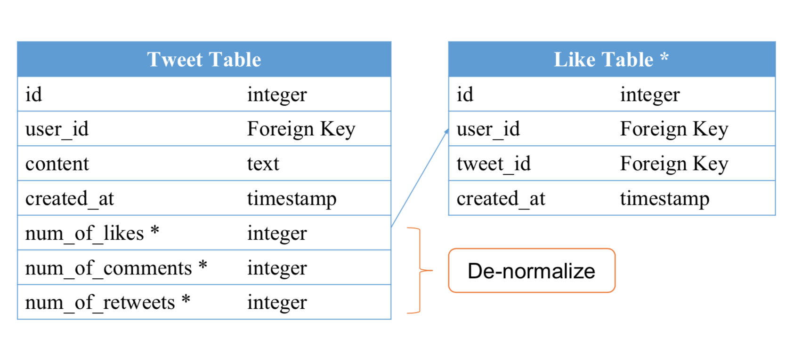

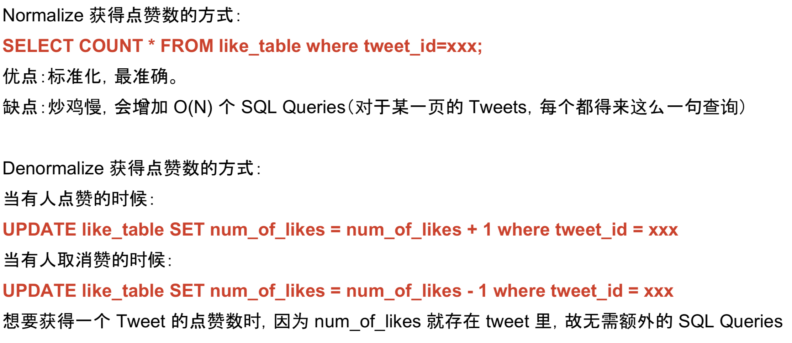

#### 拓展问题3: 惊群现象 Thundering Herd 

**什么是惊群?**

我们通常会使用缓存来作为数据库的“挡箭牌”，优化一些经常读取的数据的访问速度。即，在访问这些数据时，会先看看是否在缓存中，如果在，就直接读取缓存中的数据，如果不在，就从数据库中读取之后， 写入缓存并返回。

那么在高并发的情况下，如果一条非常热的数据，因为缓存过期或者被淘汰算法淘汰等原因，被踢出缓 存之后，会导致短时间内\(&lt;1s\)，大量的数据请求会出现缓存穿透 \(Cache miss\)，因为数据从 DB 回填到 Cache 需要时间。从而这些请求都会去访问数据库，导致数据库处理不过来而崩溃，从而影响到其他数 据的访问而导致整个网站崩溃。

**解决办法及参考资料**

* Memcache Lease Get - 《Scaling Memcache at Facebook》
  * [http://bit.ly/1jDzKZK ](http://bit.ly/1jDzKZK%20)
* Facebook 如何解决惊群效应的: [https://bit.ly/1Q3t3P7](https://bit.ly/1Q3t3P7)
* Redis 防雪崩架构设计 [https://bit.ly/2KFneb5](https://bit.ly/2KFneb5)

#### 其他的一些小白问题

* Cache是什么?
  * 可以认为相当于算法中的HashMap
  * 是Key-value的结构
* Cache存在哪儿?
  * Cache存在内存里
* 常用的Cache工具/服务器有什么? 
  * Memcached
  * Redis
* 为什么需要用Cache?
  * Cache因为是内存里，所以存取效率比DB要高
* 为什么不全放Cache里?
  * 内存中的数据断电就会丢失 
  * Cache 比硬盘贵

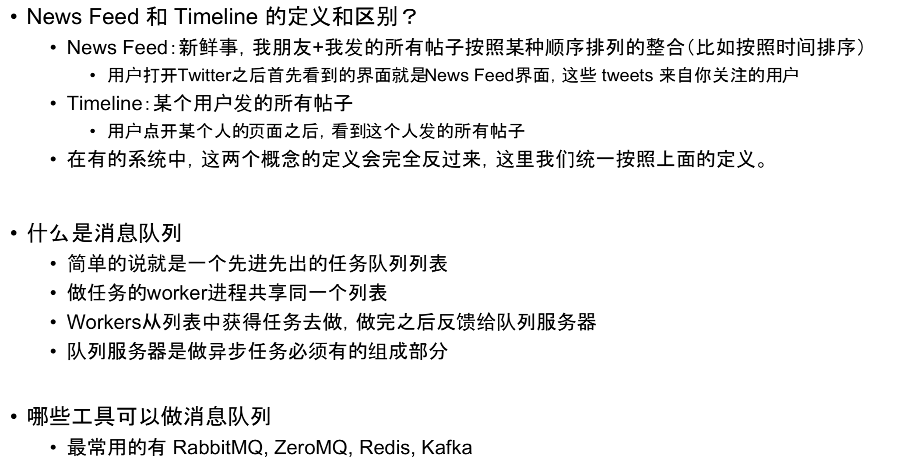

