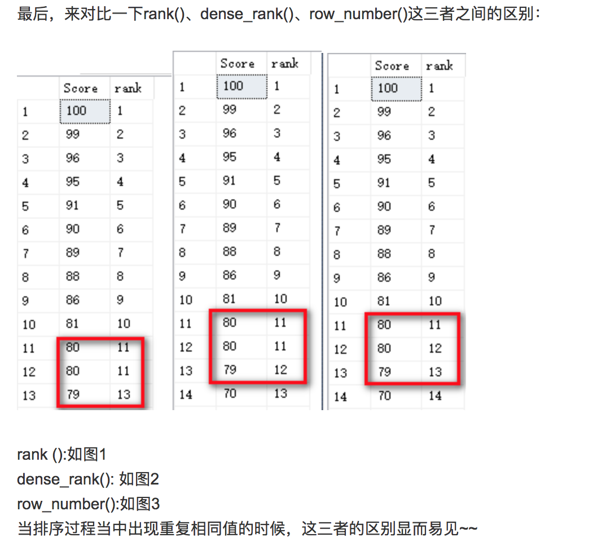

# MySQL - Window Function

## Window Function

开窗函数是我觉得非常非常好用的一个函数，它的好处基本和CTE一样，它直接优化了原有所有的算法和query，使得原有query的逻辑变得非常清晰。这个函数非常值得掌握。

仍然以刚才的表为例，先计算Running Total。

如果要计算每一年的平均评分，在依次加入新的category之后，平均评分如何进行变化，也就是产生下表的结果。


传统做法就是subquery子查询控制法，用id来控制依次取平均就可以

```sql
select f.id,f.release_year,f.category_id,f.rating,
		(select avg(f1.rating)
        from films as f1
        where f1.release_year = f.release_year and f.category_id >= f1.category_id)
from films as f

```

有了窗口函数就简单很多很多了。

```sql
select f.id,f.release_year,f.category_id,f.rating,
avg(f.rating) over(partition by release_year order by category_id) as running_total
from films as f
```

这里可以follow up一下，如果我们要累计的平均，累计的计数，理解的rank，怎么算。

如果使用传统的方法，就是写很多很多子查询，如果两个使用的条件一样还好，可以用一个query写完，可是如果不一样就要写很多，而用开窗函数就会简单非常多。

* 窗口函数可以想象成一个小窗一点一点进行移动扫描，然后将每个窗口的结果返还再做一个Join

MySQL定义的窗口函数如下:



具体参见MySQL官方文档:

[https://dev.mysql.com/doc/refman/8.0/en/window-function-descriptions.html](https://dev.mysql.com/doc/refman/8.0/en/window-function-descriptions.html)


## Mode Analytics Exercises

因为感觉自己掌握的不是很好，这里我又找了一些题来补充一下window functions，希望自己可以实际写一遍，这样才能真正掌握实际的窗口函数。

**Window Function 定义**

简单来说，窗口函数主要是一种用来计算行之间相关的函数，例如：我们想要得到running total，就需要依次对前面一行的数据进行累加。这里主要练习的网址如下:



以Running Total 为例:

```sql
SELECT duration_seconds,
       SUM(duration_seconds) OVER (ORDER BY start_time) AS running_total
FROM tutorial.dc_bikeshare_q1_2012
```

**基本的Syntax: 函数（） over（window）**

* **Partition By**: 主要是类似于group by，就是将数据进行分组，比如，要计算每种类别的排序，就需要先分组然后再计算
* **Order By**: 分组之后需要排序，比如，要按照日期计算running total，就需要先对日期进行排序，然后才能计算
* **Alias:** WINDOW xxx AS \(PARTITION BY xxx ORDER BY xx\) 主要是如果写很多窗口函数的话，需要写很多次，因此可以用alias自定义一种窗口
  * **必须在where之后**

基本上，window function 可以分成两种：

* 已有的聚合函数
* 特定的analytics function

### 已有的聚合函数

* 主要是sum, max, min, count, avg之类的

**Practice 1:**

> Write a query modification of the above example query that shows the duration of each ride as a percentage of the total time accrued by riders from each start\_terminal

```sql
SELECT duration_seconds,
      (duration_seconds/sum(duration_seconds) 
      over( Partition by start_terminal))*100 as total_time
FROM tutorial.dc_bikeshare_q1_2012
WHERE start_time < '2012-01-08'
```

window function真的好用，我都想直接放弃传统写法了。

**Practice 2:**

> Write a query that shows a running total of the duration of bike rides \(similar to the last example\), but grouped by `end_terminal`, and with ride duration sorted in descending order.

```sql
SELECT start_terminal,
       duration_seconds,
       SUM(duration_seconds) OVER
         (PARTITION BY end_terminal ORDER BY duration_seconds desc)
         AS running_total
FROM tutorial.dc_bikeshare_q1_2012
WHERE start_time < '2012-01-08'
```

### 特定的analytics functions

* **Row\_number\(\):** 类似一个统计函数，就是计数函数，比如从1到n，如果不用partition by 就是行的index。
* **RANK\(\) ：**主要是给出具体的排序，但是rank不一样在于，它允许一种并列的情况，而且会自动允许存在gap
*  **DENSE\_RANK\(\):** 和rank很像，只是它会取消之间的gap
  * 有并列 :  Rank & Dense\_Rank 
    * 有gap :  Rank
    * 无gap ：Dense\_Rank 
  * 无并列 :  Row\_number 



**Practice 1:**

> Write a query that shows the 5 longest rides from each starting terminal, ordered by terminal, and longest to shortest rides within each terminal. Limit to rides that occurred before Jan. 8, 2012.

```sql
SELECT *
  FROM (
        SELECT start_terminal,
               start_time,
               duration_seconds AS trip_time,
               RANK() OVER (PARTITION BY start_terminal ORDER BY duration_seconds DESC) AS rank
          FROM tutorial.dc_bikeshare_q1_2012
         WHERE start_time < '2012-01-08'
               ) sub
 WHERE sub.rank <= 5
```


很重要的一点，window function不能在where里面直接进行filter，因此必须再执行一个子查询。

其次以上三个函数是没有参数的，不能再\(\)里面给参数。


* **ntile\(x\)**: 将数据分成x个部分，然后看数据分别落入哪个部分

**Practice 1 :**

> Write a query that shows only the duration of the trip and the percentile into which that duration falls \(across the entire dataset—not partitioned by terminal\).

```sql
SELECT duration_seconds,
       ntile(100) over(order by duration_seconds) as percentage
  FROM tutorial.dc_bikeshare_q1_2012
WHERE start_time < '2012-01-08' 
ORDER BY percentage 
```

* **LAG :** 将数据整体**向后**移动一行
* **LEAD：** 将数据整体**向前**移动一行

至此就基本结束啦，一会再补充一点analytics function

