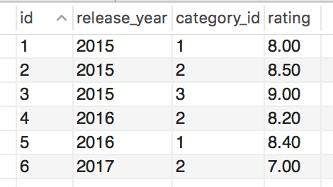
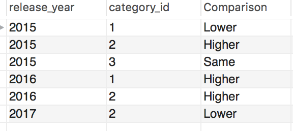

# MySQL - CTE

虽然SQL以及学了很多遍了，但是感觉学的都是非常经典也就是古老的SQL知识，现在的SQL以及有了非常长足的发展。在刷了一遍Leetcode的SQL之后，明显感觉到很多查询都太繁琐而冗长。在MySQL 8.x之后，同T-SQl以及其他语言保持一致，所以很多技术都慢慢出现了。

## With -  Common Table Expression

这里主要以films这个表作为例子，进行演示，存储这个table的schema是test



借用Leetcode中的一道题的思路，如果这里要求计算，是否某一年的category的rating和总的三年间这个平均值的比较，也就是返回下表。



思路：如果用传统的subquery，要先算出每个category 的rating，然后再将表join起来，用case when来比较得出最后的结果。

```sql
select f.release_year,f.category_id,
		case when f.rating < temp.avg then 'Lower'
			 when f.rating > temp.avg then 'Higher'
             else 'Same'
		end as Comparison
from films as f
left join (select category_id,avg(rating) as avg
		   from films
           group by category_id) as temp 
on temp.category_id = f.category_id
order by f.release_year,f.category_id
```

这里如果使用CTE函数，就可以做一个暂时的表，也就是SAS中的in-line-view。这里先将temp存为一个暂时的表，不断调用即可，这里猜测的原理可能是，先建一个表再删除掉，这会使得整个SQL query变得非常清晰。

```sql
with temp as (select category_id,avg(rating) as avg
		   from films
           group by category_id) 

select f.release_year,f.category_id,
		case when f.rating < temp.avg then 'Lower'
			 when f.rating > temp.avg then 'Higher'
             else 'Same'
		end as Comparison
from films as f
left join temp
on temp.category_id = f.category_id
order by f.release_year,f.category_id
```

从我自己做题的感觉来看，CTE函数的好处主要在：

* **清晰**：增强了SQL query 的可读性，便于读者快速理解其中的思路。
* **可重复和延展性**：如果可以允许过渡表的存在，等于我们可以多次调用temp这个表，这剩下来很多写subquery的空间。

这里给一个follow up的问题，如果我想知道根据这个comparison，第一年低于平均，但第二年高于平均的年和category\_id，怎么进行计算。

```sql
with temp as (select category_id,avg(rating) as avg
		   from films
           group by category_id) ,

     temp2 as( select f.release_year,f.category_id,
                      case when f.rating < temp.avg then 'Lower'
			               when f.rating > temp.avg then 'Higher'
                           else 'Same'
		               end as Comparison
               from films as f
               left join temp
               on temp.category_id = f.category_id
               order by f.release_year,f.category_id)

select t1.release_year,t1.category_id,t1.comparison,t2.comparison
from temp2 as t1, temp2 as t2
where t1.comparison = 'Lower' and t2.comparison = 'Higher'
and t1.category_id = t2.category_id and t1.release_year = t2.release_year -1
```

这里我调用了temp2两次，也就是刚才写的query，而temp2调用了temp一次，如果这样直接用subquery写，就会非常非常占用空间，而且思路不清晰。有兴趣的话，可以自己试一试。

## Recursive CTE

基本语法

```sql
WITH RECURSIVE cte_name AS (
    initial_query  -- anchor member
    UNION ALL
    recursive_query -- recursive member that references to the CTE name
)
SELECT * FROM cte_name;
```

举个例子

```sql
WITH RECURSIVE cte_count (n) 
AS (
      SELECT 1
      UNION ALL
      SELECT n + 1 
      FROM cte_count 
      WHERE n < 10
    )
SELECT n 
FROM cte_count;
```

这里就会返回1-10这几个数字。

感觉这个不太可能会考到，就先总结到这里

{% embed data="{\"url\":\"http://www.mysqltutorial.org/mysql-recursive-cte/\",\"type\":\"link\",\"title\":\"A Definitive Guide To MySQL Recursive CTE\",\"description\":\"In this tutorial, you will learn about MySQL recursive CTE and how to use it to traverse hierarchical data in the MySQL database.\",\"icon\":{\"type\":\"icon\",\"url\":\"http://www.mysqltutorial.org/wp-content/uploads/2018/03/cropped-favicon-1-192x192.png\",\"width\":192,\"height\":192,\"aspectRatio\":1},\"thumbnail\":{\"type\":\"thumbnail\",\"url\":\"http://www.mysqltutorial.org/wp-content/uploads/2017/07/MySQL-Recursive-CTE.png\",\"width\":702,\"height\":315,\"aspectRatio\":0.44871794871794873}}" %}

